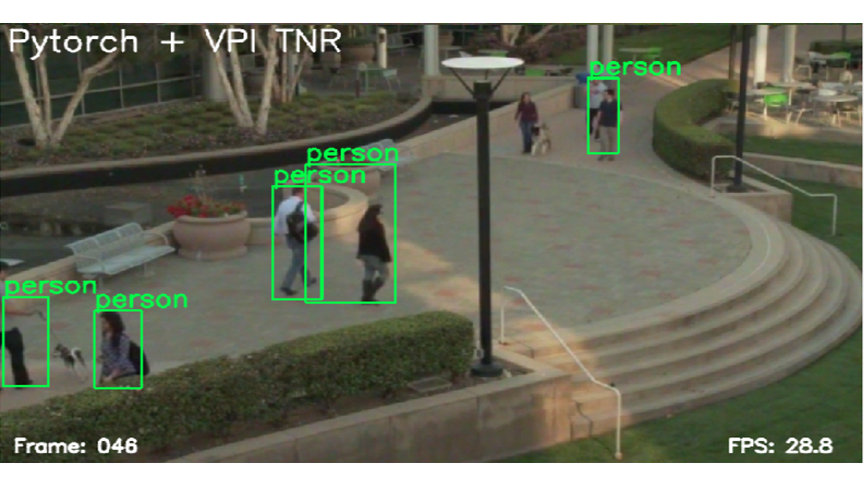
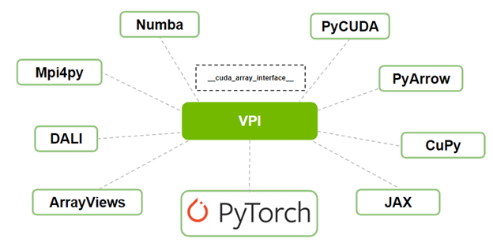
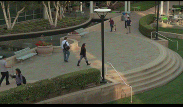
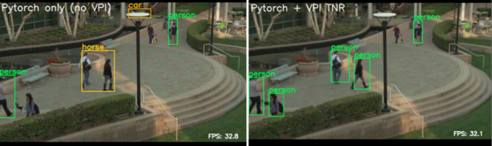

# 利用Pytorch搭建视觉处理接口



NVIDIA 视觉编程接口 (`VPI: Vision Programming Interface`) 是 NVIDIA 的计算机视觉和图像处理软件库，使您能够实现在 NVIDIA Jetson 嵌入式设备和独立的GPU 上可用的不同硬件后端上加速的算法。

库中的一些算法包括过滤方法、透视扭曲、时间降噪、直方图均衡、立体视差和镜头失真校正。 VPI 提供易于使用的 Python 绑定以及 C++ API。

除了与 OpenCV 接口外，VPI 还能够与 PyTorch 和其他基于 Python 的库进行互操作。 在这篇文章中，我们将通过基于 PyTorch 的目标检测和跟踪示例向您展示这种互操作性如何工作。 有关详细信息，请参阅[视觉编程接口 (VPI) 页面](https://developer.nvidia.com/embedded/vpi)和[视觉编程接口](https://docs.nvidia.com/vpi/)文档。


## 与 PyTorch 和其他库的互操作性

根据您在计算机视觉和深度学习流程中实现的应用程序，您可能必须使用多个库。 开发此类流程的挑战之一是这些库相互交互的效率。 例如，在它们之间交换图像数据时，由于内存副本可能会出现性能问题。

使用 VPI，您现在可以与 PyTorch 或任何其他支持 `__cuda_array_interace__` 的库进行互操作。 `__cuda_array_interface__`（CUDA 数组接口）是 Python 中的一个属性，它可以在各种项目（例如库）中实现 GPU 类数组对象的不同实现之间的互操作性。

数组对象（例如图像）可以在一个库中创建并在另一个库中修改，而无需复制 GPU 中的数据或将其传递给 CPU。




## 时序降噪以改善目标检测和跟踪
噪声是视频中跨帧的共同特征。 这种时序噪声会对视频中目标检测和跟踪算法的性能产生负面影响。

VPI 库提供了一种时序降噪 (TNR) 算法，这是计算机视觉应用中用于降低视频数据中的噪声的常用方法。 有关详细信息，请参阅[在 NVIDIA Jetson 嵌入式计算机上使用 NVIDIA VPI 减少图像上的时序噪声](https://developer.nvidia.com/blog/reducing-temporal-noise-on-images-with-vpi-on-jetson-embedded-computers/)。

在本文中，您将在嘈杂的视频上使用基于 PyTorch 的目标检测和跟踪示例（下图）。 然后应用 VPI 的 TNR 算法来降低噪声，从而改进目标检测和跟踪。

我们展示了 VPI 和 PyTorch 在执行来自 VPI 和 PyTorch 的算法期间无需任何内存副本即可无缝工作。




该示例涵盖以下内容：

* 原始输入视频上的 PyTorch 目标检测和跟踪
* 通过 VPI TNR 对已清理的输入视频进行 PyTorch 目标检测和跟踪
* 使用 CUDA 数组接口的 VPI 和 PyTorch 之间的互操作性

## 原始输入视频上的 PyTorch 目标检测和跟踪
首先，首先定义一个基于 PyTorch 的应用程序来检测图像中的目标。 此示例应用程序基于带有 MobileNetV3 主干的 SSDLite，用于使用 PyTorch 和 Torchvision 示例进行目标检测。

创建一个名为 PyTorchDetection 的类来处理所有 PyTorch 目标和调用。 在创建此类目标时，应用程序将用于目标检测的预训练深度学习模型加载到 GPU 中，仅用于推理。 以下代码示例显示了所需的导入和类构造函数定义：

```Python
import torch
import torchvision

class PyTorchDetection:
    def __init__(self):
       assert torch.cuda.is_available()
       self.cuda_device = torch.device('cuda')
       self.convert = torchvision.transforms.Compose([
           torchvision.transforms.ConvertImageDtype(torch.float32),
           torchvision.transforms.Lambda(lambda x: x.permute(2, 0, 1)),
           torchvision.transforms.Lambda(lambda x: x.unsqueeze(0)),
       ])
       model = torchvision.models.detection.ssdlite320_mobilenet_v3_large(
pretrained=True)
       self.torch_model = model.eval().to(self.cuda_device)
```

PyTorchDetection 类还负责从数组创建 CUDA 图像帧，有效地将其上传到 GPU。 稍后，您使用 OpenCV 从文件中读取输入视频，其中每个视频帧都是一个 NumPy 数组，用作此类创建函数的输入。

此外，PyTorchDetection 类可以将 CUDA 图像帧转换为 CUDA 张量对象，使其为模型推理做好准备，并将基于 VPI 的 CUDA 帧转换为张量。 最后一次转换使用 VPI 的 `__cuda_array_interface__` 互操作性来避免复制帧。

```Python
    def CreateCUDAFrame(self, np_frame):
        return torch.from_numpy(np_frame).to(self.cuda_device)

    def ConvertToTensor(self, cuda_frame):
        return self.convert(cuda_frame)

    def ConvertFromVPIFrame(self, vpi_cuda_frame):
        return torch.as_tensor(vpi_cuda_frame, device=self.cuda_device)
```
除了前面定义的函数，PyTorchDetection 类定义了一个函数来检测和绘制当前 OpenCV 帧中的对象，给定一个 `score_threshold` 值：

```Python
   def DetectAndDraw(self, cv_frame, torch_tensor, title, scores_threshold=0.2):
       with torch.no_grad():
           pred = self.torch_model(torch_tensor)
       (...)
```

在这篇文章中，我们省略了代码以提请注意 PyTorch 模型的预测结果。 通过下载或使用代码，您在此处接受此代码的条款和条件。 您可以[下载并查看代码](https://developer.download.nvidia.com/devblogs/vpi_pytorch_interop_demo.zip)。

下一节将解释如何使用 VPI 减少输入视频中的噪声，将 VPI 与 PyTorch 结合以改进其目标检测。

## 通过 VPI TNR 对已清理的输入视频进行 PyTorch 目标检测和跟踪
在本节中，定义一个基于 VPI 的实用程序类 `VPITemporalNoiseReduction`，以清除视频帧中的噪声。

创建此类的对象时，应用程序会加载主 VPI TNR 对象和基于 VPI 的 CUDA 帧以存储清理后的输出。 以下代码示例显示了所需的导入和类构造函数定义：

```C++
import vpi

class VPITemporalNoiseReduction:
   def __init__(self, shape, image_format):
       if (image_format == 'BGR8'):
           self.vpi_image_format = vpi.Format.BGR8
       else:
           self.vpi_image_format = vpi.Format.INVALID
       self.vpi_output_frame = vpi.Image(shape, format=self.vpi_image_format)
       self.tnr = vpi.TemporalNoiseReduction(shape, vpi.Format.NV12_ER, version=vpi.TNRVersion.V3, backend=vpi.Backend.CUDA)
```
`VPITemporalNoiseReduction `类的构造函数需要每个输入图像帧的形状（图像宽度和高度）和格式。 为简单起见，您只接受 BGR8 图像格式，因为这是 OpenCV 在读取输入视频时使用的格式。

此外，您正在创建 VPI 图像以使用提供的形状和格式存储输出帧。 然后使用 [TNR 代码](https://docs.nvidia.com/vpi/algo_tnr.html)版本 3 和 CUDA 后端为此形状构造 TNR 对象。 TNR 的输入格式为 NV12_ER，与输入图像帧中的格式不同。 接下来，您将在 Denoise 实用程序函数中处理帧转换。

```Python
   def Denoise(self, torch_cuda_frame, tnr_strength=1.0):
       vpi_input_frame = vpi.asimage(torch_cuda_frame, format=self.vpi_image_format)
       with vpi.Backend.CUDA:
           vpi_input_frame = vpi_input_frame.convert(vpi.Format.NV12_ER)
           vpi_input_frame = self.tnr(vpi_input_frame, preset=vpi.TNRPreset.OUTDOOR_LOW_LIGHT, strength=tnr_strength)
           vpi_input_frame.convert(out=self.vpi_output_frame)
       return self.vpi_output_frame
```

最后一个函数对输入图像帧进行实际清理。 此函数从基于 PyTorch 的输入 CUDA 帧中去除噪声，返回基于输出 VPI 的 CUDA 帧。

1. PyTorch CUDA 帧首先使用 `vpi.asimage` 函数转换为 VPI。 `torch_cuda_frame` 共享与 `vpi_input_frame` 相同的内存空间：即不涉及内存拷贝。
2. 接下来，将输入帧从给定的输入格式（BGR8）转换为 CUDA 中的 `NV12_ER` 进行处理。
3. 使用 TNR 预设 `OUTDOOR_LOW_LIGHT` 和给定的 TNR 强度在这个转换的输入帧上执行 TNR 算法。
4. 清理后的输入帧（TNR 算法的输出）被转换回原始格式（BGR8）并存储在基于 VPI 的 CUDA 输出帧中。
5. 生成的输出帧将返回供 PyTorch 以后使用。

## 使用 CUDA 阵列接口的 VPI 和 PyTorch 之间的互操作性
最后，您在主模块中定义了一个 MainWindow 类。 该类基于 PySide2，为本示例提供了图形用户界面。

窗口界面显示了两个输出图像帧，一个仅使用 PyTorch 进行检测，另一个在 VPI TNR 之后使用 PyTorch。 此外，窗口界面包含两个滑块来控制 PyTorch 检测的分数阈值和 VPI 时间噪声去除的 TNR 强度。

```Python
import cv2
import numpy as np
(...)
from PySide2 import QtWidgets, QtGui, QtCore
(...)
from vpitnr import VPITemporalNoiseReduction
from torchdetection import PyTorchDetection

class MainWindow(QMainWindow):
   def __init__(self, input_path):
       super().__init__()
       #-------- OpenCV part --------
       self.video_capture = cv2.VideoCapture(input_path)
       if not self.video_capture.isOpened():
           self.Quit()
       self.input_width = int(self.video_capture.get(cv2.CAP_PROP_FRAME_WIDTH))
       self.input_height = int(self.video_capture.get(cv2.CAP_PROP_FRAME_HEIGHT))
       self.output_video_shape = (self.input_height * 2, self.input_width, 3)
       self.output_frame_shape = (self.input_height, self.input_width, 3)
       self.cv_output_video = np.zeros(self.output_video_shape, dtype=np.uint8)
       #-------- Main objects of this example --------
       self.torch_detection = PyTorchDetection()
       self.vpi_tnr = VPITemporalNoiseReduction((self.input_width,
                       self.input_height), 'BGR8')
       (...)

   def UpdateDetection(self):
       in_frame = self.cv_input_frame
       if in_frame is None:
           return
       cuda_input_frame = self.torch_detection.CreateCUDAFrame(in_frame)
       # -------- Top Frame: No VPI ---------
       cuda_tensor = self.torch_detection.ConvertToTensor(cuda_input_frame)
       self.torch_detection.DetectAndDraw(self.TopFrame(), cuda_tensor,
                  'Pytorch only (no VPI)', self.scores_threshold)
       # -------- Bottom Frame: With VPI ---------
       vpi_output_frame = self.vpi_tnr.Denoise(cuda_input_frame,
                                               self.tnr_strength)
       with vpi_output_frame.rlock_cuda() as cuda_frame:
           cuda_output_frame=self.torch_detection.ConvertFromVPIFrame(cuda_frame)
           cuda_tensor = self.torch_detection.ConvertToTensor(cuda_output_frame)
           self.torch_detection.DetectAndDraw(self.BottomFrame(), cuda_tensor, 'Pytorch + VPI TNR', self.scores_threshold)
       (...)
```

MainWindow 类的构造函数需要输入视频的路径。它使用 OpenCV 读取输入视频并创建一个输出视频帧，其高度是输入视频的两倍。这用于存储两个输出帧，一个具有仅 PyTorch 输出，另一个具有 VPI+PyTorch 输出。

构造函数还为 PyTorch 检测和 VPI TNR 创建对象。在这篇文章中，我们省略了创建图形用户界面小部件和处理其回调的代码。我们还省略了创建主窗口和启动应用程序的代码。有关这部分 TNR 代码的更多信息，请[下载示例](https://docs.nvidia.com/vpi/algo_tnr.html)。

UpdateDetection 函数在新的输入视频帧可用时调用，它从 NumPy OpenCV 输入帧创建基于 PyTorch 的 CUDA 输入帧。然后它将其转换为张量以执行 PyTorchDetection 类的检测和绘制。顶部帧的此管道直接在输入视频帧中运行 PyTorch 检测。

底部帧的下一个流程首先对基于 PyTorch CUDA 的输入帧进行降噪。去噪输出是一个名为 `vpi_output_frame` 的基于 VPI 的 CUDA 帧，使用 `rlock_cuda` 函数将其锁定以在 CUDA 中读取。此函数为 cuda_frame 对象中的 VPI CUDA 互操作性提供` __cuda_array_interface__`。该对象被转换为 PyTorch CUDA 帧，然后转换为张量。同样，在管道的结果上调用检测和绘制函数。第二个流程在 VPI 降噪功能之后运行 PyTorchDetection。

## 结果
下图 显示了在公共场所行人的嘈杂输入视频中，不使用和使用 VPI TNR 的 PyTorch 对象检测和跟踪结果。 正如您从带有注释的输出视频中看到的那样，在检测前应用去噪时，检测和跟踪结果得到了改善（右）。




