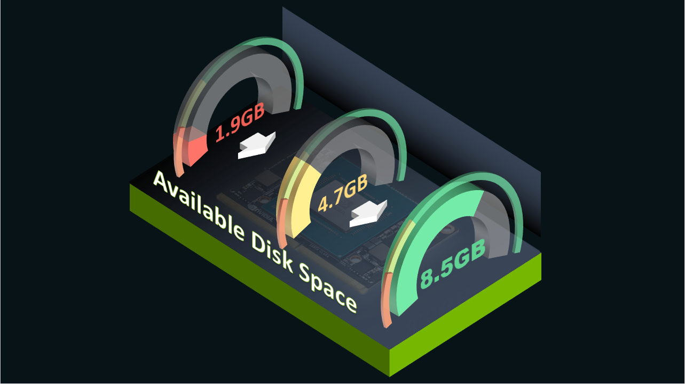
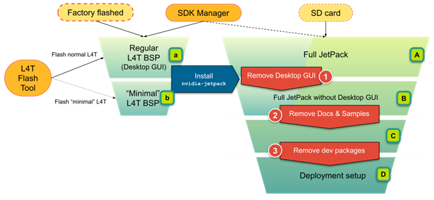

# 最小化 Jetson 上的存储使用量


NVIDIA Jetson 为开发提供灵活的存储选项/配置，但一些 Jetson 模块配备了有限的 eMMC 闪存存储空间，以实现更具成本意识的大规模产品部署。

最初，在有限的存储空间中安装您的应用程序和必要的库似乎是不可能的，尤其是使用全套 NVIIA JetPack、BSP 以及 NVIDIA 为 Jetson 预先打包的所有开发软件。

|	|NVIDIA JetPack 5.0.1 DP (Rel 34.1.1) NVIDIA Jetson AGX Orin Developer Kit|	NVIDIA JetPack 4.6.2 (Rel 32.7.2)NVIDIA Jetson AGX Xavier Developer Kit|	NVIDIA JetPack 4.6.1 (Rel 32.7.1) NVIDIA Jetson Xavier NX Developer Kit|
|----|----|----|----|
|(Original) Regular L4T ([a])|	6.1 GB|	5.5 GB	|| 
|(Original) Full JetPack ([A])|	16.6 GB|	11.6 GB|	11.6 GB|

但是，您可以通过删除不必要的包、库和其他资产来减少磁盘使用量。 下表显示了如何在一些最新的 NVIDIA JetPack 版本上回收超过 8 GB 的存储空间。

||NVIDIA JetPack 5.0.1 DP (Rel 34.1.1) NVIDIA Jetson AGX Orin Developer Kit|	NVIDIA JetPack 4.6.2 (Rel 32.7.2) NVIDIA Jetson AGX Xavier Developer Kit|	NVIDIA JetPack 4.6.1 (Rel 32.7.1) NVIDIA Jetson Xavier NX Developer Kit|
|----|----|----|----|
|Example deployment configuration ([D])|	8.3 GB|	5.2 GB|	5.3 GB|

在这篇文章中，我介绍了减少 Jetson 设备上磁盘使用的简化步骤，同时分享了有关分析磁盘使用的方法、实际命令以及不同版本 JetPack 上的示例输出的技巧。 我还展示了如何检查 AI 应用程序在精简配置下是否仍在正常工作。

## 识别占用空间的内容
[jetson-min-disk 文档](https://nvidia-ai-iot.github.io/jetson-min-disk/)展示了如何分析当前磁盘使用情况，识别哪些文件和目录占用了空间，并阐明了包依赖关系。 它还显示了 NVIDIA JetPack 4.6.x 和 NVIDIA JetPack 5.0.x 上的示例命令输出，以便您评估可以为您的应用程序减少多少。

## 最小化配置
下图 显示了最小配置的概述。 [jetson-min-disk 文档](https://nvidia-ai-iot.github.io/jetson-min-disk/)针对不同的开发和产品化需求介绍了多种配置（[A] 到 [D]）。



您可以采取以下措施来重新获得磁盘空间。

* 删除桌面用户界面。
* 删除文档和示例包。
* 删除开发包。


## 删除桌面图形用户界面
如果您知道您的系统不需要通过 HDMI、DP/eDP 或 LVDS 在 NVIDIA Jetson 本机显示输出上使用图形用户界面，则可以删除 ubuntu-desktop。 有关更多信息，请参阅[删除 GUI](https://nvidia-ai-iot.github.io/jetson-min-disk/step1.html)。

||	NVIDIA JetPack 5.0.1 DP (Rel 34.1.1) NVIDIA Jetson AGX Orin Developer Kit|	NVIDIA JetPack 4.6.2 (Rel 32.7.2) NVIDIA Jetson AGX Xavier Developer Kit|	NVIDIA JetPack 4.6.1 (Rel 32.7.1) NVIDIA Jetson Xavier NX Developer Kit|
|----|----|----|----|
|Removing the graphical user interface|	3.4 GB|	5.5 GB|	4.2 GB|

```bash
$ sudo apt-get update
$ sudo apt-get purge $(cat apt-packages-only-in-full.txt)
$ sudo apt-get install network-manager
$ sudo reboot
```

## 删除文档和示例包
如果您已使用 sudo apt install nvidia-jetpack 命令或使用 SDK Manager 安装全部 JetPack 组件（库和 SDK），则您可能拥有应用程序不需要的软件包。

文档和示例包是最安全的删除，因此您可以从卸载它们开始。 有关更多信息，请参阅[删除文档/示例](https://nvidia-ai-iot.github.io//jetson-min-disk/step2.html)。


||	NVIDIA JetPack 5.0.1 DP (Rel 34.1.1) NVIDIA Jetson AGX Orin Developer Kit|	NVIDIA JetPack 4.6.2 (Rel 32.7.2) NVIDIA Jetson AGX Xavier Developer Kit|	NVIDIA JetPack 4.6.1 (Rel 32.7.1) NVIDIA Jetson Xavier NX Developer Kit|
|----|----|----|----|
|Removing docs and samples|	0.8 GB	|1.2 GB|	1.1 GB|

```bash
$ sudo dpkg -r --force-depends "cuda-documentation-10-2" "cuda-samples-10-2" "libnvinfer-samples" "libvisionworks-samples" "libnvinfer-doc" "vpi1-samples"

```

## 从最小的 L4T BSP 开始
如果您使用主机 x86-64 Linux 主机来刷新您的 Jetson，您可以创建一个最小配置 RootFS 并将该映像刷入 Jetson。

有关构建最小 L4T RooFS 镜像的更多信息，请参阅选项：[最小 L4T](https://nvidia-ai-iot.github.io/jetson-min-disk/minimal-l4t.html)。

## 确认
该指南介绍了使用 NVIDIA DeepStream 参考应用程序作为典型 AI 应用程序来验证最低配置的 Jetson 环境的方法。 有关详细信息，请参阅[验证](https://nvidia-ai-iot.github.io/jetson-min-disk/verification.html)。

```bash
git clone https://github.com/NVIDIA-AI-IOT/jetson-min-disk/
cd jetson-min-disk
cd test-docker
./docker-run-deepstream-app-overlay.sh
```


