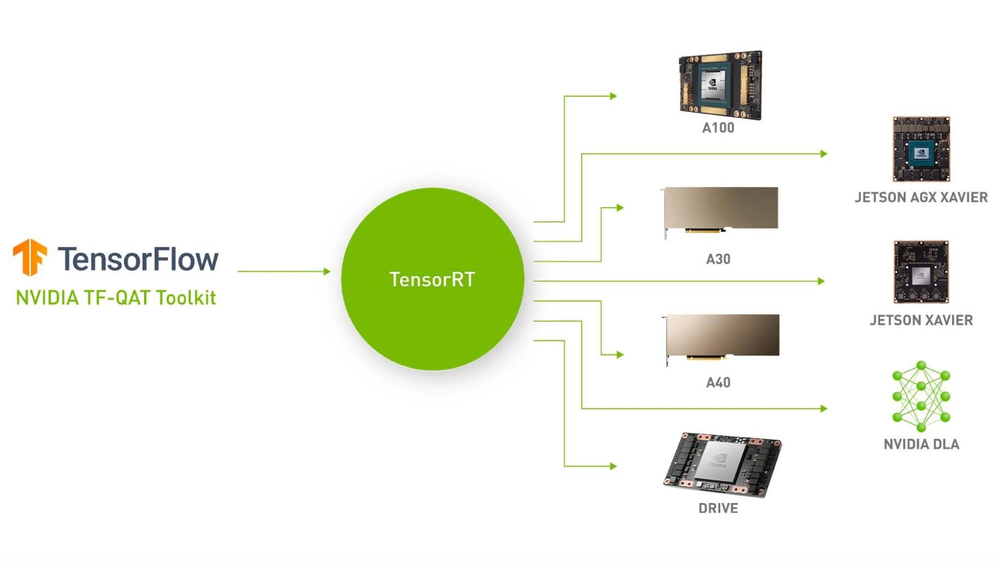
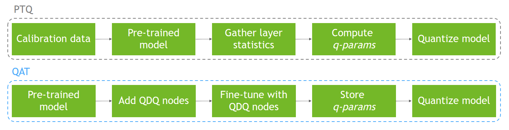
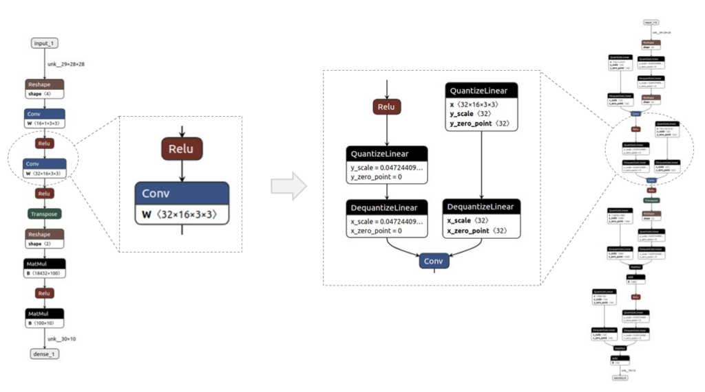
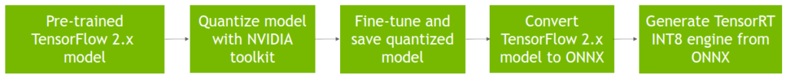
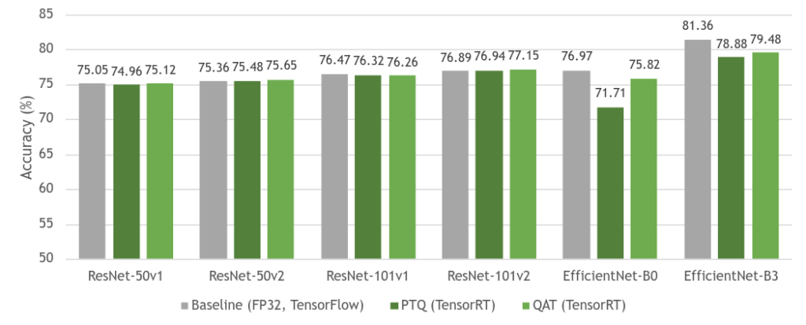
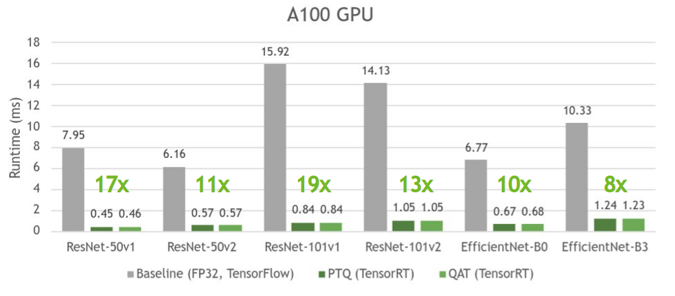

# 使用 NVIDIA QAT Toolkit for TensorFlow 和 NVIDIA TensorRT 加速量化网络




NVIDIA推出了适用于 TensorFlow 2 的 NVIDIA Quantization-Aware Training (QAT) 工具包，目标是在 NVIDIA GPU 上使用 NVIDIA TensorRT 加速量化网络。该工具包为您提供了一个易于使用的 API，以一种针对 TensorRT 推理进行了优化的方式量化网络，只需几行额外的代码。

这篇文章附有 [Toward INT8 Inference：使用 TensorRT GTC 会话部署量化感知训练网络的端到端工作流程](https://www.nvidia.com/en-us/on-demand/session/gtcspring22-s41440/)。有关 PyTorch 量化工具包，请参阅 [PyTorch 量化](https://github.com/NVIDIA/TensorRT/tree/main/tools/pytorch-quantization)。

## 背景
加速深度神经网络 (DNN) 推理是实现图像分类、图像分割、自然语言处理等现实世界应用程序的延迟关键部署的重要一步。

改善 DNN 推理延迟的需求激发了以较低精度运行这些模型的兴趣，例如 FP16 和 INT8。以 INT8 精度运行 DNN 可以提供比浮点运算更快的推理和更低的内存占用。 [NVIDIA TensorRT ](https://developer.nvidia.com/tensorrt)支持训练后量化 (PTQ) 和 QAT 技术，可将浮点 DNN 模型转换为 INT8 精度。

在这篇文章中，我们讨论了这些技术，介绍了用于 TensorFlow 的 NVIDIA QAT 工具包，并展示了一个端到端的工作流程来设计最适合 TensorRT 部署的量化网络。


## 量化感知训练
QAT 背后的主要思想是通过最小化训练期间的量化误差来模拟较低精度的行为。 为此，您可以通过在所需层周围添加量化和去量化 (QDQ) 节点来修改 DNN 图。 由于模型量化和超参数的微调，这使得量化网络能够最大限度地减少 PTQ 的精度损失。

另一方面，PTQ 在该模型已经训练后使用校准数据集执行模型量化。 由于量化未反映在训练过程中，这可能导致精度下降。 下图显示了这两个过程。



有关量化、量化方法（PTQ 与 QAT 相比）和 TensorRT 中的量化的更多信息，请参阅[使用 NVIDIA TensorRT 的量化感知训练实现 INT8 推理的 FP32 准确性](https://developer.nvidia.com/blog/achieving-fp32-accuracy-for-int8-inference-using-quantization-aware-training-with-tensorrt/)。

## 用于 TensorFlow 的 NVIDIA QAT 工具包
该工具包的目标是使您能够以最适合 TensorRT 部署的方式轻松量化网络。

目前，TensorFlow 在其开源[模型优化工具包](https://www.tensorflow.org/model_optimization/api_docs/python/tfmot)中提供非对称量化。他们的量化方案包括在所需层的输出和权重（如果适用）处插入 QDQ 节点，并且它们提供完整模型或按层类类型的部分量化。这是针对 TFLite 部署优化的，而不是 TensorRT 部署。

需要此工具包来获得适合 TensorRT 部署的量化模型。 TensorRT 优化器传播 Q 和 DQ 节点，并将它们与整个网络的浮点运算融合，以最大化 INT8 中可以处理的图的比例。这可以在 NVIDIA GPU 上实现最佳模型加速。我们的量化方案包括在所需层的输入和权重（如果适用）处插入 QDQ 节点。

我们还执行对称量化（由 TensorRT 使用）并提供扩展的量化支持，通过层名称进行部分量化和基于模式的层量化。

下表总结了 TFMOT 和 NVIDIA QAT Toolkit for TensorFlow 之间的差异。


|Feature	|TFMOT|	NVIDIA QAT Toolkit|
|----|----|----|
|QDQ node placements|	输出和权重	|输入和权重|
|Quantization support|	整个模型（完整）和一些层（部分按层类）| 扩展 TF 量化支持：按层名称进行部分量化，通过扩展 `CustomQDQInsertionCase` 进行基于模式的层量化|
|Quantization op used	|非对称量化 (tf.quantization.fake_quant_with_min_max_vars) |对称量化，TensorRT 兼容性所需 (tf.quantization.quantize_and_dequantize_v2)|

下图显示了使用 Netron 可视化的简单模型的前后示例。 QDQ 节点放置在所需层的输入和权重（如果适用）中，即卷积 (Conv) 和全连接 (MatMul)。




## 在 TensorRT 中部署 QAT 模型的工作流程
下图显示了在 TensorRT 中部署 QAT 模型的完整工作流程，该模型是使用 QAT 工具包获得的。



* 假设采用 SavedModel 格式的预训练 TensorFlow 2 模型，也称为基线模型。
* 使用 quantize_model 函数量化该模型，该函数使用 QDQ 节点克隆和包装每个所需的层。
* 微调得到的量化模型，在训练时模拟量化，保存为SavedModel格式。
* 将其转换为 ONNX。

然后，TensorRT 使用 ONNX 图执行层融合和其他图优化，例如专用 QDQ 优化，并生成更快推理的引擎。

## ResNet-50v1 示例
在此示例中，我们将向您展示如何使用 TensorFlow 2 工具包量化和微调 QAT 模型，以及如何在 TensorRT 中部署该量化模型。 有关更多信息，请参阅完整的 [example_resnet50v1.ipynb](https://github.com/NVIDIA/TensorRT/tree/main/tools/tensorflow-quantization/docs/source/docs/example_resnet50v1.ipynb)。

### 要求
要继续进行，您需要以下资源：

* Python 3.8
* TensorFlow 2.8
* NVIDIA TF-QAT Toolkit
* TensorRT 8.4

### 准备数据
对于此示例，使用 [ImageNet 2012 数据集](https://image-net.org/challenges/LSVRC/2012/2012-downloads.php)进行图像分类（任务 1），由于访问协议的条款，需要手动下载。 该数据集是 QAT 模型微调所必需的，它还用于评估基线和 QAT 模型。

在链接的网站上登录或注册并下载训练/验证数据。 您应该至少有 155 GB 的可用空间。

该工作流支持 TFRecord 格式，因此请使用以下说明（从 TensorFlow 说明修改）将下载的 .tar ImageNet 文件转换为所需的格式：

* 在 data/imagenet_data_setup.sh 中设置 IMAGENET_HOME=/path/to/imagenet/tar/files。
* 将 imagenet_to_gcs.py 下载到 $IMAGENET_HOME。
* 运行 ./data/imagenet_data_setup.sh。

您现在应该在 $IMAGENET_HOME 中看到兼容的数据集。

### 量化和微调模型

```python
from tensorflow_quantization import quantize_model
from tensorflow_quantization.custom_qdq_cases import ResNetV1QDQCase

# Create baseline model
model = tf.keras.applications.ResNet50(weights="imagenet", classifier_activation="softmax")

# Quantize model
q_model = quantize_model(model, custom_qdq_cases=[ResNetV1QDQCase()])

# Fine-tune
q_model.compile(
    optimizer="sgd",
    loss=tf.keras.losses.SparseCategoricalCrossentropy(),
    metrics=["accuracy"]
)
q_model.fit(
    train_batches, validation_data=val_batches,
    batch_size=64, steps_per_epoch=500, epochs=2
)

# Save as TF 2 SavedModel
q_model.save(“saved_model_qat”)
```

### Convert SavedModel to ONNX

```bash
$ python -m tf2onnx.convert --saved-model=<path_to_saved_model> --output=<path_to_save_onnx_file.onnx>  --opset 13
```

### 部署 TensorRT 引擎
将 ONNX 模型转换为 TensorRT 引擎（也获得延迟测量）：
```bash
$ trtexec --onnx=<path_to_onnx_file> --int8 --saveEngine=<path_to_save_trt_engine> -v
```
在验证数据集上获得准确度结果：

```bash
$ python infer_engine.py --engine=<path_to_trt_engine> --data_dir=<path_to_tfrecord_val_data> -b=<batch_size>
```

## 结果
在本节中，我们报告 ResNet 和 EfficientNet 系列中各种模型的准确性和延迟性能数据：

* ResNet-50v1
* ResNet-50v2
* ResNet-101v1
* ResNet-101v2
* EfficientNet-B0
* EfficientNet-B3
所有结果都是在批量大小为 1 的 NVIDIA A100 GPU 上使用 TensorRT 8.4（ResNet 的 EA 和 EfficientNet 的 GA）获得的。

下图 显示了基线 FP32 模型与其量化等效模型（PTQ 和 QAT）之间的精度比较。 如您所见，基线模型和 QAT 模型之间的准确性几乎没有损失。 有时，由于模型的进一步整体微调，准确性会更高。 由于 QAT 中模型参数的微调，QAT 的总体准确性也高于 PTQ。



ResNet作为一种网络结构，总体上对于量化来说是稳定的，所以PTQ和QAT之间的差距很小。 然而，EfficientNet 极大地受益于 QAT，与 PTQ 相比，基线模型的准确性损失减少了。

有关不同模型如何从 QAT 中受益的更多信息，请参阅[深度学习推理的整数量化：原理和实证评估（量化白皮书）中的表 7](https://arxiv.org/abs/2004.09602)。

下图显示 PTQ 和 QAT 具有相似的时间，并且与各自的基线模型相比，其速度提升高达 19 倍。



PTQ 有时会比 QAT 稍微快一些，因为它试图量化模型中的所有层，这通常会导致更快的推理，而 QAT 只量化用 QDQ 节点包裹的层。

有关 TensorRT 如何与 QDQ 节点一起工作的更多信息，请参阅 T[ensorRT 文档中的使用 INT8](https://docs.nvidia.com/deeplearning/tensorrt/developer-guide/index.html#working-with-int8) 和 [Toward INT8 推理：使用 TensorRT GTC 部署量化感知训练网络的端到端工作流程](https://www.nvidia.com/en-us/on-demand/session/gtcspring22-s41440/)。

有关各种受支持模型的性能数据的更多信息，请参阅[模型库](https://github.com/NVIDIA/TensorRT/tree/main/tools/tensorflow-quantization/docs/source/docs/model_zoo.md)。


