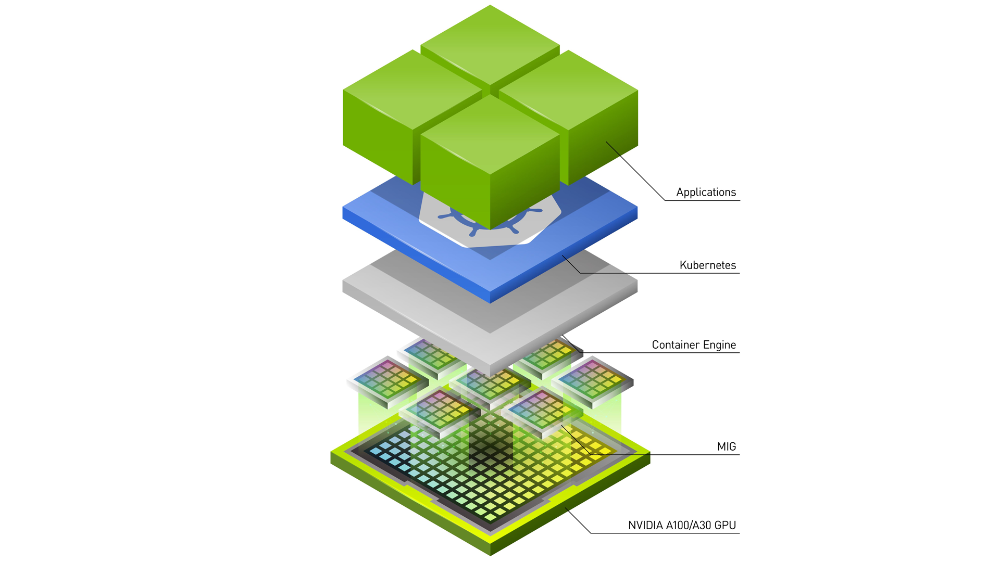
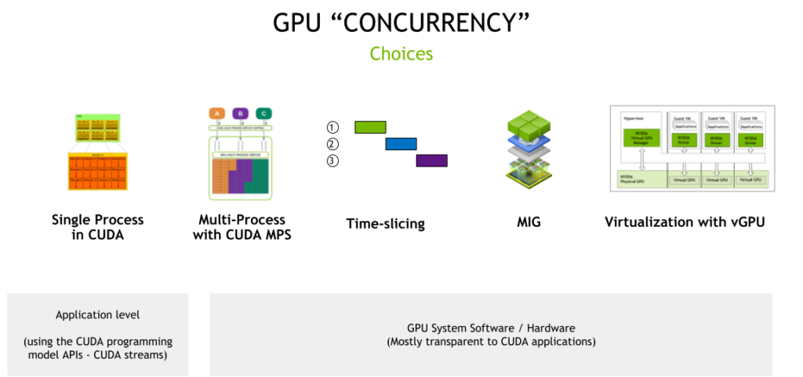

# 提高 Kubernetes 中的 GPU 利用率



对于可扩展的数据中心性能，NVIDIA GPU 已成为必备品。

由数千个计算内核支持的 NVIDIA GPU 并行处理能力对于加速不同行业的各种应用程序至关重要。如今，各行各业的计算密集型应用程序都在使用 GPU：

* 高性能计算，例如航​​空航天、生物科学研究或天气预报
* 使用 AI 来改进搜索、推荐、语言翻译或交通的消费者应用程序，例如自动驾驶
* 医疗保健，例如增强的医学成像
* 金融，例如欺诈检测
* 娱乐，例如视觉效果

在这个范围内的不同应用程序可能有不同的计算要求。训练巨型 AI 模型，其中 GPU 并行批处理数百个数据样本，使 GPU 在训练过程中得到充分利用。然而，许多其他应用程序类型可能只需要一小部分 GPU 计算，从而导致海量计算能力未得到充分利用。

在这种情况下，为每个工作负载配置适当大小的 GPU 加速是提高利用率和降低部署运营成本的关键，无论是在本地还是在云中。

为了解决 Kubernetes (K8s) 集群中 GPU 利用率的挑战，NVIDIA 提供了多种 GPU 并发和共享机制，以适应广泛的用例。最新添加的是新的 GPU 时间片 API，现已在 Kubernetes 中广泛使用，带有 NVIDIA K8s Device Plugin 0.12.0 和 NVIDIA GPU Operator 1.11。它们共同支持多个 GPU 加速工作负载进行时间切片并在单个 NVIDIA GPU 上运行。

在深入研究这个新功能之前，这里有一些关于您应该考虑共享 GPU 的用例的背景知识，并概述了所有可用的技术。


## 何时共享 NVIDIA GPU
以下是一些示例工作负载，它们可以通过共享 GPU 资源来提高利用率：

* 低批量推理服务，它可能只在 GPU 上处理一个输入样本
* 高性能计算 (HPC) 应用程序，例如模拟光子传播，平衡 CPU（读取和处理输入）和 GPU（执行计算）之间的计算。由于 CPU 核心性能的瓶颈，某些 HPC 应用程序可能无法在 GPU 部分实现高吞吐量。
* 使用 Jupyter notebook 进行 ML 模型探索的交互式开发
* 基于 Spark 的数据分析应用程序，其中一些任务或最小的工作单元同时运行并受益于更好的 GPU 利用率
* 本质上可能是突发性的可视化或离线渲染应用程序
* 希望使用任何可用 GPU 进行测试的持续集成/持续交付 (CICD) 流程

在这篇文章中，我们探讨了可用于在 Kubernetes 集群中共享对 NVIDIA GPU 的访问的各种技术，包括如何使用它们以及在选择正确方法时要考虑的权衡。

## GPU 并发机制
NVIDIA GPU 硬件与 CUDA 编程模型相结合，提供了许多不同的并发机制来提高 GPU 利用率。 这些机制的范围从编程模型 API（应用程序需要更改代码以利用并发性）到系统软件和硬件分区（包括对应用程序透明的虚拟化）。




### CUDA 流
CUDA 的异步模型意味着您可以通过单个 CUDA 上下文同时执行多个操作，类似于 GPU 端的主机进程，使用 CUDA 流。

流是一种软件抽象，它表示一系列命令，这些命令可能是计算内核、内存副本等的组合，它们都按顺序执行。在两个不同的流中启动的工作可以同时执行，从而实现粗粒度并行。该应用程序可以使用 CUDA 流和流[优先级](https://docs.nvidia.com/cuda/cuda-runtime-api/group__CUDART__STREAM.html)来管理并行性。

CUDA 流最大限度地利用 GPU 进行推理服务，例如，通过使用流并行运行多个模型。您要么缩放相同的模型，要么提供不同的模型。有关详细信息，请参阅[异步并发执行](https://docs.nvidia.com/cuda/cuda-c-programming-guide/index.html#asynchronous-concurrent-execution)。

与流的权衡是 API 只能在单个应用程序中使用，因此提供有限的硬件隔离，因为所有资源都是共享的，以及各种流之间的错误隔离。

### 时间切片
在处理多个 CUDA 应用程序时，每个应用程序都可能无法充分利用 GPU 的资源，您可以使用简单的超额订阅策略来利用 GPU 的时间切片调度程序。这由从 Pascal 架构开始的计算抢占来支持。这种技术，有时称为时间 GPU 共享，确实需要在不同 CUDA 应用程序之间进行上下文切换，但一些未充分利用的应用程序仍然可以从这种策略中受益。

从 CUDA 11.1（R455+ 驱动程序）开始，CUDA 应用程序的时间片持续时间可通过 nvidia-smi 实用程序进行配置：

```bash
$ nvidia-smi compute-policy --help

    Compute Policy -- Control and list compute policies.

    Usage: nvidia-smi compute-policy [options]

    Options include:
    [-i | --id]: GPU device ID's. Provide comma
                 separated values for more than one device

    [-l | --list]: List all compute policies

    [ | --set-timeslice]: Set timeslice config for a GPU:
                          0=DEFAULT, 1=SHORT, 2=MEDIUM, 3=LONG

    [-h | --help]: Display help information
```
当许多不同的应用程序在 GPU 上进行时间切片时，时间切片的权衡是增加了延迟、抖动和潜在的内存不足 (OOM) 情况。这种机制是我们在这篇文章的第二部分中关注的内容。

### CUDA 多进程服务
您可以使用 [CUDA MPS](https://docs.nvidia.com/deploy/mps/index.html) 将前面描述的超额订阅策略更进一步。当每个进程太小而无法使 GPU 的计算资源饱和时，MPS 使来自不同进程（通常是 MPI 等级）的 CUDA 内核能够在 GPU 上同时处理。与时间片不同，MPS 使来自不同进程的 CUDA 内核能够在 GPU 上并行执行。

较新版本的 CUDA（自 CUDA 11.4+ 起）在能够指定可分配内存量 (CUDA_MPS_PINNED_DEVICE_MEM_LIMIT) 和 MPS 客户端使用的可用计算 (CUDA_MPS_ACTIVE_THREAD_PERCENTAGE) 的限制方面增加了更细粒度的资源配置。有关使用这些调谐旋钮的更多信息，请参阅[ Volta MPS 执行资源供应](https://docs.nvidia.com/deploy/mps/index.html#topic_3_3_5_2)。

MPS 的权衡是错误隔离、内存保护和服务质量 (QoS) 的限制。 GPU 硬件资源仍然在所有 MPS 客户端之间共享。您现在可以使用 Kubernetes 进行 CUDA MPS，但 NVIDIA 计划在未来几个月内改进对 MPS 的支持。


### 多实例 GPU (MIG)
到目前为止讨论的机制依赖于使用 CUDA 编程模型 API（例如 CUDA 流）或 CUDA 系统软件（例如时间片或 MPS）对应用程序的更改。

借助 MIG，基于 NVIDIA Ampere 架构的 GPU（例如 NVIDIA A100）可以安全地划分为最多七个独立的 GPU 实例，用于 CUDA 应用程序，为多个应用程序提供专用的 GPU 资源。其中包括流式多处理器 (SM) 和 GPU 引擎，例如复制引擎或解码器，为进程、容器或虚拟机 (VM) 等不同客户端提供具有故障隔离的已定义 QoS。

在对 GPU 进行分区时，您可以在单个 MIG 实例中使用先前的 CUDA 流、CUDA MPS 和时间分片机制。

有关更多信息，请参阅 [MIG 用户指南](https://docs.nvidia.com/datacenter/tesla/mig-user-guide/)和 [Kubernetes 中的 MIG 支持](https://docs.nvidia.com/datacenter/cloud-native/kubernetes/mig-k8s.html)。

### 使用 vGPU 进行虚拟化
NVIDIA vGPU 使具有完整输入输出内存管理单元 (IOMMU) 保护的虚拟机能够同时、直接访问单个物理 GPU。除了安全性之外，NVIDIA vGPU 还带来了其他好处，例如通过实时虚拟机迁移进行虚拟机管理、运行混合 VDI 和计算工作负载的能力，以及与许多行业虚拟机管理程序的集成。

在支持 MIG 的 GPU 上，每个 GPU 分区都公开为 VM 的single-root  I/O 虚拟化 (SR-IOV) 虚拟功能。所有虚拟机都可以并行运行，而不是时间分片（在不支持 MIG 的 GPU 上）。

下表 总结了这些技术，包括何时考虑这些并发机制。

||	Streams|	MPS|	Time-Slicing|	MIG|	vGPU|
|----|----|----|----|----|----|
|Partition Type|	Single process|	Logical|	Temporal (Single process)|	Physical|	Temporal & Physical – VMs|
|Max Partitions|	Unlimited|	48|	Unlimited|	7|	Variable|
|SM Performance Isolation	|No|	Yes (by percentage, not partitioning)|	Yes	|Yes|	Yes|
|Memory Protection|	No|	Yes	|Yes	|Yes|	Yes|
|Memory Bandwidth QoS|	No	|No|	No|	Yes|	Yes|
|Error Isolation|	No|	No|	Yes|	Yes	|Yes|
|Cross-Partition Interop	|Always|	IPC	|Limited IPC|	Limited IPC	|No|
|Reconfigure|	Dynamic	|At process launch|	N/A	|When idle|	N/A|
|GPU Management (telemetry)	|N/A|	Limited GPU metrics|	N/A|	Yes – GPU metrics, support for containers	|Yes – live migration and other industry virtualization tools|
|Target use cases (and when to use each)|	Optimize for concurrency within a single application|	Run multiple applications in parallel but can deal with limited resiliency	|Run multiple applications that are not latency-sensitive or can tolerate jitter|	Run multiple applications in parallel but need resiliency and QoS|	Support multi-tenancy on the GPU through virtualization and need VM management benefits|


在此背景下，本文的其余部分将重点介绍使用 Kubernetes 中新的时间片 API 超额订阅 GPU。

## Kubernetes 中的时间片支持
NVIDIA GPU 通过[设备插件框架](https://kubernetes.io/docs/concepts/extend-kubernetes/compute-storage-net/device-plugins/#device-plugin-registration)在 Kubernetes 中被[宣传](https://github.com/NVIDIA/k8s-device-plugin)为可调度资源。但是，此框架仅允许将包括 GPU（如 nvidia.com/gpu）在内的设备宣传为整数资源，因此不允许超额订阅。在本节中，我们将讨论一种使用时间片在 Kubernetes 中超额订阅 GPU 的新方法。

在讨论新 API 之前，我们介绍一种使用配置文件配置 NVIDIA Kubernetes 设备插件的新机制。

### 新的配置文件支持
Kubernetes 设备插件提供了许多配置选项，可以设置为命令行选项或环境变量，例如设置 MIG 策略、设备枚举等。类似地，[gpu-feature-discovery](https://github.com/NVIDIA/gpu-feature-discovery) (GFD) 使用类似的选项来生成标签来描述 GPU 节点。

随着配置选项变得越来越复杂，您可以使用配置文件将这些选项表达给 Kubernetes 设备插件和 GFD，然后将其部署为 configmap 对象并在启动期间应用于插件和 GFD pod。

配置选项在 YAML 文件中表示。在以下示例中，您将各种选项记录在一个名为 `dp-example-config.yaml` 的文件中，该文件在 `/tmp` 下创建。

```bash
$ cat << EOF > /tmp/dp-example-config.yaml
version: v1
flags:
  migStrategy: "none"
  failOnInitError: true
  nvidiaDriverRoot: "/"
  plugin:
    passDeviceSpecs: false
    deviceListStrategy: "envvar"
    deviceIDStrategy: "uuid"
  gfd:
    oneshot: false
    noTimestamp: false
    outputFile: /etc/kubernetes/node-feature-discovery/features.d/gfd
    sleepInterval: 60s
EOF
```
然后，通过指定配置文件的位置并使用 `gfd.enabled=true` 选项启动 Kubernetes 设备插件来启动 GFD：

```bash
$ helm install nvdp nvdp/nvidia-device-plugin \
    --version=0.12.2 \
    --namespace nvidia-device-plugin \
    --create-namespace \
    --set gfd.enabled=true \
    --set-file config.map.config=/tmp/dp-example-config.yaml
```

### 动态配置更改
默认情况下，该配置应用于所有节点上的所有 GPU。 Kubernetes 设备插件支持指定多个配置文件。 您可以通过覆盖节点上的标签来逐个节点地覆盖配置。

Kubernetes 设备插件使用 `sidecar` 容器检测所需节点配置的变化并重新加载设备插件，以便新配置生效。 在以下示例中，您为设备插件创建了两个配置：一个应用于所有节点的默认配置，另一个您可以按需应用于 A100 GPU 节点的配置。

```bash
$ helm install nvdp nvdp/nvidia-device-plugin \
    --version=0.12.2 \
    --namespace nvidia-device-plugin \
    --create-namespace \
    --set gfd.enabled=true \
    --set-file config.map.default=/tmp/dp-example-config-default.yaml \
    --set-file config.map.a100-80gb-config=/tmp/dp-example-config-a100.yaml
```
然后，只要节点标签被覆盖，Kubernetes 设备插件就会启用对配置的动态更改，如果需要，可以在每个节点的基础上进行配置：

```bash
$ kubectl label node \
   --overwrite \
   --selector=nvidia.com/gpu.product=A100-SXM4-80GB \
    nvidia.com/device-plugin.config=a100-80gb-config
```

### 时间片 API
为了支持 GPU 的时间分片，您可以使用以下字段扩展配置文件的定义：

```json
version: v1
sharing:
  timeSlicing:
    renameByDefault: <bool>
    failRequestsGreaterThanOne: <bool>
    resources:
    - name: <resource-name>
      replicas: <num-replicas>
    ...
```

也就是说，对于 `shared.timeSlicing.resources` 下的每个命名资源，现在可以为该资源类型指定多个副本。

此外，如果 `renameByDefault=true`，则每个资源都以名称 `<resource-name>.shared` 而不是简单的 `<resource-name>` 进行通告。

为了向后兼容，`failRequestsGreaterThanOne` 标志默认为 `false`。它控制 `pod` 是否可以请求多个 GPU 资源。多个 GPU 的请求并不意味着 `Pod` 会按比例获得更多的时间片，因为 GPU 调度程序当前为在 GPU 上运行的所有进程分配了相等的时间份额。

`failRequestsGreaterThanOne` 标志将插件的行为配置为将一个 GPU 的请求视为访问请求而不是独占资源请求。

随着新的超额订阅资源的创建，Kubernetes 设备插件将这些资源分配给请求的作业。当两个或多个作业落在同一个 GPU 上时，这些作业会自动使用 GPU 的时间切片机制。该插件不提供任何其他额外的隔离优势。

### GFD 应用的标签
对于 GFD，应用的标签取决于` renameByDefault=true`。 无论 `renameByDefault` 的设置如何，始终应用以下标签：

```bash
nvidia.com/<resource-name>.replicas = <num-replicas>
```
但是，当 `renameByDefault=false` 时，还会在 `nvidia.com/<resource-name>.product` 标签中添加以下后缀：

```bash
nvidia.com/gpu.product = <product name>-SHARED
```

使用这些标签，您可以像传统上选择一个 GPU 模型而不是另一个模型一样选择共享或非共享 GPU。 也就是说，SHARED 注解确保您可以使用 `nodeSelector` 对象将 `pod` 吸引到其上具有共享 GPU 的节点。 此外，`pod` 可以确保它们降落在一个节点上，该节点使用新的副本标签将 GPU 划分为所需的比例。

### 超额认购示例
这是一个使用时间片 API 超额订阅 GPU 资源的完整示例。 在此示例中，您将逐步完成 Kubernetes 设备插件和 GFD 的其他配置设置，以设置 GPU 超额订阅并使用指定资源启动工作负载。

考虑以下配置文件：

```json
version: v1
sharing:
  timeSlicing:
    resources:
    - name: nvidia.com/gpu
      replicas: 5
    ...
```
如果将此配置应用于具有 8 个 GPU 的节点，则该插件现在将向 Kubernetes 通告 40 个 `nvidia.com/gpu` 资源，而不是 8 个。 如果设置了 `renameByDefault: true` 选项，则将通告 40 个 `nvidia.com/gpu.shared` 资源，而不是 8 个 `nvidia.com/gpu` 资源。

您可以在以下示例配置中启用时间片。 在此示例中，将 GPU 超额订阅 2 倍：

```bash
$ cat << EOF > /tmp/dp-example-config.yaml
version: v1
flags:
  migStrategy: "none"
  failOnInitError: true
  nvidiaDriverRoot: "/"
  plugin:
    passDeviceSpecs: false
    deviceListStrategy: "envvar"
    deviceIDStrategy: "uuid"
  gfd:
    oneshot: false
    noTimestamp: false
    outputFile: /etc/kubernetes/node-feature-discovery/features.d/gfd
    sleepInterval: 60s
sharing:
  timeSlicing:
    resources:
    - name: nvidia.com/gpu
      replicas: 2
EOF
```

设置 Helm chart repository：
```bash
$ helm repo add nvdp https://nvidia.github.io/k8s-device-plugin \
   && helm repo update
```

现在，通过指定之前创建的配置文件的位置来部署 Kubernetes 设备插件：

```bash
$ helm install nvdp nvdp/nvidia-device-plugin \
    --version=0.12.2 \
    --namespace nvidia-device-plugin \
    --create-namespace \
    --set gfd.enabled=true \
    --set-file config.map.config=/tmp/dp-example-config.yaml
```

由于节点只有一个物理 GPU，您现在可以看到设备插件将两个 GPU 宣传为可分配：

```bash
$ kubectl describe node
...
Capacity:
  cpu:                4
  ephemeral-storage:  32461564Ki
  hugepages-1Gi:      0
  hugepages-2Mi:      0
  memory:             16084408Ki
  nvidia.com/gpu:     2
  pods:               110
Allocatable:
  cpu:                4
  ephemeral-storage:  29916577333
  hugepages-1Gi:      0
  hugepages-2Mi:      0
  memory:             15982008Ki
  nvidia.com/gpu:     2
  pods:               110
```
接下来，部署两个应用程序（在本例中为 FP16 CUDA GEMM 工作负载），每个应用程序都请求一个 GPU。 观察到 GPU 上的应用程序上下文切换，因此仅在 T4 上实现大约一半的峰值 FP16 带宽。
```bash
$ cat << EOF | kubectl create -f -
apiVersion: v1
kind: Pod
metadata:
  name: dcgmproftester-1
spec:
  restartPolicy: "Never"
  containers:
  - name: dcgmproftester11
    image: nvidia/samples:dcgmproftester-2.0.10-cuda11.0-ubuntu18.04
    args: ["--no-dcgm-validation", "-t 1004", "-d 30"]  
    resources:
      limits:
         nvidia.com/gpu: 1    
    securityContext:
      capabilities:
        add: ["SYS_ADMIN"]  

---

apiVersion: v1
kind: Pod
metadata:
  name: dcgmproftester-2
spec:
  restartPolicy: "Never"
  containers:
  - name: dcgmproftester11
    image: nvidia/samples:dcgmproftester-2.0.10-cuda11.0-ubuntu18.04
    args: ["--no-dcgm-validation", "-t 1004", "-d 30"]  
    resources:
      limits:
         nvidia.com/gpu: 1    
    securityContext:
      capabilities:
        add: ["SYS_ADMIN"]
EOF
```

您现在可以看到在单个物理 GPU 上部署和运行的两个容器，如果没有新的时间片 API，这在 Kubernetes 中是不可能的：

```bash
$ kubectl get pods -A
NAMESPACE              NAME                                                              READY   STATUS    RESTARTS   AGE
default                dcgmproftester-1                                                  1/1     Running   0          45s
default                dcgmproftester-2                                                  1/1     Running   0          45s
kube-system            calico-kube-controllers-6fcb5c5bcf-cl5h5                          1/1     Running   3          32d
```

可以在宿主机上使用`nvidia-smi`，通过插件和GPU上的上下文切换，看到两个容器被调度在同一个物理GPU上：
```bash
$ nvidia-smi -L
GPU 0: Tesla T4 (UUID: GPU-491287c9-bc95-b926-a488-9503064e72a1)

$ nvidia-smi
...<snip>...

+-----------------------------------------------------------------------------+
| Processes:                                                                  |
|  GPU   GI   CI        PID   Type   Process name                  GPU Memory |
|        ID   ID                                                   Usage      |
|=============================================================================|
|    0   N/A  N/A    466420      C   /usr/bin/dcgmproftester11         315MiB |
|    0   N/A  N/A    466421      C   /usr/bin/dcgmproftester11         315MiB |
+-----------------------------------------------------------------------------+
```

## 总结
立即开始利用 Kubernetes 中[新的 GPU 超额订阅支持](https://catalog.ngc.nvidia.com/orgs/nvidia/containers/k8s-device-plugin)。 新版本 Kubernetes 设备插件的 Helm 图表使您可以轻松地立即开始使用该功能。

短期路线图包括与 [NVIDIA GPU Operator](https://docs.nvidia.com/datacenter/cloud-native/gpu-operator/overview.html) 的集成，以便您可以访问该功能，无论是使用 Red Hat 的 OpenShift、VMware Tanzu，还是使用[ NVIDIA LaunchPad 上的 NVIDIA Cloud Native Core 等预置环境](https://www.nvidia.com/en-us/data-center/launchpad/)。 NVIDIA 还致力于改进 Kubernetes 设备插件中对 CUDA MPS 的支持，以便您可以利用 Kubernetes 中的其他 GPU 并发机制。

如果您有任何问题或意见，请在评论部分留下。 对于有关安装和使用的技术问题，我们建议在 [NVIDIA/k8s-device-plugin](https://github.com/NVIDIA/k8s-device-plugin) GitHub 存储库上提交问题。 感谢您的反馈！


