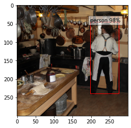
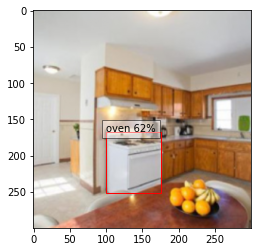
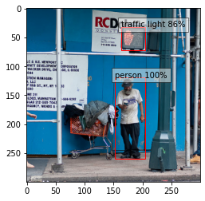

# Object Detection with Torch-TensorRT (SSD)

## 简介

在开发机器学习模型的实践中，很少有工具能像 PyTorch 那样用于开发和试验机器学习模型的设计。 PyTorch 的强大之处在于它与 Python 的深度集成、它的灵活性以及它的自动微分和执行方法（急切执行）。然而，当从研究转向生产时，需求发生了变化，我们可能不再需要深度 Python 集成，我们希望优化以在我们的部署平台上获得最佳性能。在 PyTorch 1.0 中，引入了 TorchScript 作为一种将 PyTorch 模型与 Python 分离的方法，使其可移植和可优化。 TorchScript 使用 PyTorch 的 JIT 编译器将由 Python 解释器解释的普通 PyTorch 代码转换为可以在其上运行优化并且在运行时可以由 PyTorch JIT 解释器解释的中间表示 (IR)。对于 PyTorch，这开辟了一个全新的可能性世界，包括以 C++ 等其他语言进行部署。它还引入了一种基于结构化图的格式，我们可以使用它来对模型进行内核级优化以进行推理。

在 NVIDIA GPU TensorRT 上部署时，NVIDIA 的深度学习优化 SDK 和运行时能够从任何主要框架中获取模型，并专门调整它们以在 NVIDIA 系列中的特定目标硬件上表现更好，无论是 A100、TITAN V、Jetson Xavier 还是 NVIDIA 的深度学习加速器。 TensorRT 执行了几组优化来实现这一点。 TensorRT 融合模型图中的层和张量，然后使用大型内核库来选择在目标 GPU 上表现最佳的实现。 TensorRT 还对降低操作精度执行有强大的支持，允许用户在 Volta 和更新的 GPU 上利用 Tensor Cores，并减少设备上的内存和计算占用。

Torch-TensorRT 是一个使用 TensorRT 优化 TorchScript 代码的编译器，将标准 TorchScript 模块编译成在内部使用 TensorRT 优化运行的模块。这使您能够继续留在 PyTorch 生态系统中，使用 PyTorch 具有的所有强大功能，例如模块可组合性、灵活的张量实现、数据加载器等。 Torch-TensorRT 可用于 PyTorch 和 LibTorch。

### 学习目标

本文演示了在预训练的 SSD 网络上使用 Torch-TensorRT 编译 TorchScript 模块并运行它以测试获得的加速比的步骤。

## 内容
1. [安装](#1)
2. [SSD 简介](#2)
3. [创建TorchScript模块](#3)
4. [编译 Torch-TensorRT](#4)
5. [运行Inference](#5)
6. [测试加速比](#6)
7. [总结](#7)

源码下载地址: https://github.com/pytorch/TensorRT/blob/master/notebooks/ssd-object-detection-demo.ipynb


---
<a id="1"></a>
## 1. 安装
按照 `notebooks/README` 中的步骤准备一个 Docker 容器，您可以在其中运行此演示示例。

除此之外，运行以下单元以获取特定于此演示的其他库。
```bash
pip install scikit-image==0.19.1
pip install ipywidgets --trusted-host pypi.org --trusted-host pypi.python.org --trusted-host=files.pythonhosted.org
```
```bash
Looking in indexes: https://pypi.org/simple, https://pypi.ngc.nvidia.com
Collecting scikit-image==0.19.1
  Downloading scikit_image-0.19.1-cp38-cp38-manylinux_2_17_x86_64.manylinux2014_x86_64.whl (13.8 MB)
     |████████████████████████████████| 13.8 MB 8.8 MB/s eta 0:00:01
Requirement already satisfied: networkx>=2.2 in /opt/conda/lib/python3.8/site-packages (from scikit-image==0.19.1) (2.6.3)
Collecting tifffile>=2019.7.26
  Downloading tifffile-2022.3.16-py3-none-any.whl (179 kB)
     |████████████████████████████████| 179 kB 110.1 MB/s eta 0:00:01
Requirement already satisfied: packaging>=20.0 in /opt/conda/lib/python3.8/site-packages (from scikit-image==0.19.1) (21.3)
Requirement already satisfied: scipy>=1.4.1 in /opt/conda/lib/python3.8/site-packages (from scikit-image==0.19.1) (1.6.3)
Requirement already satisfied: numpy>=1.17.0 in /opt/conda/lib/python3.8/site-packages (from scikit-image==0.19.1) (1.22.2)
Collecting imageio>=2.4.1
  Downloading imageio-2.16.1-py3-none-any.whl (3.3 MB)
     |████████████████████████████████| 3.3 MB 42.3 MB/s eta 0:00:01
Requirement already satisfied: pillow!=7.1.0,!=7.1.1,!=8.3.0,>=6.1.0 in /opt/conda/lib/python3.8/site-packages (from scikit-image==0.19.1) (9.0.0)
Collecting PyWavelets>=1.1.1
  Downloading PyWavelets-1.3.0-cp38-cp38-manylinux_2_17_x86_64.manylinux2014_x86_64.whl (6.9 MB)
     |████████████████████████████████| 6.9 MB 61.3 MB/s eta 0:00:01
Requirement already satisfied: pyparsing!=3.0.5,>=2.0.2 in /opt/conda/lib/python3.8/site-packages (from packaging>=20.0->scikit-image==0.19.1) (3.0.7)
Installing collected packages: tifffile, PyWavelets, imageio, scikit-image
Successfully installed PyWavelets-1.3.0 imageio-2.16.1 scikit-image-0.19.1 tifffile-2022.3.16
WARNING: Running pip as the 'root' user can result in broken permissions and conflicting behaviour with the system package manager. It is recommended to use a virtual environment instead: https://pip.pypa.io/warnings/venv
Looking in indexes: https://pypi.org/simple, https://pypi.ngc.nvidia.com
Collecting ipywidgets
  Downloading ipywidgets-7.7.0-py2.py3-none-any.whl (123 kB)
     |████████████████████████████████| 123 kB 12.1 MB/s eta 0:00:01
Requirement already satisfied: ipykernel>=4.5.1 in /opt/conda/lib/python3.8/site-packages (from ipywidgets) (6.9.0)
Collecting jupyterlab-widgets>=1.0.0
  Downloading jupyterlab_widgets-1.1.0-py3-none-any.whl (245 kB)
     |████████████████████████████████| 245 kB 60.6 MB/s eta 0:00:01
Requirement already satisfied: nbformat>=4.2.0 in /opt/conda/lib/python3.8/site-packages (from ipywidgets) (5.1.3)
Requirement already satisfied: ipython-genutils~=0.2.0 in /opt/conda/lib/python3.8/site-packages (from ipywidgets) (0.2.0)
Requirement already satisfied: ipython>=4.0.0 in /opt/conda/lib/python3.8/site-packages (from ipywidgets) (8.0.1)
Requirement already satisfied: traitlets>=4.3.1 in /opt/conda/lib/python3.8/site-packages (from ipywidgets) (5.1.1)
Collecting widgetsnbextension~=3.6.0
  Downloading widgetsnbextension-3.6.0-py2.py3-none-any.whl (1.6 MB)
     |████████████████████████████████| 1.6 MB 35.2 MB/s eta 0:00:01
Requirement already satisfied: nest-asyncio in /opt/conda/lib/python3.8/site-packages (from ipykernel>=4.5.1->ipywidgets) (1.5.4)
Requirement already satisfied: jupyter-client<8.0 in /opt/conda/lib/python3.8/site-packages (from ipykernel>=4.5.1->ipywidgets) (7.1.2)
Requirement already satisfied: tornado<7.0,>=4.2 in /opt/conda/lib/python3.8/site-packages (from ipykernel>=4.5.1->ipywidgets) (6.1)
Requirement already satisfied: matplotlib-inline<0.2.0,>=0.1.0 in /opt/conda/lib/python3.8/site-packages (from ipykernel>=4.5.1->ipywidgets) (0.1.3)
Requirement already satisfied: debugpy<2.0,>=1.0.0 in /opt/conda/lib/python3.8/site-packages (from ipykernel>=4.5.1->ipywidgets) (1.5.1)
Requirement already satisfied: stack-data in /opt/conda/lib/python3.8/site-packages (from ipython>=4.0.0->ipywidgets) (0.1.4)
Requirement already satisfied: prompt-toolkit!=3.0.0,!=3.0.1,<3.1.0,>=2.0.0 in /opt/conda/lib/python3.8/site-packages (from ipython>=4.0.0->ipywidgets) (3.0.26)
Requirement already satisfied: pickleshare in /opt/conda/lib/python3.8/site-packages (from ipython>=4.0.0->ipywidgets) (0.7.5)
Requirement already satisfied: pygments in /opt/conda/lib/python3.8/site-packages (from ipython>=4.0.0->ipywidgets) (2.11.2)
Requirement already satisfied: pexpect>4.3 in /opt/conda/lib/python3.8/site-packages (from ipython>=4.0.0->ipywidgets) (4.8.0)
Requirement already satisfied: decorator in /opt/conda/lib/python3.8/site-packages (from ipython>=4.0.0->ipywidgets) (5.1.1)
Requirement already satisfied: backcall in /opt/conda/lib/python3.8/site-packages (from ipython>=4.0.0->ipywidgets) (0.2.0)
Requirement already satisfied: black in /opt/conda/lib/python3.8/site-packages (from ipython>=4.0.0->ipywidgets) (22.1.0)
Requirement already satisfied: setuptools>=18.5 in /opt/conda/lib/python3.8/site-packages (from ipython>=4.0.0->ipywidgets) (59.5.0)
Requirement already satisfied: jedi>=0.16 in /opt/conda/lib/python3.8/site-packages (from ipython>=4.0.0->ipywidgets) (0.18.1)
Requirement already satisfied: parso<0.9.0,>=0.8.0 in /opt/conda/lib/python3.8/site-packages (from jedi>=0.16->ipython>=4.0.0->ipywidgets) (0.8.3)
Requirement already satisfied: entrypoints in /opt/conda/lib/python3.8/site-packages (from jupyter-client<8.0->ipykernel>=4.5.1->ipywidgets) (0.3)
Requirement already satisfied: pyzmq>=13 in /opt/conda/lib/python3.8/site-packages (from jupyter-client<8.0->ipykernel>=4.5.1->ipywidgets) (22.3.0)
Requirement already satisfied: jupyter-core>=4.6.0 in /opt/conda/lib/python3.8/site-packages (from jupyter-client<8.0->ipykernel>=4.5.1->ipywidgets) (4.9.1)
Requirement already satisfied: python-dateutil>=2.1 in /opt/conda/lib/python3.8/site-packages (from jupyter-client<8.0->ipykernel>=4.5.1->ipywidgets) (2.8.2)
Requirement already satisfied: jsonschema!=2.5.0,>=2.4 in /opt/conda/lib/python3.8/site-packages (from nbformat>=4.2.0->ipywidgets) (4.4.0)
Requirement already satisfied: attrs>=17.4.0 in /opt/conda/lib/python3.8/site-packages (from jsonschema!=2.5.0,>=2.4->nbformat>=4.2.0->ipywidgets) (21.4.0)
Requirement already satisfied: pyrsistent!=0.17.0,!=0.17.1,!=0.17.2,>=0.14.0 in /opt/conda/lib/python3.8/site-packages (from jsonschema!=2.5.0,>=2.4->nbformat>=4.2.0->ipywidgets) (0.18.1)
Requirement already satisfied: importlib-resources>=1.4.0 in /opt/conda/lib/python3.8/site-packages (from jsonschema!=2.5.0,>=2.4->nbformat>=4.2.0->ipywidgets) (5.4.0)
Requirement already satisfied: zipp>=3.1.0 in /opt/conda/lib/python3.8/site-packages (from importlib-resources>=1.4.0->jsonschema!=2.5.0,>=2.4->nbformat>=4.2.0->ipywidgets) (3.7.0)
Requirement already satisfied: ptyprocess>=0.5 in /opt/conda/lib/python3.8/site-packages (from pexpect>4.3->ipython>=4.0.0->ipywidgets) (0.7.0)
Requirement already satisfied: wcwidth in /opt/conda/lib/python3.8/site-packages (from prompt-toolkit!=3.0.0,!=3.0.1,<3.1.0,>=2.0.0->ipython>=4.0.0->ipywidgets) (0.2.5)
Requirement already satisfied: six>=1.5 in /opt/conda/lib/python3.8/site-packages (from python-dateutil>=2.1->jupyter-client<8.0->ipykernel>=4.5.1->ipywidgets) (1.16.0)
Requirement already satisfied: notebook>=4.4.1 in /opt/conda/lib/python3.8/site-packages (from widgetsnbextension~=3.6.0->ipywidgets) (6.4.1)
Requirement already satisfied: terminado>=0.8.3 in /opt/conda/lib/python3.8/site-packages (from notebook>=4.4.1->widgetsnbextension~=3.6.0->ipywidgets) (0.13.1)
Requirement already satisfied: Send2Trash>=1.5.0 in /opt/conda/lib/python3.8/site-packages (from notebook>=4.4.1->widgetsnbextension~=3.6.0->ipywidgets) (1.8.0)
Requirement already satisfied: prometheus-client in /opt/conda/lib/python3.8/site-packages (from notebook>=4.4.1->widgetsnbextension~=3.6.0->ipywidgets) (0.13.1)
Requirement already satisfied: jinja2 in /opt/conda/lib/python3.8/site-packages (from notebook>=4.4.1->widgetsnbextension~=3.6.0->ipywidgets) (3.0.3)
Requirement already satisfied: nbconvert in /opt/conda/lib/python3.8/site-packages (from notebook>=4.4.1->widgetsnbextension~=3.6.0->ipywidgets) (6.4.2)
Requirement already satisfied: argon2-cffi in /opt/conda/lib/python3.8/site-packages (from notebook>=4.4.1->widgetsnbextension~=3.6.0->ipywidgets) (21.3.0)
Requirement already satisfied: argon2-cffi-bindings in /opt/conda/lib/python3.8/site-packages (from argon2-cffi->notebook>=4.4.1->widgetsnbextension~=3.6.0->ipywidgets) (21.2.0)
Requirement already satisfied: cffi>=1.0.1 in /opt/conda/lib/python3.8/site-packages (from argon2-cffi-bindings->argon2-cffi->notebook>=4.4.1->widgetsnbextension~=3.6.0->ipywidgets) (1.15.0)
Requirement already satisfied: pycparser in /opt/conda/lib/python3.8/site-packages (from cffi>=1.0.1->argon2-cffi-bindings->argon2-cffi->notebook>=4.4.1->widgetsnbextension~=3.6.0->ipywidgets) (2.21)
Requirement already satisfied: pathspec>=0.9.0 in /opt/conda/lib/python3.8/site-packages (from black->ipython>=4.0.0->ipywidgets) (0.9.0)
Requirement already satisfied: tomli>=1.1.0 in /opt/conda/lib/python3.8/site-packages (from black->ipython>=4.0.0->ipywidgets) (2.0.1)
Requirement already satisfied: mypy-extensions>=0.4.3 in /opt/conda/lib/python3.8/site-packages (from black->ipython>=4.0.0->ipywidgets) (0.4.3)
Requirement already satisfied: click>=8.0.0 in /opt/conda/lib/python3.8/site-packages (from black->ipython>=4.0.0->ipywidgets) (8.0.3)
Requirement already satisfied: platformdirs>=2 in /opt/conda/lib/python3.8/site-packages (from black->ipython>=4.0.0->ipywidgets) (2.4.1)
Requirement already satisfied: typing-extensions>=3.10.0.0 in /opt/conda/lib/python3.8/site-packages (from black->ipython>=4.0.0->ipywidgets) (4.0.1)
Requirement already satisfied: MarkupSafe>=2.0 in /opt/conda/lib/python3.8/site-packages (from jinja2->notebook>=4.4.1->widgetsnbextension~=3.6.0->ipywidgets) (2.0.1)
Requirement already satisfied: defusedxml in /opt/conda/lib/python3.8/site-packages (from nbconvert->notebook>=4.4.1->widgetsnbextension~=3.6.0->ipywidgets) (0.7.1)
Requirement already satisfied: mistune<2,>=0.8.1 in /opt/conda/lib/python3.8/site-packages (from nbconvert->notebook>=4.4.1->widgetsnbextension~=3.6.0->ipywidgets) (0.8.4)
Requirement already satisfied: nbclient<0.6.0,>=0.5.0 in /opt/conda/lib/python3.8/site-packages (from nbconvert->notebook>=4.4.1->widgetsnbextension~=3.6.0->ipywidgets) (0.5.11)
Requirement already satisfied: testpath in /opt/conda/lib/python3.8/site-packages (from nbconvert->notebook>=4.4.1->widgetsnbextension~=3.6.0->ipywidgets) (0.5.0)
Requirement already satisfied: jupyterlab-pygments in /opt/conda/lib/python3.8/site-packages (from nbconvert->notebook>=4.4.1->widgetsnbextension~=3.6.0->ipywidgets) (0.1.2)
Requirement already satisfied: bleach in /opt/conda/lib/python3.8/site-packages (from nbconvert->notebook>=4.4.1->widgetsnbextension~=3.6.0->ipywidgets) (4.1.0)
Requirement already satisfied: pandocfilters>=1.4.1 in /opt/conda/lib/python3.8/site-packages (from nbconvert->notebook>=4.4.1->widgetsnbextension~=3.6.0->ipywidgets) (1.5.0)
Requirement already satisfied: webencodings in /opt/conda/lib/python3.8/site-packages (from bleach->nbconvert->notebook>=4.4.1->widgetsnbextension~=3.6.0->ipywidgets) (0.5.1)
Requirement already satisfied: packaging in /opt/conda/lib/python3.8/site-packages (from bleach->nbconvert->notebook>=4.4.1->widgetsnbextension~=3.6.0->ipywidgets) (21.3)
Requirement already satisfied: pyparsing!=3.0.5,>=2.0.2 in /opt/conda/lib/python3.8/site-packages (from packaging->bleach->nbconvert->notebook>=4.4.1->widgetsnbextension~=3.6.0->ipywidgets) (3.0.7)
Requirement already satisfied: executing in /opt/conda/lib/python3.8/site-packages (from stack-data->ipython>=4.0.0->ipywidgets) (0.8.2)
Requirement already satisfied: pure-eval in /opt/conda/lib/python3.8/site-packages (from stack-data->ipython>=4.0.0->ipywidgets) (0.2.2)
Requirement already satisfied: asttokens in /opt/conda/lib/python3.8/site-packages (from stack-data->ipython>=4.0.0->ipywidgets) (2.0.5)
Installing collected packages: widgetsnbextension, jupyterlab-widgets, ipywidgets
Successfully installed ipywidgets-7.7.0 jupyterlab-widgets-1.1.0 widgetsnbextension-3.6.0
WARNING: Running pip as the 'root' user can result in broken permissions and conflicting behaviour with the system package manager. It is recommended to use a virtual environment instead: https://pip.pypa.io/warnings/venv
```

---
<a id="2"></a>
## 2.SSD

### Single Shot MultiBox Detector model for object detection

 | 

PyTorch 有一个名为 PyTorch Hub 的模型存储库，它是常见模型的高质量实现的来源。 我们可以从那里获得在 [COCO](https://cocodataset.org/#home) 上预训练的 SSD 模型。


### 模型描述

该 SSD300 模型基于 [SSD：Single Shot MultiBox Detector](https://arxiv.org/abs/1512.02325) 论文，该论文将 SSD 描述为“一种使用单个深度神经网络检测图像中对象的方法”。输入大小固定为 300x300。

该模型与论文中描述的模型之间的主要区别在于主干。具体来说，VGG 模型已经过时，取而代之的是 ResNet-50 模型。

从现代卷积对象检测器的速度/准确度权衡论文中，对主干进行了以下增强：

* conv5_x、avgpool、fc 和 softmax 层已从原始分类模型中移除。
* conv4_x 中的所有步幅都设置为 1x1。

主干之后是 5 个额外的卷积层。除了卷积层，我们还附加了 6 个检测头：

* 第一个检测头附加到最后一个 conv4_x 层。
* 其他五个检测头连接到相应的 5 个附加层。
* 检测器头类似于论文中提到的那些，但是，它们在每次卷积后通过额外的 BatchNorm 层得到增强。

有关此 SSD 型号的更多信息，请访问 Nvidia 的[“DeepLearningExamples”Github](https://github.com/NVIDIA/DeepLearningExamples/tree/master/PyTorch/Detection/SSD)。

执行:
```python
import torch
torch.hub._validate_not_a_forked_repo=lambda a,b,c: True

# List of available models in PyTorch Hub from Nvidia/DeepLearningExamples
torch.hub.list('NVIDIA/DeepLearningExamples:torchhub')
```
输出:
```bash
Downloading: "https://github.com/NVIDIA/DeepLearningExamples/archive/torchhub.zip" to /root/.cache/torch/hub/torchhub.zip
/root/.cache/torch/hub/NVIDIA_DeepLearningExamples_torchhub/PyTorch/Classification/ConvNets/image_classification/models/efficientnet.py:17: UserWarning: pytorch_quantization module not found, quantization will not be available
  warnings.warn(
```
```bash
['nvidia_convnets_processing_utils',
 'nvidia_efficientnet',
 'nvidia_efficientnet_b0',
 'nvidia_efficientnet_b4',
 'nvidia_efficientnet_widese_b0',
 'nvidia_efficientnet_widese_b4',
 'nvidia_resneXt',
 'nvidia_resnet50',
 'nvidia_resnext101_32x4d',
 'nvidia_se_resnext101_32x4d',
 'nvidia_ssd',
 'nvidia_ssd_processing_utils',
 'nvidia_tacotron2',
 'nvidia_tts_utils',
 'nvidia_waveglow']
```
执行:
```Python
# load SSD model pretrained on COCO from Torch Hub
precision = 'fp32'
ssd300 = torch.hub.load('NVIDIA/DeepLearningExamples:torchhub', 'nvidia_ssd', model_math=precision);
```
输出:
```bash
Using cache found in /root/.cache/torch/hub/NVIDIA_DeepLearningExamples_torchhub
Downloading: "https://download.pytorch.org/models/resnet50-0676ba61.pth" to /root/.cache/torch/hub/checkpoints/resnet50-0676ba61.pth
  0%|          | 0.00/97.8M [00:00<?, ?B/s]
Downloading checkpoint from https://api.ngc.nvidia.com/v2/models/nvidia/ssd_pyt_ckpt_amp/versions/20.06.0/files/nvidia_ssdpyt_amp_200703.pt
```

设置`precision="fp16"` 会将经过混合精度训练的检查点加载到能够在`Tensor Cores` 上执行的架构中。 处理混合精度数据需要 `Apex` 库。

### 样本推断
我们现在可以对模型进行推理。 下面使用来自 COCO 2017 验证集的示例图像对此进行了演示。

执行:
```python
# Sample images from the COCO validation set
uris = [
    'http://images.cocodataset.org/val2017/000000397133.jpg',
    'http://images.cocodataset.org/val2017/000000037777.jpg',
    'http://images.cocodataset.org/val2017/000000252219.jpg'
]

# For convenient and comprehensive formatting of input and output of the model, load a set of utility methods.
utils = torch.hub.load('NVIDIA/DeepLearningExamples:torchhub', 'nvidia_ssd_processing_utils')

# Format images to comply with the network input
inputs = [utils.prepare_input(uri) for uri in uris]
tensor = utils.prepare_tensor(inputs, False)

# The model was trained on COCO dataset, which we need to access in order to
# translate class IDs into object names. 
classes_to_labels = utils.get_coco_object_dictionary()
```

输出:
```bash
Using cache found in /root/.cache/torch/hub/NVIDIA_DeepLearningExamples_torchhub
Downloading COCO annotations.
Downloading finished.
```

执行:
```python
# Next, we run object detection
model = ssd300.eval().to("cuda")
detections_batch = model(tensor)

# By default, raw output from SSD network per input image contains 8732 boxes with 
# localization and class probability distribution. 
# Let’s filter this output to only get reasonable detections (confidence>40%) in a more comprehensive format.
results_per_input = utils.decode_results(detections_batch)
best_results_per_input = [utils.pick_best(results, 0.40) for results in results_per_input]
```

### 可视化结果

执行:
```python
from matplotlib import pyplot as plt
import matplotlib.patches as patches

# The utility plots the images and predicted bounding boxes (with confidence scores).
def plot_results(best_results):
    for image_idx in range(len(best_results)):
        fig, ax = plt.subplots(1)
        # Show original, denormalized image...
        image = inputs[image_idx] / 2 + 0.5
        ax.imshow(image)
        # ...with detections
        bboxes, classes, confidences = best_results[image_idx]
        for idx in range(len(bboxes)):
            left, bot, right, top = bboxes[idx]
            x, y, w, h = [val * 300 for val in [left, bot, right - left, top - bot]]
            rect = patches.Rectangle((x, y), w, h, linewidth=1, edgecolor='r', facecolor='none')
            ax.add_patch(rect)
            ax.text(x, y, "{} {:.0f}%".format(classes_to_labels[classes[idx] - 1], confidences[idx]*100), bbox=dict(facecolor='white', alpha=0.5))
    plt.show()

# Visualize results without Torch-TensorRT
plot_results(best_results_per_input)
```



### 测试单元

执行:
```python
import time
import numpy as np

import torch.backends.cudnn as cudnn
cudnn.benchmark = True

# Helper function to benchmark the model
def benchmark(model, input_shape=(1024, 1, 32, 32), dtype='fp32', nwarmup=50, nruns=1000):
    input_data = torch.randn(input_shape)
    input_data = input_data.to("cuda")
    if dtype=='fp16':
        input_data = input_data.half()
        
    print("Warm up ...")
    with torch.no_grad():
        for _ in range(nwarmup):
            features = model(input_data)
    torch.cuda.synchronize()
    print("Start timing ...")
    timings = []
    with torch.no_grad():
        for i in range(1, nruns+1):
            start_time = time.time()
            pred_loc, pred_label  = model(input_data)
            torch.cuda.synchronize()
            end_time = time.time()
            timings.append(end_time - start_time)
            if i%10==0:
                print('Iteration %d/%d, avg batch time %.2f ms'%(i, nruns, np.mean(timings)*1000))

    print("Input shape:", input_data.size())
    print("Output location prediction size:", pred_loc.size())
    print("Output label prediction size:", pred_label.size())
    print('Average batch time: %.2f ms'%(np.mean(timings)*1000))

```

我们在使用 Torch-TensorRT 之前检查模型的性能

执行:
```Python
# Model benchmark without Torch-TensorRT
model = ssd300.eval().to("cuda")
benchmark(model, input_shape=(128, 3, 300, 300), nruns=100)
```
输出:

```bash
Warm up ...
Start timing ...
Iteration 10/100, avg batch time 165.38 ms
Iteration 20/100, avg batch time 165.99 ms
Iteration 30/100, avg batch time 166.04 ms
Iteration 40/100, avg batch time 166.32 ms
Iteration 50/100, avg batch time 166.49 ms
Iteration 60/100, avg batch time 166.74 ms
Iteration 70/100, avg batch time 166.88 ms
Iteration 80/100, avg batch time 167.05 ms
Iteration 90/100, avg batch time 167.18 ms
Iteration 100/100, avg batch time 167.31 ms
Input shape: torch.Size([128, 3, 300, 300])
Output location prediction size: torch.Size([128, 4, 8732])
Output label prediction size: torch.Size([128, 81, 8732])
Average batch time: 167.31 ms
```

---
<a id="3"></a>
## 3. 创建 TorchScript 模块  

要使用 Torch-TensorRT 进行编译，模型必须首先在 TorchScript 中。 TorchScript 是 PyTorch 中包含的一种编程语言，它消除了普通 PyTorch 模型所具有的 Python 依赖性。 这种转换是通过 JIT 编译器完成的，给定 PyTorch 模块将生成等效的 TorchScript 模块。 有两种路径可用于生成 TorchScript：**Tracing** 和 **Scripting**。

* **Tracing**遵循 PyTorch 的执行，在 TorchScript 中生成与它所看到的内容相对应的操作。
* **Scripting**对 Python 代码进行分析并生成 TorchScript，这允许生成的图形包含跟踪无法做到的控制流。

然而，由于其简单性，Tracing 更有可能使用 Torch-TensorRT 成功编译（尽管两个系统都支持）。

```python
model = ssd300.eval().to("cuda")
traced_model = torch.jit.trace(model, [torch.randn((1,3,300,300)).to("cuda")])
```
如果需要，我们也可以保存这个模型并独立于 Python 使用它。

执行:
```python
# This is just an example, and not required for the purposes of this demo
torch.jit.save(traced_model, "ssd_300_traced.jit.pt")

# Obtain the average time taken by a batch of input with Torchscript compiled modules
benchmark(traced_model, input_shape=(128, 3, 300, 300), nruns=100)
```
输出:
```bash
Warm up ...
Start timing ...
Iteration 10/100, avg batch time 165.53 ms
Iteration 20/100, avg batch time 166.19 ms
Iteration 30/100, avg batch time 166.12 ms
Iteration 40/100, avg batch time 166.16 ms
Iteration 50/100, avg batch time 166.24 ms
Iteration 60/100, avg batch time 166.33 ms
Iteration 70/100, avg batch time 166.43 ms
Iteration 80/100, avg batch time 166.44 ms
Iteration 90/100, avg batch time 166.53 ms
Iteration 100/100, avg batch time 166.59 ms
Input shape: torch.Size([128, 3, 300, 300])
Output location prediction size: torch.Size([128, 4, 8732])
Output label prediction size: torch.Size([128, 81, 8732])
Average batch time: 166.59 ms
```
---
<a id="4"></a>
## 4. 利用 Torch-TensorRT编译

TorchScript 模块的行为就像普通的 PyTorch 模块并且是互兼容的。 现在，我们可以从 TorchScript 编译基于 TensorRT 的模块。 该模块仍将在 TorchScript 中实现，但所有计算都将在 TensorRT 中完成。

执行:
```python
import torch_tensorrt

# The compiled module will have precision as specified by "op_precision".
# Here, it will have FP16 precision.
trt_model = torch_tensorrt.compile(traced_model, 
    inputs= [torch_tensorrt.Input((3, 3, 300, 300), dtype=torch.half)],
    enabled_precisions= {torch.half}, # Run with FP16
    workspace_size= 1 << 20
)
```
输出:
```bash
WARNING: [Torch-TensorRT] - For input x, found user specified input dtype as Float16, however when inspecting the graph, the input type expected was inferred to be Float
The compiler is going to use the user setting Float16
This conflict may cause an error at runtime due to partial compilation being enabled and therefore
compatibility with PyTorch's data type convention is required.
If you do indeed see errors at runtime either:
- Remove the dtype spec for x
- Disable partial compilation by setting require_full_compilation to True
WARNING: [Torch-TensorRT] - Dilation not used in Max pooling converter
WARNING: [Torch-TensorRT] - There may be undefined behavior using dynamic shape and aten::size
WARNING: [Torch-TensorRT] - There may be undefined behavior using dynamic shape and aten::size
WARNING: [Torch-TensorRT] - There may be undefined behavior using dynamic shape and aten::size
WARNING: [Torch-TensorRT] - There may be undefined behavior using dynamic shape and aten::size
WARNING: [Torch-TensorRT] - There may be undefined behavior using dynamic shape and aten::size
WARNING: [Torch-TensorRT] - There may be undefined behavior using dynamic shape and aten::size
```

---
<a id="5"></a>
## 5. 执行 Inference
接下来我们运行目标检测
```python
# using a Torch-TensorRT module is exactly the same as how we usually do inference in PyTorch i.e. model(inputs)
detections_batch = trt_model(tensor.to(torch.half)) # convert the input to half precision

# By default, raw output from SSD network per input image contains 8732 boxes with 
# localization and class probability distribution. 
# Let’s filter this output to only get reasonable detections (confidence>40%) in a more comprehensive format.
results_per_input = utils.decode_results(detections_batch)
best_results_per_input_trt = [utils.pick_best(results, 0.40) for results in results_per_input]
```

可视化结果:

```python
# Visualize results with Torch-TensorRT
plot_results(best_results_per_input_trt)
```






结果和之前的相似

---
<a id="6"></a>
## 6. 测试加速比

我们可以再次运行基准函数来查看获得的加速！ 在上面没有 Torch-TensorRT 的情况下，将此结果与相同批量大小的输入进行比较。

执行:
```python
batch_size = 128

# Recompiling with batch_size we use for evaluating performance
trt_model = torch_tensorrt.compile(traced_model,
    inputs = [torch_tensorrt.Input((batch_size, 3, 300, 300), dtype=torch.half)],
    enabled_precisions= {torch.half}, # Run with FP16
    workspace_size= 1 << 20
)

benchmark(trt_model, input_shape=(batch_size, 3, 300, 300), dtype='fp16', nruns=100)
```
输出:
```bash
WARNING: [Torch-TensorRT] - For input x, found user specified input dtype as Float16, however when inspecting the graph, the input type expected was inferred to be Float
The compiler is going to use the user setting Float16
This conflict may cause an error at runtime due to partial compilation being enabled and therefore
compatibility with PyTorch's data type convention is required.
If you do indeed see errors at runtime either:
- Remove the dtype spec for x
- Disable partial compilation by setting require_full_compilation to True
WARNING: [Torch-TensorRT] - Dilation not used in Max pooling converter
WARNING: [Torch-TensorRT] - There may be undefined behavior using dynamic shape and aten::size
WARNING: [Torch-TensorRT] - There may be undefined behavior using dynamic shape and aten::size
WARNING: [Torch-TensorRT] - There may be undefined behavior using dynamic shape and aten::size
WARNING: [Torch-TensorRT] - There may be undefined behavior using dynamic shape and aten::size
WARNING: [Torch-TensorRT] - There may be undefined behavior using dynamic shape and aten::size
WARNING: [Torch-TensorRT] - There may be undefined behavior using dynamic shape and aten::size
Warm up ...
Start timing ...
Iteration 10/100, avg batch time 45.88 ms
Iteration 20/100, avg batch time 46.20 ms
Iteration 30/100, avg batch time 46.10 ms
Iteration 40/100, avg batch time 46.19 ms
Iteration 50/100, avg batch time 46.15 ms
Iteration 60/100, avg batch time 46.17 ms
Iteration 70/100, avg batch time 46.19 ms
Iteration 80/100, avg batch time 46.20 ms
Iteration 90/100, avg batch time 46.22 ms
Iteration 100/100, avg batch time 46.21 ms
Input shape: torch.Size([128, 3, 300, 300])
Output location prediction size: torch.Size([128, 4, 8732])
Output label prediction size: torch.Size([128, 81, 8732])
Average batch time: 46.21 ms
```

---
<a id="7"></a>
## 7. 总结

在这个 notebook 中，我们走完了用 Torch-TensorRT 编译一个 TorchScript SSD300 模型的完整过程，并测试了优化对性能的影响。 我们发现使用 Torch-TensorRT 编译模型，我们在推理方面获得了显着的加速，而性能没有任何明显的下降！


