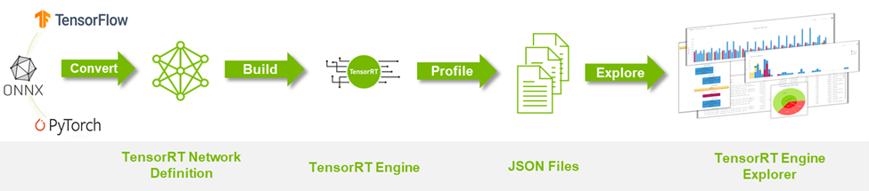
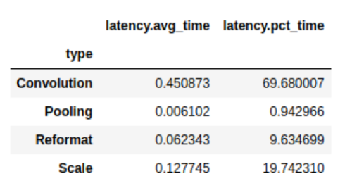
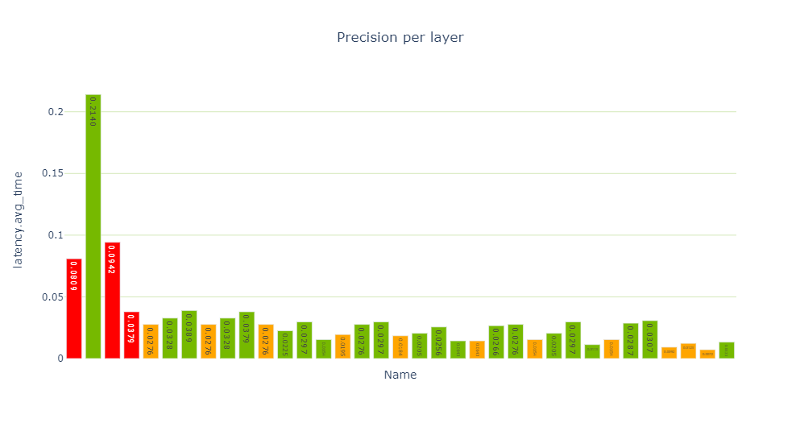

# 利用TREx导出TensorRT引擎


NVIDIA TensorRT 的主要功能是加速深度学习推理，通过处理网络定义并将其转换为优化的引擎执行计划来实现。 [TensorRT Engine Explorer (TREx)](https://github.com/NVIDIA/TensorRT/tree/main/tools/experimental/trt-engine-explorer) 是一个 Python 库和一组 [Jupyter notebook](https://jupyter.org/)，用于探索 TensorRT 引擎计划及其相关的推理分析数据。

TREx 提供对生成引擎的可见性，通过汇总统计数据、图表实用程序和引擎图形可视化为您提供新的见解。 TREx 对于高级网络性能优化和调试很有用，例如比较两个版本的网络的性能。 对于深入的性能分析，[NVIDIA Nsight Systems](https://developer.nvidia.com/nsight-systems) 是推荐的性能分析工具。

在这篇文章中，我总结了 TREx 工作流程并重点介绍了用于检查数据和 TensorRT 引擎的 API 功能。

## TREx 的工作原理
TREx 的主要抽象是 `trex.EnginePlan`，它封装了与引擎相关的所有信息。 `EnginePlan` 由多个输入 `JSON` 文件构成，每个 `JSON` 文件描述引擎的不同方面，例如其数据依赖关系图及其分析数据。 `EnginePlan `中的信息可通过 [`Pandas DataFrame`](https://pandas.pydata.org/) 访问，这是一种熟悉、强大且方便的数据结构。

在使用 TREx 之前，您必须构建和配置您的引擎。 TREx 提供了一个简单的实用程序脚本 [`process_engine.py`](https://github.com/NVIDIA/TensorRT/blob/main/tools/experimental/trt-engine-explorer/utils/process_engine.py) 来执行此操作。 该脚本作为参考提供，您可以选择任何方式收集此信息。

此脚本使用 [`trtexec`](https://github.com/NVIDIA/TensorRT/tree/main/samples/trtexec) 从 `ONNX` 模型构建引擎并分析引擎。 它还创建了几个 JSON 文件，用于捕获引擎构建和分析会话的各个方面：

### Plan-graph JSON 文件
Plan-graph JSON 文件以 JSON 格式描述引擎数据流图。

TensorRT 引擎Plan是 TensorRT 引擎的序列化格式。它包含有关最终推理图的信息，并且可以反序列化以进行推理运行时执行。

TensorRT 8.2 引入了 [`IEngineInspector`](https://docs.nvidia.com/deeplearning/tensorrt/developer-guide/index.html#engine-inspector) API，它提供了检查引擎层、它们的配置和它们的数据依赖关系的能力。 `IEngineInspector` 使用简单的 JSON 格式化架构提供此信息。此 JSON 文件是 `TREx trex.EnginePlan` 对象的主要输入，并且是必需的。

### 分析 JSON 文件
分析 JSON 文件为每个引擎层提供分析信息。

`trtexec `命令行应用程序实现 [`IProfiler `](https://docs.nvidia.com/deeplearning/tensorrt/developer-guide/index.html#profiling)接口并[生成](https://github.com/NVIDIA/TensorRT/blob/99a11a5fcdd1f184739bb20a8c4a473262c8ecc8/samples/common/sampleReporting.cpp#L361)一个 JSON 文件，其中包含每个层的分析记录。如果您只想调查引擎的结构而没有相关的分析信息，则此文件是可选的。

### 计时记录JSON文件
JSON 文件包含每个分析迭代的时间记录。

为了分析引擎，trtexec 多次执行引擎以平滑测量噪声。每个引擎执行的时间信息可以作为单独的记录记录在时间 JSON 文件中，并且平均测量值报告为引擎延迟。此文件是可选的，通常在评估分析会话的质量时很有用。

如果您发现引擎时序信息的差异过大，您可能需要确保您仅使用 GPU 并且计算和内存时钟已锁定。


### 元数据 JSON 文件
元数据 JSON 文件描述了引擎的构建器配置和有关用于构建引擎的 GPU 的信息。 此信息为引擎分析会话提供了更有意义的上下文，并且在您比较两个或多个引擎时特别有用。


TREx 工作流程
下图 总结了 TREx 工作流程：

* 首先将您的深度学习模型转换为 TensorRT 网络。
* 构建和分析引擎，同时生成附带的 JSON 文件。
* 启动 TREx 以探索文件的内容。




## TREx 功能和 API
收集所有分析数据后，您可以创建一个 EnginePlan 实例：

```python
plan = EnginePlan(
    "my-engine.graph.json",
    "my-engine.profile.json",
    "my-engine.profile.metadata.json")
```

使用 trex.EnginePlan 实例，您可以通过 [Pandas DataFrame ](https://pandas.pydata.org/docs/reference/api/pandas.DataFrame.html)对象访问大部分信息。 DataFrame 中的每一行代表计划文件中的一个层，包括其名称、策略、输入、输出和描述该层的其他属性。

```python
# Print layer names
plan = EnginePlan("my-engine.graph.json")
df = plan.df
print(df['Name'])
```

使用 DataFrame 抽象引擎信息很方便，因为它既是许多 Python 开发人员都知道和喜爱的 API，又是一个强大的 API，具有切片、切块、导出、图形和打印数据的功能。

例如，列出引擎中最慢的三个层很简单：

```python
# Print the 3 slowest layers
top3 = plan.df.nlargest(3, 'latency.pct_time')
for i in range(len(top3)):
    layer = top3.iloc[i]
    print("%s: %s" % (layer["Name"], layer["type"]))
features.16.conv.2.weight + QuantizeLinear_771 + Conv_775 + Add_777: Convolution
features.15.conv.2.weight + QuantizeLinear_722 + Conv_726 + Add_728: Convolution
features.12.conv.2.weight + QuantizeLinear_576 + Conv_580 + Add_582: Convolution
```
我们经常想对信息进行分组。 例如，您可能想知道每种层类型消耗的总延迟：
```python
# Print the latency of each layer type
plan.df.groupby(["type"]).sum()[["latency.avg_time"]]
```


Pandas 可以与其他库很好地混合，例如 [dtale](https://github.com/man-group/dtale)，一个用于查看和分析数据框的便捷库，以及 [Plotly](https://plotly.com/python/)，一个具有交互式绘图的图形库。这两个库都与示例 TREx 笔记本集成，但还有许多用户友好的[替代方案](https://pandas.pydata.org/docs/ecosystem.html)，例如 qgrid、matplotlib 和 Seaborn。

还有一些方便的 API，它们是 Pandas、Plotly 和 dtale 的瘦包装器：

* 绘制数据（plotting.py）
* 可视化引擎图 (graphing.py)
* 交互式notebook（interactive.py 和 notebook.py）
* 报告（report_card.py 和 compare_engines.py）

最后，linting API (lint.py) 使用静态分析来标记性能危害，类似于软件 linter。理想情况下，层 linter 提供专家性能反馈，您可以根据这些反馈来提高引擎的性能。例如，如果您使用次优卷积输入形状或量化层的次优放置。 linting 功能处于早期开发状态，NVIDIA 计划对其进行改进。

TREx 还附带了一些教程notebook和两个工作流notebook：一个用于分析单个引擎，另一个用于比较两个或多个引擎。

使用 TREx API，您可以编写新的方法来探索、提取和显示 TensorRT 引擎，您可以与社区共享这些引擎。

## 示例 TREx 演练

现在您已经了解了 TREx 的运作方式，下面是一个展示 TREx 运行的示例。

在此示例中，您将创建一个量化的 [ResNet18 PyTorch](https://pytorch.org/vision/master/_modules/torchvision/models/resnet.html) 模型的优化 TensorRT 引擎，对其进行分析，最后使用 TREx 检查引擎计划。  然后，您根据您的学习调整模型，以提高其性能。 此示例的代码可在 [TREx](https://github.com/NVIDIA/TensorRT/tree/main/tools/experimental/trt-engine-explorer) GitHub 存储库中找到。

首先将 PyTorch ResNet 模型导出为 ONNX 格式。 使用 [NVIDIA PyTorch 量化工具包](https://github.com/NVIDIA/TensorRT/tree/master/tools/pytorch-quantization)在模型中添加量化层，但您不执行校准和微调，因为您专注于性能，而不是准确性。

在实际用例中，您应该遵循完整的量化感知训练 (QAT) 方法。 QAT 工具包会自动将伪量化操作插入 Torch 模型。 这些操作导出为 QuantizeLinear 和 DequantizeLinear ONNX 操作符：

```C++
import torch
import torchvision.models as models
# For QAT
from pytorch_quantization import quant_modules
quant_modules.initialize()
from pytorch_quantization import nn as quant_nn
quant_nn.TensorQuantizer.use_fb_fake_quant = True

resnet = models.resnet18(pretrained=True).eval()
# Export to ONNX, with dynamic batch-size
with torch.no_grad():
    input = torch.randn(1, 3, 224, 224)
    torch.onnx.export(
        resnet, input, "/tmp/resnet/resnet-qat.onnx",
    	  input_names=["input.1"],
    	  opset_version=13,
    	  dynamic_axes={"input.1": {0: "batch_size"}})=
```

接下来，使用 TREx 实用程序 process_engine.py 脚本执行以下操作：

* 从 ONNX 模型构建引擎。
* 创建一个引擎计划 JSON 文件。
* 分析引擎执行并将结果存储在分析 JSON 文件中。 您还将计时结果记录在计时 JSON 文件中。

```bash
python3 <path-to-trex>/utils/process_engine.py /tmp/resnet/resnet-qat.onnx /tmp/resnet/qat int8 fp16 shapes=input.1:32x3x224x224
```

脚本 `process_engine.py `使用 `trtexec` 来完成繁重的工作。 您可以通过简单地列出不带 `--` 前缀的参数，从 process_engine.py 命令行透明地将参数传递给 trtexec。

在示例中，参数 `int8`、`fp16` 和 `shape=input`.`1:32x3x224x224` 被转发到 `trtexec`，指示它针对 FP16 和 INT8 精度进行优化，并将输入批量大小设置为 `32`。第一个脚本参数是输入 ONNX 文件（`/tmp/resnet/resnet-qat.onnx`），第二个参数（`/tmp/resnet/qat`）指向包含生成的JSON文件的目录。

您现在已准备好检查优化的引擎计划，因此请转到 TREx 引擎报告卡notebook。 我不会在这篇文章中介绍整个notebook，只介绍对这个示例有用的几个单元格。

第一个单元设置引擎文件并从各种 JSON 文件创建一个 trex.EnginePlan 实例：

```python
engine_name = "/tmp/resnet/qat/resnet-qat.onnx.engine"
plan = EnginePlan(      f"{engine_name}.graph.json",      
  f"{engine_name}.profile.json",
  f"{engine_name}.profile.metadata.json")
```
下一个单元创建引擎数据依赖图的可视化，这对于理解原始网络到引擎的转换最有用。 TensorRT 将引擎作为拓扑排序的层列表执行，而不是作为可并行化的图。

默认的渲染格式是 SVG，它是可搜索的，在不同的比例下保持清晰，并且支持悬停文本以提供额外的信息而不占用大量空间。

```python
graph = to_dot(plan, layer_type_formatter)
svg_name = render_dot(graph, engine_name, 'svg')
```

该函数创建一个 SVG 文件并打印其名称。 即使对于小型网络，在notebook内渲染也很麻烦，您可以在单独的浏览器窗口中打开 SVG 文件进行渲染。

TREx 图形 API 是可配置的，允许进行各种着色和格式化，并且可用的格式化程序包含信息。 例如，使用默认格式化程序，图层会根据其操作进行着色，并按名称、类型和分析延迟进行标记。 张量被描述为连接层的边缘，并根据它们的精度进行着色，并用它们的形状和内存布局信息进行标记。

在生成的 ResNet QAT 引擎图（下图）中，您会看到一些 FP32 张量（红色）。 进一步调查，因为您希望使用 INT8 精度执行尽可能多的层。 使用 INT8 数据和计算精度可提高吞吐量并降低延迟和功耗。


性能单元提供性能数据的各种视图，特别是每层精度视图（下图）显示了使用 FP32 和 FP16 进行的多个层计算。
```python
report_card_perf_overview(plan)
```



