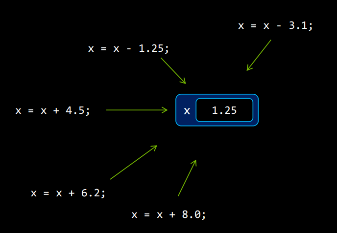
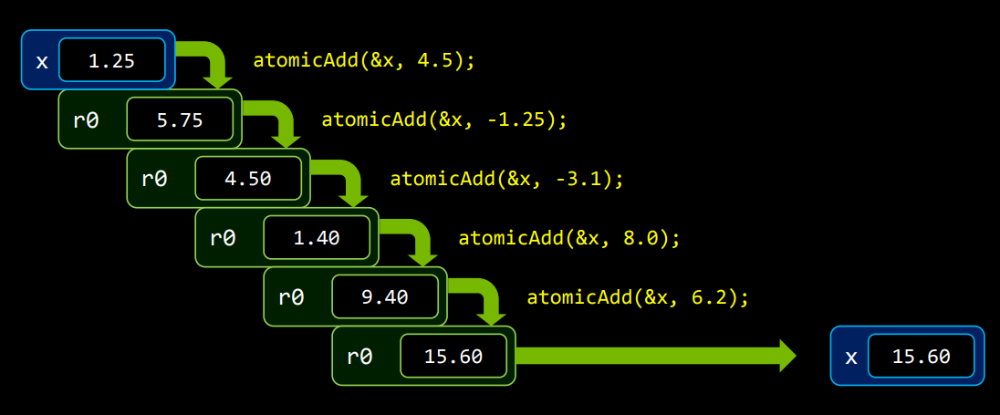

#! https://zhuanlan.zhihu.com/p/552049508
# CUDA原子操作详解及其适用场景

CUDA中的原子操作本质上是让线程在某个内存单元完成读-修改-写的过程中不被其他线程打扰.

官方的编程手册上是这么说的:
"**原子函数对驻留在全局或共享内存中的一个 32 位或 64 位字执行读-修改-写原子操作**"

举个例子来说, 我有很多线程. 每个线程计算出了一个结果, 我需要把所有的结果加在一起, 如下图所示.



执行到这一步时, 有很多线程想读取X的值, 并加上另一个值. 如果你在你的Kernel程序最后面直接写 `x=x+a`, 那么当执行到这里的时候, 一个线程在读的时候, 可能另一个线程就在写. 这会产生未定义的错误.

这时候, 你就需要原子操作来解决这个问题.

当你的一个线程使用原子加操作在这里, 另一个线程也像做原子加操作的时候, 它就会产生等待. 直到上一个操作完成. 这里会产生一个队列, one by one的执行. 如下图所示.



上面是原子加的操作示例.

实际上还有很多种原子操作, 详细信息如下所示:

#### atomicAdd()
```C++
int atomicAdd(int* address, int val);
unsigned int atomicAdd(unsigned int* address,
                       unsigned int val);
unsigned long long int atomicAdd(unsigned long long int* address,
                                 unsigned long long int val);
float atomicAdd(float* address, float val);
double atomicAdd(double* address, double val);
__half2 atomicAdd(__half2 *address, __half2 val);
__half atomicAdd(__half *address, __half val);
__nv_bfloat162 atomicAdd(__nv_bfloat162 *address, __nv_bfloat162 val);
__nv_bfloat16 atomicAdd(__nv_bfloat16 *address, __nv_bfloat16 val);
```
读取位于全局或共享内存中地址 `address` 的 16 位、32 位或 64 位字 `old`，计算 `(old + val)`，并将结果存储回同一地址的内存中。这三个操作在一个原子事务中执行。该函数返回`old`。

`atomicAdd()` 的 32 位浮点版本仅受计算能力 2.x 及更高版本的设备支持。

`atomicAdd()` 的 64 位浮点版本仅受计算能力 6.x 及更高版本的设备支持。

`atomicAdd()` 的 32 位 `__half2` 浮点版本仅受计算能力 6.x 及更高版本的设备支持。 `__half2` 或 `__nv_bfloat162` 加法操作的原子性分别保证两个 `__half` 或 `__nv_bfloat16` 元素中的每一个；不保证整个 `__half2` 或 `__nv_bfloat162` 作为单个 32 位访问是原子的。

`atomicAdd()` 的 16 位 `__half` 浮点版本仅受计算能力 7.x 及更高版本的设备支持。

`atomicAdd()` 的 16 位 `__nv_bfloat16` 浮点版本仅受计算能力 8.x 及更高版本的设备支持。

#### atomicSub()
```C++
int atomicSub(int* address, int val);
unsigned int atomicSub(unsigned int* address,
                       unsigned int val);
```
读取位于全局或共享内存中地址`address`的 32 位字 `old`，计算 `(old - val)`，并将结果存储回同一地址的内存中。 这三个操作在一个原子事务中执行。 该函数返回`old`。

#### atomicExch()
```C++
int atomicExch(int* address, int val);
unsigned int atomicExch(unsigned int* address,
                        unsigned int val);
unsigned long long int atomicExch(unsigned long long int* address,
                                  unsigned long long int val);
float atomicExch(float* address, float val);
```
读取位于全局或共享内存中地址address的 32 位或 64 位字 `old` 并将 `val` 存储回同一地址的内存中。 这两个操作在一个原子事务中执行。 该函数返回`old`。

#### atomicMin()
```C++
int atomicMin(int* address, int val);
unsigned int atomicMin(unsigned int* address,
                       unsigned int val);
unsigned long long int atomicMin(unsigned long long int* address,
                                 unsigned long long int val);
long long int atomicMin(long long int* address,
                                long long int val);
```
读取位于全局或共享内存中地址`address`的 32 位或 64 位字 `old`，计算 `old` 和 `val` 的最小值，并将结果存储回同一地址的内存中。 这三个操作在一个原子事务中执行。 该函数返回`old`。

`atomicMin()` 的 64 位版本仅受计算能力 3.5 及更高版本的设备支持。

#### atomicMax()
```C++
int atomicMax(int* address, int val);
unsigned int atomicMax(unsigned int* address,
                       unsigned int val);
unsigned long long int atomicMax(unsigned long long int* address,
                                 unsigned long long int val);
long long int atomicMax(long long int* address,
                                 long long int val);
```
读取位于全局或共享内存中地址`address`的 32 位或 64 位字 `old`，计算 `old` 和 `val` 的最大值，并将结果存储回同一地址的内存中。 这三个操作在一个原子事务中执行。 该函数返回`old`。

`atomicMax()` 的 64 位版本仅受计算能力 3.5 及更高版本的设备支持。

#### atomicInc()
```C++
unsigned int atomicInc(unsigned int* address,
                       unsigned int val);
```

读取位于全局或共享内存中地址`address`的 32 位字 `old`，计算 `((old >= val) ? 0 : (old+1))`，并将结果存储回同一地址的内存中。 这三个操作在一个原子事务中执行。 该函数返回`old`。

#### atomicDec()
```C++
unsigned int atomicDec(unsigned int* address,
                       unsigned int val);
```
读取位于全局或共享内存中地址`address`的 32 位字 `old`，计算 `(((old == 0) || (old > val)) ? val : (old-1) )`，并将结果存储回同一个地址的内存。 这三个操作在一个原子事务中执行。 该函数返回`old`。

#### atomicCAS()
```C++
int atomicCAS(int* address, int compare, int val);
unsigned int atomicCAS(unsigned int* address,
                       unsigned int compare,
                       unsigned int val);
unsigned long long int atomicCAS(unsigned long long int* address,
                                 unsigned long long int compare,
                                 unsigned long long int val);
unsigned short int atomicCAS(unsigned short int *address, 
                             unsigned short int compare, 
                             unsigned short int val);
```
读取位于全局或共享内存中地址`address`的 16 位、32 位或 64 位字 `old`，计算 `(old == compare ? val : old)` ，并将结果存储回同一地址的内存中。 这三个操作在一个原子事务中执行。 该函数返回`old`（Compare And Swap）。

#### atomicAnd()
```C++
int atomicAnd(int* address, int val);
unsigned int atomicAnd(unsigned int* address,
                       unsigned int val);
unsigned long long int atomicAnd(unsigned long long int* address,
                                 unsigned long long int val);
```
读取位于全局或共享内存中地址`address`的 32 位或 64 位字 `old`，计算 `(old & val)`，并将结果存储回同一地址的内存中。 这三个操作在一个原子事务中执行。 该函数返回`old`。

`atomicAnd()` 的 64 位版本仅受计算能力 3.5 及更高版本的设备支持。

#### atomicOr()
```C++
int atomicOr(int* address, int val);
unsigned int atomicOr(unsigned int* address,
                      unsigned int val);
unsigned long long int atomicOr(unsigned long long int* address,
                                unsigned long long int val);
```
读取位于全局或共享内存中地址`address`的 32 位或 64 位字 `old`，计算 `(old | val)`，并将结果存储回同一地址的内存中。 这三个操作在一个原子事务中执行。 该函数返回`old`。

`atomicOr()` 的 64 位版本仅受计算能力 3.5 及更高版本的设备支持。

#### atomicXor()
```C++
int atomicXor(int* address, int val);
unsigned int atomicXor(unsigned int* address,
                       unsigned int val);
unsigned long long int atomicXor(unsigned long long int* address,
                                 unsigned long long int val);
```
读取位于全局或共享内存中地址`address`的 32 位或 64 位字 `old`，计算 `(old ^ val)`，并将结果存储回同一地址的内存中。 这三个操作在一个原子事务中执行。 该函数返回`old`。

`atomicXor()` 的 64 位版本仅受计算能力 3.5 及更高版本的设备支持。
