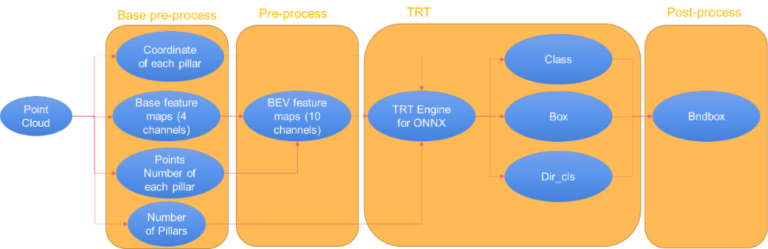

# 使用 NVIDIA CUDA-Pointpillars 检测点云中的对象


点云是坐标系中点的数据集。 点包含丰富的信息，包括三维坐标X、Y、Z； 颜色; 分类值； 强度值； 和时间。 点云主要来自各种 NVIDIA Jetson 用例中常用的激光雷达，例如自主机器、感知模块和 3D 建模。

关键应用之一是利用远程和高精度数据集来实现感知、映射和定位算法的 3D 对象检测。

PointPillars 是用于点云推理的最常用模型之一。 这篇文章讨论了面向 Jetson 开发人员的 NVIDIA CUDA 加速 PointPillars 模型。[ 立即下载 CUDA-PointPillars 模型](https://github.com/NVIDIA-AI-IOT/CUDA-PointPillars)。


## 什么是 CUDA-Pointpillars
在这篇文章中，我们介绍了 CUDA-Pointpillars，它可以检测点云中的对象。 过程如下：

* 基础预处理：生成pillars。
* 预处理：生成 BEV 特征图（10 个通道）。
* TensorRT 的 ONNX 模型：一种可由 TensorRT 实现的 ONNX 模式。
* 后处理：通过解析 TensorRT 引擎的输出生成边界框。




## 基础预处理
基础预处理步骤将点云转换为基础特征图。 它提供以下组件：

* 基本特征图
* 支柱坐标：每个pillar的坐标。
* 参数：pillar的数量。


## 预处理
预处理步骤将基本特征图（四个通道）转换为 BEV 特征图（10 个通道）。


## TensorRT 的 ONNX 模型
OpenPCDet 的原生点柱因以下原因进行了修改：

* 小操作太多，内存带宽低。
* TensorRT 不支持某些操作，例如 NonZero。
* 一些操作，如 ScatterND，性能较低。
* 他们使用“dict”作为输入和输出，不能导出 ONNX 文件。

为了从原生 OpenPCDet 导出 ONNX，我们修改了模型（下图）。


您可以将整个 ONNX 文件分为以下几个部分：

* **输入**：BEV 特征图、支柱坐标、参数。 这些都是在预处理中生成的。
* **输出**：类、框、Dir_class。 这些由后处理解析以生成边界框。
* **ScatterBEV**：将点柱 (1D) 转换为 2D 图像，可以作为 TensorRT 的插件使用。
* **其他**：由 TensorRT 支持。


## 后期处理
后处理解析 TensorRT 引擎的输出（类、框和 dir_class）和输出边界框。 下图显示了示例参数。


## 使用 CUDA-PointPillars
要使用 CUDA-PointPillars，请为点云提供 ONNX 模式文件和数据缓冲区：

```C++
    std::vector<Bndbox> nms_pred;
    PointPillar pointpillar(ONNXModel_File, cuda_stream);
    pointpillar.doinfer(points_data, points_count, nms_pred);
```
## 将 OpenPCDet 训练的原生模型转换为 CUDA-Pointpillars 的 ONNX 文件
在我们的项目中，我们提供了一个 Python 脚本，可以将 OpenPCDet 训练的原生模型转换为 CUDA-Pointpillars 的 am ONNX 文件。 在 CUDA-Pointpillars 的 `/tool` 目录下找到 `exporter.py` 脚本。

要获取当前目录中的 pointpillar.onnx 文件，请运行以下命令：

```bash
$ python exporter.py --ckpt ./*.pth
```


## 性能
该表显示了测试环境和性能。 测试前，提升 CPU 和 GPU。

|Jetson|	Xavier NVIDIA AGX 8GB|
|----|----|
|Release	|NVIDIA JetPack 4.5|
|CUDA|	10.2|
|TensorRT	|7.1.3|
|Infer Time	|33 ms|


