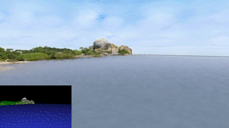
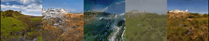
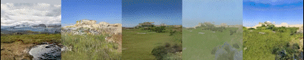
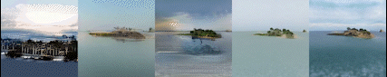
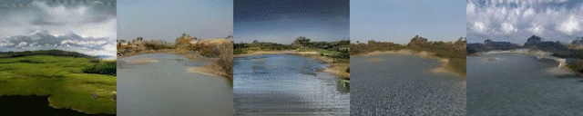

# GANcraft-将游戏玩家变成3D艺术家

NVIDIA 和康奈尔大学的科学家们引入了一种混合无监督神经渲染流程，可以在立体元素世界中有效地表示大型复杂场景。从本质上讲，3D 艺术家只需要构建最简单的部分，算法将完成剩下的工作来构建一个逼真的世界。研究人员将这种混合神经渲染管道应用于 Minecraft 块世界，以生成更逼真的 Minecraft 场景版本。

NVIDIA 和更广泛的研究社区（[pix2pix](https://phillipi.github.io/pix2pix/)、[pix2pixHD](https://github.com/NVIDIA/pix2pixHD)、[MUNIT](https://research.nvidia.com/publication/2018-09_Multimodal-Unsupervised-Image-to-Image)、[SPADE](https://nvlabs.github.io/SPADE/)）以前的工作解决了图像到图像转换 (im2im) 的问题——将图像从一个域转换到另一个域。乍一看，这些方法似乎为将一个世界转换为另一个世界的任务提供了一个简单的解决方案——一次转换一个图像。然而，im2im 方法不保持视点一致性，因为它们不了解 3D 几何，并且每个 2D 帧都是独立生成的。从下面的图像中可以看出，这些方法的结果会产生抖动和突然的颜色和纹理变化。

|MUNIT    |  SPADE     | wc-vid2vid    |  NSVF-W      | GANcraft|
|----|----|----|----|----|

进入 GANcraft，一种直接对 3D 输入世界进行操作的新方法。

研究人员在[研究](https://nvlabs.github.io/GANcraft/)中解释说：“由于用户创建的块世界的真实照片级渲染根本不存在，我们必须通过
间接监督来训练模型。”

该方法的工作原理是在输入块世界中随机采样相机视图，然后想象该视图的逼真版本会是什么样子。 这是在 SPADE 的帮助下完成的，SPADE 是 NVIDIA 在图像到图像转换方面的先前工作，并且是流行的 GauGAN 演示中的关键组件。 GANcraft 通过使用可以消除世界结构与渲染风格歧义的风格调节网络，克服了这些生成的“伪真实”的视图不一致问题。 这使 GANcraft 能够生成视图一致的输出视频，以及如图所示的不同风格！

虽然研究结果在 Minecraft 中得到了展示，但该方法适用于其他 3D 块世界，例如立体像素。 缩短构建高清世界所需的时间和专业知识的潜力增加了这项研究的价值。 它可以帮助游戏开发者、CGI 艺术家和动画行业减少构建这些庞大而令人印象深刻的世界所需的时间。

GANcraft 在 [Imaginaire](https://github.com/nvlabs/imaginaire/) 库中实现。 该库针对生成模型和生成对抗网络的训练进行了优化，支持多 GPU、多节点和自动混合精度训练。 NVIDIA 制作的 10 多种不同研究工作的实现以及预训练模型已经发布。 随着时间的推移，这个库将继续更新更新的作品。

