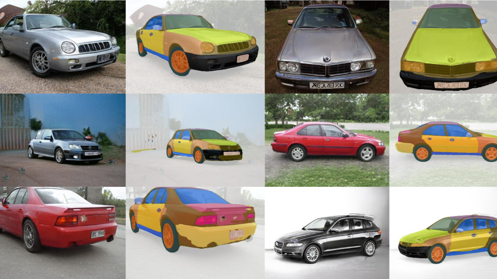
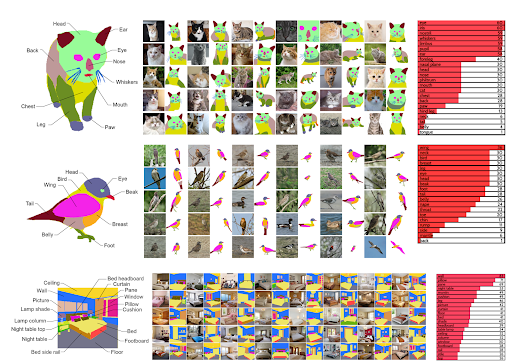

# 高精度的AI图像编辑:EditGAN

得益于称为 EditGAN 的生成对抗网络 (GAN) 模型，编辑猫、汽车甚至古董画的照片的愿望从未如此简单。 这项工作由 NVIDIA、多伦多大学和麻省理工学院的[研究人员](https://nv-tlabs.github.io/editGAN/)共同完成，建立在 [DatasetGAN](https://nv-tlabs.github.io/datasetGAN/) 的基础上，这是一种人工智能视觉模型，可以用少至 16 个人工注释的图像进行训练，并且与其他需要 100 倍以上图像的方法一样有效。 EditGAN 继承了先前模型的强大功能，使用户能够通过简单的命令（例如绘图）编辑或操作所需的图像，而不会影响原始图像质量。

## 什么是 EditGAN？
根据该[论文](https://arxiv.org/pdf/2111.03186.pdf)：“EditGAN 是第一个 GAN 驱动的图像编辑框架，它同时提供非常高精度的编辑，需要很少的带注释的训练数据（并且不依赖外部分类器），可以实时交互式运行，允许多次编辑的直接组合，并适用于真实的嵌入式、GAN 生成的，甚至是域外的图像。”

该模型学习特定数量的编辑向量，可以交互地应用于图像。从本质上讲，它形成了对图像及其内容的直观理解，然后用户可以利用这些理解进行特定的修改和编辑。该模型从相似的图像中学习并识别图像内对象的不同组件和特定部分。用户可以利用它对不同的子部分进行有针对性的修改或在特定区域内进行编辑。由于模型的精确度，图像在用户设置的参数之外不会失真。

“该框架允许我们学习任意数量的编辑向量，然后可以以交互速率直接应用于其他图像。”研究人员在他们的研究中解释道。 “我们通过实验表明，EditGAN 可以以前所未有的细节和自由度来处理图像，同时保持完整的图像质量。我们还可以轻松地组合多个编辑并在 EditGAN 的训练数据之外执行合理的编辑。我们在各种图像类型上展示了 EditGAN，并在标准编辑基准任务上定量地优于以前的几种编辑方法。”

从添加微笑、改变某人注视的方向、创造新发型或为汽车提供更好的轮组，研究人员展示了模型在使用最少数据注释的情况下的内在性。用户可以根据想要的编辑绘制简单的草图或蒙版，并引导 AI 模型实现修改，例如更大的猫耳朵或汽车上更酷的大灯。然后，AI 渲染图像，同时保持非常高的准确性并保持原始图像的质量。之后，可以将相同的编辑实时应用于其他图像。

## 这个 GAN 是如何工作的？
EditGAN 将图像的每个像素分配给一个类别，例如轮胎、挡风玻璃或车架。 这些像素在 AI 潜在空间内进行控制，并根据用户的输入进行控制，用户可以轻松灵活地编辑这些类别。 EditGAN 仅处理与所需更改相关联的那些像素。 AI 根据用于训练模型的其他图像知道每个像素代表什么，因此您无法尝试将猫耳朵添加到具有准确结果的汽车上。 但是，当在正确的模型中使用时，EditGAN 是一种非凡的工具，可提供出色的图像编辑结果。

## EditGAN 的潜力
人工智能驱动的照片和图像编辑有可能简化摄影师和内容创作者的工作流程，并实现更高水平的创造力和数字艺术。 EditGAN 还使新手摄影师和编辑能够制作高质量的内容，以及偶尔的病毒模因。

这种人工智能可能会改变我们编辑照片的方式，甚至可能最终改变视频。它允许某人使用简单的文本命令拍摄图像并对其进行更改。如果你有一张汽车的照片，并且你想把车轮做得更大，只需输入“让车轮更大”，然后噗！——这是一张具有更大车轮的同一辆车的完全逼真的照片。

EditGAN 将来也可能用于其他重要应用。例如，EditGAN 的编辑功能可用于创建具有某些特征的大型图像数据集。在针对不同的计算机视觉任务训练下游机器学习模型时，此类特定数据集可能很有​​用。

此外，EditGAN 框架可能会影响未来几代 GAN 的发展。虽然当前版本的 EditGAN 专注于图像编辑，但类似的方法可能用于编辑 3D 形状和对象，这在为游戏、电影或虚拟世界创建虚拟 3D 内容时很有用。

