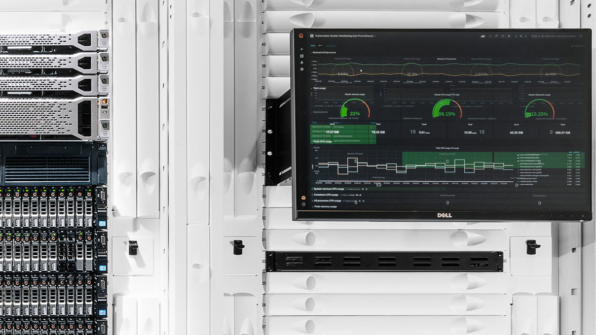

# 使用NetDevOps使您的网络现代化

在本文中，我们将重点介绍优化和现代化数据中心网络运营的解决方案。 在第一部分“[优化您的数据中心网络](https://developer.nvidia.com/blog/optimizing-your-data-center-network/)”中，我们着眼于更新您的网络基础设施和协议。

NetDevOps 是一种在过去 5 年中一直渗透到 IT 基础架构散居地的意识形态。 作为一个理论，它可以提供许多领域来优化基础设施运营。

我们将讨论一些可应用于您的运营工作流的 NetDevOps 应用程序。

这些包括：

* 通过基础架构即代码 (IaC.) 集中配置管理
* 自动化重复的操作任务。
* 使用自动化实现配置的标准化和一致性。
* 使用网络数字孪生模拟测试和验证更改。

## 使用 IaC 集中配置管理
IaC 背后的原则已被用于软件开发中，以便开发人员将代码并行地贡献给同一个软件项目。但他们还创建了一个集中的存储库，代码项目（包括服务器、NIC、路由器和交换机的网络配置）可以驻留并充当单一的事实来源。

配置管理的分散方面使得执行标准化从根本上是低效的。它还使得难以确定正确的配置或跟踪更改。

将 IaC 与 Git 等源代码控制管理软件结合使用可以帮助解决问题，确保所有管理员、服务器和交换机都可以使用正确的网络配置和代码。

## 自动化重复的操作任务
在大型基础设施中，无论设备如何，配置的组件都是相同的。系统日志服务器、NTP 服务器、SNMP 设置和其他管理设置等配置可以通过零接触配置 (ZTP) 等技术实现自动化。 ZTP 可以将配置应用于开机启动，以减少在许多设备上手动配置时可能发生的错误。应用标准配置和执行重复性任务非常适合 ZTP，因为它可以在每台设备上一致地实施。

## 设备的首次启动期间使用。

Ansible 和 Salt 等自动化工具使用模板技术和脚本来大规模应用配置。这些工具通过构建标准化模板并仅依赖键/值对数据结构来填充模板来简化基础架构管理。通过这种方式，操作员可以对配置充满信心，并专注于验证正确的配置是否用于正确的设备。

此外，自动化工具可以大规模应用配置。对错误配置或错误的任何修复都可以放心地应用于数千个节点，并且不会因输入错误的命令或分心的管理员而导致节点错误配置的风险。

## 测试和验证网络数字孪生模拟的变化
在使用自动化将配置大规模应用到多个节点时，在提交更改之前了解更大的影响至关重要。将更改应用于几个节点作为测试通常不会揭示将更改应用于每个节点时会发生什么。 NVIDIA Air 基础设施模拟平台创建环境的数字双胞胎，供用户在部署之前测试所有更改。

借助数字孪生，您可以在安全的沙箱中运行自动化，以确保更改不会导致任何意外中断。将数字双胞胎与验证技术（如 NVIDIA NetQ）相结合，可以创建一个自动化测试管道，以确保所有配置更改都完全符合每个更改窗口的预期。

