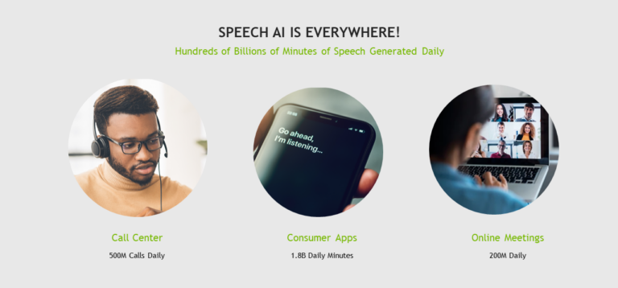
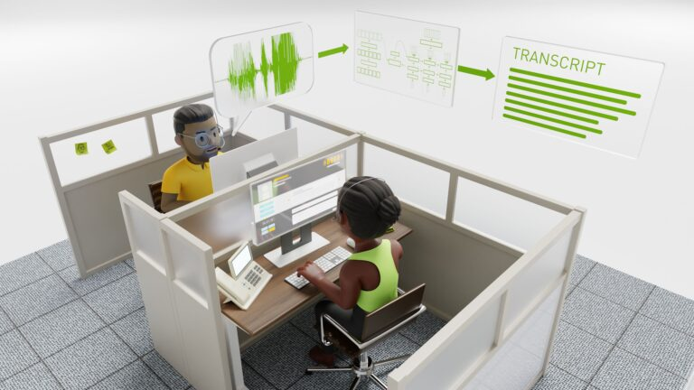
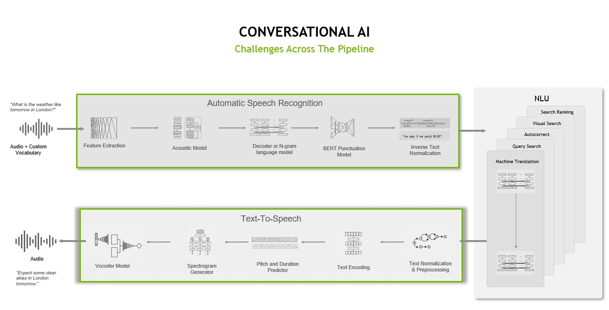
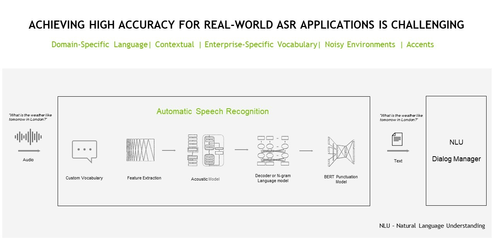
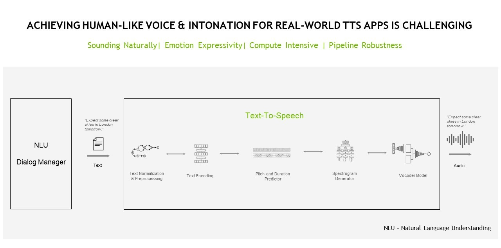

# 语音人工智能的简单介绍

人工智能 (AI) 已将合成语音从单调的自动电话和几十年前的 GPS 导航系统转变为智能手机和智能扬声器中虚拟助手的优美音调。

对于组织来说，为其特定行业和领域使用定制的最先进的语音 AI 技术从未如此简单。

语音 AI 被用于为虚拟助手提供支持、扩展呼叫中心、人性化数字化身、增强 AR 体验，并通过自动化临床笔记为患者提供流畅的医疗体验。

根据 Gartner Research 的数据，到 2023 年，客户将更喜欢使用语音界面来启动 70% 的自助客户交互（高于 2019 年的 40%）。对个性化和自动化体验的需求只会继续增长。

在这篇文章中，我将讨论语音 AI、它的工作原理、语音识别技术的优势以及语音 AI 用例示例。

## 什么是语音 AI，有什么好处？
语音 AI 将 AI 用于基于语音的技术：自动语音识别 (ASR)，也称为语音到文本和文本到语音 (TTS)。 示例包括虚拟会议中的自动实时字幕以及向虚拟助手添加基于语音的界面。

同样，聊天机器人、文本分析和数字助理等基于语言的应用程序使用语音 AI 作为大型应用程序或系统的一部分，以及自然语言处理 (NLP)。 有关详细信息，请参阅[对话式 AI 词汇表](https://www.nvidia.com/en-us/glossary/data-science/conversational-ai/)。

语音 AI 有很多好处：

* 高可用性：语音 AI 应用程序可以在人工座席工作时间内外响应客户呼叫，从而使联络中心能够更高效地运行。
* 实时洞察：实时记录被指定并用作以客户为中心的业务分析的输入，例如情绪分析、客户体验分析和欺诈检测。
* 即时可扩展性：在旺季，语音 AI 应用程序可以自动扩展以处理来自客户的数万个请求。
* 增强体验：语音 AI 通过减少等待时间、快速解决客户查询以及通过可定制的语音界面提供类人交互来提高客户满意度。
* 数字可访问性：从语音到文本到文本到语音应用程序，语音 AI 工具正在帮助有阅读和听力障碍的人从生成的语音和书面文本中学习。

## 谁在使用语音 AI 以及如何使用？
如今，语音 AI 正在彻底改变金融、电信和统一通信即服务 (UCaaS) 等全球最大的行业。

以下是语音 AI 提高效率和业务成果的一些具体示例。

### 呼叫中心转录
全球约有 1000 万呼叫中心座席每天接听 20 亿个电话。呼叫中心用例包括以下所有内容：

* 趋势分析
* 合规性
* 实时安全或欺诈分析
* 实时情绪分析
* 实时翻译

例如，自动语音识别转录客户和呼叫中心代理之间的实时对话以进行文本分析，然后用于为代理提供实时建议以快速解决客户查询。

### 临床笔记
在医疗保健领域，语音 AI 应用程序改善了患者接触医疗专业人员和索赔代表的机会。 ASR 在医患对话和理赔代理信息提取过程中自动记笔记。

### 虚拟助手
每个行业都可以找到虚拟助手来增强用户体验。 ASR 用于为虚拟助手转录音频查询。然后，文字转语音

生成虚拟助手的合成语音。除了人性化的交易情境外，虚拟助手还可以帮助视障者与非盲文文本进行交互，帮助有语音障碍的人与个人交流，以及儿童学习如何阅读。

## 语音 AI 是如何工作的？
Speech AI 使用自动语音识别和文本转语音技术为会话应用程序提供语音界面。 典型的语音 AI 流程由数据预处理阶段、神经网络模型训练和后处理阶段组成。

在本节中，我将讨论 ASR 和 TTS 流程中的这些阶段。

## 自动语音识别
为了让机器能够与人类交流和交流，它们需要一种将声音转换为代码的通用媒介。 设备或应用程序如何通过声音“看到”世界？

ASR 流程处理包含语音的给定原始音频文件并将其转录为相应的文本，同时最小化称为单词错误率 (WER) 的度量。

WER 用于测量和比较各种类型的语音识别系统和算法之间的性能。 它的计算方法是错误数除以正在转录的剪辑中的单词数。

ASR 流程必须完成一系列任务，包括特征提取、声学建模以及语言建模。

特征提取任务涉及将原始模拟音频信号转换为频谱图，频谱图是表示信号在不同频率下随时间变化的响度的可视图表，类似于热图。转换过程的一部分涉及传统的信号预处理技术，如标准化和窗口化。

然后使用声学建模来模拟音频信号和语言中的语音单元之间的关系。它将音频片段映射到最可能不同的语音单元和相应的字符。

ASR 流程中的最后一项任务涉及语言建模。语言模型增加了上下文表示并纠正了声学模型的错误。换句话说，当您拥有声学模型中的字符时，您可以将这些字符转换为单词序列，然后再将其进一步处理为短语和句子。

从历史上看，这一系列任务是使用生成方法执行的，需要使用语言模型、发音模型和声学模型将发音转换为音频波形。然后，将使用高斯混合模型或隐马尔可夫模型来尝试从音频波形中找到最可能匹配声音的单词。

这种统计方法在实施和部署的时间和精力上都不太准确，而且更加密集。当试图确保音频数据的每个时间步长与字符的正确输出相匹配时尤其如此。

然而，端到端深度学习模型，如连接主义时间分类 (CTC) 模型和具有注意力的序列到序列模型，可以直接从音频信号生成转录本，并且 WER 较低。

换句话说，Jasper、QuartzNet 和 Citrinet 等基于深度学习的模型使公司能够创建更便宜、更强大、更准确的语音 AI 应用程序。

## 文字转语音
TTS 或语音合成流程负责将文本转换为自然发音的语音，该语音是人工产生的，具有类似人类的语调和清晰的发音。

TTS 流程可能必须完成许多不同的任务，包括文本分析、语言分析和波形生成。

在文本分析阶段，原始文本（带有符号、缩写等）被转换为完整的单词和句子，扩展缩写和分析表达。输出被传递到语言分析中，以改进语调、持续时间和理解语法结构。结果，产生了频谱图或梅尔频谱图，以将其转换为连续的类人音频。

我之前介绍的方法是一个典型的两步过程，需要一个合成网络和一个声码器网络。这是两个独立的网络，用于后续从文本生成频谱图（使用 Tacotron 架构或 FastPitch）和从频谱图或其他中间表示（如 WaveGlow 或 HiFiGAN）生成音频的目的。

除了两阶段方法外，TTS 流程的另一种可能实现涉及使用端到端深度学习模型，该模型使用单个模型直接从文本生成音频。神经网络直接从文本-音频对训练，而不依赖于中间表示。

端到端方法降低了复杂性，因为它减少了网络之间的错误传播，减少了对单独训练流程的需求，并最大限度地减少了持续时间信息的手动注释成本。

传统的 TTS 方法还倾向于产生更多机器人和不自然的声音，影响用户参与度，尤其是面向消费者的应用程序和服务。

## 构建语音 AI 系统的挑战
成功的语音 AI 应用程序必须启用以下功能。

### 访问最先进的模型
从头开始创建训练有素且准确的深度学习模型既昂贵又耗时。

通过在尖端模型发布后立即提供对它们的访问，即使是数据和资源受限的公司也可以在其产品和服务中使用高度准确的预训练模型和迁移学习。

### 高准确率
要在全球或任何行业或领域部署，必须定制模型以考虑多种语言（世界上 6,500 种口语的一小部分）、方言、口音和上下文。一些域使用特定的术语和技术术语。

### 实时性能
由多个深度学习模型组成的流程必须以毫秒为单位运行推理，以实现实时交互，准确地说远小于 300 毫秒，因为大多数用户在 100 毫秒左右开始注意到延迟和通信故障，在此之前对话或体验开始感觉不自然。

### 灵活且可扩展的部署
公司需要不同的部署模式，甚至可能需要混合使用云、本地和边缘部署。成功的系统支持扩展到数十万需求波动的并发用户。

### 数据所有权和隐私
公司应该能够为其行业和领域实施适当的安全实践，例如在本地或组织的云中进行安全数据处理。例如，可能要求遵守 HIPAA 或其他法规的医疗保健公司限制对数据和数据处理的访问。

## 语音人工智能的未来
由于计算基础设施、语音 AI 算法的进步、对远程服务的需求增加以及现有和新兴行业中令人兴奋的新用例，现在有一个强大的基于语音 AI 的产品和服务的生态系统和基础设施。

与当前语音 AI 应用程序在推动业务成果方面的强大一样，下一代语音 AI 应用程序必须具备处理多语言、多域和多用户对话的能力。

能够成功地将语音 AI 技术集成到其核心运营中的组织将有能力为尚未列出的用例扩展其服务和产品。

