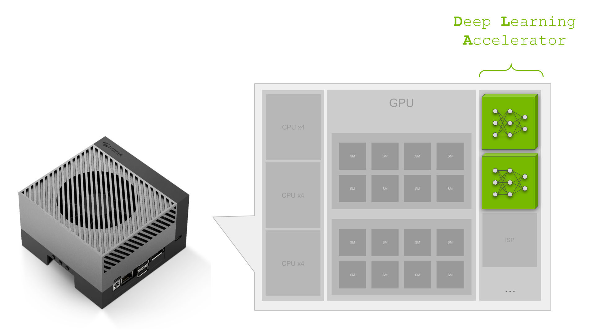
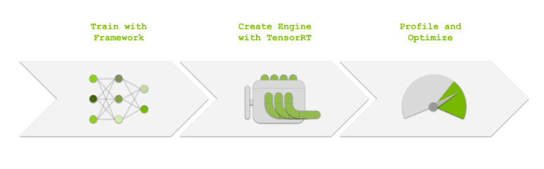

# 开始使用 NVIDIA Jetson Orin 上的深度学习加速器

如果您是一名活跃的 Jetson 开发人员，您就会知道 NVIDIA Jetson 的主要优势之一是将 CPU 和 GPU 组合到一个模块中，从而在一个小型低功耗封装中为您提供可扩展的 NVIDIA 软件堆栈，可以部署在边缘环境中。

Jetson 还具有各种其他处理器，包括硬件加速编码器和解码器、图像信号处理器和深度学习加速器 (DLA)。

DLA 可用于 `Jetson AGX Xavier`、`Xavier NX`、`Jetson AGX Orin` 和 `Jetson Orin NX` 模块。 最近基于 NVIDIA DRIVE Xavier 和 Orin 的平台也具有 DLA 内核。

如果您使用 GPU 执行深度学习，请继续阅读以了解有关 DLA、它为何有用以及如何使用它的更多信息。

## 深度学习加速器概述

DLA ( Deep Learning Accelerator ) 是一种专用集成电路，能够有效地执行现代神经网络架构中常见的固定操作，例如卷积和池化。尽管 DLA 没有 GPU 那么多的[支持层](https://docs.nvidia.com/deeplearning/tensorrt/developer-guide/index.html#dla_layers)，但它仍然支持许多流行的神经网络架构中使用的各种层。

在许多情况下，层支持可能会满足您模型的要求。例如，[NVIDIA TAO 工具包](https://developer.nvidia.com/tao-toolkit)包括 DLA 支持的各种预训练模型，范围从对象检测到动作识别。

虽然需要注意的是，DLA 吞吐量通常低于 GPU，但它非常节能，并且允许您卸载深度学习工作负载，从而将 GPU 腾出来用于其他任务。或者，根据您的应用程序，您可以同时在 GPU 和 DLA 上运行相同的模型以实现更高的净吞吐量。

许多 NVIDIA Jetson 开发人员已经在使用 DLA 成功地优化他们的应用程序。 [Postmates ](https://developer.nvidia.com/blog/postmates-unveils-new-nvidia-jetson-agx-xavier-equipped-delivery-robot/)利用 DLA 和 GPU 在 Jetson AGX Xavier 上优化了他们的送货机器人应用程序。[菜鸟 ET](https://developer.download.nvidia.com/assets/embedded/downloads/jetson_solution_showcase-cainiao.pdf?yFFm9UMqDqRoAZ9RfO4YPFsAVPQrJRU82qykdB3SWhcTyHJAbIqbJTbHLwMclqkvBZ0LeDWbHEl0GytdMjeitzyrDbI8LP1zUiC_E_C5Ce3S-jON-zARdra9eV9tYwnRoRA1zo84SDQgVKt0xf0hVsWUHKCkqwl28Vcy_Sg&t=eyJscyI6ImdzZW8iLCJsc2QiOiJodHRwczpcL1wvd3d3Lmdvb2dsZS5jb21cLyJ9) 实验室使用 DLA 优化他们的物流车辆。如果您希望全面优化您的应用程序，那么 DLA 是 Jetson 曲目中需要考虑的重要部分。

要使用 DLA，您首先需要使用 PyTorch 或 TensorFlow 等深度学习框架来训练您的模型。 接下来，您需要使用 NVIDIA TensorRT 导入和优化您的模型。 TensorRT 负责生成 DLA 引擎，也可以用作执行它们的运行时。 最后，您应该分析您的模式并在可能的情况下进行优化，以最大限度地提高 DLA 兼容性。

## 开始使用深度学习加速器

准备好深入了解了吗？ [Jetson_dla_tutorial](https://github.com/NVIDIA-AI-IOT/jetson_dla_tutorial) GitHub 项目演示了一个基本的 DLA 工作流程，可帮助您优化 Jetson 应用程序。

通过本教程，您可以了解如何在 PyTorch 中定义模型、使用 TensorRT 导入模型、使用 NVIDIA Nsight System profiler 分析性能、修改模型以获得更好的 DLA 兼容性以及校准 INT8 执行。 请注意，CIFAR10 数据集用作简单示例，以方便重现这些步骤。

探索 [Jetson_dla_tutorial](https://github.com/NVIDIA-AI-IOT/jetson_dla_tutorial) 以开始使用。

## 更多资源
* 有关 DLA 的更多信息，请访问[深度学习加速器产品页面](https://developer.nvidia.com/deep-learning-accelerator)。
* [NVIDIA TAO 工具包](https://developer.nvidia.com/tao-toolkit)具有预先训练的模型，涵盖从对象检测到动作识别的任务，这些任务都支持 DLA。 [查看性能基准并了解更多信息](https://developer.nvidia.com/tao-toolkit)。

