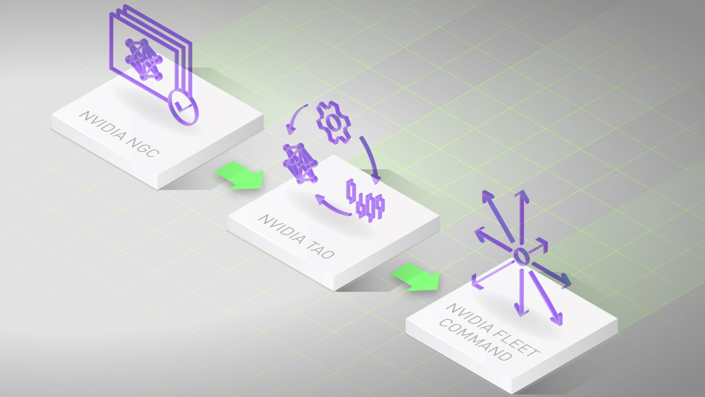

# 使用 LaunchPad 上的 TAO 工具包体验轻松创建 AI 模型

从头开始构建 AI 模型非常困难，需要大量数据和大量数据科学家。 借助 [NVIDIA TAO](https://developer.nvidia.com/tao-toolkit) 工具包，您可以利用迁移学习的强大功能，利用您自己的数据微调 NVIDIA 预训练模型，并针对推理进行优化——无需 AI 专业知识或大型训练数据集。

您现在可以通过 NVIDIA LaunchPad 体验 TAO 工具包，这是一个免费程序，可提供对大量动手实验室的短期访问。

LaunchPad 可帮助开发人员、设计师和 IT 专业人员加快现代数据密集型应用程序的创建和部署。 LaunchPad 是享受和体验 NVIDIA 硬件和软件堆栈的变革性力量的最佳方式，它们协同工作，为您的 AI 应用程序提供动力。

## LaunchPad 上的 TAO 工具包

LaunchPad 上的 TAO Toolkit 实验室拥有您体验微调和部署对象检测应用程序的端到端过程所需的一切。

对象检测是一项流行的计算机视觉任务，涉及对图像或视频帧进行分类和放置边界框。它可用于零售（例如自助结账）、运输、制造等领域的实际应用。

使用 TAO 工具包，您还可以：

* 通过内置模型优化实现高达 4 倍的推理速度
* 通过离线和在线数据增强来概括您的模型
* 使用多 GPU 和多节点向上和向外扩展以加快模型训练
* 在 TensorBoard 中可视化和理解模型训练性能
* TAO Toolkit 实验室预配置了数据集、GPU 优化的预训练模型、Jupyter 笔记本和必要的 SDK，可让您无缝完成任务。

准备好开始了吗？[立即申请](https://www.nvidia.com/en-us/launchpad/ai/develop-a-custom-object-detection-model-with-tao-toolkit-and-deploy-with-deepstream/)以访问免费实验室。

了解有关 [TAO 工具包](https://developer.nvidia.com/tao-toolkit)的更多信息。

