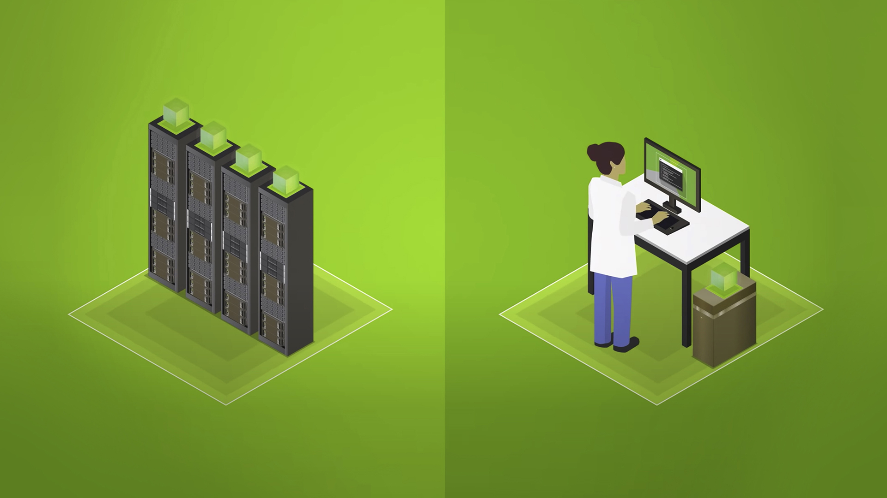

# 浅谈人工智能服务器和人工智能工作站的区别

如果您想知道 AI 服务器与 AI 工作站有何不同，那么您不是唯一一个。假设严格的 AI 用例具有最小的图形工作量，明显的差异可能很小甚至没有。从技术上讲，您可以将一个用作另一个。但是，根据要求每个人执行的工作量，每个人的结果将完全不同。因此，重要的是要清楚地了解 AI 服务器和 AI 工作站之间的区别。

暂时将 AI 放在一边，服务器通常倾向于联网，并可作为共享资源使用，运行通过网络访问的服务。工作站通常旨在执行特定用户、应用程序或用例的请求。

工作站可以充当服务器，还是服务器可以充当工作站？答案是“是”，但忽略工作站或服务器的设计目的通常没有意义。例如，工作站和服务器都可以支持多线程工作负载，但如果服务器可以支持比工作站多 20 倍的线程（其他条件相同），那么服务器将更适合为处理器创建多个线程以同时处理的应用程序。

服务器经过优化，可作为客户端的网络资源进行扩展。工作站通常没有针对大规模、共享、并行和网络功能进行优化。

## 具体差异：用于 AI 的服务器和工作站
服务器通常运行专为服务器用例设计的操作系统，而工作站运行专为工作站用例设计的操作系统。 例如，考虑用于桌面和个人使用的 Microsoft Windows 10，而 Microsoft Windows Server 在专用服务器上运行以提供共享网络服务。

AI服务器和工作站的原理相同。 大多数用于机器学习、深度学习和 AI 开发的 AI 工作站都是基于 Linux 的。 人工智能服务器也是如此。 由于工作站和服务器的预期用途不同，服务器可以配备处理器集群、更大的 CPU 和 GPU 内存资源、更多的处理核心以及更大的多线程和网络能力。

请注意，由于对服务器作为共享资源的极端要求，通常对存储容量、闪存存储性能和网络基础设施有更高的需求。

## GPU：必不可少的组成部分
GPU 已成为现代 AI 工作站和 AI 服务器中必不可少的元素。 与 CPU 不同，GPU 能够增加应用程序中的数据吞吐量和并发计算的数量。

GPU 最初旨在加速图形渲染。 由于 GPU 可以同时处理多条数据，它们在机器学习、视频编辑、自动驾驶等领域找到了新的现代用途。

尽管 AI 工作负载可以在 CPU 上运行，但使用 GPU 获得结果的时间可能要快 10 到 100 倍。 例如，自然语言处理、推荐引擎和图像分类中深度学习的复杂性极大地受益于 GPU 加速。

机器学习和深度学习模型的初始训练需要性能。 当实时响应（如对话式 AI）在推理模式下运行时，性能也是必需的。

## 企业使用

人工智能服务器和工作站在企业内部以及与云无缝协作非常重要。 每个人都在企业组织中占有一席之地。

## 人工智能服务器

对于 AI 服务器，大型模型在支持 GPU 的服务器和服务器集群上得到更有效的训练。 它们还可以使用支持 GPU 的云实例进行有效训练，特别是对于需要极高分辨率的海量数据集和模型。 AI 服务器的任务通常是作为各种 AI 应用程序的专用 AI 推理平台运行。

## 人工智能工作站
个人数据科学家、数据工程师和人工智能研究人员在构建和维护人工智能应用程序的过程中经常使用个人人工智能或数据科学工作站。 这往往包括数据准备、模型设计和初步模型训练。 GPU 加速的工作站使使用大型数据集的适当子集构建完整的模型原型成为可能。 这通常在几小时到一两天内完成。

