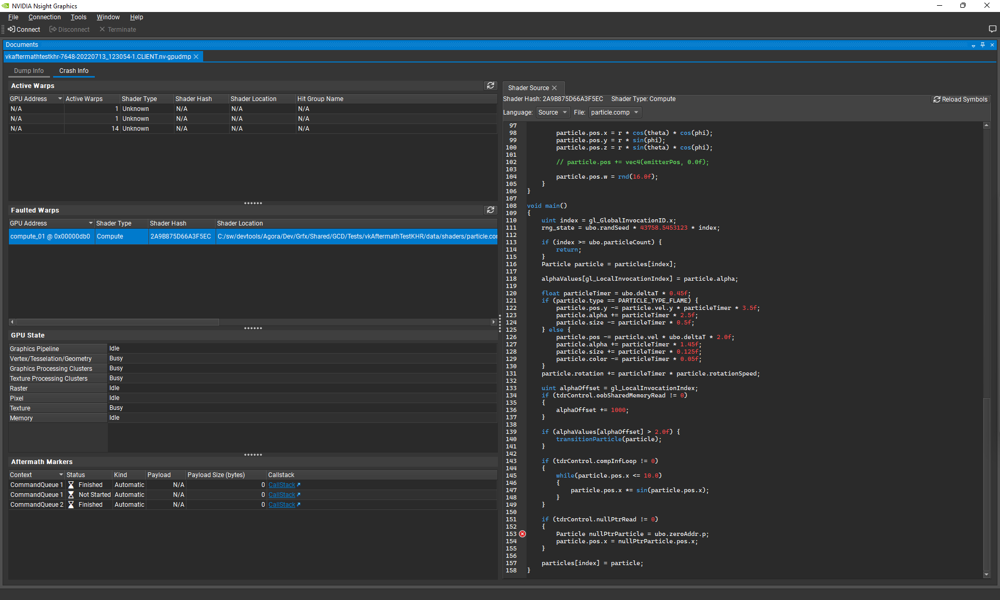

# 新 Nsight Graph、Nsight Aftermath 版本中的性能提升和增强功能

Nsight Graphics 2022.3 和 Nsight Aftermath 2022.2 刚刚发布，现在可供下载。

## Nsight Graphics 2022.3

[Nsight Graphics](https://developer.nvidia.com/nsight-graphics) 2022.3 版本侧重于性能提升、错误修复和 Vulkan 改进。

由于更好的遮挡剔除，光线追踪加速结构查看器的性能在某些复杂场景中提高了高达 20 倍。此外，查看器改进了对大型实例计数的处理，以提高性能并减少具有重复几何图形的场景中的内存使用量。

借助新的 [VK_KHR_graphics_pipeline_library](https://github.com/KhronosGroup/Vulkan-Docs/blob/main/proposals/VK_EXT_graphics_pipeline_library.asciidoc#resolved-what-is-the-expected-usage-model) 扩展，您的 Vulkan 应用程序现在可以预编译shader并在运行时链接它们，成本大大降低。这一点很重要，因为大型 3D 图形应用程序（例如游戏）使用复杂的算法会产生大量的shader。

这些算法通常需要不同的shader排列来解决不同的效果或照明环境。最终结果是成千上万个shader，在许多情况下，它们是在运行时编译的。这可能会导致中间帧卡顿，从而对用户体验产生负面影响。

[下载 Nsight Graphics 2022.3 >>](https://developer.nvidia.com/gameworksdownload#?dn=nvidia-nsight-graphics-2022-3)

## Nsight Aftermath 2022.2

除了 Nsight Graphics 中结构查看器和shader的重大改进之外，[Nsight Aftermath](https://developer.nvidia.com/nsight-aftermath) 2022.2 版本增强了您查找用户系统上 GPU 崩溃根本原因的能力。

GPU shader频繁访问内存，所有这些都通过称为 MMU 的专用硬件单元进行。 Nsight Aftermath 2022.2 添加了增强的 MMU 故障相关性，它提供了从着shader unit启动内存请求的shader源代码行。

在错误是由没有突出依赖关系的内存写入引起的情况下，着shader unit将退出warp，不留下上下文数据来帮助调试过程。 API 中的一个新（仅调试）设置解决了这个问题，防止着shader unit在存在可能导致 MMU 故障的未完成指令时退出扭曲。

Nsight Aftermath 可帮助您定位 GPU 崩溃，以便您可以发布快速稳定的 3D 图形应用程序。 在未来的版本中寻找更好的 GPU 崩溃相关性，以便您可以准确找到代码中发生崩溃的位置。

[下载 Nsight Aftermath 2022.2 >>](https://developer.nvidia.com/gameworksdownload#?dn=aftermath-2022-2-0)

