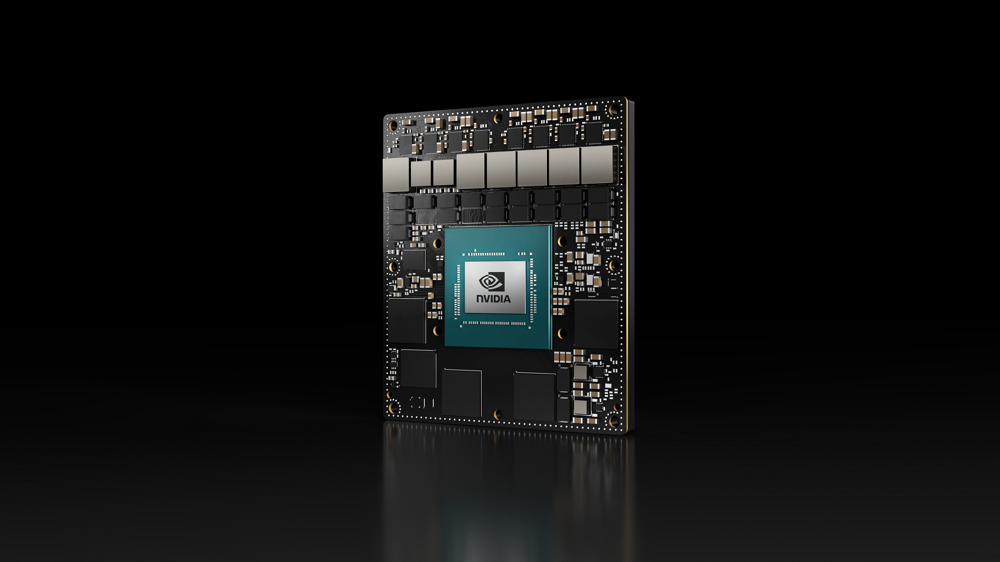

# Jetson AGX Orin 32GB 模块现已上市

从今天开始，可以购买 [NVIDIA Jetson AGX Orin 32GB](https://store.nvidia.com/jetson/store/) 量产模块。 结合世界标准的 NVIDIA AI 软件堆栈以及服务和产品生态系统，上市之路从未如此快捷。

NVIDIA Jetson AGX Orin 32GB 模块可提供高达每秒 200 万亿次操作 (TOPS) 的 AI 性能，功率可配置在 15W 和 40W 之间，是 Jetson AGX Xavier 在相同紧凑型机器人和 其他自主机器用例。

这个最新的系统级模块支持多个并发 AI 应用程序管道，具有 NVIDIA Ampere 架构 GPU、下一代[深度学习和视觉加速器](https://developer.nvidia.com/deep-learning-accelerator)、高速 IO 和快速内存带宽。 开发人员可以使用他们最大、最复杂的 AI 模型构建解决方案，以解决自然语言理解、3D 感知和多传感器融合等问题。

Jetson 运行 [NVIDIA AI 软件堆栈](https://developer.nvidia.com/embedded/develop/software)，并提供特定于用例的应用程序框架，包括用于机器人技术的 NVIDIA Isaac、用于视觉 AI 的 DeepStream 和用于会话 AI 的 Riva。

您还可以使用 NVIDIA Omniverse Replicator 来生成合成数据 (SDG)，并使用 NVIDIA TAO 工具包来微调来自 NGC 目录的预训练 AI 模型，从而节省时间。

广泛的 [Jetson 生态系统合作伙伴](https://developer.nvidia.com/embedded/ecosystem)提供额外的 AI 和系统软件、开发人员工具和定制软件开发。他们还可以为您的产品提供[相机](https://developer.nvidia.com/embedded/jetson-partner-supported-cameras?t1_supported-jetson-products=Orin)和[其他传感器](https://developer.nvidia.com/embedded/jetson-partner-products?t1_supported-jetson=Orin)，以及完整的系统载板和设计服务。

详细了解今天宣布的支持 Orin 的所有合作伙伴解决方案。

Jetson AGX Orin 开发人员套件现在也可以使用。使用它来加速您的 Orin 开发，模拟整个 Jetson Orin 模块系列，并创建先进的机器人技术和边缘 AI 应用程序。

今年晚些时候寻找其他 Jetson Orin 模块，包括 10 月的 Jetson Orin NX 16GB、11 月的 Jetson AGX Orin 64GB 和 12 月的 Jetson Orin NX 8GB。注册以在新的 Jetson Orin 模块可用时收到通知。

