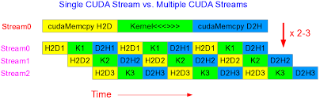

# CUDA 默认流与非默认流

CUDA中有一个重要的概念是 **流(stream)**.  其实它代表着一系列的指令的执行队列.  这个执行队列就像他的名字一样, 有着固定的执行顺序(就像河流只能向一个方向固定的河道流淌一样).

而这条河的源头就是主机线程(host), 它开启了这个执行队列. 同样的, 也可能这座高山开启了不同的河流, 我们的主机线程(host)也可能启动了不同的执行队列. 或者多个主机线程(多座高山), 开启了多个stream(河流).

我更愿意理解流是更高一个层次的并行手段, 相对于thread, block 和 grid, 它的层级更高, 也更独立.

thread, block 和 grid其实都可以算作 kernel内的并行层次, 而流(stream)是kernel外的并行层次.

## 流(stream)分为**默认流(或者叫做NULL流)** 和 **非默认流**.

默认流指的是你不显示声明,创建或指定的操作队列. 在任何CUDA程序中只要是你调用了kernel或调用相关的CUDA函数, 并且没指定他们运行在哪个流中, 那么他们会自动的被安排在默认流中. 

或者你可以这么想, 当你开始CUDA程序的时候, 你调用的那些方法或函数就已经在默认流中了. 当你创建了新的流并把那些函数方法放在新的流中的时候, 他们才从默认流中解脱, 有了自己新的执行队列.

而你创建的那些新的流, stream0, stream1, stream2....就是非默认流.

