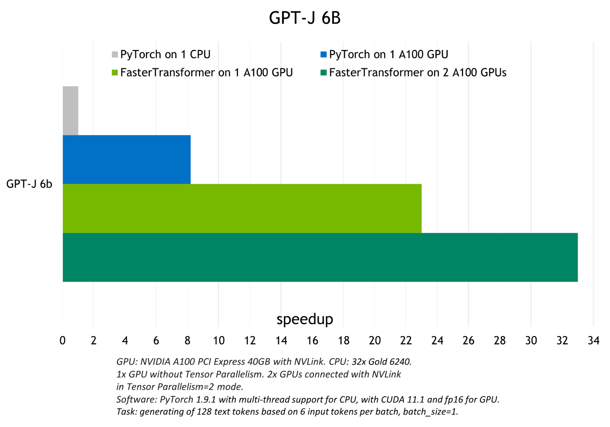

# 使用 FasterTransformer 和 Triton 推理服务器加速大型 Transformer 模型的推理

这是讨论 NVIDIA FasterTransformer 库的两部分系列的第一部分，该库是用于对任意大小（多达数万亿个参数）的Transformer进行分布式推理的最快库之一。它提供了 FasterTransformer 的概述，包括使用该库的好处。

[使用 FasterTransformer 和 Triton 推理服务器部署 GPT-J 和 T5（第 2 部分）](https://developer.nvidia.com/blog/deploying-gpt-j-and-t5-with-fastertransformer-and-triton-inference-server/?nvid=nv-int-txtad-393407-vt27#cid=an01_nv-int-txtad_en-us)是一个指南，说明了使用 FasterTransformer 库和 Triton 推理服务器以具有张量并行性的最佳方式为 T5-3B 和 GPT-J 6B 模型提供服务。

Transformers 是当今最具影响力的 AI 模型架构之一，正在塑造未来 AI 研发的方向。它们最初是作为自然语言处理 (NLP) 的工具而发明的，现在几乎用于任何 AI 任务，包括计算机视觉、自动语音识别、分子结构分类和金融数据处理。考虑到如此广泛使用的是注意力机制，它显着提高了模型的计算效率、质量和准确性。

具有数千亿参数的大型基于 Transformer 的模型的行为就像一个巨大的百科全书和大脑，其中包含有关它所学到的一切的信息。他们以独特的方式对所有这些知识进行结构化、表示和总结。拥有具有大量先验知识的此类模型使我们能够使用新的强大的一次性或少量学习技术来解决许多 NLP 任务。

由于它们的计算效率，Transformer可以很好地扩展——通过增加网络的规模和训练数据的数量，研究人员可以改善观察并提高准确性。

然而，训练如此大的模型并非易事。这些模型可能需要比一个 GPU 供应更多的内存——甚至是数百个 GPU。值得庆幸的是，NVIDIA 研究人员已经创建了强大的开源工具，例如 NeMo Megatron，可以优化训练过程。

快速和优化的推理使企业能够充分发挥这些大型模型的潜力。最新研究表明，增加模型和数据集的大小可以提高这种模型在不同领域（NLP、CV 等）下游任务上的质量。

同时，数据表明这种技术也适用于多域任务。 （例如，参见 OpenAI 的 [DALLE-2](https://openai.com/dall-e-2/) 和 Google 的 [Imagen](https://imagen.research.google/) 等关于文本到图像生成的研究论文。）依赖于大型模型的“冻结”拷贝的 [p-tuning](https://developer.nvidia.com/blog/adapting-p-tuning-to-solve-non-english-downstream-tasks/) 等研究方向甚至增加了拥有稳定且优化的推理流程。此类大型模型的优化推理需要分布式多 GPU 多节点解决方案。

## 用于加速推断大型Transformer的库
[NVIDIA FasterTransformer (FT)](https://github.com/NVIDIA/FasterTransformer/) 是一个库，用于实现基于转换器的神经网络推理的加速引擎，特别强调大型模型，以分布式方式跨越许多 GPU 和节点。

FasterTransformer 包含Transformer块的高度优化版本的实现，其中包含编码器和解码器部分。

使用此模块，您可以运行完整的编码器-解码器架构（如 T5）以及仅编码器模型（如 BERT）或仅解码器模型（如 GPT）的推理。 它是用 C++/CUDA 编写的，依赖于高度优化的 cuBLAS、cuBLASLt 和 cuSPARSELt 库。 这使您可以在 GPU 上构建最快的转换器推理流程。

与[ NVIDIA TensorRT](https://developer.nvidia.com/blog/optimizing-t5-and-gpt-2-for-real-time-inference-with-tensorrt/) 等其他编译器相比，FT 的显着特点是它支持以分布式方式推断大型Transformer模型。

上图显示了如何使用张量并行 (TP) 和流水线并行 (PP) 技术将具有多个经典transformer/attention的神经网络拆分到多个 GPU 和节点上。

当每个张量被分成多个块时，就会发生张量并行性，并且张量的每个块都可以放置在单独的 GPU 上。在计算过程中，每个块在不同的 GPU 上单独并行处理，并且可以通过组合来自多个 GPU 的结果来计算结果（最终张量）。

当模型被深度拆分并将不同的完整层放置到不同的 GPU/节点上时，就会发生管道并行。

在底层，启用节点间/节点内通信依赖于 MPI 和 NVIDIA NCCL。使用此软件堆栈，您可以在多个 GPU 上以张量并行模式运行大型转换器，以减少计算延迟。

同时，TP 和 PP 可以结合在一起，在多 GPU 和多节点环境中运行具有数十亿和数万亿个参数（相当于 TB 级权重）的大型 Transformer 模型。

除了 C 中的源代码，FasterTransformer 还提供 TensorFlow 集成（使用 TensorFlow 操作）、PyTorch 集成（使用 PyTorch 操作）和 Triton 集成作为后端。

目前，TensorFlow op 仅支持单 GPU，而 PyTorch op 和 Triton 后端都支持多 GPU 和多节点。

为了避免为模型并行性而拆分模型的额外工作，FasterTransformer 还提供了一个工具，用于将模型从不同格式拆分和转换为 FasterTransformer 二进制文件格式。然后 FasterTransformer 可以直接以二进制格式加载模型。

目前，FT 支持 Megatron-LM GPT-3、GPT-J、BERT、ViT、Swin Transformer、Longformer、T5 和 XLNet 等模型。您可以在 GitHub 上的 [FasterTransformer 存储库](https://github.com/NVIDIA/FasterTransformer#support-matrix)中查看最新的支持矩阵。

FT 适用于计算能力 >= 7.0 的 GPU，例如 V100、A10、A100 等。

## FasterTransformer 中的优化
与深度学习训练的通用框架相比，FT 使您能够获得更快的推理管道，并且基于 Transformer 的 NN 具有更低的延迟和更高的吞吐量。

允许 FT 对 GPT-3 和其他大型Transformer模型进行最快推理的一些优化技术包括：

**层融合**——预处理阶段的一组技术，将多层神经网络组合成一个单一的神经网络，将使用一个单一的内核进行计算。 这种技术减少了数据传输并增加了数学密度，从而加速了推理阶段的计算。 例如，多头注意力块中的所有操作都可以合并到一个内核中。

## 自回归模型/激活缓存的推理优化
为了防止通过Transformer重新计算每个新token 生成器的先前键和值，FT 分配一个缓冲区来在每一步存储它们。

虽然需要一些额外的内存使用，但 FT 可以节省重新计算的成本、在每一步分配缓冲区以及连接的成本。该过程的方案上图 所示。相同的缓存机制用于 NN 的多个部分。

## 内存优化
与 BERT 等传统模型不同，大型 Transformer 模型具有多达数万亿个参数，占用数百 GB 存储空间。即使我们以半精度存储模型，GPT-3 175b 也需要 350 GB。因此有必要减少其他部分的内存使用。

例如，在 FasterTransformer 中，我们在不同的解码器层重用了激活/输出的内存缓冲区。由于 GPT-3 中的层数为 96，因此我们只需要 1/96 的内存量用于激活。

## 使用 MPI 和 NCCL 实现节点间/节点内通信并支持模型并行性
在 GPT 模型中，FasterTransormer 同时提供张量并行和流水线并行。 对于张量并行性，FasterTransformer 遵循了 Megatron 的思想。 对于自注意力块和前馈网络块，FT 按行拆分第一个矩阵的权重，并按列拆分第二个矩阵的权重。 通过优化，FT 可以将每个 Transformer 块的归约操作减少到两倍。

对于流程并行性，FasterTransformer 将整批请求拆分为多个微批，隐藏了通信的泡沫。 FasterTransformer 会针对不同情况自动调整微批量大小。

## MatMul 内核自动调整（GEMM 自动调整）
矩阵乘法是基于Transformer的神经网络中主要和最繁重的操作。 FT 使用来自 CuBLAS 和 CuTLASS 库的功能来执行这些类型的操作。 重要的是要知道 MatMul 操作可以在“硬件”级别使用不同的低级算法以数十种不同的方式执行。

[GemmBatchedEx](https://docs.nvidia.com/cuda/cublas/index.html#cublas-GemmBatchedEx) 函数实现 MatMul 操作，并以“cublasGemmAlgo_t”作为输入参数。 使用此参数，您可以选择不同的低级算法进行操作。

FasterTransformer 库使用此参数对所有低级算法进行实时基准测试，并为模型的参数（注意层的大小、注意头的数量、隐藏层的大小）选择最佳的一个和 为您的输入数据。 此外，FT 对网络的某些部分使用硬件加速的低级函数，例如 `__expf`、`__shfl_xor_sync`。

## 精度较低的推理
FT 的内核支持使用 fp16 和 int8 中的低精度输入数据进行推理。 由于较少的数据传输量和所需的内存，这两种机制都允许加速。 同时，int8 和 fp16 计算可以在特殊硬件上执行，例如张量核心（适用于从 Volta 开始的所有 GPU 架构），以及即将推出的 Hopper GPU 中的Transformer引擎。

## 更多
* 快速的 C++ BeamSearch 实现
* 针对 TensorParallelism 8 模式优化 all-reduce 当模型的权重部分在 8 个 GPU 之间拆分时

## 具有 FasterTransformer 后端的 NVIDIA Triton 推理服务器
NVIDIA Triton 推理服务器是一款开源推理服务软件，有助于标准化模型部署和执行，在生产中提供快速且可扩展的 AI。 Triton 稳定且快速，允许您使用预烘焙的 Docker 容器以简单的方式运行 ML/DL 模型的推理，该容器仅使用一行代码和简单的类似 JSON 的配置。

Triton 支持使用多个后端的模型，例如 `PyTorch、TorchScript、Tensorflow、ONNXRuntime` 和 `OpenVINO`。 Triton 采用您在其中一个框架中训练的导出模型，并使用相应的后端为您透明地运行该模型进行推理。 它也可以使用自定义后端进行扩展。 Triton 使用 `HTTP/gRPC` API 包装您的模型，并为多种语言提供客户端库。

Triton 包含 FasterTransformer 库作为后端（图 4），该库支持使用 TP 和 PP 运行大型Transformer模型的分布式多 GPU、多节点推理。 今天，带有 FasterTransformer 后端的 Triton 支持 GPT-J、GPT-Megatron 和 T5 模型。

有关演示使用 NVIDIA Triton 和 NVIDIA FasterTransformer 在优化推理中运行 T5-3B 和 GPT-J 6B 模型的过程的指南，请参阅# 使用 FasterTransformer 和 Triton 推理服务器加速大型 Transformer 模型的推理

这是讨论 NVIDIA FasterTransformer 库的两部分系列的第一部分，该库是用于对任意大小（多达数万亿个参数）的Transformer进行分布式推理的最快库之一。它提供了 FasterTransformer 的概述，包括使用该库的好处。

[使用 FasterTransformer 和 Triton 推理服务器部署 GPT-J 和 T5（第 2 部分）](https://developer.nvidia.com/blog/deploying-gpt-j-and-t5-with-fastertransformer-and-triton-inference-server/?nvid=nv-int-txtad-393407-vt27#cid=an01_nv-int-txtad_en-us)是一个指南，说明了使用 FasterTransformer 库和 Triton 推理服务器以具有张量并行性的最佳方式为 T5-3B 和 GPT-J 6B 模型提供服务。

Transformers 是当今最具影响力的 AI 模型架构之一，正在塑造未来 AI 研发的方向。它们最初是作为自然语言处理 (NLP) 的工具而发明的，现在几乎用于任何 AI 任务，包括计算机视觉、自动语音识别、分子结构分类和金融数据处理。考虑到如此广泛使用的是注意力机制，它显着提高了模型的计算效率、质量和准确性。

具有数千亿参数的大型基于 Transformer 的模型的行为就像一个巨大的百科全书和大脑，其中包含有关它所学到的一切的信息。他们以独特的方式对所有这些知识进行结构化、表示和总结。拥有具有大量先验知识的此类模型使我们能够使用新的强大的一次性或少量学习技术来解决许多 NLP 任务。

由于它们的计算效率，Transformer可以很好地扩展——通过增加网络的规模和训练数据的数量，研究人员可以改善观察并提高准确性。

然而，训练如此大的模型并非易事。这些模型可能需要比一个 GPU 供应更多的内存——甚至是数百个 GPU。值得庆幸的是，NVIDIA 研究人员已经创建了强大的开源工具，例如 NeMo Megatron，可以优化训练过程。

快速和优化的推理使企业能够充分发挥这些大型模型的潜力。最新研究表明，增加模型和数据集的大小可以提高这种模型在不同领域（NLP、CV 等）下游任务上的质量。

同时，数据表明这种技术也适用于多域任务。 （例如，参见 OpenAI 的 [DALLE-2](https://openai.com/dall-e-2/) 和 Google 的 [Imagen](https://imagen.research.google/) 等关于文本到图像生成的研究论文。）依赖于大型模型的“冻结”拷贝的 [p-tuning](https://developer.nvidia.com/blog/adapting-p-tuning-to-solve-non-english-downstream-tasks/) 等研究方向甚至增加了拥有稳定且优化的推理流程。此类大型模型的优化推理需要分布式多 GPU 多节点解决方案。

## 用于加速推断大型Transformer的库
[NVIDIA FasterTransformer (FT)](https://github.com/NVIDIA/FasterTransformer/) 是一个库，用于实现基于转换器的神经网络推理的加速引擎，特别强调大型模型，以分布式方式跨越许多 GPU 和节点。

FasterTransformer 包含Transformer块的高度优化版本的实现，其中包含编码器和解码器部分。

使用此模块，您可以运行完整的编码器-解码器架构（如 T5）以及仅编码器模型（如 BERT）或仅解码器模型（如 GPT）的推理。 它是用 C++/CUDA 编写的，依赖于高度优化的 cuBLAS、cuBLASLt 和 cuSPARSELt 库。 这使您可以在 GPU 上构建最快的转换器推理流程。

与[ NVIDIA TensorRT](https://developer.nvidia.com/blog/optimizing-t5-and-gpt-2-for-real-time-inference-with-tensorrt/) 等其他编译器相比，FT 的显着特点是它支持以分布式方式推断大型Transformer模型。

上图显示了如何使用张量并行 (TP) 和流水线并行 (PP) 技术将具有多个经典transformer/attention的神经网络拆分到多个 GPU 和节点上。

当每个张量被分成多个块时，就会发生张量并行性，并且张量的每个块都可以放置在单独的 GPU 上。在计算过程中，每个块在不同的 GPU 上单独并行处理，并且可以通过组合来自多个 GPU 的结果来计算结果（最终张量）。

当模型被深度拆分并将不同的完整层放置到不同的 GPU/节点上时，就会发生管道并行。

在底层，启用节点间/节点内通信依赖于 MPI 和 NVIDIA NCCL。使用此软件堆栈，您可以在多个 GPU 上以张量并行模式运行大型转换器，以减少计算延迟。

同时，TP 和 PP 可以结合在一起，在多 GPU 和多节点环境中运行具有数十亿和数万亿个参数（相当于 TB 级权重）的大型 Transformer 模型。

除了 C 中的源代码，FasterTransformer 还提供 TensorFlow 集成（使用 TensorFlow 操作）、PyTorch 集成（使用 PyTorch 操作）和 Triton 集成作为后端。

目前，TensorFlow op 仅支持单 GPU，而 PyTorch op 和 Triton 后端都支持多 GPU 和多节点。

为了避免为模型并行性而拆分模型的额外工作，FasterTransformer 还提供了一个工具，用于将模型从不同格式拆分和转换为 FasterTransformer 二进制文件格式。然后 FasterTransformer 可以直接以二进制格式加载模型。

目前，FT 支持 Megatron-LM GPT-3、GPT-J、BERT、ViT、Swin Transformer、Longformer、T5 和 XLNet 等模型。您可以在 GitHub 上的 [FasterTransformer 存储库](https://github.com/NVIDIA/FasterTransformer#support-matrix)中查看最新的支持矩阵。

FT 适用于计算能力 >= 7.0 的 GPU，例如 V100、A10、A100 等。

## FasterTransformer 中的优化
与深度学习训练的通用框架相比，FT 使您能够获得更快的推理管道，并且基于 Transformer 的 NN 具有更低的延迟和更高的吞吐量。

允许 FT 对 GPT-3 和其他大型Transformer模型进行最快推理的一些优化技术包括：

**层融合**——预处理阶段的一组技术，将多层神经网络组合成一个单一的神经网络，将使用一个单一的内核进行计算。 这种技术减少了数据传输并增加了数学密度，从而加速了推理阶段的计算。 例如，多头注意力块中的所有操作都可以合并到一个内核中。

## 自回归模型/激活缓存的推理优化
为了防止通过Transformer重新计算每个新token 生成器的先前键和值，FT 分配一个缓冲区来在每一步存储它们。

虽然需要一些额外的内存使用，但 FT 可以节省重新计算的成本、在每一步分配缓冲区以及连接的成本。该过程的方案上图 所示。相同的缓存机制用于 NN 的多个部分。

## 内存优化
与 BERT 等传统模型不同，大型 Transformer 模型具有多达数万亿个参数，占用数百 GB 存储空间。即使我们以半精度存储模型，GPT-3 175b 也需要 350 GB。因此有必要减少其他部分的内存使用。

例如，在 FasterTransformer 中，我们在不同的解码器层重用了激活/输出的内存缓冲区。由于 GPT-3 中的层数为 96，因此我们只需要 1/96 的内存量用于激活。

## 使用 MPI 和 NCCL 实现节点间/节点内通信并支持模型并行性
在 GPT 模型中，FasterTransormer 同时提供张量并行和流水线并行。 对于张量并行性，FasterTransformer 遵循了 Megatron 的思想。 对于自注意力块和前馈网络块，FT 按行拆分第一个矩阵的权重，并按列拆分第二个矩阵的权重。 通过优化，FT 可以将每个 Transformer 块的归约操作减少到两倍。

对于流程并行性，FasterTransformer 将整批请求拆分为多个微批，隐藏了通信的泡沫。 FasterTransformer 会针对不同情况自动调整微批量大小。

## MatMul 内核自动调整（GEMM 自动调整）
矩阵乘法是基于Transformer的神经网络中主要和最繁重的操作。 FT 使用来自 CuBLAS 和 CuTLASS 库的功能来执行这些类型的操作。 重要的是要知道 MatMul 操作可以在“硬件”级别使用不同的低级算法以数十种不同的方式执行。

[GemmBatchedEx](https://docs.nvidia.com/cuda/cublas/index.html#cublas-GemmBatchedEx) 函数实现 MatMul 操作，并以“cublasGemmAlgo_t”作为输入参数。 使用此参数，您可以选择不同的低级算法进行操作。

FasterTransformer 库使用此参数对所有低级算法进行实时基准测试，并为模型的参数（注意层的大小、注意头的数量、隐藏层的大小）选择最佳的一个和 为您的输入数据。 此外，FT 对网络的某些部分使用硬件加速的低级函数，例如 `__expf`、`__shfl_xor_sync`。

## 精度较低的推理
FT 的内核支持使用 fp16 和 int8 中的低精度输入数据进行推理。 由于较少的数据传输量和所需的内存，这两种机制都允许加速。 同时，int8 和 fp16 计算可以在特殊硬件上执行，例如张量核心（适用于从 Volta 开始的所有 GPU 架构），以及即将推出的 Hopper GPU 中的Transformer引擎。

## 更多
* 快速的 C++ BeamSearch 实现
* 针对 TensorParallelism 8 模式优化 all-reduce 当模型的权重部分在 8 个 GPU 之间拆分时

## 具有 FasterTransformer 后端的 NVIDIA Triton 推理服务器
NVIDIA Triton 推理服务器是一款开源推理服务软件，有助于标准化模型部署和执行，在生产中提供快速且可扩展的 AI。 Triton 稳定且快速，允许您使用预烘焙的 Docker 容器以简单的方式运行 ML/DL 模型的推理，该容器仅使用一行代码和简单的类似 JSON 的配置。

Triton 支持使用多个后端的模型，例如 `PyTorch、TorchScript、Tensorflow、ONNXRuntime` 和 `OpenVINO`。 Triton 采用您在其中一个框架中训练的导出模型，并使用相应的后端为您透明地运行该模型进行推理。 它也可以使用自定义后端进行扩展。 Triton 使用 `HTTP/gRPC` API 包装您的模型，并为多种语言提供客户端库。

Triton 包含 FasterTransformer 库作为后端（图 4），该库支持使用 TP 和 PP 运行大型Transformer模型的分布式多 GPU、多节点推理。 今天，带有 FasterTransformer 后端的 Triton 支持 GPT-J、GPT-Megatron 和 T5 模型。

有关演示使用 NVIDIA Triton 和 NVIDIA FasterTransformer 在优化推理中运行 T5-3B 和 GPT-J 6B 模型的过程的指南，请参阅[使用 FasterTransformer 和 Triton 推理服务器部署 GPT-J 和 T5](https://developer.nvidia.com/blog/deploying-gpt-j-and-t5-with-fastertransformer-and-triton-inference-server/?nvid=nv-int-txtad-393407-vt27#cid=an01_nv-int-txtad_en-us)。

。

