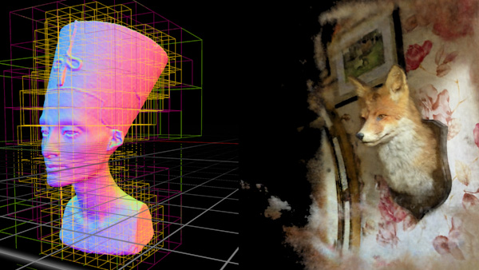
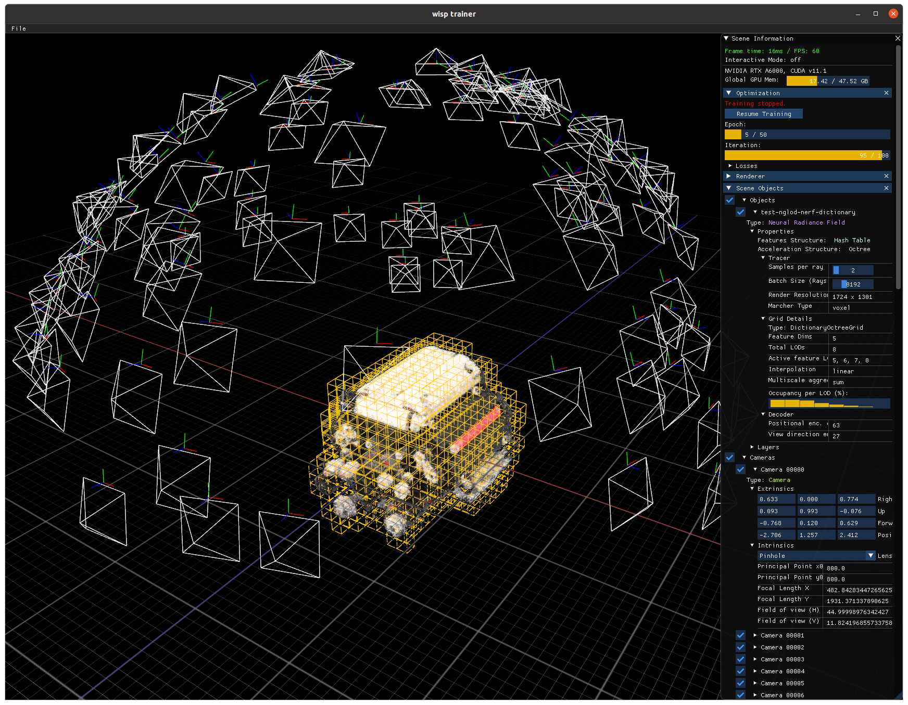
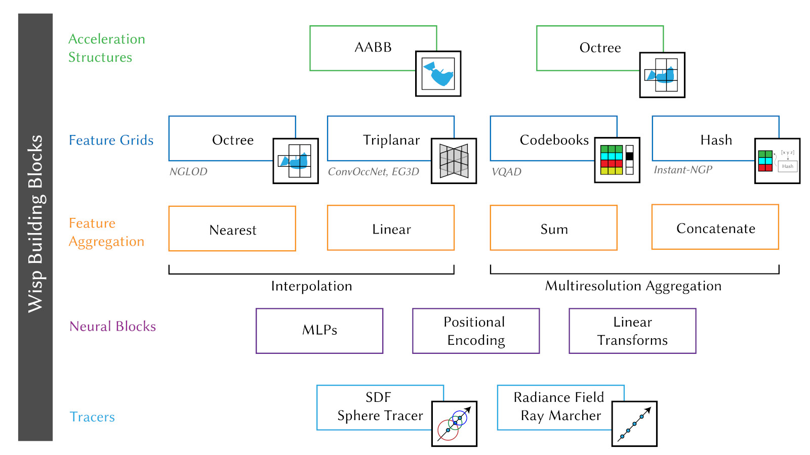

# 使用 NVIDIA Kaolin Wisp 按您的方式研究神经场

近年来，[神经领域](https://neuralfields.cs.brown.edu/)的研究已经成为计算机图形学和计算机视觉领域越来越热门的话题。 神经域可以通过使用以坐标为输入并在该位置输出相应数据的神经网络来表示形状、外观、运动和其他物理量等 3D 数据。

这些表示已被证明在生成建模和 3D 重建等各种应用中很有用。 [NGLOD](https://github.com/nv-tlabs/nglod)、[GANcraft](https://nvlabs.github.io/GANcraft/)、[NeRF-Tex](https://research.nvidia.com/publication/2021-06_nerf-tex-neural-reflectance-field-textures)、[EG3D](https://github.com/NVlabs/eg3d)、[Instant-NGP](https://nvlabs.github.io/instant-ngp/) 和[可变比特率神经场](https://nv-tlabs.github.io/vqad/)等 NVIDIA 项目正在以各种方式推进神经领域、计算机图形学和计算机视觉领域的最先进技术。

## 研究挑战
神经领域的研究进展很快，这意味着标准和软件往往落后。实施差异可能导致质量指标和性能的巨大差异。新项目的启动成本可能相当可观，因为神经领域的组件越来越复杂。研究小组之间经常重复工作——例如，创建整个交互式应用程序来可视化神经场输出。

一个重要的里程碑是 [NVIDIA Instant-NGP](https://nvlabs.github.io/instant-ngp/)，它最近引起了研究界的广泛关注，因为它能够适应各种信号，如神经辐射场 (NeRF)、符号距离场 (SDF) 和近乎瞬时速度的图像。由于其计算效率，它开启了实际应用和研究方向的新前沿。然而，由于高度专业化和优化的代码难以适应和扩展，这种计算效率也可能成为研究的障碍。

## NVIDIA Kaolin Wisp
NVIDIA Kaolin Wisp 被开发为一个快节奏的面向研究的神经领域库，以支持研究人员应对不断发展的学科的挑战。 它建立在核心 Kaolin Library 功能之上，其中包括用于 3D 深度学习研究的更通用和稳定的组件。

Wisp 的目标是为神经领域的研究提供一个通用的核心库和框架。 该库由可用于创建复杂神经域的模块化构建块和用于训练和可视化神经域的交互式应用程序组成。

Wisp 没有提供特定的实现，而是提供了神经领域的构建块。 该框架易于扩展以用于研究目的，并由一个模块化管道组成，其中每个管道组件都可以轻松互换，从而为标准培训提供即插即用配置。

Wisp 的目标不是提供可用于生产的代码，而是快速发布新模块，保持该技术的领先地位。 它还提供了一组丰富的示例，展示了 Kaolin Core 框架以及如何使用 Kaolin Core 来加速研究。

## NVIDIA Kaolin Wisp 功能亮点
Kaolin Wisp 使用基于 Python 的 API，该 API 建立在 PyTorch 之上，使用户能够快速开发项目。 与许多其他基于 PyTorch 的公共项目兼容，Kaolin Wisp 可以使用基于 PyTorch / CUDA 的构建块轻松定制。

虽然 Wisp 专为开发人员的速度而非计算性能而设计，但库中提供的构建块经过优化，可以在几分钟内训练神经领域并以交互方式可视化它们。

Kaolin Wisp 包含大量构建块，可通过混合搭配方法组成神经场管道。 值得注意的例子是特征网格，其中包括：

* 分层八叉树：来自 NGLOD，用于学习空间细分树的特征。 Octree 还支持光线追踪操作，除了 SDF 之外，它还允许训练基于多视图图像的 NGLOD-NeRF 变体。
* 三平面特征：在 EG3D 和卷积占用网络论文中用于学习三平面纹理图上的体积特征。 三平面还支持多分辨率金字塔结构中的多层次细节 (LOD)。
* Codebooks：从可变二元神经领域，学习具有可微分可学习键的压缩特征码本。
* Hash Grids：来自 Instant-NGP 论文，用于学习具有高性能内存访问的紧凑型缓存友好特征码本。

NVIDIA Kaolin Wisp 与交互式渲染器配对，支持灵活渲染神经基元管道，如 NeRF 和神经 SDF 的变体。它允许集成新的表示。

OpenGL 风格的光栅化基元可以与神经表示混合和匹配，以添加更多数据层的可视化，例如相机和占用结构。它还允许通过支持 GUI 上可以与训练和渲染交互的自定义​​小部件来轻松构建可定制的应用程序。

其他有用的功能包括属性查看器、优化控件、自定义输出渲染缓冲区和允许轻松操作场景摄像机的摄像机对象。

要了解有关 Kaolin Wisp 和其他库的更多信息，请访问 [NVIDIA 研究](https://www.nvidia.com/en-us/research/)。您可以访问 GitHub 上的 [kaolin-wisp](https://github.com/NVIDIAGameWorks/kaolin-wisp) 项目。

在 SIGGRAPH 2022 上与 NVIDIA 3D 深度学习研究人员和 Kaolin 库开发人员一起参加有关[照亮图形未来的会议](https://www.nvidia.com/en-us/events/siggraph/)。提出问题、观看演示并了解 Kaolin Wisp 如何加速您的神经网络研究。

