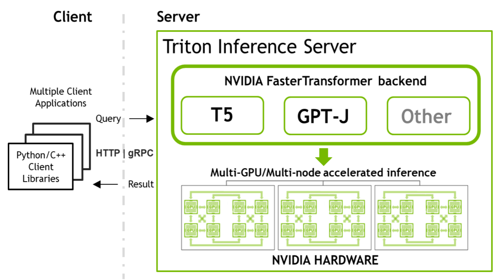
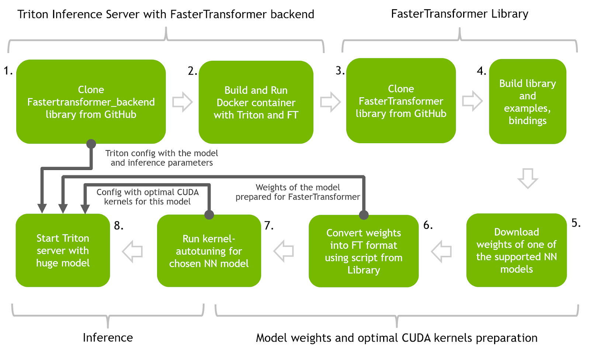
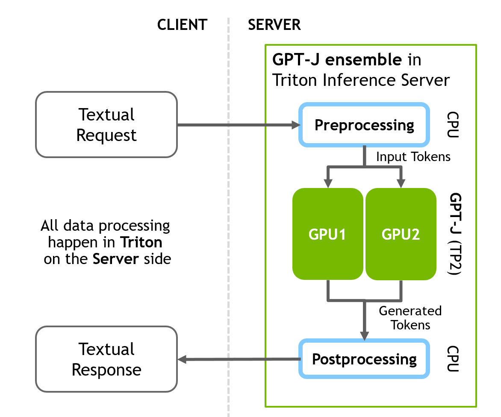
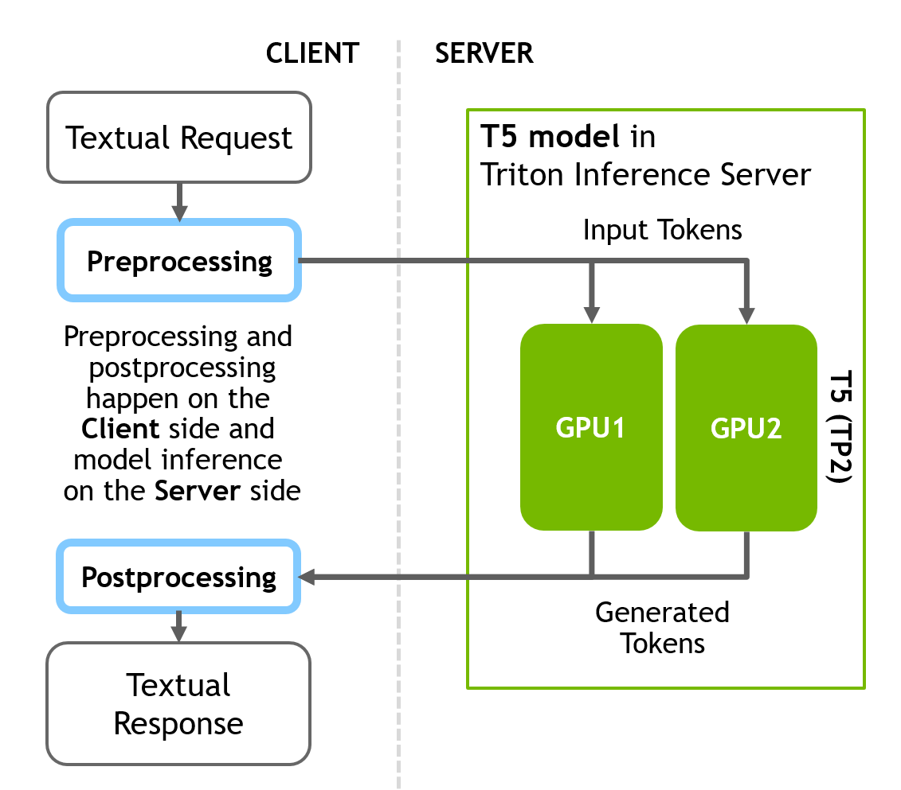
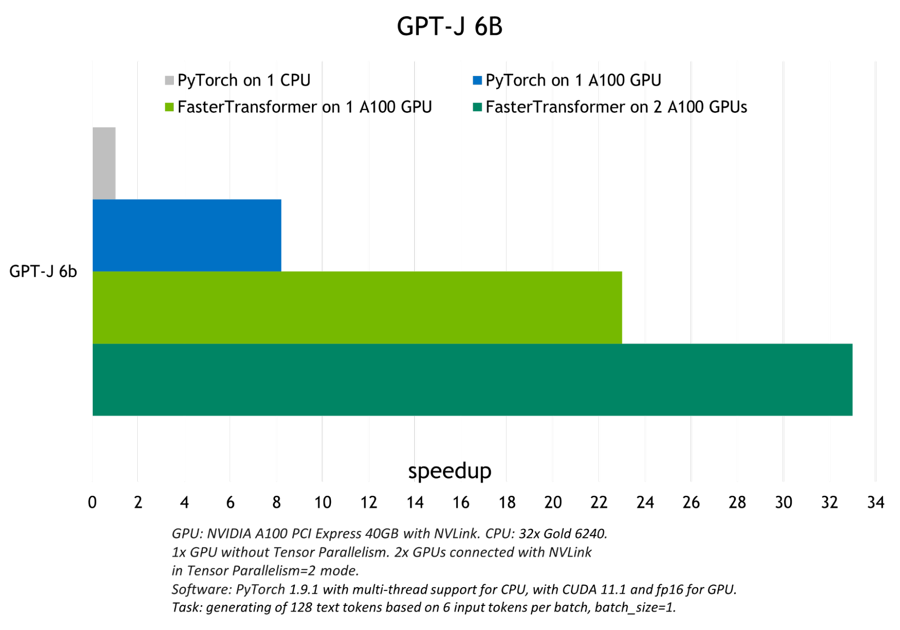

# 使用 FasterTransformer 和 Triton 推理服务器部署 GPT-J 和 T5



这是关于 NVIDIA 工具的两部分系列的第二部分，这些工具允许您运行大型Transformer模型以加速推理。 有关 NVIDIA FasterTransformer 库（第 1 部分）的介绍，请参阅 [使用 FasterTransformer 和 Triton 推理服务器加速大型 Transformer 模型的推理](https://blog.csdn.net/kunhe0512/article/details/126227555)


## 简介
这篇文章是大型Transformer模型（例如 EleutherAI 的 GPT-J 6B 和 Google 的 T5-3B）的优化推理指南。这两种模型在许多下游任务中都表现出良好的效果，并且是研究人员和数据科学家最常用的模型之一。

NVIDIA Triton 中的 NVIDIA FasterTransformer (FT) 允许您以类似且简单的方式运行这两个模型，同时提供足够的灵活性来集成/组合其他推理或训练流程。相同的 NVIDIA 软件堆栈可用于在多个节点上结合张量并行 (TP) 和流程并行 (PP) 技术来推断万亿参数模型。

Transformer模型越来越多地用于众多领域，并表现出出色的准确性。更重要的是，模型的大小直接影响其质量。除了 NLP，这也适用于其他领域。

来自谷歌的研究人员证明，基于转换器的文本编码器的缩放对于他们的 [Imagen 模型](https://arxiv.org/pdf/2205.11487.pdf)中的整个图像生成流程至关重要，这是最新的也是最有前途的生成文本到图像模型之一。缩放转换器可以在单域和多域流程中产生出色的结果。本指南使用相同结构和相似尺寸的基于Transformer的模型。


## 主要步骤概述
本节介绍使用 FasterTransformer 和 Triton 推理服务器在优化推理中运行 T5 和 GPT-J 的主要步骤。 下图展示了一个神经网络的整个过程。

您可以使用 GitHub 上的逐步快速[transformer_backend notebook](https://github.com/triton-inference-server/fastertransformer_backend/blob/dev/t5_gptj_blog/notebooks/GPT-J_and_T5_inference.ipynb) 重现所有步骤。

强烈建议在 Docker 容器中执行所有步骤以重现结果。 有关准备 FasterTransformer Docker 容器的说明可在同一notebook 的开头找到。

如果您已经预训练了其中一个模型，则必须将框架保存模型文件中的权重转换为 FT 可识别的二进制格式。 FasterTransformer 存储库中提供了转换脚本。



**第 1 步和第 2 步**：使用 Triton 推理服务器和 FasterTransformer 后端构建 Docker 容器。 使用 Triton 推理服务器作为向 FasterTransformer 后端代理请求的主要服务工具。

**第 3 步和第 4 步**：构建 FasterTransformer 库。 该库包含许多用于推理准备的有用工具以及多种语言的绑定以及如何在 C++ 和 Python 中进行推理的示例。

**第 5 步和第 6 步**：下载预训练模型（T5-3B 和 GPT-J）的权重，并通过将它们转换为二进制格式并将它们拆分为多个分区以实现并行性和加速推理，为使用 FT 进行推理做好准备。 此步骤中将使用 FasterTransformer 库中的代码。

**第 7 步**：使用 FasterTransformer 库中的代码为 NN 找到最佳的低级内核。

**第 8 步**：启动 Triton 服务器，该服务器使用前面步骤中的所有工件并运行 Python 客户端代码以向具有加速模型的服务器发送请求。


## 第 1 步：从 Triton GitHub 存储库中克隆 fastertransformer_backend

从 GitHub 克隆 [fasttransformer_backend](https://github.com/triton-inference-server/fastertransformer_backend/blob/dev/t5_gptj_blog/notebooks/GPT-J_and_T5_inference.ipynb) 存储库：

```bash
git clone https://github.com/triton-inference-server/fastertransformer_backend.git
cd fastertransformer_backend && git checkout -b t5_gptj_blog remotes/origin/dev/t5_gptj_blog
```

## 第 2 步：使用 Triton 和 FasterTransformer 库构建 Docker 容器
使用此文件构建 Docker 映像：

```bash
docker build --rm  --build-arg TRITON_VERSION=22.03 -t triton_with_ft:22.03 \
             -f docker/Dockerfile .
cd ../
```

运行 Docker 容器并使用以下代码启动交互式 bash 会话：
```c++
docker run -it --rm --gpus=all --shm-size=4G  -v $(pwd):/ft_workspace \
           -p 8888:8888 triton_with_ft:22.03 bash
```

所有进一步的步骤都需要在 Docker 容器交互会话中运行。 此容器中还需要 Jupyter Lab 才能使用提供的notebook 。

```bash
apt install jupyter-lab && jupyter lab -ip 0.0.0.0
```
Docker 容器是使用 Triton 和 FasterTransformer 构建的，并从内部的 fastertransformer_backend 源代码开始。

## 第 3 步和第 4 步：克隆 FasterTransformer 源代码并构建库
FasterTransformer 库是在 Docker 构建过程中预先构建并放入我们的容器中的。

从 GitHub 下载 FasterTransformer 源代码，以使用允许将 GPT-J 或 T5 的预训练模型文件转换为推理时使用的 FT 二进制格式的附加脚本。
```bash
git clone https://github.com/NVIDIA/FasterTransformer.git
```

该库能够在以后运行用于内核自动调整的代码：

```bash
mkdir -p FasterTransformer/build && cd FasterTransformer/build
git submodule init && git submodule update
cmake -DSM=xx -DCMAKE_BUILD_TYPE=Release -DBUILD_PYT=ON -DBUILD_MULTI_GPU=ON ..
make -j32
```


## GPT-J 推理
GPT-J 是由 EleutherAI 开发的解码器模型，并在 The Pile 上进行了训练，该数据集是从多个来源策划的 825GB 数据集。 GPT-J 拥有 60 亿个参数，是最大的类似 GPT 的公开发布模型之一。

FasterTransformer 后端在 `fasttransformer_backend/all_models/gptj` 下有一个 GPT-J 模型的配置。这个配置是 Triton 合奏的完美演示。 Triton 允许您运行单个模型推理，以及构建包含推理任务所需的许多模型的复杂流程/流程。

您还可以在任何神经网络之前或之后添加额外的 Python/C++ 脚本，用于可以将您的数据/结果转换为最终形式的预处理/后处理步骤。

GPT-J 推理流程在服务器端包括三个不同的顺序步骤：

预处理 -> FasterTransformer -> 后处理

配置文件将所有三个阶段组合到一个流程中。下图说明了客户端-服务器推理方案。



GPT-J 和 T5 的步骤 5-8 相同，如下所示（首先是 GPT，然后是 T5）。

## 第 5 步（GPT-J）：下载并准备 GPT-J 模型的权重

```bash
wget https://mystic.the-eye.eu/public/AI/GPT-J-6B/step_383500_slim.tar.zstd
tar -axf step_383500_slim.tar.zstd -C ./models/  
```
这些权重需要转换为 C++ FasterTransformer 后端识别的二进制格式。 FasterTransformer 为不同的预训练神经网络提供工具/脚本。

对于 GPT-J 权重，您可以使用以下脚本：

`FasterTransformer/examples/pytorch/gptj/utils/gptj_ckpt_convert.py` 转换检查点如下：


## 第 6 步 (GPT-J)：将权重转换为 FT 格式
```bash
python3 ./FasterTransformer/examples/pytorch/gptj/utils/gptj_ckpt_convert.py \
          --output-dir ./models/j6b_ckpt \
          --ckpt-dir ./step_383500/ \
          --n-inference-gpus 2
```
n-inference-gpus 指定用于张量并行的 GPU 数量。 该脚本将创建 `./models/j6b_ckpt/2-gpu` 目录并自动在那里写入准备好的权重。 这些权重将为 TensorParallel 2 推理做好准备。 使用此参数，您可以将权重拆分到更多 GPU 上，以使用 TP 技术实现更高的速度。


## 第 7 步（GPT-J）：GPT-J 推理的内核自动调整

下一步是内核自动调整。 矩阵乘法是基于Transformer的神经网络中主要和最繁重的操作。 FT 使用来自 CuBLAS 和 CuTLASS 库的功能来执行此类操作。 需要注意的是，MatMul 操作可以在“硬件”级别使用不同的低级算法以数十种不同的方式执行。

FasterTransformer 库有一个脚本，允许对所有低级算法进行实时基准测试，并为模型的参数（注意层的大小、注意头的数量、隐藏层的大小）和 你的输入数据。 此步骤是可选的，但可以实现更高的推理速度。

运行在构建 FasterTransformer 库阶段构建的 `./FasterTransformer/build/bin/gpt_gemm` 二进制文件。 脚本的参数可以在 GitHub 的文档中找到，或者使用 --help 参数。

```bash
./FasterTransformer/build/bin/gpt_gemm 8 1 32 12 128 6144 51200 1 2
```

## 第 8 步（GPT-J）：准备 Triton 配置并提供模型
准备好权重后，下一步是为 GPT-J 模型准备 Triton 配置文件。 在 `fastertransformer_backend/all_models/gptj/fastertransformer/config.pbtxt` 打开 GPT-J 模型的主要 Triton 配置进行编辑。 那里只需要更改两个强制参数即可开始推理。

更新 `tensor_para_size`。 为两个 GPU 准备了权重，因此将其设置为 2。

```json
parameters {
  key: "tensor_para_size"
  value: {
    string_value: "2"
  }
}
```
更新上一步中检查点文件夹的路径：

```json
parameters {
  key: "model_checkpoint_path"
  value: {
    string_value: "./models/j6b_ckpt/2-gpu/"
  }
}
```
现在使用 Triton 后端和 GPT-J 启动 Triton 推理服务器：
```bash
CUDA_VISIBLE_DEVICES=0,1 /opt/tritonserver/bin/tritonserver  --model-repository=./triton-model-store/gptj/ &
```
如果 Triton 成功启动，您将看到输出行通知模型已由 Triton 加载并且服务器正在侦听指定端口的传入请求：

```bash
# Info about T5 model that was found by the Triton in our directory:

+-------------------+---------+--------+
| Model             | Version | Status |
+-------------------+---------+--------+
| fastertransformer | 1       | READY  |
+-------------------+---------+--------+

# Info about that Triton successfully started and waiting for HTTP/GRPC requests:

I0503 17:26:25.226719 1668 grpc_server.cc:4421] Started GRPCInferenceService at 0.0.0.0:8001
I0503 17:26:25.227017 1668 http_server.cc:3113] Started HTTPService at 0.0.0.0:8000
I0503 17:26:25.283046 1668 http_server.cc:178] Started Metrics Service at 0.0.0.0:8002
```
接下来，将推理请求发送到服务器。 在客户端，tritonclient Python 库允许从任何 Python 应用程序与我们的服务器进行通信。

这个 GPT-J 示例将文本数据直接发送到 Triton 服务器，所有预处理和后处理都将在服务器端进行。 完整的客户端脚本可以在 f`astertransformer_backend/tools/end_to_end_test.py` 或提供的 `Jupyter notebook` 中找到。

主要部分包括：
```python
# Import libraries
import tritonclient.http as httpclient

# Initizlize client
client = httpclient.InferenceServerClient("localhost:8000",
                                           concurrency=1,
                                           verbose=False)
# ...

# Request text promp from user
print("Write any input prompt for the model and press ENTER:")
# Prepare tokens for sending to the server
inputs = prepare_inputs( [[input()]])
# Sending request
result = client.infer(MODEl_GPTJ_FASTERTRANSFORMER, inputs)
print(result.as_numpy("OUTPUT_0"))
```
## T5 推理
T5（Text-to-Text Transfer Transformer）是谷歌最近创建的架构。它由编码器和解码器部分组成，是完整Transformer架构的一个实例。它将所有自然语言处理 (NLP) 任务重新构建为统一的文本到文本格式，其中输入和输出始终是文本字符串。

本节准备的 T5 推理流程与 GPT-J 模型的不同之处在于，只有 NN 推理阶段位于服务器端，而不是具有数据预处理和后处理结果的完整流程。预处理和后处理阶段的所有计算都发生在客户端。

Triton 允许您灵活地配置推理，因此也可以在服务器端构建完整的流程，但其他配置也是可能的。

首先，使用客户端的 Huggingface 库在 Python 中将文本转换为标记。接下来，向服务器发送推理请求。最后，在得到服务器的响应后，在客户端将生成的令牌转换为文本。

下图说明了客户端-服务器推理方案。



T5 的准备步骤与 GPT-J 相同。 下面为 T5 提供步骤 5-8 的详细信息：

## 第 5 步 (T5)：下载 T5-3B 的权重
首先下载 T5 3b 大小的权重。 您必须安装 git-lfs 才能成功下载权重。
```bash
git clone https://huggingface.co/t5-3b
```

## 第 6 步 (T5)：将权重转换为 FT 格式
同样，权重需要转换为 C++ FasterTransformer 后端识别的二进制格式。 对于 T5 权重，您可以使用 `FasterTransformer/blob/main/examples/pytorch/t5/utils/huggingface_t5_ckpt_convert.py `中的脚本来转换检查点。

转换器需要以下参数。 与 GPT-J 非常相似，但参数 i_g 表示 GPU 的数量将用于 TP 机制中的推理，因此将其设置为 2：
```bash
python3 FasterTransformer/examples/pytorch/t5/utils/huggingface_t5_ckpt_convert.py\
        -i t5-3b/ \
        -o ./models/t5-3b/ \
        -i_g 2
```

## 第 7 步 (T5)：T5-3B 推理的内核自动调整
下一步是使用 t5_gemm 二进制文件对 T5 进行内核自动调整，该文件将运行实验以对 T5 模型的最重部分进行基准测试，并找到最佳的低级内核。 运行在构建 FasterTransformer 库（步骤 2）阶段构建的 `./FasterTransformer/build/bin/t5_gemm` 二进制文件。 此步骤是可选的，但包含它可以实现更高的推理速度。 同样，脚本的参数可以在 GitHub 的文档中找到，或者使用 --help 参数。
```bash
./FasterTransformer/build/bin/t5_gemm 1 1 32 1024 32 128 16384 1024 32 128 16384 32128 1 2 1 1
```
## 步骤 8 (T5)：准备 T5 模型的 Triton 配置
您必须为 T5 模型 `triton-model-store/t5/fastertransformer/config.pbtxt` 打开复制的 Triton 配置进行编辑。 那里只需要更改两个强制参数即可开始推理。

然后更新 tensor_para_size。 为两个 GPU 准备了权重，因此将其设置为 2。

```json
parameters {
  key: "tensor_para_size"
  value: {
    string_value: "2"
  }
}
```
接下来，使用权重更新文件夹的路径：

```json
parameters {
  key: "model_checkpoint_path"
  value: {
    string_value: "./models/t5-3b/2-gpu/"
  }
}
```
启动 Triton 推理服务器。 更新上一步准备的转换模型的路径：

```bash
CUDA_VISIBLE_DEVICES=0,1 /opt/tritonserver/bin/tritonserver \ --model-repository=./triton-model-store/t5/  
```
如果 Triton 成功启动，您将在输出中看到这些行：
```c++
# Info about T5 model that was found by the Triton in our directory:

+-------------------+---------+--------+
| Model             | Version | Status |
+-------------------+---------+--------+
| fastertransformer | 1       | READY  |
+-------------------+---------+--------+

# Info about that Triton successfully started and waiting for HTTP/GRPC requests:

I0503 17:26:25.226719 1668 grpc_server.cc:4421] Started GRPCInferenceService at 0.0.0.0:8001
I0503 17:26:25.227017 1668 http_server.cc:3113] Started HTTPService at 0.0.0.0:8000
I0503 17:26:25.283046 1668 http_server.cc:178] Started Metrics Service at 0.0.0.0:8002
```

现在运行客户端脚本。 在客户端，使用 Huggingface 库将文本输入转换为token，然后才使用 Python 的 tritonclient 库向服务器发送请求。 为此目的实现函数预处理。

然后使用 tritonclient http 类的实例，该实例将请求服务器上的 8000 端口（“localhost”，如果部署在本地）通过 HTTP 将token发送到模型。

收到包含标记的响应后，再次使用后处理辅助函数将标记转换为文本形式。

```python
# Import libraries
from transformers import (
    T5Tokenizer,
    T5TokenizerFast
) 
import tritonclient.http as httpclient

# Initialize client
client = httpclient.InferenceServerClient(
    URL, concurrency=request_parallelism, verbose=verbose
)

# Initialize tokenizers from HuggingFace to do pre and post processings 
# (convert text into tokens and backward) at the client side
tokenizer = T5Tokenizer.from_pretrained(MODEL_T5_HUGGINGFACE, model_max_length=1024)
fast_tokenizer = T5TokenizerFast.from_pretrained(MODEL_T5_HUGGINGFACE, model_max_length=1024)

# Implement the function that takes text converts it into the tokens using 
# HFtokenizer and prepares tensorts for sending to Triton
def preprocess(t5_task_input):
    ...

# Implement function that takes tokens from Triton's response and converts 
# them into text
def postprocess(result):
    ...

# Run translation task with T5
text = "Translate English to German: He swung back the fishing pole and cast the line."
inputs = preprocess(text)
result = client.infer(MODEl_T5_FASTERTRANSFORMER, inputs)
postprocess(result)
```
## 添加自定义层和新的 NN 架构
如果您有一些内部带有转换器块的自定义神经网络，或者您已将一些自定义层添加到 FT（T5、GPT）支持的默认 NN 中，则 FT 开箱即用将不支持此 NN。 您可以通过添加对新层的支持来更改 FT 的源代码以添加对此 NN 的支持，或者您可以使用 FT 块和 C++、PyTorch 和 TensorFlow API 将来自 FT 的快速转换器块集成到您的自定义推理脚本/流程中 .

## 结果
FasterTransformer 执行的优化在 FP16 模式下实现了比原生 PyTorch GPU 推理最高 6 倍的加速，以及对 GPT-J 和 T5-3B 的 PyTorch CPU 推理最高 33 倍的加速。

下图显示了 GPT-J 的推理结果，显示了 T5-3B 模型在批量大小为 1 的翻译任务的推理结果。



模型越小，batch size 越大，FasterTransformer 表现出的优化就越好，因为计算带宽增加了。 下图显示了 T5-small 模型，其测试可以在 FasterTrasformer GitHub 上找到。 与 GPU PyTorch 推理相比，它展示了约 22 倍的吞吐量增加。 可以在 GitHub 上找到基于 T5 的模型的类似结果。


