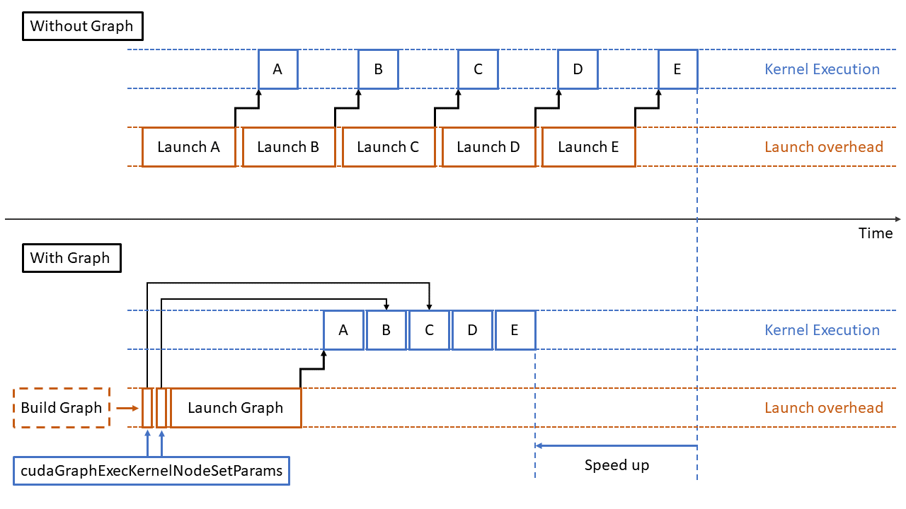

# 使用动态参数构建CUDA图



自从在 CUDA 10 以来，[CUDA Graphs](https://developer.nvidia.com/blog/cuda-graphs/) 已被用于各种应用程序。 上图将一组 CUDA 内核和其他 CUDA 操作组合在一起，并使用指定的依赖树执行它们。 它通过结合与 CUDA 内核启动和 CUDA API 调用相关的驱动程序活动来加快工作流程。 如果可能，它还通过硬件加速来强制依赖，而不是仅仅依赖 CUDA 流和事件。

构建 CUDA 图有两种主要方法：显式 API 调用和流捕获。


## 使用显式 API 调用构建 CUDA 图

通过这种构造 CUDA 图的方式，由 CUDA 内核和 CUDA 内存操作形成的图节点通过调用 `cudaGraphAdd*Node API` 被添加到图中，其中 * 替换为节点类型。 节点之间的依赖关系通过 API 显式设置。

使用显式 API 构建 CUDA 图的好处是 `cudaGraphAdd*Node API` 返回节点句柄 (`cudaGraphNode_t)`，可用作未来节点更新的参考。 例如，实例化图中内核节点的内核启动配置和内核函数参数可以使用 `cudaGraphExecKernelNodeSetParams` 以最低成本进行更新。

不利之处在于，在使用 CUDA 图来加速现有代码的场景中，使用显式 API 调用构建 CUDA 图通常需要进行大量代码更改，尤其是有关代码的控制流和函数调用结构的更改。

## 使用流捕获构建 CUDA 图

通过这种构造 CUDA 图的方式，`cudaStreamBeginCapture`和 `cudaStreamEndCapture` 被放置在代码块之前和之后。 代码块启动的所有设备活动都被记录、捕获并分组到 CUDA 图中。 节点之间的依赖关系是从流捕获区域内的 CUDA 流或事件 API 调用推断出来的。

使用流捕获构建 CUDA 图的好处是，对于现有代码，需要的代码更改更少。 原始代码结构大部分可以保持不变，并且以自动方式执行图形构建。

这种构建 CUDA 图的方式也有缺点。 在流捕获区域内，所有内核启动配置和内核函数参数，以及 CUDA API 调用参数均按值记录。 每当任何配置和参数发生变化时，捕获然后实例化的图就会过时。

[在动态环境中使用 CUDA 图](https://developer.nvidia.com/blog/employing-cuda-graphs-in-a-dynamic-environment/)一文中提供了两种解决方案：

* **重新捕获工作流**。当重新捕获的图与实例化图具有相同的节点拓扑时，不需要重新实例化，并且可以使用 `cudaGraphExecUpdate `执行全图更新。
* **以一组配置和参数为键值缓存 CUDA 图**。每组配置和参数都与缓存中不同的 CUDA 图相关联。在运行工作流时，首先将一组配置和参数抽象为一个键值。然后在缓存中找到相应的图（如果它已经存在）并启动。

但是，有些工作流程中的解决方案都不能很好地工作。重新捕获然后更新方法在纸面上效果很好，但在某些情况下重新捕获和更新本身很昂贵。在某些情况下，根本不可能将每组参数与 CUDA 图相关联。例如，具有浮点数参数的情况很难缓存，因为可能的浮点数数量巨大。

使用显式 API 构建的 CUDA 图很容易更新，但这种方法可能过于繁琐且不够灵活。 CUDA Graphs 可以通过流捕获灵活构建，但生成的图很难更新且成本高昂。


## 组合方法
在这篇文章中，我提供了一种使用显式 API 和流捕获方法构建 CUDA 图的方法，从而实现两者的优点并避免两者的缺点。

例如，在顺序启动三个内核的工作流中，前两个内核具有静态启动配置和参数，但最后一个内核具有动态启动配置和参数。

使用流捕获记录前两个内核的启动，并调用显式 API 将最后一个内核节点添加到捕获图中。 然后，显式 API 返回的节点句柄用于在每次启动图之前使用动态配置和参数更新实例化图。

下面的代码示例展示了这个想法：

```c++
cudaStream_t stream; 
std::vector<cudaGraphNode_t> _node_list; 
cudaGraphExec_t _graph_exec; 
if (not using_graph) { 
  first_static_kernel<<<1, 1, 0, stream>>>(static_parameters); 
  second_static_kernel<<<1, 1, 0, stream>>>(static_parameters); 
  dynamic_kernel<<<1, 1, 0, stream>>>(dynamic_parameters); 
} else { 
  if (capturing_graph) { 
    cudaStreamBeginCapture(stream, cudaStreamCaptureModeGlobal); 
    first_static_kernel<<<1, 1, 0, stream>>>(static_parameters); 
    second_static_kernel<<<1, 1, 0, stream>>>(static_parameters); 

    // Get the current stream capturing graph 

    cudaGraph_t _capturing_graph; 
    cudaStreamCaptureStatus _capture_status; 
    const cudaGraphNode_t *_deps; 
    size_t _dep_count; 
    cudaStreamGetCaptureInfo_v2(stream, &_capture_status, nullptr &_capturing_graph, &_deps, &_dep_count);  

    // Manually add a new kernel node 

    cudaGraphNode_t new_node; 
    cudakernelNodeParams _dynamic_params_cuda; 
    cudaGraphAddKernelNode(&new_node, _capturing_graph, _deps, _dep_count, &_dynamic_params_cuda); 

    // ... and store the new node for future references 

    _node_list.push_back(new_node);  

    // Update the stream dependencies 

    cudaStreamUpdateCaptureDependencies(stream, &new_node, 1, 1); 

    // End the capture and instantiate the graph 

    cudaGraph_t _captured_graph; 
    cudaStreamEndCapture(stream, &_captured_graph);
    cudaGraphInstantiate(&_graph_exec, _captured_graph, nullptr, nullptr, 0); 
  } else if (updating_graph) { 
    cudakernelNodeParams _dynamic_params_updated_cuda; 
    cudaGraphExecKernelNodeSetParams(_graph_exec, _node_list[0], &_dynamic_params_updated_cuda); 
  } 
} cudaStream_t stream;
std::vector<cudaGraphNode_t> _node_list;
cudaGraphExec_t _graph_exec;

if (not using_graph) {
  
  first_static_kernel<<<1, 1, 0, stream>>>(static_parameters);
  second_static_kernel<<<1, 1, 0, stream>>>(static_parameters);
  dynamic_kernel<<<1, 1, 0, stream>>>(dynamic_parameters);

} else {

  if (capturing_graph) {

    cudaStreamBeginCapture(stream, cudaStreamCaptureModeGlobal);

    first_static_kernel<<<1, 1, 0, stream>>>(static_parameters);
    second_static_kernel<<<1, 1, 0, stream>>>(static_parameters);

    // Get the current stream capturing graph
    cudaGraph_t _capturing_graph;
    cudaStreamCaptureStatus _capture_status;
    const cudaGraphNode_t *_deps;
    size_t _dep_count;
    cudaStreamGetCaptureInfo_v2(stream, &_capture_status, nullptr &_capturing_graph, &_deps, &_dep_count);

    // Manually add a new kernel node
    cudaGraphNode_t new_node;
    cudakernelNodeParams _dynamic_params_cuda;
    cudaGraphAddKernelNode(&new_node, _capturing_graph, _deps, _dep_count, &_dynamic_params_cuda);
    // ... and store the new node for future references
    _node_list.push_back(new_node);

    // Update the stream dependencies
    cudaStreamUpdateCaptureDependencies(stream, &new_node, 1, 1); 

    // End the capture and instantiate the graph
    cudaGraph_t _captured_graph;
    cudaStreamEndCapture(stream, &_captured_graph);

    cudaGraphInstantiate(&_graph_exec, _captured_graph, nullptr, nullptr, 0);

  } else if (updating_graph) {
    cudakernelNodeParams _dynamic_params_updated_cuda;
  
    cudaGraphExecKernelNodeSetParams(_graph_exec, _node_list[0], &_dynamic_params_updated_cuda);

  }
}
```
在此示例中，`cudaStreamGetCaptureInfo_v2` 提取当前正在记录和捕获的 CUDA 图。在调用 `cudaStreamUpdateCaptureDependencies` 以更新当前捕获流的依赖树之前，将内核节点添加到此图中，并返回存储节点句柄 (new_node)。最后一步是必要的，以确保随后捕获的任何其他活动在这些手动添加的节点上正确设置了它们的依赖关系。

使用这种方法，即使参数是动态的，也可以通过轻量级 `cudaGraphExecKernelNodeSetParams` 调用直接重用相同的实例化图（`cudaGraphExec_t `object）。这篇文章中的第一张图片显示了这种用法。

此外，捕获和更新代码路径可以组合成一段代码，位于启动最后两个内核的原始代码旁边。这会造成最少数量的代码更改，并且不会破坏原始控制流和函数调用结构。

新方法在 [hummingtree/cuda-graph-with-dynamic-parameters](https://github.com/hummingtree/cuda-graph-with-dynamic-parameters) 独立代码示例中有详细介绍。 `cudaStreamGetCaptureInfo_v2` 和 `cudaStreamUpdateCaptureDependencies` 是 CUDA 11.3 中引入的新 CUDA 运行时 API。


## 执行结果
使用 [hummingtree/cuda-graph-with-dynamic-parameters](https://github.com/hummingtree/cuda-graph-with-dynamic-parameters) 独立代码示例，我使用三种不同的方法测量了运行受内核启动开销约束的相同动态工作流的性能：

* 在没有 CUDA 图形加速的情况下运行
* 使用 recapture-then-update 方法运行 CUDA 图
* 使用本文介绍的组合方法运行 CUDA 图

表1显示了结果。 这篇文章中提到的方法的加速很大程度上取决于底层的工作流程。

|Approach	|Time	|Speedup over no graph|
|----|----|----|
|Combined	|433 ms	|1.63|
|Recapture-then-update|	580 ms	|1.22|
|No CUDA Graph|	706 ms	|1.00|


## 总结
在这篇文章中，我介绍了一种构建 CUDA 图的方法，该方法结合了显式 API 和流捕获方法。 它提供了一种以最低成本重用具有动态参数的工作流的实例化图的方法。

除了前面提到的 CUDA 技术帖子之外，CUDA 编程指南的 [CUDA Graph](https://docs.nvidia.com/cuda/cuda-c-programming-guide/index.html#cuda-graphs) 部分提供了对 CUDA Graphs 及其用法的全面介绍。 有关在各种应用程序中使用 CUDA Graphs 的有用提示，请参阅 [Nearly Effortless CUDA Graphs GTC session。](https://www.nvidia.com/en-us/on-demand/session/gtcfall21-a31421/)


