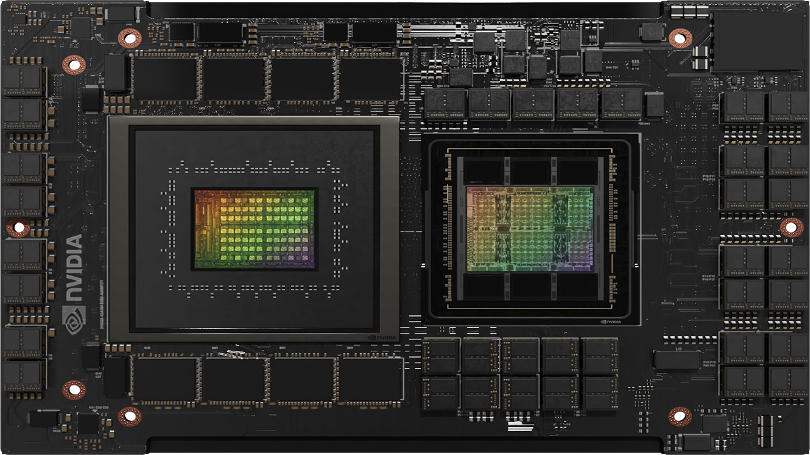
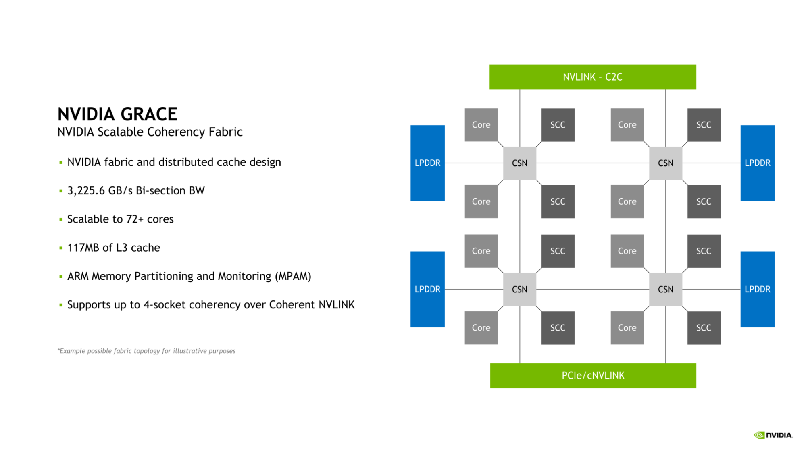
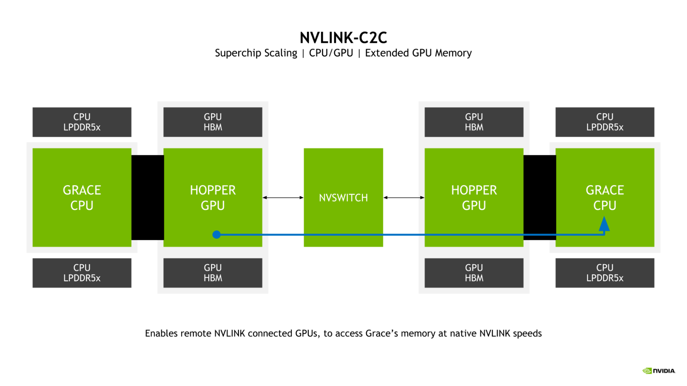
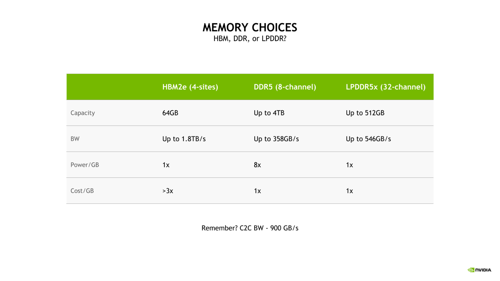
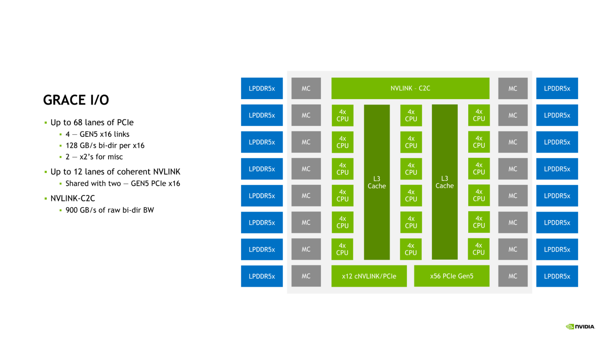

# NVIDIA Grace CPU：NVIDIA 为 HPC 和 AI 加强超级芯片工程

[NVIDIA Grace CPU](https://www.nvidia.com/en-us/data-center/grace-cpu/) 是 NVIDIA 开发的第一款数据中心 CPU。 它是从头开始建造的，旨在创造[世界上第一个超级芯片](https://nvidianews.nvidia.com/news/nvidia-introduces-grace-cpu-superchip)。

NVIDIA Grace CPU 旨在提供卓越的性能和能效，以满足现代数据中心工作负载的需求，这些工作负载为[数字孪生](https://www.nvidia.com/en-us/omniverse/solutions/digital-twins/)、云游戏和图形、人工智能和高性能计算 (HPC) 提供支持，具有 72 个 Armv9 CPU 内核，可实现 Arm Scalable Vector 扩展版本二 (SVE2) 指令集。 这些内核还包含具有嵌套虚拟化功能和 S-EL2 支持的虚拟化扩展。

NVIDIA Grace CPU 还符合以下 Arm 规范：

* RAS v1.1 通用中断控制器 (GIC) v4.1
* 内存分区和监控 (MPAM)
* 系统内存管理单元 (SMMU) v3.1

Grace CPU 可与 NVIDIA Hopper GPU 配对以创建 NVIDIA Grace CPU 超级芯片，用于大规模 AI 训练、推理和 HPC，或与另一个 Grace CPU 配对以构建高性能 CPU 以满足 HPC 和 云计算工作负载。

继续阅读以了解 Grace CPU 的主要功能。

## 采用 NVLink-C2C 的高速芯片到芯片互连
Grace Hopper 和 Grace Superchips 均由 NVIDIA [NVLink-C2C](https://www.nvidia.com/en-us/data-center/nvlink-c2c/) 高速芯片到芯片互连启用，该互连充当超级芯片通信的骨干。

NVLink-C2C 扩展了用于连接服务器中多个 GPU 的 [NVIDIA NVLink](https://www.nvidia.com/en-us/data-center/nvlink/)，并通过 NVLink 切换系统连接多个 GPU 节点。

NVLink-C2C 具有 `900 GB/s` 的原始双向带宽，是 `PCIe Gen 5 x16` 链路的 7 倍（与使用 NVLink 时 NVIDIA Hopper GPU 之间可用的带宽相同）并且延迟更低。 NVLink-C2C 也只需要传输 1.3 picojoules/bit，这是 PCIe Gen 5 能效的 5 倍以上。

NVLink-C2C 也是一种一致性互连，在使用 Grace CPU 超级芯片对标准一致性 CPU 平台进行编程时，以及使用 Grace Hopper 超级芯片对异构编程模型进行编程时，它都能实现一致性。

## 具有 NVIDIA Grace CPU 的符合标准的平台
NVIDIA Grace CPU Superchip 旨在为软件开发人员提供符合标准的平台。 Arm 提供了一组规范作为其 Arm SystemReady 计划的一部分，旨在为 Arm 生态系统带来标准化。

Grace CPU 以 Arm 系统标准为目标，以提供与现成操作系统和软件应用程序的兼容性，Grace CPU 将从一开始就利用 NVIDIA Arm 软件堆栈。

Grace CPU 还符合 Arm 服务器基础系统架构 (SBSA)，以支持符合标准的硬件和软件接口。此外，为了在基于 Grace CPU 的系统上启用标准引导流程，Grace CPU 旨在支持 Arm 服务器基本引导要求 (SBBR)。

对于缓存和带宽分区，以及带宽监控，Grace CPU 还支持 Arm Memory Partitioning and Monitoring (MPAM)。

Grace CPU 还包括 Arm 性能监控单元，允许对 CPU 内核以及片上系统 (SoC) 架构中的其他子系统进行性能监控。这使得标准工具（例如 Linux perf）能够用于性能调查。

## 采用 Grace Hopper 超级芯片的统一内存
NVIDIA Grace Hopper 超级芯片将 Grace CPU 与 Hopper GPU 相结合，对 CUDA 8.0 中首次引入的 CUDA 统一内存编程模型进行了扩展。

NVIDIA Grace Hopper Superchip 引入了具有共享页表的统一内存，允许 Grace CPU 和 Hopper GPU 与 CUDA 应用程序共享地址空间甚至页表。

Grace Hopper GPU 还可以访问可分页内存分配。 Grace Hopper Superchip 允许程序员使用系统分配器来分配 GPU 内存，包括与 GPU 交换指向 malloc 内存的指针的能力。

NVLink-C2C 实现了 Grace CPU 和 Hopper GPU 之间的原生原子支持，释放了 CUDA 10.2 中首次引入的 C++ 原子的全部潜力。

## NVIDIA 可扩展一致性结构
Grace CPU 引入了 NVIDIA Scalable Coherency Fabric (SCF)。 SCF 由 NVIDIA 设计，是一种网状结构和分布式缓存，旨在满足数据中心的需求。 SCF 提供 3.2 TB/s 的二等分带宽，以确保 NVLink-C2C、CPU 内核、内存和系统 IO 之间的数据流量流动。

单个 Grace CPU 包含 72 个 CPU 内核和 117MB 高速缓存，但 SCF 旨在实现超出此配置的可扩展性。 当两个 Grace CPU 组合形成一个 Grace Superchip 时，这些数字分别翻了一番，达到 144 个 CPU 内核和 234MB 的 L3 高速缓存。

CPU 内核和 SCF 缓存分区 (SCC) 分布在整个网格中。 高速缓存交换节点 (CSN) 通过结构路由数据，并充当 CPU 内核、高速缓存和系统其余部分之间的接口，从而实现高带宽。

## 内存分区和监控
Grace CPU 支持内存系统资源分区和监控 (MPAM) 功能，这是用于分区系统缓存和内存资源的 Arm 标准。

MPAM 通过将分区 ID (PARTID) 分配给系统内的请求者来工作。这种设计允许根据各自的 PARTID 对缓存容量和内存带宽等资源进行分区或监控。

Grace CPU 中的 SCF 缓存支持使用 MPAM 对缓存容量和内存带宽进行分区。此外，性能监视器组 (PMG) 可用于监视资源使用情况。

## 通过内存子系统提高带宽和能源效率
为了提供出色的带宽和能效，Grace CPU 实现了 32 通道 LPDDR5X 内存接口。这提供了高达 512 GB 的内存容量和高达 546 GB/s 的内存带宽。

## 扩展 GPU 内存
Grace Hopper 超级芯片的一个关键特性是引入了扩展 GPU 内存 (EGM)。通过允许从更大的 NVLink 网络连接的任何 Hopper GPU 访问连接到 Grace Hopper Superchip 中的 Grace CPU 的 LPDDR5X 内存，GPU 可用的内存池大大扩展。

GPU 到 GPU NVLink 和 NVLink-C2C 双向带宽在超级芯片中匹配，这使 Hopper GPU 能够以 NVLink 本机速度访问 Grace CPU 内存。

## 使用 LPDDR5X 平衡带宽和能效
为 Grace CPU 选择 LPDDR5X 的原因是需要在大规模 AI 和 HPC 工作负载中实现带宽、能效、容量和成本的最佳平衡。

虽然四站点 HBM2e 内存子系统可以提供大量内存带宽和良好的能源效率，但它的每 GB 成本是 DDR5 或 LPDDR5X 的 3 倍以上。

此外，这样的配置将被限制为仅 64 GB 的容量，这是配备 LPDDR5X 的 Grace CPU 可用最大容量的八分之一。

与更传统的 8 通道 DDR5 设计相比，Grace CPU LPDDR5X 内存子系统可提供高达 53% 的带宽，并且显着提高能效，每 GB 仅需要八分之一的功率。

LPDDR5X 出色的能效能够将更多的总功率预算分配给计算资源，例如 CPU 内核或 GPU 流式多处理器 (SM)。

NVIDIA Grace CPU I/O
Grace CPU 结合了高速 I/O 的补充，以满足现代数据中心的需求。 Grace CPU SoC 提供多达 68 个 PCIe 连接通道和多达四个 PCIe Gen 5 x16 链路。 每个 PCIe Gen 5 x16 链路提供高达 128 GB/s 的双向带宽，并且可以进一步分叉成两个 PCIe Gen 5 x8 链路以实现额外连接。

这种连接是对片上 NVLink-C2C 链路的补充，可用于将 Grace CPU 连接到另一个 Grace CPU 或 NVIDIA Hopper GPU。

NVLink、NVLink-C2C 和 PCIe Gen 5 的组合为 Grace CPU 提供了丰富的连接选项套件和扩展现代数据中心性能所需的充足带宽。

## NVIDIA Grace CPU 性能
NVIDIA Grace CPU 旨在在单芯片和 Grace Superchip 配置中提供出色的计算性能，估计 SPECrate2017_int_base 分数分别为 370 和 740。 这些硅前估计是基于对 GNU 编译器集合 (GCC) 的使用。

内存带宽对于 Grace CPU 设计的工作负载至关重要，在 Stream Benchmark 中，单个 Grace CPU 预计可提供高达 536 GB/s 的实际带宽，占芯片峰值理论带宽的 98% 以上 .

最后，Hopper GPU 和 Grace CPU 之间的带宽对于最大化 Grace Hopper Superchip 的性能至关重要。 GPU 到 CPU 的内存读取和写入预计分别为 429 GB/s 和 407 GB/s，分别代表 NVLink-C2C 峰值理论单向传输速率的 95% 和 90% 以上。

综合读写性能预计为 506 GB/s，占单个 NVIDIA Grace CPU SoC 可用的峰值理论内存带宽的 92% 以上。

## NVIDIA Grace CPU 超级芯片的优势
NVIDIA Grace CPU Superchip 拥有 144 个内核和 1TB/s 的内存带宽，将为基于 CPU 的高性能计算应用提供前所未有的性能。 HPC 应用程序是计算密集型应用程序，需要最高性能的内核、最高的内存带宽以及每个内核的正确内存容量以加快结果。

NVIDIA 正与领先的 HPC、超级计算、超大规模和云客户合作开发 Grace CPU Superchip。 Grace CPU Superchip 和 Grace Hopper Superchip 预计将于 2023 年上半年上市。

有关 NVIDIA Grace Hopper 超级芯片和 NVIDIA Grace CPU 超级芯片的更多信息，请访问 [NVIDIA Grace CPU](https://www.nvidia.com/en-us/data-center/grace-cpu/)。

