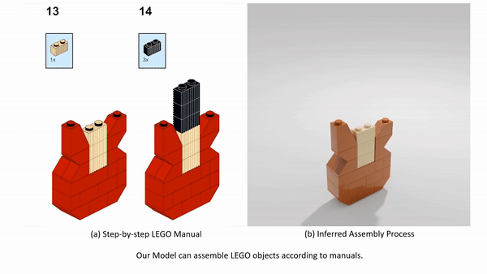
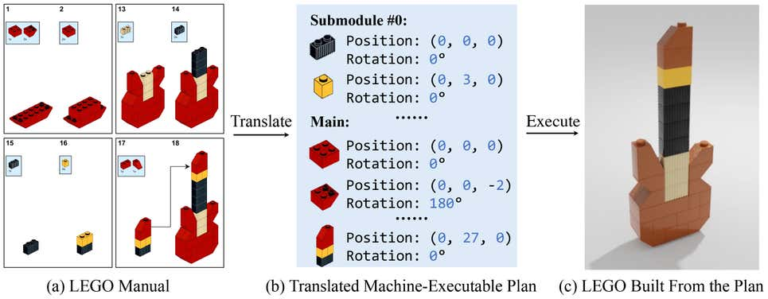

# 用计算机视觉和AI教机器阅读乐高手册

得益于斯坦福大学、麻省理工学院和欧特克的一项新研究，乐高爱好者在阅读组装说明时摸不着头脑，很快就能在复杂的构建中获得帮助。研究人员设计了一个深度学习框架，将 2D 手册翻译成机器可以理解的步骤来构建 3D 乐高套件。这项工作可以推进研究，重点是创造在组装物体时帮助人们的机器。

“乐高手册提供了一个独立的环境，体现了一项核心人类技能：在指导下学习完成任务。利用视觉场景解析和程序合成的最新进展，我们的目标是制造具有类似技能的机器，从乐高开始，最终瞄准现实世界的场景，”该研究的资深作者、斯坦福大学计算机科学助理教授吴家军说。

据研究人员称，使用人工智能翻译 2D 手册存在两个主要挑战。首先，AI 必须根据 2D 手动图像在每个装配步骤中学习和理解 3D 形状之间的对应关系。这包括考虑零件的方向和对齐方式。

它还必须能够对积木进行分类并在半组装模型中推断出它们的 3D 姿势。作为 LEGO 拼搭过程的一部分，小部件被组合成更大的部件，例如吉他的头部、颈部和琴身。组合在一起时，这些较大的部分将创建一个完整的项目。这增加了难度，因为机器必须解析出所有的乐高积木，即使是那些可能不可见的积木，例如乐高螺柱和反螺柱。

该团队致力于创建一个模型，该模型可以将 2D 手册转换为机器可执行计划以构建定义的对象。虽然目前有两种执行此任务的方法——基于搜索的和基于学习的——但都存在局限性。

基于搜索的方法寻找碎片和手动图像的可能 3D 姿势，寻找正确的姿势。该方法计算密集且缓慢，但精确。

基于学习的模型依靠神经网络来预测组件的 3D 姿势。它们速度很快，但没有那么准确，尤其是在使用看不见的 3D 形状时。

为了解决这一限制，研究人员开发了手动到可执行计划网络（[MEPNet](https://cs.stanford.edu/~rcwang/projects/lego_manual/)），根据该研究，该网络使用深度学习和[计算机视觉](https://developer.nvidia.com/computer-vision)来集成“神经 2D 关键点检测模块和 2D-​​3D 投影算法”。

​​处理一系列预测，在每一步，模型都会阅读手册，定位要添加的部分，并推断出 3D 定位。在模型预测每个部件和步骤的姿势后，它可以从头开始解析手册，创建机器人可以遵循的构建计划来构建 LEGO 对象。

“对于每个步骤，输入包括 1) 一组原始砖块和在之前步骤中构建的以 3D 表示的部件； 2) 显示组件应如何连接的目标 2D 图像。预期的输出是此步骤中涉及的所有组件的（相对）姿势，”研究人员在研究中写道。

他们从包含 72 种积木的 LEGO 套件创建了第一个合成训练数据，并使用了 LPub3D 的图像渲染，LPub3D 是一个开源应用程序，用于“创建 LEGO 风格的数字建筑说明”。

研究人员总共生成了 8,000 份培训手册，其中 10 套用于验证，20 套用于测试。每个数据集中大约有 200 个单独的步骤，约占训练中的 200,000 个单独的步骤。

他们在研究中写道：“我们在综合生成的数据集上训练 MEPNet，并对其进行全面监督，其中我们拥有地面实况关键点、掩码和旋转信息。” MEPNet 模型在四个由 NVIDIA Turing 架构提供支持的 NVIDIA TITAN RTX GPU 上训练了 5 天。

他们还在 Minecraft 房屋数据集上测试了该模型，该数据集的构建风格与 LEGO 相似。

将 MEPNet 与现有模型进行比较，研究人员发现它在现实世界的乐高积木、综合生成的手册和 Minecraft 示例中的表现优于其他模型。

MEPNet 在姿势估计方面更准确，即使是看不见的部分也能更好地识别构建。研究人员还发现，该模型能够将合成生成的手册中的知识应用于现实世界的乐高手册。

虽然还需要生产能够执行计划的机器人，但研究人员将这项工作设想为一个起点。

“我们的长期目标是制造可以帮助人类构建和组装复杂物体的机器。我们正在考虑将我们的方法扩展到其他装配领域，例如宜家家具，”主要作者、即将攻读博士学位的王若成说。斯坦福大学计算机科学专业的学生。

[lego_release](https://github.com/Relento/lego_release) 代码可在 GitHub 上找到。

