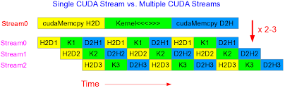
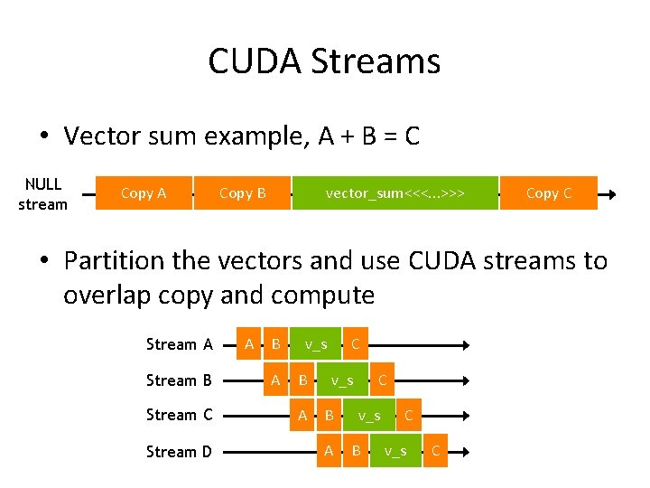

#! https://zhuanlan.zhihu.com/p/552049585
# 利用CUDA流重叠计算和数据传输

CUDA中有一个重要的概念是 **流(stream)**.  其实它代表着一系列的指令的执行队列.  这个执行队列就像他的名字一样, 有着固定的执行顺序(就像河流只能向一个方向固定的河道流淌一样).

而这条河的源头就是主机线程(host), 它开启了这个执行队列. 同样的, 也可能这座高山开启了不同的河流, 我们的主机线程(host)也可能启动了不同的执行队列. 或者多个主机线程(多座高山), 开启了多个stream(河流).

我更愿意理解流是更高一个层次的并行手段, 相对于thread, block 和 grid, 它的层级更高, 也更独立.

thread, block 和 grid其实都可以算作 kernel内的并行层次, 而流(stream)是kernel外的并行层次.

## 流(stream)分为**默认流(或者叫做NULL流)** 和 **非默认流**.

默认流指的是你不显示声明,创建或指定的操作队列. 在任何CUDA程序中只要是你调用了kernel或调用相关的CUDA函数, 并且没指定他们运行在哪个流中, 那么他们会自动的被安排在默认流中. 

或者你可以这么想, 当你开始CUDA程序的时候, 你调用的那些方法或函数就已经在默认流中了. 当你创建了新的流并把那些函数方法放在新的流中的时候, 他们才从默认流中解脱, 有了自己新的执行队列.

而你创建的那些新的流, stream0, stream1, stream2....就是非默认流.



## CUDA流最重要的功能就是并发执行

这里提到的并发执行简单点说就是, 将要计算的数据或要处理的资源分割成多个部分, 让每个流分别处理.

这个流的概念也是其他基于CUDA的加速库使用最多的CUDA内容. 比如cuBLAS, cuFFT, TensorRT, cuDNN中的句柄概念就可以和CUDA流结合使用, 并发处理.

接下来我们分析一下这段代码:
```C++
for (int i = 0; i < 2; ++i)
    cudaMemcpyAsync(inputDevPtr + i * size, hostPtr + i * size,
                    size, cudaMemcpyHostToDevice, stream[i]);

for (int i = 0; i < 2; ++i)
    MyKernel<<<100, 512, 0, stream[i]>>>
          (outputDevPtr + i * size, inputDevPtr + i * size, size);

for (int i = 0; i < 2; ++i)
    cudaMemcpyAsync(hostPtr + i * size, outputDevPtr + i * size,
                    size, cudaMemcpyDeviceToHost, stream[i]);
```

在这段代码中:
* 第一个for循环将数据从CPU内存传输给GPU显存中. 而传输的过程是将input分割成两部分. 分别放在`stream[i]`中进行传输.
* 在第二个for循环中, `MyKernel<<<100, 512, 0, stream[i]>>>`分别在`stream[i]`中执行.
* 第三个for循环分别在两个stream中讲计算完成的结果传输给CPU内存.

这里需要注意的是:
* 这里传输的函数使用的是`cudaMemcpyAsync`, 它是一个异步传输的函数. 简单点说, 可以同时进行多个传输任务, 他们之间并不是一起执行的.
* 我们在使用上述代码的时候, 需要手动的进行同步. 

我们需要让程序知道这些流(执行队列)是否已经完成, 而显式的同步流的方法有以下几种:
* cudaDeviceSynchronize() 一直等待，直到所有主机线程的所有流中的所有先前命令都完成。

* cudaStreamSynchronize() 将流作为参数并等待，直到给定流中的所有先前命令都已完成。 它可用于将主机与特定流同步，允许其他流继续在设备上执行。

* cudaStreamWaitEvent() 将流和事件作为参数（有关事件的描述，请参阅事件），并在调用 cudaStreamWaitEvent() 后使添加到给定流的所有命令延迟执行，直到给定事件完成。

* cudaStreamQuery() 为应用程序提供了一种方法来了解流中所有前面的命令是否已完成。

## 重叠计算
理解了上面的内容, 我们就可以简单的理解了重叠计算的内容.



如上图所示, 我们同时进行数据传输和数据计算. 那么我们就将数据传输的时间隐藏在数据计算的过程中, 或者将数计算的时间隐藏在数据传输的过程中.

如果主机线程在它们之间发出以下任一操作，则来自不同流的两个命令不能同时运行：

* 页面锁定的主机内存分配，
* 设备内存分配，
* 设备内存设置，
* 两个地址之间的内存拷贝到同一设备内存，
* 对 NULL 流的任何 CUDA 命令，
* 计算能力 3.x 和计算能力 7.x 中描述的 L1/共享内存配置之间的切换。

对于支持并发内核执行且计算能力为 3.0 或更低的设备，任何需要依赖项检查以查看流内核启动是否完成的操作：

* 仅当从 CUDA 上下文中的任何流启动的所有先前内核的所有线程块都已开始执行时，才能开始执行；
* 阻止所有以后从 CUDA 上下文中的任何流启动内核，直到检查内核启动完成。

需要依赖检查的操作包括与正在检查的启动相同的流中的任何其他命令以及对该流的任何 `cudaStreamQuery()` 调用。 因此，应用程序应遵循以下准则来提高并发内核执行的潜力：

* 所有独立操作都应该在依赖操作之前发出，
* 任何类型的同步都应该尽可能地延迟。


