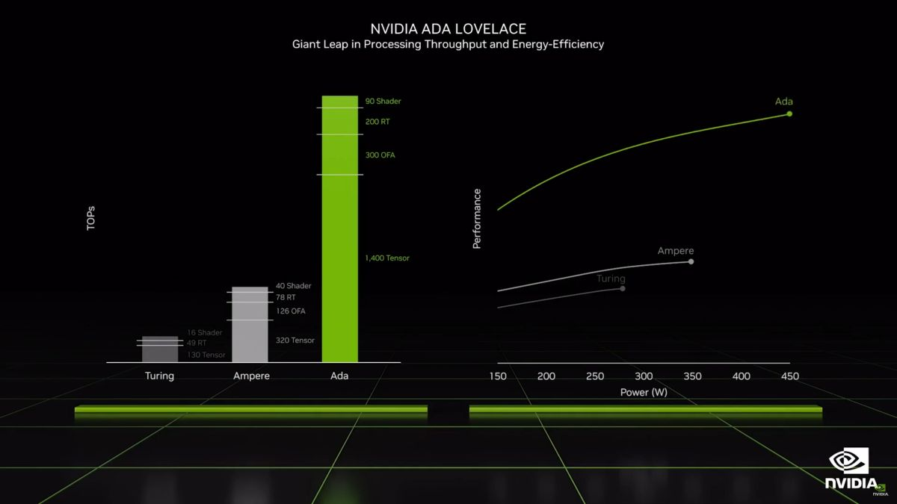

# 最新NVIDIA Ada Lovelace架构 和 RTX 40系列详解

Nvidia 的 Ada 架构和 GeForce RTX 40 系列显卡计划于 10 月 12 日开始到货，从 GeForce RTX 4090 和 RTX 4080 开始。这是 Nvidia Ampere 架构的两年后，考虑到放缓摩尔的“定律”，这是一个好消息，因为最好的显卡需要一些新的竞争。

我们知道 RTX 4090 何时发布。如果 Nvidia 遵循与过去类似的发布时间表，我们可以预期 RTX 40 系列的其余产品将在明年陆续推出。 RTX 4080 16GB 和 12GB 型号将于 11 月到货，但除此之外，情况有些模糊。 RTX 4070 可能会在 2023 年初上市，RTX 4060 和 4050 可能会在明年晚些时候上市。让我们从 Ada 系列 GPU 的规格和传闻规格的高级概述开始。

|Graphics Card	|RTX 4090	|RTX 4080 16GB|	RTX 4080 12GB|
|----|----|----|----|
|Architecture|	AD102	|AD103|	AD104	|A
|Process Technology|	TSMC 4N	|TSMC 4N|	TSMC 4N	|
|Transistors (Billion)	|76.3	|45.9	|35.8|	
|Die size (mm^2)|	608.4	|378.6	|294.5|	
|SMs / CUs / Xe-Cores|	128|	76	|60	|
|GPU Cores (Shaders)	|16384|	9728|	7680|	
|Tensor Cores|	512|	304|	240|	
|Ray Tracing "Cores"	|128	|76	|60	|
|Boost Clock (MHz)|	2520|	2505	|2610|	
|VRAM Speed (Gbps)|	21	|22.4	|21|	
|VRAM (GB)|	24	|16	|12|
|VRAM Bus Width|	384|	256|	192|	
|L2 Cache	|72|	64	|48	|
|ROPs	|176|	112|	80|
|TMUs|	512|	304	|240	|
|TFLOPS FP32 (Boost)	|82.6|	48.7|	40.1|	
|TFLOPS FP16 (FP8)|	661 (1321)|	390 (780)|	321 (641)|	
|Bandwidth (GBps)|	1008|	717|	504|	
|TDP (watts)	|450	|320	|285	|
|Launch Date	|Oct 2022|	Nov 2022|	Nov 2022|	
|Launch Price|	$1,599|	$1,199|	$899|	

他的前三张卡现在是官方的，规格完全准确。

当然，未来的 RTX 4090 Ti 顶部有足够的空间。请注意，最大二级缓存在 4090 上被削减（六个 12MB 块而不是六个 16MB 块），ROP 被削减了一点，Nvidia 肯定可以推高时钟和功率......和价格。 [叹气。]但是明年有更新时可能会出现。

我们确实知道 Nvidia 在 4090 和 4080 上的时钟速度达到了 2.5-2.6 GHz，我们预计 RTX 40 系列中的其他 GPU 上的时钟速度也类似。 Nvidia 还成功地将 RTX 4090 超频至 3.0GHz 及以上。我们暂时在未发布的 GPU 上估计了 2.6 GHz 的时钟速度。

英伟达还透露，发布的三款机型使用了三种不同的 GPU，这与之前的发布相比有很大的变化。 RTX 4090 使用显着缩减的 AD102 实现（89% 的内核，75% 的缓存）。 同时，RTX 4080 16GB 使用“几乎完整”的 AD103 芯片（95% 的内核和所有缓存），而 RTX 4080 12GB 使用完全启用的 AD104 芯片。 同样，我们可以期待每个 GPU 在某个时候收获或更完全启用的变体。

Nvidia 很可能会在所有 Ada GPU 上使用 TSMC 的 4N 工艺——“4nm Nvidia”，而且肯定会在 RTX 4090 和 4080 卡上使用。我们确定 AD102、AD103 和 AD104 以及 Hopper H100 都使用 TSMC 的 4N 节点，这是 TSMC 的 N5 节点的调整变体，已广泛用于其他芯片，也将用于 AMD 的 Zen 4 和 RDNA 3。我们不'认为三星不会有一个引人注目的替代方案，不需要对核心架构进行认真的重新设计，因此整个家族可能都在同一个节点上。

Nvidia 将在 AD102 GPU 上“做大”，它的尺寸和晶体管数量更接近 H100，而不是 GA102 接近 GA100。根据现有信息和一些剩余的谣言，Ada Lovelace 看起来是个怪物。它将包含比当前 Ampere GPU 更多的 SM 和相关内核，它将具有更高的 GPU 时钟，并且还将包含许多架构增强功能以​​进一步提高性能。 Nvidia 声称 RTX 4090 比即将推出的 RTX 3090 Ti 快 2 倍至 4 倍，但警告适用于这些基准。

Nvidia 的预览性能主要是 4K Ultra，这是需要牢记的。如果您当前运行的是更适中的处理器，而不是绝对最好的游戏 CPU 之一，即 Core i9-12900K 或 Ryzen 7 5800X3D，那么即使在 1440p 超分辨率下，您也很可能会受到 CPU 的限制。为了充分利用最快的 Ada GPU，可能需要进行更大的系统升级。

## ADA 将大幅提升计算性能

随着高级概述的结束，让我们进入细节。与当前 Ampere 相比，Ada GPU 最显着的变化将是 SM 的数量。AD102 包含的 SM 可能比 GA102 多 71%。即使体系结构没有其他任何重大变化，我们也希望这会带来性能的巨大提升。

这不仅适用于图形，也适用于其他元素。尽管 Tensor core现在支持 FP8（具有稀疏性）以可能使 FP16 性能翻倍，但大多数计算与 Ampere 并没有改变。 RTX 4090 在 FP16 中具有高达 661 teraflops 的深度学习/AI 计算能力，在 FP8 中具有高达 1,321 teraflops 的能力——完全启用的 AD102 芯片可以在类似的时钟下达到 1.4 petaflops。

相比之下，RTX 3090 Ti 中的完整 GA102 最高约为 321 TFLOPS FP16（同样，使用 Nvidia 的稀疏特性）。这意味着 RTX 4090 根据核心数量和时钟速度提供了 107% 的理论增长。相同的理论性能提升也适用于着色器和光线追踪硬件，除了这些也在发生变化。

GPU shader cores将具有新的shader执行重排序 (SER) 功能，Nvidia 声称该功能可将总体性能提高 25%，并且可以将光线追踪操作提高多达 200%。不幸的是，对 SER 的支持将要求开发人员使用专有的 Nvidia 扩展，因此现有游戏不一定会受益。

同时，RT 内核在射线/三角形相交硬件上加倍投入，此外它们还有更多可用的新技巧。不透明度微贴图 (OMM) 引擎可显着加快对树叶、粒子和栅栏等透明表面的光线追踪。另一方面，置换微网格 (DMM) 引擎优化了边界体积层次 (BVH) 结构的生成，Nvidia 声称它可以将 BVH 的创建速度提高 10 倍，同时将 BVH 存储使用的内存减少 20 倍 (5%) .同样，这些要求开发人员利用新功能。

总之，这些架构增强应该使 Ada Lovelace GPU 能够提供巨大的性能飞跃。除非由开发人员来启用它们中的大多数，因此吸收可能会相当减少。

## ADA LOVELACE ROPS

在某些情况下，Ada 的 ROP 数量会增加很多，尤其是顶级型号（目前）RTX 4090。与 Ampere 一样，Nvidia 将 ROP 与 GPC、图形处理集群联系起来，但其中一些仍然可以禁用。

AD102 有多达 144 个 SM，我们现在知道它使用 12 个 GPC，每个 GPC 有 12 个 SM。尽管 RTX 4090 上的最终数字是 11 个 GPC 和 176 个 ROP，但这最多产生 192 个 ROP。

RTX 4080 16GB 将有 7 个 GPC，就像 GA102 一样，但奇怪的是，其中两个 GPC 集群似乎只有 10 个 SM，而其他五个将有多达 12 个 SM。无论如何，所有七个都在 RTX 4080 16GB 上启用，它有 112 个 ROP。 RTX 4080 12GB 中的 AD104 使用 12 个 SM 的 5 个 GPC，具有 80 个 ROP。

暂且把剩下的三张牌作为最好的猜测。我们不确定将使用哪些 GPU，并且可能会在卡之间穿插其他型号（即 RTX 4060 Ti）。一旦其他 Ada GPU 接近发布，我们将在未来几个月内获得更多信息时填补空白。

## 内存系统：GDDR6X 再次运行

最近，美光宣布它拥有运行速度高达 24Gbps 的 GDDR6X 内存。最新的 RTX 3090 Ti 仅使用 21Gbps 内存，而 Nvidia 是目前唯一一家使用 GDDR6X 的公司。这立即引发了将使用 24Gbps GDDR6X 的问题，唯一合理的答案似乎是 Nvidia Ada。较低层的 GPU 更有可能坚持使用标准 GDDR6 而不是 GDDR6X，其最高速度为 18Gbps。

这代表了一个问题，因为 GPU 通常需要计算和带宽来按比例扩展以实现承诺的性能量。例如，RTX 3090 Ti 的计算量比 3090 多 12%，更高的时钟内存提供了 8% 的带宽。根据上面显示的计算细节，正在酝酿着巨大的脱节。 RTX 4090 的计算量大约是 RTX 3090 Ti 的两倍，但它提供相同的 1008 GB/s 带宽——最终的 RTX 4090 Ti 为 24Gbps，有人知道吗？

假设可以控制 GDDR6X 功耗，那么在较低层 GPU 上带宽增长的空间要大得多。当前的 RTX 3050 到 RTX 3070 都使用标准 GDDR6 内存，主频为 14-15Gbps。我们已经知道以 18Gbps 运行的 GDDR6 是可用的，因此具有 18Gbps GDDR6 的假设 RTX 4050 应该可以轻松跟上 GPU 计算能力的增长。如果 Nvidia 仍然需要更多带宽，它也可以将 GDDR6X 用于较低层的 GPU。

由于我们知道 RTX 4090 和 4080 卡的核心规格，我们只能得出结论，Nvidia 不需要大幅增加纯内存带宽，因为相反它将重新设计架构，类似于我们看到 AMD 对 RDNA 2 所做的比较到原始的 RDNA 架构。

## ADA  L2 缓存

一种减少对更多原始内存带宽需求的好方法是几十年来已知和使用的方法。在芯片上增加更多缓存，您会获得更多缓存命中，每次缓存命中意味着 GPU 不需要从 GDDR6/GDDR6X 内存中提取数据。大缓存对游戏性能特别有帮助。 AMD 的 Infinity Cache 允许 RDNA 2 芯片以更少的原始带宽完成更多工作，而 Nvidia Ada L2 缓存信息表明 Nvidia 采取了类似的方法。

AMD 在 Navi 21 GPU 上使用了高达 128MB 的大型 L3 缓存，Navi 22 为 96MB，Navi 23 为 32MB，Navi 24 仅为 16MB。令人惊讶的是，即使是较小的 16MB 缓存也能为内存子系统带来奇迹。我们并不认为 Radeon RX 6500 XT 总体上是一款出色的显卡，但它基本上可以赶上内存带宽几乎是两倍的显卡。

Ada 架构似乎将 8MB L2 缓存与每个 32 位内存控制器配对，或者每个 64 位控制器 16MB。这意味着具有 128 位内存接口的卡将获得 32MB 的总二级缓存，而 AD102 上的 384 位接口具有高达 96MB 的二级缓存。除此之外，还可以禁用部分二级缓存块，RTX 4090 只有 72MB 的二级缓存（12MB 的六个块而不是 16MB）。虽然在很多情况下这比 AMD 的 Infinity Cache 要小，但我们还不知道延迟或设计的其他方面。 L2 缓存的延迟往往低于 L3 缓存，因此稍小的 L2 肯定可以跟上更大但速度较慢的 L3 缓存，正如我们在 RDNA 2 GPU 中看到的那样，即使是 16MB 或 32MB 的无限缓存也有很大帮助。

如果我们以 AMD 的 RX 6700 XT 为例。与上一代 RX 5700 XT 相比，它的计算量增加了约 35%。与此同时，我们的 GPU 基准测试层次结构中的性能在 1440p 超分辨率下高出约 32%，因此整体性能与计算几乎一致。除此之外，6700 XT 拥有 192 位接口，带宽仅为 384 GB/s，比 RX 5700 XT 的 448 GB/s 低 14%。这意味着大型无限缓存使 AMD 的有效带宽至少提高了 50%。

假设 Nvidia 与 Ada 获得了类似的结果，而且情况似乎确实如此，即使没有更宽的内存接口，Ada GPU 仍然应该有足够的有效带宽。还值得一提的是，Nvidia 在过去架构中的内存压缩技术已被证明是有能力的，因此与 AMD 相比略小的缓存可能根本不重要。

## RTX 40 系列获得 DLSS 3

RTX 4090 和 4080 的重大公告之一是 DLSS 3 即将推出……它仅适用于 RTX 40 系列显卡。 DLSS 1 和 DLSS 2 在 RTX 20 和 30 系列卡上都可以工作，并且也可以在 Ada GPU 上工作，而 DLSS 3 从根本上改变了算法中的一些东西，显然需要新的架构更新。

DLSS 3 算法的输入与以前大致相同，但现在有一个新的光流加速器 (OFA)，它似乎采用先前的帧并生成额外的运动矢量，然后可以输入光学多帧生成单元。这听起来有点像 VR 时代的异步空间扭曲 (ASW)，除了现在它被用于放大以从单个源帧生成两个帧。当然它是用人工智能增强的，所以它绝对不是反潜战，但从高层次来看，肯定有一些相似之处。

我们将不得不看看它在行动中的样子，但这确实提供了一些诱人的性能提升。双倍帧率？由于正在进行额外的计算工作，可能没有那么多，但 Nvidia 确实展示了描绘 63 fps 的 DLSS 2 和 101 FPS 的 DLSS 3 的幻灯片，性能提高了 73%。

DLSS 3 将需要 RTX 40 系列卡才能运行，至少在启用帧生成的情况下。这将是用户可以选择启用的额外设置；没有它，听起来好像仍然会使用核心 DLSS 2 算法，这样开发人员就可以有效地支持 RTX 40 系列以及之前的 RTX 系列卡。 Nvidia 还花时间插入其 Streamline API，它允许游戏开发人员轻松支持 DLSS 2、DLSS 3、Intel XeSS，甚至可能是 AMD FSR 2.0（如果有人创建插件）。

## ADA 获得 AV1 编码

Nvidia 宣布 GeForce RTX 4090 和 GeForce RTX 4080 显卡将配备两个第八代 Nvidia Encoder (NVENC) 硬件单元。这些也将支持 AV1 编码。

据 Nvidia 称，AV1 编码将效率提高了 40%。这意味着任何支持编解码器的直播看起来都比当前的 H.264 流的比特率高 40%。当然，流媒体服务需要支持 AV1。

请注意，两个编码器可以在它们之间拆分工作，因此对于任何潜在的工作负载，编码性能都会有效地翻倍，即使 GPU 只编码单个流。视频编辑器可以从性能提升中受益，Nvidia 正在与 DaVinci Resolve、Voukoder 和 Jianying 合作以提供支持，预计将于 10 月推出。

GeForce Experience 和 ShadowPlay 也将使用新硬件，允许游戏玩家以 HDR 格式捕捉高达 8K 和 60 fps 的游戏画面。非常适合 0.01% 可以观看原生 8K 内容的人！ （如果你构建它，它们就会来......）此外，NVENC 单元仍然可以处理 H.264、HEVC 和其他格式。

## ADA 功耗

早期关于 Ada 的 600W 和更高 TBP（总板功率）的报道似乎大多没有根据，至少在已宣布的 Founders Edition 型号上是这样。 RTX 4090 与即将推出的 RTX 3090 Ti 具有相同的 450W TBP，而 RTX 4080 16GB 将其降至仅 320W，而 RTX 4080 12GB 具有 285W TBP。但是，这些是供参考的 Founders Edition 模型。

正如我们在 RTX 3090 Ti 和其他 Ampere GPU 中看到的那样，一些 AIB（附加板）合作伙伴非常乐意拥有更高的功耗来追求每一点的性能。高达 600W 的 RTX 4090 定制卡当然不是不可能的，未来的 RTX 4090 Ti 可能会推得更高。

这一切都可以追溯到丹纳德缩放的终结，以及摩尔定律的死亡。简而言之，，每一代，尺寸都可以缩小约 30%。这将总面积减少了 50%（长度和宽度都按比例缩放），电压下降了类似的 30%，电路延迟也将减少 30%。此外，频率将增加约 40%，总功耗将减少 50%。

如果这一切听起来好得令人难以置信，那是因为 Dennard 缩放在 2007 年左右有效地结束了。就像摩尔定律一样，它并没有完全失败，但收益变得不那么明显了。集成电路中的时钟速度仅从 2004 年 Pentium 4 Extreme Edition 的最高约 3.7GHz 增加到如今 Core i9-12900KS 的最高 5.5GHz。这仍然几乎增加了 50% 的频率，但它已经超过了六代（或更多，取决于您要如何计算）的流程节点改进。换句话说，如果 Dennard 缩放没有死，现代 CPU 的时钟频率将高达 28GHz。 RIP，丹纳德缩放，你会被想念的。

死亡的不仅仅是频率缩放，还有功率和电压缩放。如今，新的工艺节点可以提高晶体管密度，但需要平衡电压和频率。如果您想要一个速度快两倍的芯片，您可能需要使用几乎两倍的功率。或者，您可以构建更高效的芯片，但不会更快。 Nvidia 似乎在追求 Ada 的更高性能，尽管它并没有完全将效率问题抛诸脑后。

以 RTX 4080 12GB 为例。 Nvidia 至少暗示它将在性能上接近上一代 RTX 3090 Ti，同时减少 37% 的功耗。在某些情况下，例如 DLSS 3 和繁重的 RT 工作负载，它甚至可以在使用更少功率的同时将性能提高一倍。不过，我们将不得不看看这些卡片在各种游戏中是如何工作的。

