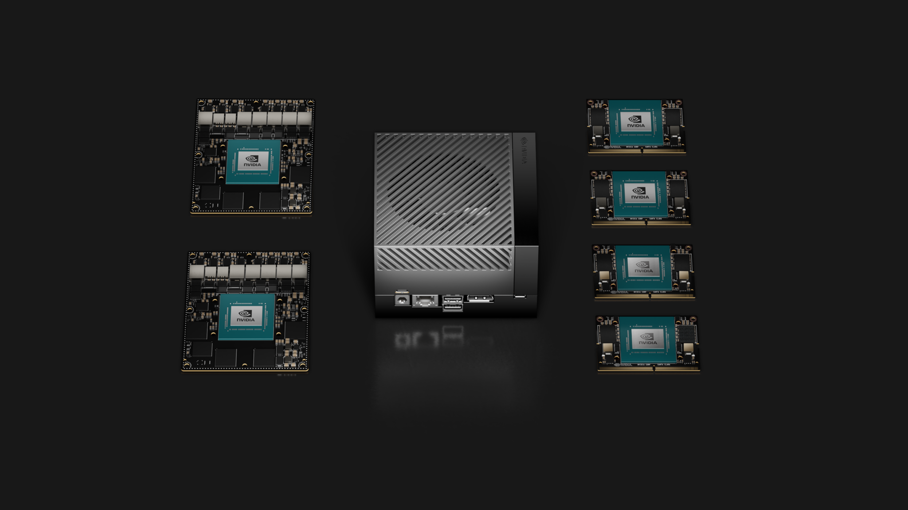
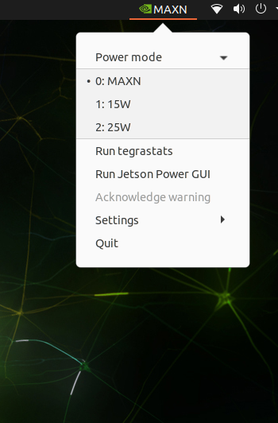
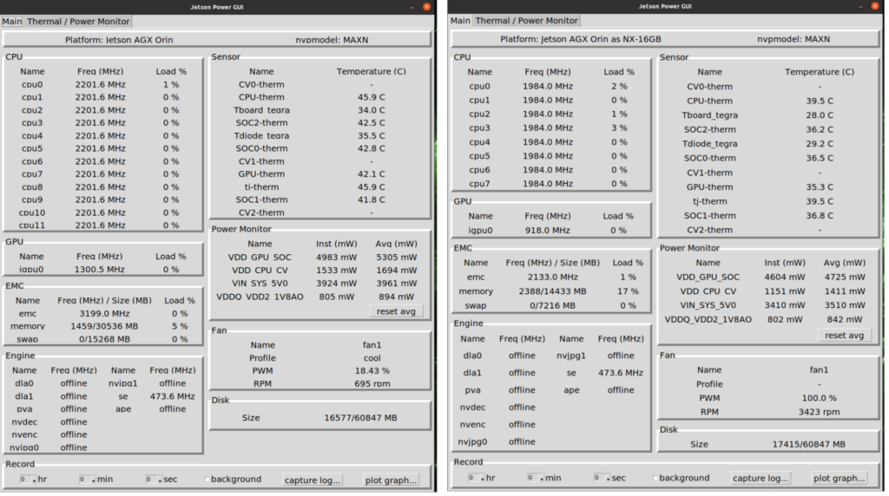
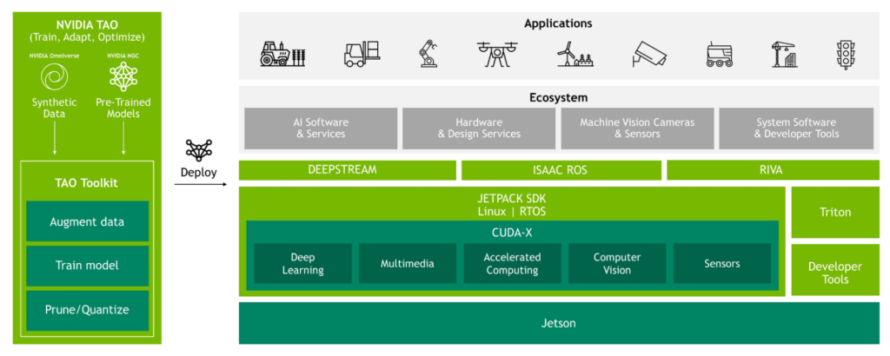

# 使用一个开发工具包的强大功能为所有六个NVIDIAJetsonOrin模块进行开发



随着本周在 GTC 上发布的 [Jetson Orin Nano](https://developer.nvidia.com/blog/solving-entry-level-edge-ai-challenges-with-nvidia-jetson-orin-nano/)，整个 Jetson Orin 模块阵容现已揭晓。凭借高达 40 TOPS 的 AI 性能，Orin Nano 模块为入门级 AI 设定了新标准，正如 Jetson AGX Orin 已经通过 275 TOPS 的服务器级计算重新定义机器人技术和其他自主边缘用例一样。

所有 Jetson Orin 模块和 Jetson AGX Orin 开发套件均基于单一 SoC 架构，配备 NVIDIA Ampere 架构 GPU、高性能 CPU 和最新加速器。这种共享架构意味着您可以为一个 Jetson Orin 模块开发软件，然后轻松将其部署到任何其他模块。

您现在可以使用 Jetson AGX Orin 开发工具包开始开发任何 Jetson Orin 模块。开发人员工具包能够本地模拟任何模块的性能，让您从现在开始并缩短上市时间。通过配置硬件特性和时钟以匹配目标模块的特性，开发者工具包可以准确地模拟任何 Jetson Orin 模块的性能。

开发团队受益于只需要一种类型的开发工具包的简单性，而不管哪些模块是针对生产的。这也简化了 CI/CD 基础架构。无论您是针对机器人、视频分析还是任何其他用例进行开发，这一开发工具包的功能都会带来许多好处。


## 将 Jetson AGX Orin 开发人员套件转换为任何 Jetson Orin 模块

只需一步，您就可以将 Jetson AGX Orin 开发人员套件转换为任何一个 Jetson Orin 模块。 我们为此过程提供了刷机的配置文件。

在 Jetson AGX Orin 开发工具包上模拟 Jetson Orin 模块，遵循与使用刷写实用程序[刷写 Jetson AGX Orin 开发工具包](https://docs.nvidia.com/jetson/archives/r35.1/DeveloperGuide/text/IN/QuickStart.html#to-flash-the-jetson-developer-kit-operating-software)中提到的相同步骤。 将您的开发工具包置于[强制恢复模式](https://developer.nvidia.com/embedded/learn/jetson-agx-orin-devkit-user-guide/howto.html#force-recovery-mode)后，使用 flash.sh 命令行工具使用新映像对其进行闪存。 例如，以下命令使用其默认配置刷新开发人员工具包：

```bash
$ sudo ./flash.sh jetson-agx-orin-devkit mmcblk0p1
```

您使用的确切命令应修改为适合您正在模拟的目标 Jetson Orin 模块的闪存配置名称。 例如，要模拟 Jetson Orin NX 16GB 模块，请使用以下命令：

```bash
$ sudo ./flash.sh jetson-agx-orin-devkit-as-nx-16gb mmcblk0p1
```

下表列出了 Jetson Orin 模块和适用于每个模块的 flash.sh 命令。

|Jetson Orin module to be emulated	|Flashing command|
|----|----|
|Jetson AGX Orin 64GB	|sudo ./flash.sh jetson-agx-orin-devkit mmcblk0p1|
|Jetson AGX Orin 32GB	|sudo ./flash.sh jetson-agx-orin-devkit-as-jao-32gb mmcblk0p|
|Jetson Orin NX 16GB	|sudo ./flash.sh jetson-agx-orin-devkit-as-nx16gb mmcblk0p1|
|Jetson Orin NX 8GB	|sudo ./flash.sh jetson-agx-orin-devkit-as-nx8gb mmcblk0p1|
|Jetson Orin Nano 8GB*	|sudo ./flash.sh jetson-agx-orin-devkit-as-nano8gb mmcblk0p1|
|Jetson Orin Nano 4GB	|sudo ./flash.sh jetson-agx-orin-devkit-as-nano4gb mmcblk0p1|


自 5.0.2 版起，Jetson Orin Nano 模块的闪存配置尚未包含在 NVIDIA JetPack 中。 [下载这些新配置](https://developer.nvidia.com/embedded/jetson-linux-r351)并按照下载文件中的说明在 NVIDIA JetPack 5.0.2 上应用覆盖补丁后使用这些新配置。

有关对仿真有用的闪存配置的更多信息，请参阅[仿真刷机配置](https://docs.nvidia.com/jetson/archives/r35.1/DeveloperGuide/text/SD/EmulationSupport.html)。

刷机完成后，完成初始启动和配置。 然后，您可以使用 SDK 管理器或简单地使用正在运行的开发工具包上的包管理器来安装其余的 NVIDIA JetPack 组件：

```bash
sudo apt update
sudo apt install nvidia-jetpack
```
现在您已运行开发工具包并安装了 NVIDIA JetPack。 您的 Jetson AGX Orin 开发人员套件现在可以模拟指定 Jetson Orin 模块的性能和功能。


## 准确模拟任何 Jetson Orin 模块
这种本机仿真是准确的，因为它将开发工具包配置为与目标模块可用的时钟频率、GPU 和 CPU 内核数量以及硬件加速器相匹配。

例如，在模拟 Jetson Orin NX 16GB 模块时：

* 开发人员套件 GPU 配置有 1024 个 CUDA 内核和 32 个 Tensor 内核，最大频率为 918 MHz。
* CPU 配置有八个运行频率为 2 GHz 的 Arm Cortex-A78AE 内核。
* DRAM 配置为 16 GB，带宽为 102 GB/s。
* 该系统提供与 Jetson Orin NX 16GB 模块支持的相同电源配置文件。



从桌面顶部菜单打开 Jetson Power 图形用户界面，您会看到系统已根据正在模拟的目标模块进行了准确的配置。 可以通过运行以下命令来配置最大时钟，Jetson Power 图形用户界面将显示更改。

```bash
sudo jetson_clocks
```

下图显示了配置最大时钟后的 Jetson Power 图形用户界面，当 Jetson AGX Orin 开发人员套件刷入仿真 Jetson AGX Orin 64GB 模块时，与刷入仿真 Jetson Orin NX 16GB 模块时的比较。




通过运行 NVIDIA JetPack 提供的各种示例，您可以看到性能已调整为与正在模拟的模块相匹配。 例如，在配置 Jetson AGX Orin Developer Kit 进行仿真后，与 VPI 库一起打包的基准测试示例可用于显示 Jetson AGX Orin 64GB、Jetson Orin NX 16GB 和 Jetson Orin Nano 8GB 模块的 CPU、GPU 和 PVA 性能 相应的模块。

要运行 VPI 基准测试示例，请使用以下命令：

```bash
cd /opt/nvidia/vpi2/samples/05-benchmark
sudo cmake .
sudo make
sudo ./vpi_sample_05_benchmark <cpu/cuda/pva>
```
VPI 基准测试示例以毫秒为单位输出高斯算法的延迟。下表显示了每个目标模块的结果。

|Algorithm: 5X5
Gaussian Filter Input Image Size: 1920 X 1080
Input Format: U16|	Emulated as Jetson AGX Orin 64GB|	Emulated as Jetson Orin NX 16GB|	Emulated as Jetson Orin Nano 8GB|
|----|----|----|----|
|Running on CPU|	0.331	|0.492|	0.838|
|Running on GPU|	0.065	|0.143|	0.210|
|Running on PVA	|1.169	|1.888|	–|

同样，您可以运行多媒体样本进行编码和解码。

对于解码，运行以下命令：

```c++
cd /usr/src/jetson_multimedia_api/samples/00_video_decode
sudo make
sudo ./video_decode H264 --disable-rendering --stats --max-perf <input file>
```

对于编码，运行以下命令：

```bash
cd /usr/src/jetson_multimedia_api/samples/01_video_encode
sudo make
sudo ./video_encode input.yuv 1920 1080 H264 out.h264 -fps 30 1 -ifi 1000 -idri 1000 --max-perf --stats
```
下表 报告了使用 H.264 1080P 30FPS 视频流运行这些编码和解码样本后的 FPS 数。

|Encode/Decoder Sample|	Emulated as Jetson AGX Orin 64GB	|Emulated as Jetson Orin NX 16GB|	Emulated as Jetson Orin Nano 8GB|
|----|----|----|----|
|Encode	|178|	142	|110*|
|Decode|	400	|374|	231|

为了证明模拟的准确性，我们在模拟为 Jetson AGX Orin 32GB 的 Jetson AGX Orin 开发人员套件上运行了一些 AI 模型基准测试。 然后，我们将其与在真实 Jetson AGX Orin 32GB 模块上运行相同基准测试获得的结果进行比较。 从结果中可以看出，仿真性能和真实性能之间的差异微不足道。

尽管 Jetson AGX Orin 开发人员套件包含一个 32GB 模块，但它提供了相同水平的性能，并配备了与 Jetson AGX Orin 64GB 匹配的 275 TOPS。 模拟 Jetson AGX Orin 64 GB 不需要特殊的闪存配置，但您必须使用适当的闪存配置在 Jetson AGX Orin 开发人员套件上模拟 Jetson AGX Orin 32GB。


|Model	|Jetson AGX Orin 32GB Emulated|	Jetson AGX Orin 32GB Real|
|----|----|----|
|PeopleNet (V2.5)|	327	|320|
|Action Recognition 2D|	1161	|1151|
|Action Recognition 3D|	70	|71|
|LPR Net|	2776|	2724|
|Dashcam Net	|1321|	1303|
|BodyPose Net	|359	|363|


## 对任何 Jetson Orin 模块进行端到端开发

您可以在模拟 Jetson Orin 模块的同时使用整个 Jetson 软件堆栈。 NVIDIA DeepStream、NVIDIA Isaac 和 NVIDIA Riva 等框架在仿真模式下工作，而 TAO Toolkit 等工具在来自 NGC 的预训练模型上表现如预期。 软件堆栈与仿真无关，性能与被仿真目标的性能精确匹配。



如果您正在开发机器人用例或开发视觉 AI 流程，您现在可以使用 Jetson AGX Orin 开发人员套件和仿真模式对任何 Jetson Orin 模块进行端到端开发。

使用 NVIDIA Isaac ROS 为任何 Jetson Orin 模块开发机器人应用程序。 只需使用正确的刷机配置来刷机并开始您的 ROS 开发。 下图显示了在模拟为 Jetson Orin Nano 8GB 的 Jetson AGX Orin 开发人员套件上运行 [Isaac ROS Stereo Disparity DNN](https://github.com/NVIDIA-ISAAC-ROS/isaac_ros_dnn_stereo_disparity)。


使用 Jetson AGX Orin 开发工具包上的 DeepStream 为任何 Jetson Orin 模块开发视觉 AI 流程。 它只是工作！

下图显示了在 Jetson AGX Orin 开发人员套件上使用 DeepStream 运行人员检测的 IVA 流程，该套件模拟为 Jetson Orin Nano 8GB，具有四个 H.265 1080P 30FPS 流。


