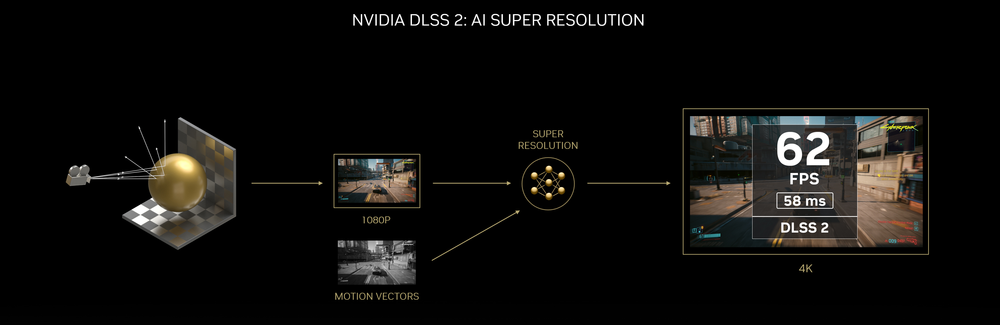
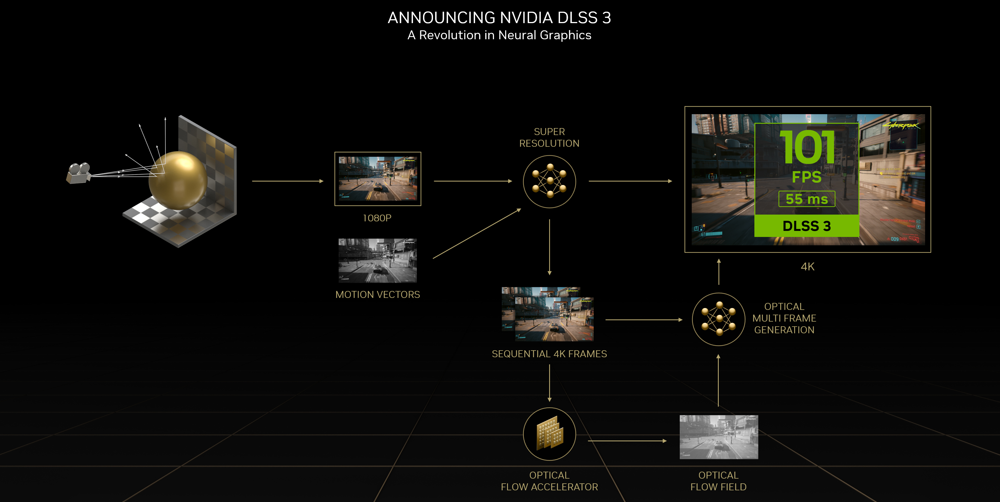
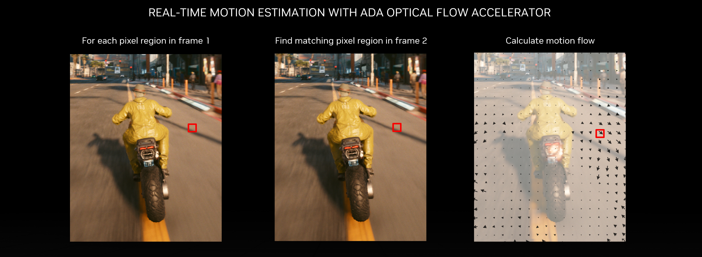
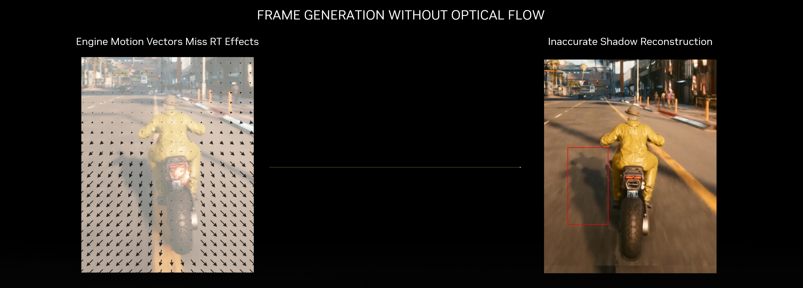
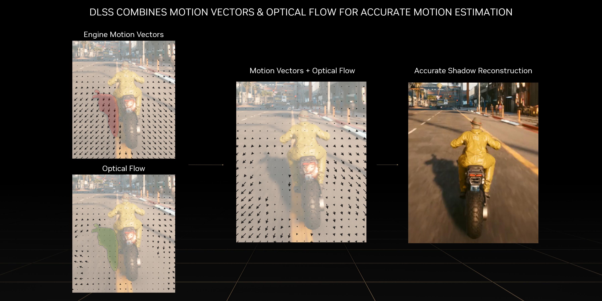
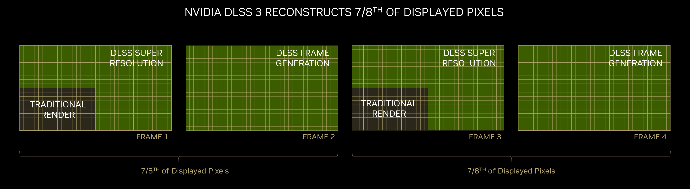
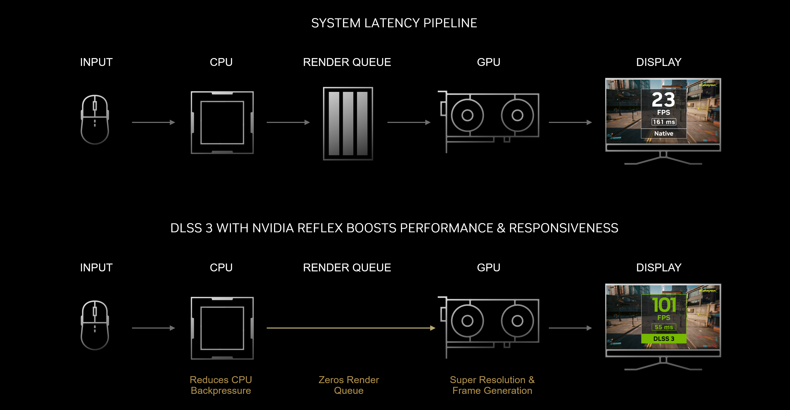
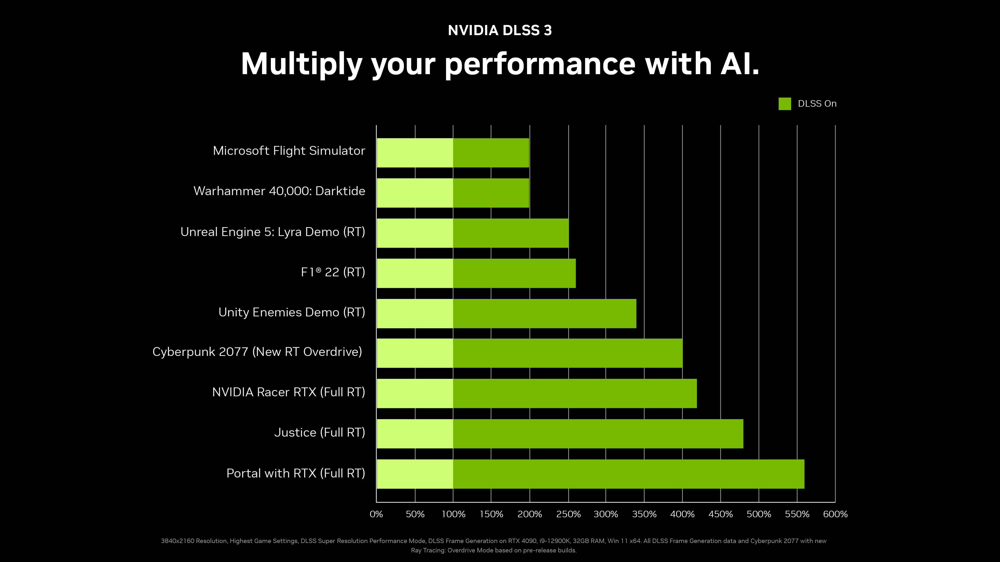
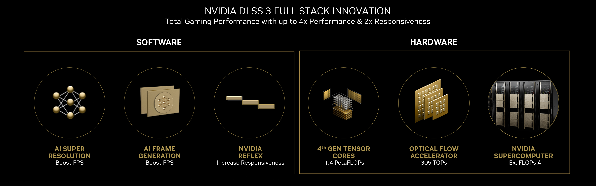
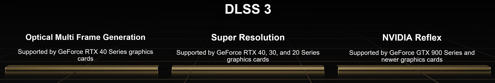

# 92.NVIDIA DLSS 3: AI 驱动的性能倍增器将帧速率提升高达 4 倍

NVIDIA DLSS 通过在 GeForce RTX GPU 上使用 AI 超分辨率和 Tensor Core 来提高帧速率，同时提供可与原生分辨率相媲美的清晰、高质量的图像，从而彻底改变了图形。 自 DLSS 发布以来，已有 216 款游戏和应用程序采用了该技术，提供更快的帧速率和性能空间，使实时视频游戏光线追踪成为现实。

今天，NVIDIA宣布 NVIDIA DLSS 3，这是神经图形学的下一次革命。 结合 DLSS 超分辨率、全新的 DLSS 帧生成和 NVIDIA Reflex，在 GeForce RTX 40 系列 GPU 的新硬件功能上运行，DLSS 3 将性能比暴力渲染提高了 4 倍。 DLSS 3 已被生态系统迅速采用，[超过 35 款游戏和应用程序](https://www.nvidia.com/en-us/geforce/news/dlss3-supports-over-35-games-apps/)集成了该技术，其中第一款于 10 月推出。

## NVIDIA DLSS 的演变
当我们首次推出 NVIDIA DLSS 时，我们着手通过基于 AI 的超分辨率重新定义实时渲染——渲染更少的像素，然后使用 AI 构建清晰、更高分辨率的图像。 不到两年后，我们向全世界介绍了 NVIDIA DLSS 2，它通过无需特定训练即可适应所有游戏和场景的通用神经网络进一步提高了图像质量和性能。 DLSS 2 现在在 216 款游戏和应用程序中得到广泛采用，同时还支持 Unity 和 Unreal Engine。 DLSS 2 通过对 NVIDIA 的 AI 超级计算机的持续培训不断改进，迄今为止发布了 4 个重大更新，进一步提升了图像质量。

## 介绍 NVIDIA DLSS 3 - 神经图形学的一场革命
DLSS 3 是 AI 驱动图形的革命性突破，可大幅提升性能，同时保持出色的图像质量和响应能力。 在 DLSS 超分辨率的基础上，DLSS 3 添加了光学多帧生成以生成全新的帧，并集成了 NVIDIA Reflex 低延迟技术以实现最佳响应。 DLSS 3 由新的第四代张量核心和 NVIDIA Ada Lovelace 架构的光流加速器提供支持，该架构为 GeForce RTX 40 系列显卡提供支持。

DLSS 帧生成卷积自动编码器需要 4 个输入——当前和之前的游戏帧、由 Ada 的光流加速器生成的光流场，以及运动矢量和深度等游戏引擎数据。

Ada 的光流加速器分析两个连续的游戏内帧并计算光流场。 光流场捕捉像素从第 1 帧移动到第 2 帧的方向和速度。光流加速器能够捕捉粒子、反射、阴影和光照等像素级信息，这些信息不包含在游戏中 发动机运动矢量计算。 在下面的摩托车示例中，摩托车手的运动流准确地表示阴影在屏幕上与他们的自行车大致相同的位置。

光流加速器可以准确跟踪反射等像素级效果，而 DLSS 3 还使用游戏引擎运动矢量来精确跟踪场景中几何体的运动。 在下面的示例中，游戏运动矢量准确地跟踪经过摩托车手的道路的运动，而不是他们的影子。 仅使用引擎运动矢量生成帧会导致视觉异常，例如阴影上的卡顿。

对于每个像素，DLSS 帧生成 AI 网络决定如何使用来自游戏运动矢量、光流场和连续游戏帧的信息来创建中间帧。 通过使用引擎运动矢量和光流来跟踪运动，DLSS 帧生成网络能够准确地重建几何和效果，如下图所示。

启用 DLSS 3 后，AI 将使用 DLSS 超分辨率重建第一帧的四分之三，并使用 DLSS 帧生成重建整个第二帧。 总的来说，DLSS 3 重建了总显示像素的八分之七，显着提高了性能！

DLSS 3 还集成了 [NVIDIA Reflex](https://www.nvidia.com/en-us/geforce/technologies/reflex/)，可同步 GPU 和 CPU，确保最佳响应能力和低系统延迟。 较低的系统延迟使游戏控制响应更快，并确保在您单击鼠标或其他控制输入后几乎立即发生屏幕上的操作。 与原生相比，DLSS 3 可以将延迟减少多达 2 倍。

在[赛博朋克 2077 的新光线追踪：过载模式](https://www.nvidia.com/en-us/geforce/news/dlss3-supports-over-35-games-apps/#cyberpunk-2077)的预发布版本中，DLSS 3 支持 DLSS 超分辨率、DLSS 帧生成和 NVIDIA Reflex，与原始分辨率相比，性能提升高达 4 倍，响应速度提高 2 倍，所有 同时保持出色的图像质量。

## NVIDIA DLSS 3 可以使 CPU 绑定性能翻倍
DLSS 帧生成作为 GPU 上的后处理执行，即使在游戏遇到 CPU 瓶颈时，AI 网络也能提高帧速率。 对于 CPU 受限的游戏，例如那些需要大量物理或涉及大型世界的游戏，DLSS 3 允许 GeForce RTX 40 系列显卡以 CPU 能够计算的帧速率高达两倍的帧速率进行渲染。 例如，在 Microsoft Flight Simulator 中，通过 1:1 对我们星球的真实世界娱乐，DLSS 3 将 FPS 提高了 2 倍。

## NVIDIA DLSS 3 将性能提升高达 4 倍
与传统渲染相比，DLSS 3 在一系列游戏和引擎中有助于将 GeForce RTX 40 系列的性能提高多达 4 倍：

DLSS 3 提供全面的游戏性能、先进的 AI 网络和 Reflex 软件算法、专用的 Tensor Core 和光流硬件，以及持续训练和改进 AI 网络的 NVIDIA 超级计算机。 GeForce RTX 40 系列用户获得更快的帧速率、快速响应和出色的图像质量，这只有通过全栈创新才能实现。

## NVIDIA DLSS 3：今年 10 月上市
光线追踪和 AI 技术的结合使视频游戏发生了革命性的变化，同时显着提高了图像质量，同时大幅提升了性能，这是在 RTX 和 DLSS 发明之前闻所未闻的壮举。

DLSS 3 以我们在游戏 AI 领域的开创性工作为基础，将性能提升高达 4 倍，使完整的光线追踪游戏成为现实，并使游戏玩家能够享受完全模拟的世界，正如 NVIDIA Racer RTX 所展示的那样。

DLSS 3 已经获得了许多世界领先的游戏开发商和引擎的支持，超过 35 款游戏和应用程序宣布支持，其中第一款于 10 月推出。

DLSS 3 游戏向后兼容 DLSS 2 技术。 GeForce RTX 40 系列 GPU 支持 DLSS 3 技术。 它包括 3 个功能：我们的新帧生成技术、超分辨率（DLSS 2 的关键创新）和反射。 开发者只需集成 DLSS 3，默认支持 DLSS 2。 NVIDIA 继续通过研究和训练用于 DLSS 超分辨率的 AI 来改进 DLSS 2，并将为所有 GeForce RTX 游戏玩家提供模型更新，正如我们自 DLSS 最初发布以来一直在做的那样。

与 NVIDIA Ada Lovelace 架构的其他奇迹一起，DLSS 3 可提供下一代性能。 在 [GeForce.com](https://www.nvidia.com/en-us/geforce/news/) 上获取有关 GeForce RTX 40 系列显卡、新 Ada 技术以及采用这些技术的游戏的更多详细信息。

