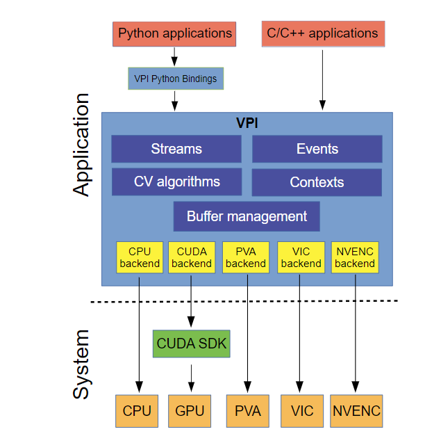
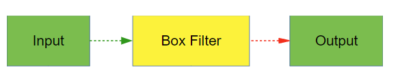
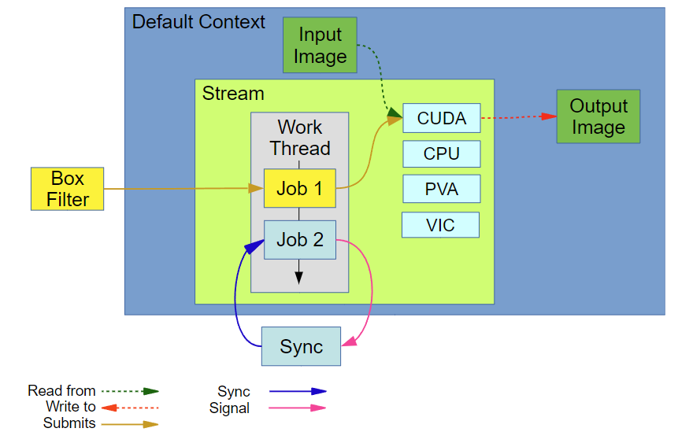
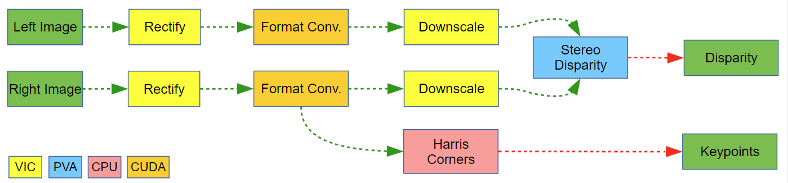
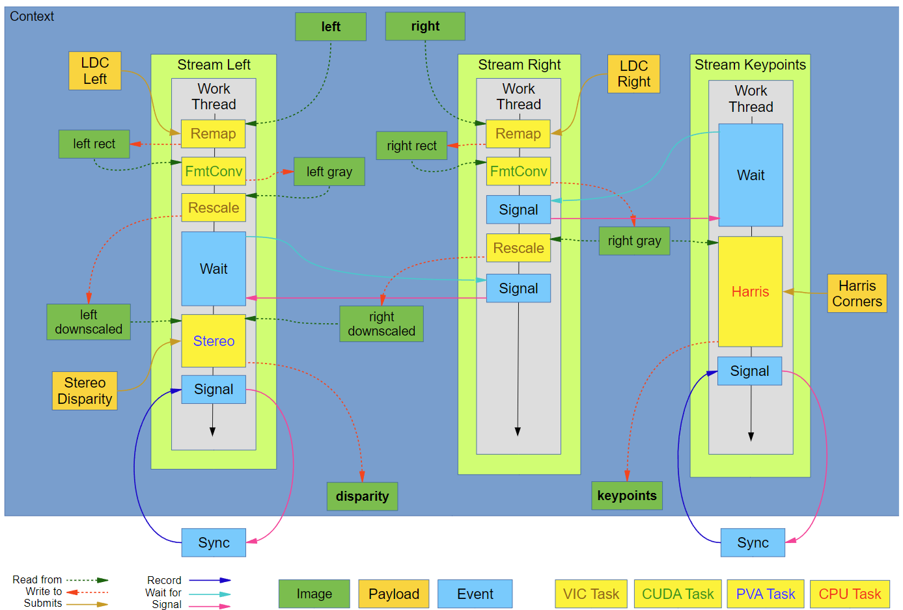

# VPI 架构解析

## 概述
VPI 是一个软件库，提供了一系列计算机视觉和图像处理算法，可以在各种硬件加速器中无缝执行。 这些加速器称为后端。

VPI 的目标是为计算后端提供统一的接口，同时保持高性能。 它通过暴露底层硬件及其操作的数据的薄而有效的软件抽象来实现这一点。

此图说明了 VPI 的体系结构：



API 遵循在初始化阶段进行对象分配和设置的范例。 以下是应用程序循环，主要处理发生在其中，使用在初始化期间创建的对象。 主处理完成后，销毁创建的对象并清理环境。 在资源受限的嵌入式环境中，内存分配在时间和空间上都受到限制，VPI 提供的对内存分配和生命周期的控制是有益的。

VPI的核心组件包括

* [算法](https://docs.nvidia.com/vpi/architecture.html#arch_algorithm)：表示不可分割的计算操作。
* [后端](https://docs.nvidia.com/vpi/architecture.html#arch_backend)：代表负责实际计算的硬件引擎。
* [流](https://docs.nvidia.com/vpi/architecture.html#arch_stream)：充当向其提交算法的异步队列，最终在给定的后端按顺序执行。 流和事件是计算流程的构建块。
* [缓冲区](https://docs.nvidia.com/vpi/architecture.html#arch_buffer)：存储输入和输出数据。
* [事件](https://docs.nvidia.com/vpi/architecture.html#arch_event)：提供对流和/或应用程序线程进行操作的同步原语。
* [上下文](https://docs.nvidia.com/vpi/architecture.html#arch_context)：保存 VPI 和已创建对象的状态。


## 支持的平台
VPI 可用于以下平台/设备：

* Jetson AGX Xavier、Jetson AGX Xavier NX
* Jetson AGX Orin
* Linux x86_64 和 NVIDIA dGPU 从 Maxwell（sm_50 或更高版本）开始。
  * 用 Ubuntu 18.04 和 Ubuntu 20.04 测试

## 算法
算法代表实际的计算操作。 它们作用于一个或多个输入缓冲区并将其结果写入用户提供的输出缓冲区。 它们相对于应用程序线程异步运行。 有关受支持算法的列表，请参阅算法部分。

有两类算法：

* 需要有效负载的算法。
* 无负载算法。

### 算法负载
某些算法实现，例如 [FFT](https://docs.nvidia.com/vpi/algo_fft.html) 或 [KLT Feature Tracker](https://docs.nvidia.com/vpi/algo_klt_tracker.html)，需要临时资源才能正常运行。 这些资源由与算法关联的 VPIPayload 对象封装。

在执行算法之前，您必须在初始化时创建相应的有效负载，传递用于分配临时资源和指定可以执行算法的后端的参数。 在执行计算的主循环中，您将算法实例提交给流执行，提供相应的有效负载以及输入和输出参数。 您可以在多个算法实例中重用负载，但您必须确保负载一次仅由一个实例使用。

当不再需要有效负载时，您必须通过调用 [vpiPayloadDestroy](https://docs.nvidia.com/vpi/group__VPI__Payload.html#ga7a526f0e63ecc3a90ce5fc356535e825) 将其销毁。 此函数释放封装在有效负载中的所有资源。

例子：
* 供 CUDA 后端使用的 FFT 有效负载创建，仅执行一次。
```c++
    VPIPayload fft;
    vpiCreateFFT(VPI_BACKEND_CUDA, width, height, VPI_IMAGE_FORMAT_F32, VPI_IMAGE_FORMAT_2F32, &fft);
```

* FFT 算法提交到流，根据需要多次调用，可能具有不同的输入和输出。

```c++
    vpiSubmitFFT(stream, VPI_BACKEND_CUDA, fft, inputF32, spectrum, 0);
```

* 有效负载销毁，在处理完成且不再需要有效负载时进行。

```c++
    vpiPayloadDestroy(fft);
```

### 无负载算法
一些算法不需要临时资源。 此类算法包括 [Box Filter](https://docs.nvidia.com/vpi/algo_box_filter.html) 和 [Rescale](https://docs.nvidia.com/vpi/algo_rescale.html) 等。 对于这些算法，无需处理有效负载，并且简化了操作顺序。 在算法提交期间发送所有必需的数据。

例子：

* Box filter算法提交到 CUDA 后端，可根据需要多次调用。
```c++
    vpiSubmitBoxFilter(stream, VPI_BACKEND_CUDA, input, output, 5, 5, VPI_BORDER_ZERO);
```

## 后端
VPI 支持的每种算法都在一个或多个后端实现。 当给定相同的输入时，相同算法的不同实现会返回相似的结果，但它们的结果之间可能会发生微小的变化。 这主要是由于针对特定后端量身定制的优化，例如使用定点而不是浮点运算。

### CPU
此后端代表设备的 CPU。 它可以创建一组后台工作线程和数据结构，支持跨多个内核的高效并行执行。 这些工作线程可能在不同的流和/或上下文实例之间共享。

VPI 提供的机制允许您通过使用 [VPIParallelForCallback](https://docs.nvidia.com/vpi/group__VPI__Context.html#gaf3d91319451f2393a000c1a3f7f98ec3) 函数调用 [vpiContextSetParallelFor](https://docs.nvidia.com/vpi/group__VPI__Context.html#ga157e83397a3fea2ea559b614a9c5c5d4) 来定义自己的 CPU 任务调度方案，当 CPU 任务需要执行时，VPI 将调用该函数。

### CUDA
CUDA 后端与特定的支持 CUDA 的 GPU 具有显式关联，在构建流期间定义。这意味着提交在此流上执行的算法由此 GPU 处理。

CUDA 后端管理允许它启动底层 CUDA 内核的 **cudaStream_t** 句柄和其他 CUDA 设备信息。

VPI 利用 CUDA 内核启动的异步特性来优化其启动。在某些情况下，特别是当没有用户定义的函数被提交到流时，后端直接从调用者线程启动一个 CUDA 任务，完全绕过工作线程。

当仅涉及 CUDA 算法时，VPI 通常充当 CUDA SDK 之上的高效薄层。

在构造 API 上下文之前，您必须为调用线程正确设置 CUDA 上下文。生成的上下文对象使用相应的 CUDA 上下文进行内部内核调用。

**注意**

当前不支持使用多个 GPU，这可能会导致未定义的行为。使用多个 GPU 获得的结果并不可靠。

### PVA
可编程视觉加速器 (PVA) 是 NVIDIA® Jetson AGX Xavier™ 和 NVIDIA® Jetson Xavier™ NX 设备中的处理器，专门用于图像处理和计算机视觉算法。

当您需要让 GPU 自由运行其他只能由它执行的任务时，请使用 PVA 后端，例如深度学习推理阶段和仅在 CUDA 后端实现的算法。

PVA 硬件比 CPU 和 CUDA 硬件更节能。 因此，如果电力非常宝贵，请尽可能使用 PVA 后端。

每个 Jetson AGX Xavier 或 Jetson Xavier NX 设备包含两个 PVA 处理器，每个处理器包含两个矢量处理器。 因此，设备最多可以同时执行四个独立的 PVA 任务。

当多个 VPI 流启用了 PVA 后端时，它们各自依次循环选择一个可用的 PVA 矢量处理器。

**注意**
对于任何特定算法，PVA 后端不一定比 CUDA 或 CPU 后端快。

### VIC
视频图像合成器 (VIC) 是 Jetson 设备中的固定功能处理器，专门用于低级图像处理任务，例如重新缩放、色彩空间转换、降噪和合成。

与 PVA 后端一样，VIC 后端允许您从 GPU 卸载任务，如果性能不高，则将其留给其他处理。

### NVENC
NVIDIA 编码器引擎 (NVENC) 是 Jetson 设备中专用于视频编码的处理器。 编码过程的某些阶段可以重新用于其他任务，例如密集光流。

### OFA
NVIDIA 光流加速器 (OFA) 是新 Jetson AGX Orin 设备中的专用处理器，用于计算图像之间的光流。 它目前被用作 Stereo Disparity Estimator 的后端。


## 流
VPIStream 对象是 API 的主要入口点。它松散地基于 CUDA 的 cudaStream_t。该对象表示一个 FIFO 命令队列，其中存储要由某个后端执行的命令列表。这些命令可能会运行特定的计算机视觉算法、执行主机功能（使用 [vpiSubmitHostFunction](https://docs.nvidia.com/vpi/group__VPI__HostFunction.html#gab70a52c2bba79a43b51cfa7ddda154b9)）或发出事件信号。

在初始化时，流被配置为使用后端来执行提交给它的任务。默认情况下，它使用当前上下文启用的后端。创建流时，您可以设置标志以进一步限制可用后端的数量并减少资源使用。

每个流启动一个内部工作线程来分派任务，允许相对于调用（用户）线程执行异步任务。这意味着当对特定后端的 VPI 流调用算法提交调用时，该函数会将相应的命令推送到 [VPIStream](https://docs.nvidia.com/vpi/group__VPI__Stream.html#ga26b8b8d80631b71b97027292be9d1670) 工作线程并立即将执行返回给调用线程。

推送到工作线程的任务不会立即处理。它们最初聚集在一个暂存队列中。仅在刷新流时处理这些任务。此操作将所有任务从暂存队列移动到处理队列，最终将任务提交到与它们关联的后端。

以下事件触发流刷新：

* 通过调用以下函数：
    * vpiStreamFlush，用于显式刷新流。 此调用不同步流。
    * vpi事件记录
    * vpiSubmitHostFunction
    * vpiSubmitHostFunctionEx
    * vpiStreamSync
    * vpiStreamDestroy，隐式同步（并因此刷新）流。
* 当暂存队列已满并且有新任务被推送到它时。 在这种情况下，流在新任务添加到队列之前被刷新。
* 在每个算法提交操作之后，仅当使用 VPI_STREAM_GREEDY 标志创建流时。

暂存队列允许处理流程优化机会，例如最小化内存映射操作等。

有关详细信息，请参阅 VPI - 视觉编程接口的“C API 参考”部分中的[流](https://docs.nvidia.com/vpi/group__VPI__Stream.html)。

## 缓冲器
缓冲区表示 VPI 算法使用的数据。 VPI 支持对三种数据的抽象：

* [图像](https://docs.nvidia.com/vpi/architecture.html#arch_image)：保存二维数据。
* [数组](https://docs.nvidia.com/vpi/architecture.html#arch_array)：保存一维数据。
* [Pyramid](https://docs.nvidia.com/vpi/architecture.html#arch_pyramid)：保存一系列具有不同数量细节的图像，从精细到粗糙。

VPI 可以分配所有三种类型的缓冲区。 对于图像和数组，它可以将数据封装到 VPI 缓冲区中，并将其存储在预分配的内存中。 当应用程序需要与 VPI 以外的库互操作时，这很有用，例如当它使用 OpenCV cv::Mat 缓冲区作为 VPI 算法的输入时。

所有缓冲区类型共享大小和元素类型的属性。


## Images
VPI 图像表示任何类型的 2D 数据，例如实际图像、嵌入 2D 空间中的矢量场和 2D 热图。

VPI 图像的特征在于它们的大小（宽度和高度）和格式。

当应用程序创建 [VPIImage](https://docs.nvidia.com/vpi/group__VPI__Image.html#ga240ce6ffa4671fb2ce65cd1e9b747a0e) 对象时，它会传递指定图像可以使用的后端的标志。 您可以使用 [VPIBackend ](https://docs.nvidia.com/vpi/group__VPI__Stream.html#ga374d95af182a21d49f5b296a0247f814)枚举之一或两个或多个枚举一起设置标志。 当没有传递后端标志时，VPI 启用当前上下文允许的所有后端，默认情况下都是可用的后端。

有关详细信息，请参阅 VPI - 视觉编程接口的“C API 参考”部分中的[图像](https://docs.nvidia.com/vpi/group__VPI__Image.html)。


### 图像视图
VPI [图像](https://docs.nvidia.com/vpi/group__VPI__Image.html)视图表示图像的现有 2D 数据中的一个矩形区域，请参阅上面的图像描述。

VPI 图像视图是从现有的 VPI 图像创建的，并以它们的剪辑区域为特征，即由起始位置（x，y）和大小（宽度，高度）定义的矩形。 它们共享原始源图像的相同上下文和格式，但它们的大小（宽度和高度）是矩形区域的大小。

当应用程序将[ VPIImage](https://docs.nvidia.com/vpi/group__VPI__Image.html#ga240ce6ffa4671fb2ce65cd1e9b747a0e) 对象创建为图像视图时，它会传递指定后端的标志，就像处理常规图像一样。

有关详细信息，请参阅 [vpiImageCreateView](https://docs.nvidia.com/vpi/group__VPI__Image.html#ga29f5be3a686dd856cf304b3ff661c035) 和 [vpiImageSetView](https://docs.nvidia.com/vpi/group__VPI__Image.html#ga67aaa7344a6a7b9d369d0515a9009ea1) 函数的参考文档。

### 锁
要使图像内容可在 VPI 外部访问，图像必须通过调用 [vpiImageLockData](https://docs.nvidia.com/vpi/group__VPI__Image.html#ga6024548d5ee11f88fab7341830262e2d) 函数来锁定图像缓冲区。这可确保对内存所做的所有更改都已提交并可供 VPI 外部访问。

根据可用的缓冲区类型，图像必须启用某些后端，请参阅 [vpiImageLockData](https://docs.nvidia.com/vpi/group__VPI__Image.html#ga6024548d5ee11f88fab7341830262e2d) 文档了解更多详细信息。 [vpiImageLockData](https://docs.nvidia.com/vpi/group__VPI__Image.html#ga6024548d5ee11f88fab7341830262e2d) 用图像信息填充 [VPIImageData](https://docs.nvidia.com/vpi/group__VPI__Image.html#structVPIImageData) 对象，使您可以正确处理和解释所有图像像素。在主机上处理完图像数据后，调用 [vpiImageUnlock](https://docs.nvidia.com/vpi/group__VPI__Image.html#gaf3ea88aa5c8ca290ab03fa6794f72d3e)。

当图像接口在 VPI 外部分配的缓冲区并且这些缓冲区在 VPI 外部访问时，它们也必须被锁定。在这种情况下，您对通过 VPI 调用检索图像内容不感兴趣。相反，调用 [vpiImageLock](https://docs.nvidia.com/vpi/group__VPI__Image.html#ga45791ab0e143fc93a1bf87307cbe7262) 来锁定图像内容。只有这样才能通过接口的缓冲区直接访问它们。完成后调用 [vpiImageUnlock](https://docs.nvidia.com/vpi/group__VPI__Image.html#gaf3ea88aa5c8ca290ab03fa6794f72d3e) 让 VPI 访问缓冲区。同样，当缓冲区被锁定时，尝试访问其内容的流将失败并显示 [VPI_ERROR_BUFFER_LOCKED](https://docs.nvidia.com/vpi/group__VPI__Status.html#gga00590fb7e3bc6c02d207f4d280c27056a1ddcbe683522d5bba8c7058ca6e330ea)。

当图像被锁定时，它不能被异步运行的算法访问。但是，它可以被最初锁定它的同一线程递归地锁定。请记住将每个 vpiImageLockData 调用与相应的 vpiImageUnlock 配对。

### 图像格式
VPI 支持表示不同像素类型的多种图像格式，例如单通道 8、16 或 32 位、无符号和有符号、多通道 RGB 和 RGBA、半平面 NV12 等。

图像格式由 [VPIImageFormat](https://docs.nvidia.com/vpi/group__VPI__ImageFormat.html#ga27a6a47997485150fa413487e6963e9f) 枚举表示。每种格式都由几个属性定义，例如颜色空间、平面数和数据布局。具有从图像格式中提取每个组件以及修改现有组件的功能。

并非所有算法都支持所有可识别的图像格式。不过，大多数都提供多种格式的选择。支持的格式列在每个算法的 API 参考文档中。

2D 图像最常以音高线性格式排列在内存中，即逐行、一个接一个地排列。每行都可以比保存图像数据所需的大，以符合行地址对齐限制。

您还可以使用专有的块线性布局创建或接口内存。对于某些算法和后端，使用这种格式创建 2D 内存会更有效。

有关详细信息，请参阅 VPI - 视觉编程接口的“C API 参考”部分中的[图像格式](https://docs.nvidia.com/vpi/group__VPI__ImageFormat.html)。


### 外部存储器接口
您可以使用函数 [vpiImageCreateWrapper](https://docs.nvidia.com/vpi/group__VPI__Image.html#ga3e7cf2520dd568a7e7a9a6876ea7995c) 创建外部分配内存的图像接口。 在每种情况下，您都必须使用所需信息填充 [VPIImageData](https://docs.nvidia.com/vpi/group__VPI__Image.html#structVPIImageData) 结构并将其传递给函数。 有关可以封装的内存类型的信息，请参阅其 API 参考文档。

在所有这些情况下，[VPIImage](https://docs.nvidia.com/vpi/group__VPI__Image.html#ga240ce6ffa4671fb2ce65cd1e9b747a0e) 对象都不拥有内存缓冲区。 当 [VPIImage](https://docs.nvidia.com/vpi/group__VPI__Image.html#ga240ce6ffa4671fb2ce65cd1e9b747a0e) 被销毁时，缓冲区不会被释放。

与创建由 VPI 管理的图像缓冲区的函数一样，这些接口函数接受指定它们可以与哪些后端一起使用的标志。


## 数组
VPI 数组表示一维数据，例如关键点列表、边界框和变换。

数组的特征在于它们的容量、大小和元素类型。 与图像一样，标志用于指定它们可以使用的后端。

数组类型是从枚举 [VPIArrayType](https://docs.nvidia.com/vpi/group__VPI__Array.html#ga7944c1559463ab4205b1d471c4b56def) 中提取的。 需要数组作为输入或输出的算法，例如 KLT 模板跟踪器，通常接受一种特定的数组类型。

[VPIArray](https://docs.nvidia.com/vpi/group__VPI__Array.html#gaf0bda18ea999f46e0d54a3504e7a62f4) 的行为与其他内存缓冲区略有不同：虽然数组的容量在对象的生命周期内是固定的，但它的大小可以改变。 任何写入数组的 API 都必须将 size 参数设置为数组中有效元素的数量。 您可以使用 [vpiArrayGetSize](https://docs.nvidia.com/vpi/group__VPI__Array.html#gace1509e6c2e82ce346b5e0d1bd1cc5ed) 和 [vpiArraySetSize](https://docs.nvidia.com/vpi/group__VPI__Array.html#ga07a92cd882d779b77d89aff3c864a54a) 来查询和修改数组的大小。

有关详细信息，请参阅 VPI - 视觉编程接口的“C API 参考”部分中的[数组](https://docs.nvidia.com/vpi/group__VPI__Array.html)。

### 锁定
可以使用 [vpiArrayLockData](https://docs.nvidia.com/vpi/group__VPI__Array.html#ga3bfd7668d8b1c4b6dbb8e101e89b053b) 函数在 VPI 外部访问数组数据。 此功能的工作方式与它的图像对应物一样。 它也支持同一线程的递归锁定。

### 外部存储器接口
您还可以使用函数 [vpiArrayCreateWrapper](https://docs.nvidia.com/vpi/group__VPI__Array.html#ga4d59031e43ef10046675f38e54423374) 创建外部分配的 CUDA 和主机内存的数组接口。 在这两种情况下，您都必须使用所需信息填充 VPIArrayData 结构并将其传递给函数。


## Pyramids
VPI Pyramids表示堆叠在一起的 VPI 图像的集合，它们都具有相同的格式，但可能具有不同的尺寸。

金字塔的特征在于其级别数、基本级别维度、比例因子和图像格式。比例因子表示一个级别的维度与前一个级别的维度的比率。例如，当 scale=0.5 时，金字塔是二元的，即维度是二次方。

通常需要将一个Pyramids级别处理为 VPI 算法的输入或输出。然后您必须使用 [vpiImageCreateWrapperPyramidLevel](https://docs.nvidia.com/vpi/group__VPI__Pyramid.html#ga93e7df09b18c02b3d954401805120557) 来识别Pyramids及其要封装的级别。生成的图像继承了Pyramids启用的后端。您可以像使用任何其他图像一样使用返回的 [VPIImage](https://docs.nvidia.com/vpi/group__VPI__Image.html#ga240ce6ffa4671fb2ce65cd1e9b747a0e) 句柄。使用完图像后，必须使用 [vpiImageDestroy](https://docs.nvidia.com/vpi/group__VPI__Image.html#ga22501c2a5ded7c2ba9f04f19e3b52a45) 将其销毁。

有关更多信息，请参阅 VPI - 视觉编程接口的“C API 参考”部分中的[Pyramids](https://docs.nvidia.com/vpi/group__VPI__Pyramid.html)。

### 锁定
与图像和数组一样，您可以使用函数 [vpiPyramidLockData](https://docs.nvidia.com/vpi/group__VPI__Pyramid.html#gaa7192464e94fd2a22e6d8240b1c8c36f) 在 VPI 之外访问整个Pyramid的内容，前提是Pyramid已启用与返回的缓冲区类型对应的后端。有关详细信息，请参阅 [vpiPyramidLockData](https://docs.nvidia.com/vpi/group__VPI__Pyramid.html#gaa7192464e94fd2a22e6d8240b1c8c36f)。此函数填充包含 [VPIImageData](https://docs.nvidia.com/vpi/group__VPI__Image.html#structVPIImageData) 数组的 [VPIPyramidData](https://docs.nvidia.com/vpi/group__VPI__Pyramid.html#structVPIPyramidData) 结构。使用完 [VPIPyramidData](https://docs.nvidia.com/vpi/group__VPI__Pyramid.html#structVPIPyramidData) 后，调用 [vpiPyramidUnlock](https://docs.nvidia.com/vpi/group__VPI__Pyramid.html#ga7c1fe1a87b21bab1f9670973857a32ce) 从主机取消金字塔的映射并释放其资源。

递归锁定适用于Pyramid，就像图像和数组一样。


## 事件
API 中的每个计算函数都相对于调用线程异步执行；也就是说，它立即返回，而不是等待操作完成。有两种方法可以将操作与后端同步。

一种方法是通过调用 [vpiStreamSync](https://docs.nvidia.com/vpi/group__VPI__Stream.html#ga31f569f9da89eabc0249d42746f1c3b7) 等到 [VPIStream](https://docs.nvidia.com/vpi/group__VPI__Stream.html#ga26b8b8d80631b71b97027292be9d1670) 队列中的所有命令完成。这种方法很简单，但它不能提供细粒度的同步（例如，“等到函数 X 完成”）或流间的同步（例如，“等到流 D 中的函数 C 完成，然后再运行函数 A流 B")。

另一种方法通过使用 [VPIEvent](https://docs.nvidia.com/vpi/group__VPI__Event.html#ga2a3f12a314a733cfb08c8c5370732b55) 对象提供更灵活的同步。这些对象在概念上类似于二进制信号量，旨在密切模仿 CUDA API 中的事件：

* 您可以在事件实例中捕获提交给 [VPIStream](https://docs.nvidia.com/vpi/group__VPI__Stream.html#ga26b8b8d80631b71b97027292be9d1670) 实例的所有命令（请参阅 [vpiEventRecord](https://docs.nvidia.com/vpi/group__VPI__Event.html#ga547c8f2db1f380c6ebe12546d3f25b44)）。当所有捕获的命令都已处理并从 [VPIStream](https://docs.nvidia.com/vpi/group__VPI__Stream.html#ga26b8b8d80631b71b97027292be9d1670) 命令队列中删除时，会发出该事件。
* 您可以使用 [vpiStreamWaitEvent](https://docs.nvidia.com/vpi/group__VPI__Stream.html#ga293d1cd8f517d44eef15fa145a13a1c6) 调用执行流间同步，该调用将命令推送到 VPIStream 队列，该队列阻止处理未来排队的命令，直到发出给定事件的信号。
* 应用程序可以使用 [vpiEventQuery](https://docs.nvidia.com/vpi/group__VPI__Event.html#ga3f515a0d737557830eb47e94aba03d45) 查询事件的状态。
* 应用程序线程可以阻塞，直到使用 [vpiEventSync](https://docs.nvidia.com/vpi/group__VPI__Event.html#gaabae23bffc197bf33ee1241160bed794) 完成事件。
* 事件可以在完成时加上时间戳。
* 您可以计算同一流中已完成事件的时间戳之间以及不同流之间的时间戳之间的差异。


有关详细信息，请参阅 VPI - 视觉编程接口的“C API 参考”部分中的[事件](https://docs.nvidia.com/vpi/group__VPI__Event.html)。


## 上下文
上下文封装了 VPI 用于执行操作的所有资源。当上下文被销毁时，它会自动清理这些资源。

每个应用程序 CPU 线程都有一个活动上下文。每个上下文都拥有在其处于活动状态时创建的 VPI 对象。

默认情况下，所有应用程序线程都与相同的全局上下文相关联，该全局上下文由 VPI 在创建第一个 VPI 资源时自动创建。在这种情况下，您不需要执行任何显式的上下文管理，一切都由 VPI 在后台处理。

当需要更好地控制上下文时，用户创建的上下文是一种选择。一旦创建，上下文可以被推送到当前应用程序线程的上下[文堆栈](https://docs.nvidia.com/vpi/architecture.html#arch_global_context_stack)，或者可以替换当前上下文。这两个动作都使创建的上下文处于活动状态。有关如何操作上下文的更多信息，请参阅[上下文堆栈](https://docs.nvidia.com/vpi/architecture.html#arch_global_context_stack)。

您可以在创建上下文时指定与上下文关联的多个属性，例如当上下文处于活动状态时，创建的对象支持哪些后端。这有效地允许您屏蔽对特定后端的支持。例如，如果当前上下文没有设置 [VPI_BACKEND_CUDA](https://docs.nvidia.com/vpi/group__VPI__Stream.html#gga374d95af182a21d49f5b296a0247f814a03f3701593d44d9ae9945484932af9ea) 标志，则为 CUDA 后端创建流会失败。如果您不传递后端标志，则上下文会检查正在运行的平台并启用与所有可用硬件引擎关联的后端。

**注意**

CPU 后端不能被屏蔽，并且必须始终作为后备实现来支持。
对象（缓冲区、有效负载、事件等）不能在不同的上下文之间共享。

除可用内存外，创建的上下文的数量没有限制。

有关详细信息，请参阅 VPI - 视觉编程接口的“C API 参考”部分中的[上下文](https://docs.nvidia.com/vpi/group__VPI__Context.html)。

### Global Context
默认情况下，VPI 在创建任何 VPI 对象之前创建单个全局上下文。这个全局上下文最初在所有应用程序线程之间共享，并且不能被用户销毁。

对于大多数用例，应用程序可以使用全局上下文。当应用程序需要更好地控制对象如何组合在一起，或者它需要流程之间的一定程度的独立性时，您可能需要显式地创建和操作上下文。

### 上下文堆栈
每个应用程序线程都有一个不与其他线程共享的上下文堆栈。

堆栈中的顶部上下文是该线程的当前上下文。

默认情况下，上下文堆栈中有一个上下文，即全局上下文。因此，所有新线程都具有与当前线程相同的全局上下文集。

在给定堆栈中设置当前上下文相当于用给定上下文替换顶部上下文，无论是全局上下文还是最近推送的上下文。替换的上下文不再属于堆栈。

但是，将上下文推入堆栈并不会取代任何东西。顶部上下文保存在堆栈中，新推送的上下文放在顶部，从而成为新的当前上下文。

用户可以随意从堆栈中推送和弹出上下文。这允许在新上下文中临时创建流程，而不会干扰现有上下文。

为了避免泄漏，重要的是要匹配给定上下文堆栈上的推送和弹出次数。请注意，上下文堆栈中最多可以有八个上下文。


## 线程安全
所有 API 函数都是线程安全的。对 API 对象的并发主机访问被序列化并以未指定的顺序执行。所有 API 调用都使用特定于线程并存储在线程本地存储 (TLS) 中的 [VPIContext](https://docs.nvidia.com/vpi/group__VPI__Context.html#gae69d465bce45899efd5c87fc48724a3e) 实例。如果当前线程的上下文指针为 NULL（未设置上下文），则所有 API 调用都使用库初始化期间创建的默认全局上下文。

API 对象没有线程亲和性的概念；也就是说，如果多个线程使用相同的上下文实例，则在一个线程中创建的对象可以安全地被另一个线程销毁。

大多数 API 函数都是非阻塞的。调用时可以阻塞的函数是 [vpiStreamSync](https://docs.nvidia.com/vpi/group__VPI__Stream.html#ga31f569f9da89eabc0249d42746f1c3b7)、[vpiStreamDestroy](https://docs.nvidia.com/vpi/group__VPI__Stream.html#ga40fe88db3a7709dc58cc173db3c0049b)、[vpiContextDestroy](https://docs.nvidia.com/vpi/group__VPI__Context.html#ga58d4be865e4e429df943ed7d44cab8ea)、[vpiEventSync](https://docs.nvidia.com/vpi/group__VPI__Event.html#gaabae23bffc197bf33ee1241160bed794) 和几个 `vpiSubmit*` 函数（当流命令队列已满时会阻塞）。由于 API 实现中的隐式同步很少，因此您必须确保生成的依赖函数调用顺序是合法的。

流程示例，以及如何使用 VPI 实现它们，将在以下部分中进行说明。

## 简单的流程

在此示例中，实现了具有简单box filter操作的流程来处理输入图像。 这与图像模糊教程非常相似。



1. 导入VPI模块
```python
import vpi
```
2. 创建要使用的输入图像缓冲区

    该示例使用无符号 8 位像素元素创建 640x480 1 通道（灰度）输入图像，这些元素由 vpi.Format.U8 表示。 VPI 在创建时用零初始化图像。

    **注意**

    此示例创建一个空的输入图像缓冲区，但在实际用例中，可以将现有内存缓冲区封装到 VPI 图像缓冲区中，或者可以使用来自早期流程阶段的图像。 有关更完整的示例，请参阅[图像模糊教程](https://docs.nvidia.com/vpi/tutorial.html)。

```python
input = vpi.Image((640,480), vpi.Format.U8)
```

在将 vpi.Backend.CUDA 定义为默认后端的 Python 上下文中，对输入图像调用 box_filter 方法。 3x3 box_filter算法将由 CUDA 后端在默认流上执行。 结果将返回到新的图像输出中。
```python
with vpi.Backend.CUDA:
    output = input.box_filter(3)
```

在此示例中，NVIDIA 建议检查多个 VPI 对象如何协同工作，并检查对象之间的所有权关系。

这是提供的 C/C++ 示例的概念结构：



在上图中：

* 默认上下文是自动创建并激活的上下文。在此示例中，默认上下文是流和图像缓冲区。
* Stream 拥有一个工作线程，该线程将任务排队并将其分派到后端设备并处理同步。它还拥有代表最终执行算法的硬件后端的对象。
* Box Filter 是提交给流的算法。在内部，作业 1 是使用算法内核及其所有参数创建的。然后它在工作线程上排队，当所有先前提交给它的任务完成时，它会将它提交给硬件。由于该算法没有有效载荷（或状态），因此无需担心其生命周期。
* Sync 表示 [vpiStreamSync](https://docs.nvidia.com/vpi/group__VPI__Stream.html#ga31f569f9da89eabc0249d42746f1c3b7) 调用。它将作业 2 排入工作线程，作业在执行时发出内部事件信号。调用线程一直等待，直到事件发出信号，保证到目前为止排队的所有任务都已完成。其他线程的提交被阻止，直到 [vpiStreamSync](https://docs.nvidia.com/vpi/group__VPI__Stream.html#ga31f569f9da89eabc0249d42746f1c3b7) 返回。

**注意**

在此示例中，由于提交算法时工作线程为空且 CUDA 内核执行是异步的，因此 VPI 将算法直接提交给 CUDA 设备，完全绕过工作线程。  

当仅 CUDA 后端用于算法提交和同步时，底层 CUDA 执行之上的 VPI 开销通常被最小化，并且通常可以忽略不计。仅使用其他后端之一的流也是如此。将算法提交到同一流中的不同后端会产生很小的内部同步开销。

## 复杂的流程
更复杂的场景可能会利用设备上的不同加速处理器，并创建一个最能利用其全部计算能力的流程。 为此，流程必须具有可并行化的阶段。

下一个示例实现了完整的立体视差估计和Harris 角点提取流程，这为并行化提供了大量机会。



该图揭示了三个阶段的并行化机会：独立的左右图像预处理和Harris 角点提取。 流程对每个处理阶段使用不同的后端，具体取决于每个后端的处理速度、功率要求、输入和输出限制以及可用性。 在此示例中，处理在以下后端之间进行拆分：

* VIC：进行立体声对校正和缩小。
* CUDA：进行图像格式转换。
* PVA：进行立体视差计算。
* CPU：处理哈里斯角的一些预处理和提取。

这种后端选择使 GPU 可以腾出时间来处理其他任务，例如深度学习推理阶段。 CUDA上的图像格式转换操作相当快，干扰不大。 CPU 一直忙于不受干扰地提取 Harris 关键点。

下图显示了算法如何拆分为流以及流如何同步。



左流和右流都开始立体对预处理，而关键点流等待直到右灰度图像准备好。 准备就绪后，Harris 角点检测开始，同时流权继续预处理。 当左侧流上的预处理结束时，流会一直等待，直到右侧的缩小图像准备好。 最后，立体视差估计从它的两个立体输入开始。 在任何时候，主机线程都可以在左侧和关键点流中发出 [vpiStreamSync](https://docs.nvidia.com/vpi/group__VPI__Stream.html#ga31f569f9da89eabc0249d42746f1c3b7) 调用，以等待视差和关键点数据准备好进行进一步处理或显示。

上面的大纲解释了实现这个流程的代码：

1. 导入所需要的头文件和算法
    ```c++
    #include <string.h>
    #include <vpi/Array.h>
    #include <vpi/Context.h>
    #include <vpi/Event.h>
    #include <vpi/Image.h>
    #include <vpi/LensDistortionModels.h>
    #include <vpi/Stream.h>
    #include <vpi/WarpMap.h>
    #include <vpi/algo/BilateralFilter.h>
    #include <vpi/algo/ConvertImageFormat.h>
    include <vpi/algo/HarrisCorners.h>
    #include <vpi/algo/Remap.h>
    #include <vpi/algo/Rescale.h>
    #include <vpi/algo/StereoDisparity.h>
    ```
2. 执行初始化阶段，创建所有必需的对象。
    1. 创建上下文并使其处于活动状态。

        尽管您可以使用自动创建的默认上下文来管理 VPI 状态，但创建一个上下文并使用它来处理链接到特定流程的所有对象在其生命周期内可能更方便。 最后，上下文销毁会触发在其下创建的对象的销毁。 使用专用上下文还可以更好地隔离此流程与应用程序可能使用的其他流程。
        ```c++
        int main()
        {
            VPIContext ctx;
            vpiContextCreate(0, &ctx);
            vpiContextSetCurrent(ctx);
        ```
    2. 创建流。

        创建带有全零标志的流，这意味着它们可以处理所有后端的任务。

        有两个流用于处理立体对预处理，第三个流用于Harris 角点检测。 预处理完成后，stream_left 被重新用于立体视差估计。
        ```c++
        VPIStream stream_left, stream_right, stream_keypoints;
        vpiStreamCreate(0, &stream_left);
        vpiStreamCreate(0, &stream_right);
        vpiStreamCreate(0, &stream_keypoints);
        ```
    3. 创建输入图像缓冲区接口。

        假设输入来自作为 EGLImage 的捕获流程，您可以将缓冲区接口在 VPIImage 中以在 VPI 流程中使用。 所有流程需要的是来自每个立体声输入的一帧（通常是第一帧）。
        ```c++
            EGLImageKHR eglLeftFrame  = /* First frame from left camera */;
            EGLImageKHR eglRightFrame = /* First frame from right camera */;
 
            VPIImage left, right;
 
            VPIImageData dataLeft;
            dataLeft.bufferType = VPI_IMAGE_BUFFER_EGLIMAGE;
            dataLeft.buffer.egl = eglLeftFrame;
            vpiImageCreateWrapper(&dataLeft, NULL, 0, &left);
 
            VPIImageData dataRight;
            dataRight.bufferType = VPI_IMAGE_BUFFER_EGLIMAGE;
            dataRight.buffer.egl = eglRightFrame;
            vpiImageCreateWrapper(&dataRight, NULL, 0, &right);
        ```
    4. 创建要使用的图像缓冲区。

        与简单流程一样，此流程创建空输入图像。 这些输入图像必须通过封装内存中存在的图像或从早期 VPI 流程的输出来填充。

        输入是 640x480 NV12（彩色）立体声对，通常由相机捕获流程输出。 需要临时图像来存储中间结果。 格式转换是必要的，因为立体视差估计器和哈里斯角提取器需要灰度图像。 此外，立体视差预计其输入正好是 480x270。 这是通过上图中的重新缩放阶段完成的。
        ```c++
        VPIImage left_rectified, right_rectified;
        vpiImageCreate(640, 480, VPI_IMAGE_FORMAT_NV12_ER, 0, &left_rectified);
        vpiImageCreate(640, 480, VPI_IMAGE_FORMAT_NV12_ER, 0, &right_rectified);
 
        VPIImage left_grayscale, right_grayscale;
        vpiImageCreate(640, 480, VPI_IMAGE_FORMAT_U16, 0, &left_grayscale);
        vpiImageCreate(640, 480, VPI_IMAGE_FORMAT_U16, 0, &right_grayscale);
 
        VPIImage left_reduced, right_reduced;
        vpiImageCreate(480, 270, VPI_IMAGE_FORMAT_U16, 0, &left_reduced);
        vpiImageCreate(480, 270, VPI_IMAGE_FORMAT_U16, 0, &right_reduced);
 
        VPIImage disparity;
        vpiImageCreate(480, 270, VPI_IMAGE_FORMAT_U16, 0, &disparity);
        ```
    5. 定义立体视差算法参数并创建有效负载。

        立体视差处理需要一些临时数据。 VPI 将此数据称为有效负载。 在此示例中，调用 [vpiCreateStereoDisparityEstimator](https://docs.nvidia.com/vpi/group__VPI__StereoDisparityEstimator.html#ga54b192495300259dd7b94410ca86655c) 并传递内部分配器所需的所有参数以指定临时数据的大小。

        因为临时数据是在后端设备上分配的，所以有效负载与后端紧密耦合。 如果要在不同的后端执行相同的算法，或者在不同的流中同时使用相同的后端，则每个后端或流都需要一个有效负载。 在此示例中，为 PVA 后端执行创建了有效负载。

        算法参数方面，VPI立体视差估计器采用半全局立体匹配算法实现。 估计器需要人口普查变换窗口大小，指定为 5，最大视差级别数，指定为 64。有关更多信息，请参阅[立体视差估计器](https://docs.nvidia.com/vpi/algo_stereo_disparity.html)。
        ```c++
        VPIStereoDisparityEstimatorParams stereo_params;
        stereo_params.windowSize   = 5;
        stereo_params.maxDisparity = 64;
 
        VPIStereoDisparityEstimatorCreationParams stereo_creation_params;
        vpiInitStereoDisparityEstimatorCreationParams(&stereo_creation_params);
        stereo_params.maxDisparity = stereo_params.maxDisparity;
 
        VPIPayload stereo;
        vpiCreateStereoDisparityEstimator(VPI_BACKEND_CUDA, 480, 270, VPI_IMAGE_FORMAT_U16, &stereo_creation_params,
                                      &stereo);

        ```

    6.  创建图像校正负载和相应的参数。 它使用 Remap 算法进行镜头畸变校正。 这里指定了立体镜头参数。 因为左右镜头不同，所以创建了两个重映射有效负载。 有关详细信息，请参阅[镜头失真校正](https://docs.nvidia.com/vpi/algo_ldc.html)。   

        ```c++
        VPIPolynomialLensDistortionModel dist;
        memset(&dist, 0, sizeof(dist));
        dist.k1 = -0.126;
        dist.k2 = 0.004;
 
        const VPICameraIntrinsic Kleft =
        {
            {466.5, 0, 321.2},
            {0, 466.5, 239.5}
        };
        const VPICameraIntrinsic Kright =
        {
            {466.2, 0, 320.3},
            {0, 466.2, 239.9}
        };
        const VPICameraExtrinsic X =
        {
            {1, 0.0008, -0.0095, 0},
            {-0.0007, 1, 0.0038, 0},
            {0.0095, -0.0038, 0.9999, 0}
        };
 
        VPIWarpMap map;
        memset(&map, 0, sizeof(map));
        map.grid.numHorizRegions  = 1;
        map.grid.numVertRegions   = 1;
        map.grid.regionWidth[0]   = 640;
        map.grid.regionHeight[0]  = 480;
        map.grid.horizInterval[0] = 4;
        map.grid.vertInterval[0]  = 4;
        vpiWarpMapAllocData(&map);
 
        VPIPayload ldc_left;
        vpiWarpMapGenerateFromPolynomialLensDistortionModel(Kleft, X, Kleft, &dist, &map);
        vpiCreateRemap(VPI_BACKEND_VIC, &map, &ldc_left);
 
        VPIPayload ldc_right;
        vpiWarpMapGenerateFromPolynomialLensDistortionModel(Kright, X, Kleft, &dist, &map);
        vpiCreateRemap(VPI_BACKEND_VIC, &map, &ldc_right);
        ```
    7. 为 Harris Corner Detector 创建输出缓冲区。

        该算法接收图像并输出两个数组，一个包含关键点本身，另一个包含每个关键点的分数。 最多返回 8192 个关键点，这必须是数组容量。 关键点由 VPIKeypointF32 结构表示，分数由 32 位无符号值表示。 有关详细信息，请参阅[哈里斯角检测器](https://docs.nvidia.com/vpi/algo_harris_corners.html)。

        ```c++
        VPIArray keypoints, scores;
        vpiArrayCreate(8192, VPI_ARRAY_TYPE_KEYPOINT_F32, 0, &keypoints);
        vpiArrayCreate(8192, VPI_ARRAY_TYPE_U32, 0, &scores);
        ```
    8. 定义 Harris 检测器参数并创建检测器的有效载荷。

        用所需参数填充 VPIHarrisCornerDetectorParams 结构。 有关每个参数的更多信息，请参阅结构文档。

        与立体视差一样，Harris 检测器需要有效载荷。 这次只需要输入大小 (640x480)。 流程仅接受此大小的输入有效负载。
        ```c++
        VPIHarrisCornerDetectorParams harris_params;
        vpiInitHarrisCornerDetectorParams(&harris_params);
        harris_params.gradientSize   = 5;
        harris_params.blockSize      = 5;
        harris_params.strengthThresh = 10;
        harris_params.sensitivity    = 0.4f;
 
        VPIPayload harris;
        vpiCreateHarrisCornerDetector(VPI_BACKEND_CPU, 640, 480, &harris);
        ```
    9. 创建事件以实现同步。

        事件用于流间同步。 它们是用 VPIEvent 实现的。 流程需要两个屏障：一个等待 Harris 角点提取的输入准备好，另一个等待预处理的右图像。
        ```c++
        VPIEvent barrier_right_grayscale, barrier_right_reduced;
        vpiEventCreate(0, &barrier_right_grayscale);
        vpiEventCreate(0, &barrier_right_reduced);
        ```
3. 初始化之后是主要处理阶段，它通过以正确的顺序向流提交算法和事件来实现流程。 流程的主循环可以使用相同的事件、有效负载、临时缓冲区和输出缓冲区多次执行此操作。 输入通常为每次迭代重新定义，如下所示。
   

    1. 提交左帧处理阶段。

        镜头畸变校正、图像格式转换和缩小都提交给左流。 再次注意提交操作是非阻塞的并立即返回。
        ```c++
        vpiSubmitRemap(stream_left, VPI_BACKEND_VIC, ldc_left, left, left_rectified, VPI_INTERP_CATMULL_ROM,
                   VPI_BORDER_ZERO, 0);
        vpiSubmitConvertImageFormat(stream_left, VPI_BACKEND_CUDA, left_rectified, left_grayscale, NULL);
        vpiSubmitRescale(stream_left, VPI_BACKEND_VIC, left_grayscale, left_reduced, VPI_INTERP_LINEAR, VPI_BORDER_CLAMP,
                     0);
        ```
    2. 提交正确帧预处理的前几个阶段。

        镜头畸变校正和图像格式转换阶段产生灰度图像，用于哈里斯角提取的输入。
        ```c++
        vpiSubmitRemap(stream_right, VPI_BACKEND_VIC, ldc_right, right, right_rectified, VPI_INTERP_CATMULL_ROM,
                   VPI_BORDER_ZERO, 0);
        vpiSubmitConvertImageFormat(stream_right, VPI_BACKEND_CUDA, right_rectified, right_grayscale, NULL);
        ```
    3. 记录正确的流状态，以便关键点流可以与之同步。

        关键点流只能在其输入准备好时开始。 首先，barrier_right_grayscale 事件必须通过向其提交一个任务来记录正确的流状态，该任务将在格式转换完成时发出事件信号。
        ```c++
        vpiEventRecord(barrier_right_grayscale, stream_right);
        ```
    
    4. 通过缩小操作完成正确的帧预处理。
        ```c++
        vpiSubmitRescale(stream_right, VPI_BACKEND_VIC, right_grayscale, right_reduced, VPI_INTERP_LINEAR, VPI_BORDER_CLAMP,
                     0);
        ```
    5. 记录右流状态，以便左流可以与之同步。

        提交了整个右预处理后，必须再次记录流状态，以便左流可以等待，直到右帧准备好。
        ```c++
        vpiEventRecord(barrier_right_reduced, stream_right);
        ```
    6. 让左流等待，直到右帧准备好。

        立体视差需要左右帧准备好。流程使用 vpiStreamWaitEvent 向左侧流提交任务，该任务将等待右侧流上的 barrier_right_reduced 事件发出信号，这意味着右侧帧预处理已完成。
        ```c++
        vpiStreamWaitEvent(stream_keypoints, barrier_right_grayscale);
        ```
    7. 提交立体视差算法。

        输入图像现已准备就绪。 调用 [vpiSubmitStereoDisparityEstimator](https://docs.nvidia.com/vpi/group__VPI__StereoDisparityEstimator.html#gae4dec7b10a068fca06346fbc519e8c5d) 提交 disparty 估计器。
        ```c++
        vpiSubmitStereoDisparityEstimator(stream_left, VPI_BACKEND_CUDA, stereo, left_reduced, right_reduced, disparity,
                                      NULL, &stereo_params);
        ```

    8. 提交关键点检测器流程。

        对于关键点检测，首先在barrier_right_grayscale事件上提交一个等待操作，让流程等待，直到输入准备好。 然后提交哈里斯角点检测器就可以了。
        ```c++
        vpiSubmitHarrisCornerDetector(stream_keypoints, VPI_BACKEND_CPU, harris, right_grayscale, keypoints, scores,
                                  &harris_params);
        ```
    9. 同步流以使用检测到的视差图和关键点。

        请记住，到目前为止在处理阶段调用的函数都是异步的； 一旦作业在流中排队等待稍后执行，它们就会立即返回。

        现在可以在主线程上执行更多处理，例如更新 GUI 状态信息或显示前一帧。 这发生在 VPI 执行流程时。 执行此附加处理后，必须使用 [vpiStreamSync](https://docs.nvidia.com/vpi/group__VPI__Stream.html#ga31f569f9da89eabc0249d42746f1c3b7) 同步处理来自当前帧的最终结果的流。 然后可以访问生成的缓冲区。
        ```c++
        vpiStreamSync(stream_left);
        vpiStreamSync(stream_keypoints);
        ```
    10. 获取下一帧并更新输入封装器。

        现有的输入 VPI 图像封装器可以重新定义以封装接下来的两个立体对帧，前提是它们的尺寸和格式相同。 此操作非常有效，因为它无需堆内存分配即可完成。

        ```c++
        eglLeftFrame  = /* Fetch next frame from left camera */;
        eglRightFrame = /* Fetch next from right camera */;
 
        dataLeft.bufferType = VPI_IMAGE_BUFFER_EGLIMAGE;
        dataLeft.buffer.egl = eglLeftFrame;
        vpiImageSetWrapper(left, &dataLeft);
 
        dataRight.bufferType = VPI_IMAGE_BUFFER_EGLIMAGE;
        dataRight.buffer.egl = eglRightFrame;
        vpiImageSetWrapper(right, &dataRight);
        ```
4. 销毁上下文。

    此示例在当前上下文下创建了许多对象。 一旦所有处理完成并且不再需要管道，就销毁上下文。 然后所有流与所有其他使用的对象一起被同步和销毁。 没有内存泄漏是可能的。

    销毁当前上下文会重新激活在当前上下文变为活动之前处于活动状态的上下文。
    ```c++
        vpiContextDestroy(ctx);
 
        return 0;
    }
    ```

这些示例的重要内容：

* 算法提交立即返回。
* 算法执行相对于主机线程异步发生。
* 不同的流可以使用相同的缓冲区，但您必须通过使用事件来避免竞争条件。
* 上下文在其处于活动状态时拥有由一个用户线程创建的所有对象。 这允许一些有趣的场景，其中一个线程设置上下文并触发所有处理管道，然后将整个上下文移动到等待管道结束的另一个线程，然后触发进一步的数据处理。


