# NVIDIA Grace Hopper架构深度解析

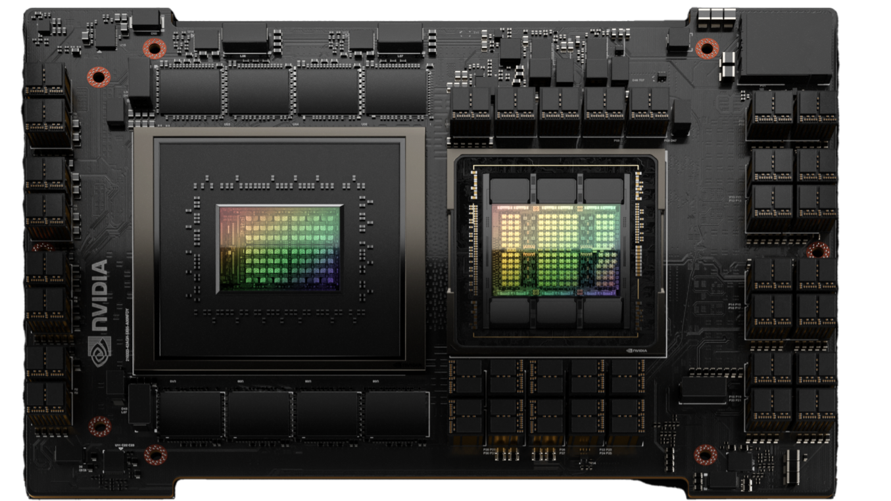

NVIDIA Grace Hopper Superchip 架构是第一个真正的异构加速平台，适用于高性能计算 (HPC) 和 AI 工作负载。 它利用 GPU 和 CPU 的优势加速应用程序，同时提供迄今为止最简单、最高效的分布式异构编程模型。 科学家和工程师可以专注于解决世界上最重要的问题。

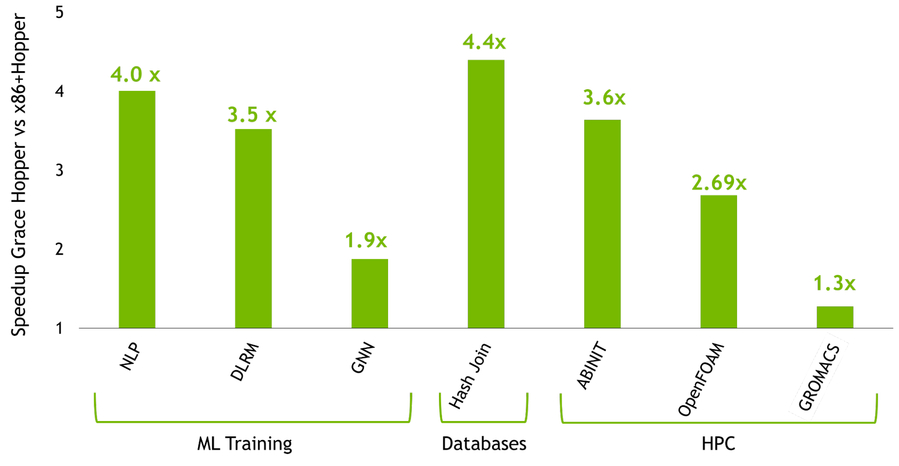

在本文中，您将全面了解 Grace Hopper 超级芯片，并重点介绍 NVIDIA Grace Hopper 带来的性能突破。 有关 Grace Hopper 使用 NVIDIA Hopper H100 GPU 在最强大的基于 PCIe 的加速平台上实现的加速的更多信息，请参阅 [NVIDIA Grace Hopper Superchip Architecture](https://nvda.ws/3frjtKQ) 白皮书。

## 强大的 HPC 和超大 AI 工作负载的性能和生产力

NVIDIA Grace Hopper Superchip 架构将 NVIDIA Hopper GPU 的突破性性能与 NVIDIA Grace CPU 的多功能性结合在一起，在单个超级芯片中与高带宽和内存一致的 NVIDIA NVLink Chip-2-Chip (C2C) 互连相连，并且 支持新的 [NVIDIA NVLink 交换系统](https://www.nvidia.com/en-us/data-center/nvlink/)。

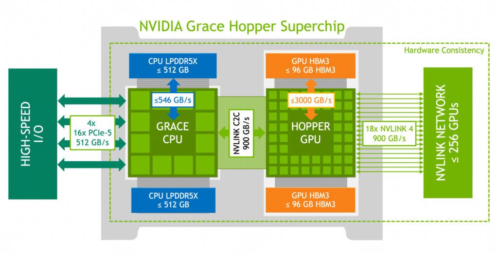

NVIDIA NVLink-C2C 是一种 NVIDIA 内存一致性、高带宽和低延迟的超级芯片互连。它是 Grace Hopper Superchip 的核心，提供高达 900 GB/s 的总带宽。这比加速系统中常用的 x16 PCIe Gen5 通道高 7 倍。

NVLink-C2C 内存一致性提高了开发人员的生产力和性能，并使 GPU 能够访问大量内存。CPU 和 GPU 线程现在可以同时透明地访问 CPU 和 GPU 驻留内存，使您能够专注于算法而不是显式内存管理.

内存一致性使您能够仅传输所需的数据，而不是将整个页面迁移到 GPU 或从 GPU 迁移出来。它还通过启用来自 CPU 和 GPU 的本机原子操作来启用跨 GPU 和 CPU 线程的轻量级同步原语。具有地址转换服务 (ATS) 的 NVLink-C2C 利用 NVIDIA Hopper 直接内存访问 (DMA) 复制引擎来加速跨主机和设备的可分页内存的批量传输。

NVLink-C2C 使应用程序能够超额订阅 GPU 的内存，并在高带宽下直接使用 NVIDIA Grace CPU 的内存。每个 Grace Hopper Superchip 具有高达 512 GB 的 LPDDR5X CPU 内存，GPU 可以直接高带宽访问比 HBM 可用内存多 4 倍的内存。结合 NVIDIA NVLink 开关系统，在多达 256 个 NVLink 连接的 GPU 上运行的所有 GPU 线程现在可以在高带宽下访问高达 150 TB 的内存。第四代 NVLink 支持使用直接加载、存储和原子操作访问对等内存，使加速应用程序能够比以往更轻松地解决更大的问题。

与 NVIDIA 网络技术一起，Grace Hopper 超级芯片为下一代 HPC 超级计算机和人工智能工厂提供了配方。客户可以承担更大的数据集、更复杂的模型和新的工作负载，从而比以前更快地解决它们。

NVIDIA Grace Hopper Superchip的主要创新点如下：

* 英伟达 Grace CPU：
    * 多达 72 个 Arm Neoverse V2 内核，每个内核具有 Armv9.0-A ISA 和 4 个 128 位 SIMD 单元。
    * 高达 117 MB 的 L3 缓存。
    * 高达 512 GB 的 LPDDR5X 内存提供高达 546 GB/s 的内存带宽。
    * 多达 64 个 PCIe Gen5 通道。
    * NVIDIA 可扩展一致性结构 (SCF) 网格和分布式缓存，内存带宽高达 3.2 TB/s。
    * 单个 CPU NUMA 节点可提高开发人员的工作效率。
* NVIDIA Hopper GPU：
    * 与 NVIDIA A100 GPU 相比，具有第四代 Tensor Core、Transformer Engine、DPX 以及高 3 倍的 FP32 和 FP64 的多达 144 个 SM。
    * 高达 96 GB 的 HBM3 内存提供高达 3000 GB/s 的速度。
    * 60 MB 二级缓存。
    * NVLink 4 和 PCIe 5。
* 英伟达 NVLink-C2C：
    * Grace CPU 和 Hopper GPU 之间的硬件一致性互连。
    * 高达 900 GB/s 的总带宽，450 GB/s/dir。
    * 扩展 GPU 内存功能使 Hopper GPU 能够将所有 CPU 内存寻址为 GPU 内存。每个 Hopper GPU 可以在超级芯片内寻址多达 608 GB 的内存。
* NVIDIA NVLink 交换系统：
    * 使用 NVLink 4 连接多达 256 个 NVIDIA Grace Hopper 超级芯片。
    * 每个 NVLink 连接的 Hopper GPU 都可以寻址网络中所有超级芯片的所有 HBM3 和 LPDDR5X 内存，最高可达 150 TB 的 GPU 可寻址内存。

## 性能、便携性和生产力的编程模型
具有 PCIe 连接加速器的传统异构平台要求用户遵循复杂的编程模型，该模型涉及手动管理设备内存分配和与主机之间的数据传输。

NVIDIA Grace Hopper Superchip 平台是异构的且易于编程，NVIDIA 致力于让所有开发人员和应用程序都可以访问它，而不受所选编程语言的影响。

Grace Hopper Superchip 和平台的构建都是为了让您能够为手头的任务选择正确的语言，而 [NVIDIA CUDA LLVM](https://developer.nvidia.com/cuda-llvm-compiler) 编译器 API 使您能够将您喜欢的编程语言带到具有相同代码级别的 CUDA 平台 -生成质量和优化作为 NVIDIA 编译器和工具。

NVIDIA 为 CUDA 平台提供的语言包括加速标准语言，如 ISO C++、ISO Fortran 和 Python。该平台还支持基于指令的编程模型，如 OpenACC、OpenMP、CUDA C++ 和 CUDA Fortran。 NVIDIA HPC SDK 支持所有这些方法，以及一组丰富的用于分析和调试的加速库和工具。

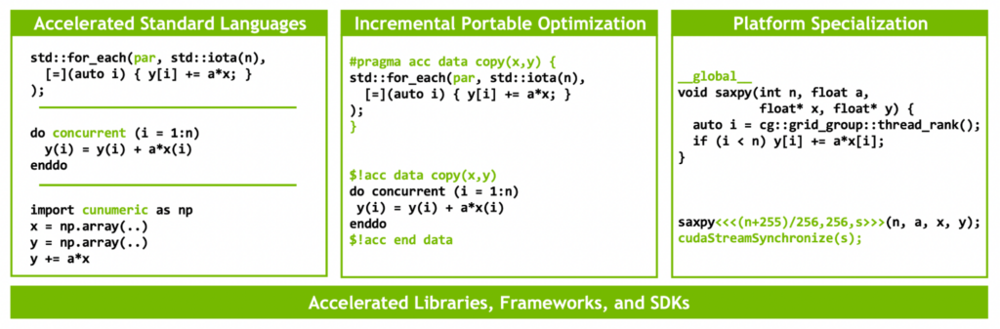

NVIDIA 是 ISO C++ 和 ISO Fortran 编程语言社区的成员，这使得符合 ISO C++ 和 ISO Fortran 标准的应用程序能够在 NVIDIA CPU 和 NVIDIA GPU 上运行，无需任何语言扩展。 有关在 GPU 上运行符合 ISO 标准的应用程序的更多信息，请参阅使用标准并行 C++ 进行多 GPU 编程和使用 Fortran 标准并行编程实现 GPU 加速。

该技术在很大程度上依赖于 NVIDIA NVLink-C2C 和 NVIDIA 统一虚拟内存提供的硬件加速内存一致性。 如图 所示，在没有 ATS 的传统 PCIe 连接 x86+Hopper 系统中，CPU 和 GPU 具有独立的每进程页表，系统分配的内存不能直接从 GPU 访问。 当程序使用系统分配器分配内存但页面条目在 GPU 的页表中不可用时，从 GPU 线程访问内存将失败。
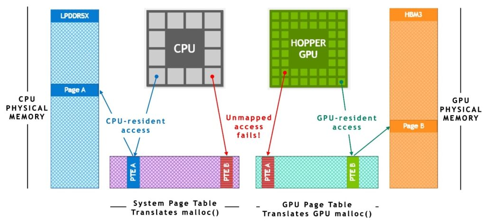

在基于 NVIDIA Grace Hopper Superchip 的系统中，ATS 使 CPU 和 GPU 能够共享单个每进程页表，使所有 CPU 和 GPU 线程能够访问所有系统分配的内存，这些内存可以驻留在物理 CPU 或 GPU 内存上。 所有 CPU 和 GPU 线程都可以访问 CPU 堆、CPU 线程堆栈、全局变量、内存映射文件和进程间内存。

NVIDIA NVLink-C2C 硬件一致性使 Grace CPU 能够以缓存行粒度缓存 GPU 内存，并使 GPU 和 CPU 无需页面迁移即可访问彼此的内存。

NVLink-C2C 还可以加速 CPU 和 GPU 在系统分配内存上支持的所有原子操作。范围内的原子操作得到完全支持，并且可以跨系统中的所有线程实现细粒度和可扩展的同步。

在 LPDDR5X 或 HBM3 上，运行时在第一次接触时使用物理内存支持系统分配的内存，具体取决于 CPU 还是 GPU 线程首先访问它。从操作系统的角度来看，Grace CPU 和 Hopper GPU 只是两个独立的 NUMA 节点。系统分配的内存是可迁移的，因此运行时可以更改其物理内存支持以提高应用程序性能或处理内存压力。

对于 x86 或 Arm 等基于 PCIe 的平台，您可以使用与 NVIDIA Grace Hopper 模型相同的统一内存编程模型。这最终将通过异构内存管理 (HMM) 功能实现，该功能结合了 Linux 内核功能和 NVIDIA 驱动程序功能，使用软件模拟 CPU 和 GPU 之间的内存一致性。

在 NVIDIA Grace Hopper 上，这些应用程序明显受益于 NVLink-C2C 提供的更高带宽、更低延迟、更高原子吞吐量和内存一致性硬件加速，无需任何软件更改。

## 超芯架构特点
以下是 NVIDIA Grace Hopper 架构的主要创新：

* 英伟达 Grace CPU
* NVIDIA Hopper GPU
* NVLink-C2C
* NVLink 交换系统
* 扩展 GPU 显存

## 英伟达 Grace CPU
随着 GPU 的并行计算能力每一代都增加三倍，快速高效的 CPU 对于防止现代工作负载的串行和仅 CPU 部分主导性能至关重要。

NVIDIA Grace CPU 是第一个 NVIDIA [数据中心 CPU](https://www.nvidia.com/en-us/data-center/)，它是从头开始构建的，[用于创建 HPC 和 AI 超级芯片](https://developer.nvidia.com/blog/inside-nvidia-grace-cpu-nvidia-amps-up-superchip-engineering-for-hpc-and-ai/)。 Grace 提供多达 72 个带有 [Armv9.0-A ISA](https://www.arm.com/company/news/2021/03/arms-answer-to-the-future-of-ai-armv9-architecture) 的 Arm Neoverse V2 CPU 内核，以及每个内核 4×128 位宽的 SIMD 单元，支持 Arm 的可扩展矢量扩展 2 (SVE2) SIMD 指令集。

NVIDIA Grace 提供领先的每线程性能，同时提供比传统 CPU 更高的能效。 72 个 CPU 内核在 SPECrate 2017_int_base 上提供高达 370（估计）的分数，确保高性能以满足 HPC 和 AI 异构工作负载的需求。

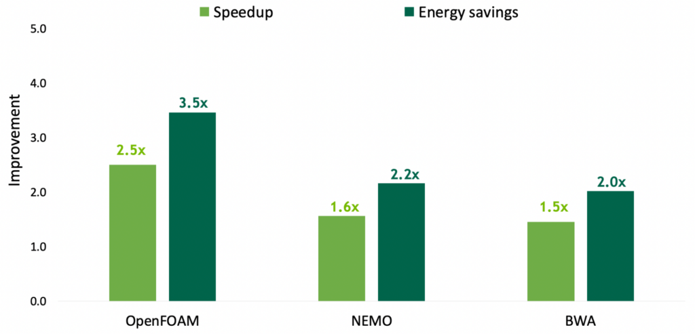

机器学习和数据科学中的现代 GPU 工作负载需要访问大量内存。通常，这些工作负载必须使用多个 GPU 将数据集存储在 HBM 内存中。

NVIDIA Grace CPU 提供高达 512 GB 的 LPDDR5X 内存，可在内存容量、能效和性能之间实现最佳平衡。它提供高达 546 GB/s 的 LPDDR5X 内存带宽，NVLink-C2C 以 900 GB/s 的总带宽可供 GPU 访问。

单个 NVIDIA Grace Hopper Superchip 为 Hopper GPU 提供了总共 608 GB 的快速访问内存，几乎是 DGX-A100-80 中可用慢速内存的总量；上一代的八卡GPU 系统。

这是通过下图中所示的 NVIDIA SCF 实现的，它是一种网状结构和分布式缓存，可提供高达 3.2 TB/s 的总对分带宽，以实现 CPU 内核、内存、系统 I/O 和 NVLink- C2C。 CPU 核心和 SCF 缓存分区 (SCC) 分布在整个网格中，而缓存交换节点 (CSN) 通过结构路由数据，并充当 CPU 核心、缓存内存和系统其余部分之间的接口。

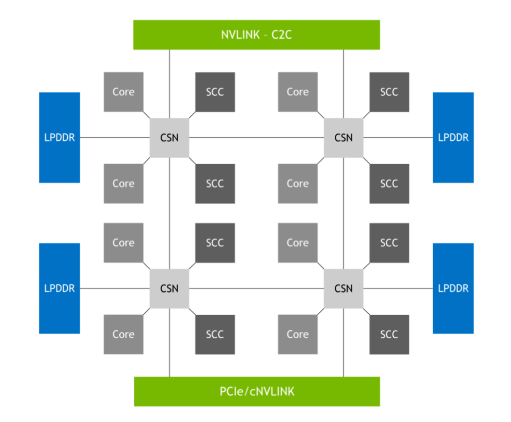

## NVIDIA Hopper GPU
NVIDIA Hopper GPU 是第九代 NVIDIA 数据中心 GPU。 与前几代 NVIDIA Ampere GPU 相比，它旨在为大规模 AI 和 HPC 应用程序提供数量级的改进。 Hopper GPU 还具有多项创新：

* 新的第四代 Tensor Cores 在更广泛的 AI 和 HPC 任务上执行比以往更快的矩阵计算。
* 与上一代 NVIDIA A100 GPU 相比，新的 transformer 引擎使 H100 能够在大型语言模型上提供高达 9 倍的 AI 训练速度和高达 30 倍的 AI 推理加速。
* 空间和时间数据局部性和异步执行的改进功能使应用程序能够始终保持所有单元忙碌并最大限度地提高能效。
* 安全多实例 GPU (MIG) 将 GPU 划分为隔离的、大小合适的实例，以最大限度地提高较小工作负载的服务质量 (QoS)。

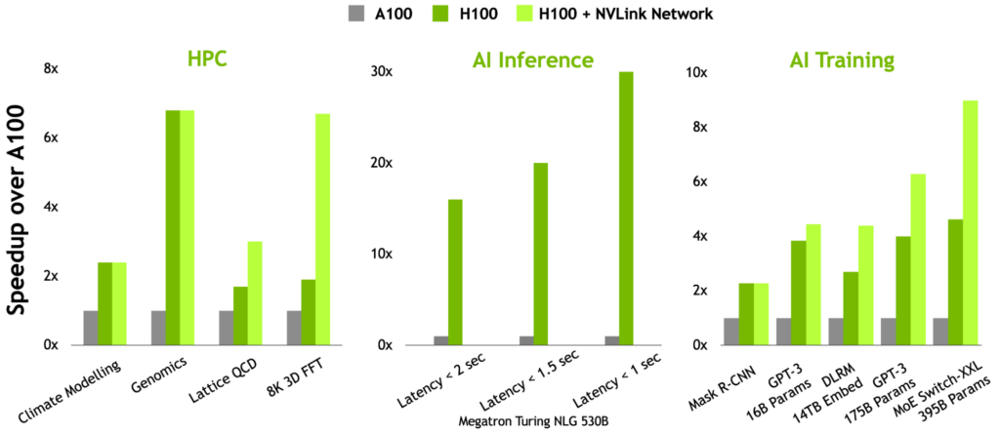

NVIDIA Hopper 是第一个真正的异步 GPU。 其张量内存加速器 (TMA) 和异步事务屏障使线程能够重叠和流水线独立的数据移动和数据处理，使应用程序能够充分利用所有单元。

线程块集群、分布式共享内存和线程块重新配置等新的空间和时间局部性功能为应用程序提供了对更大量共享内存和工具的快速访问。 这使应用程序能够更好地重用片上数据，从而进一步提高应用程序性能。

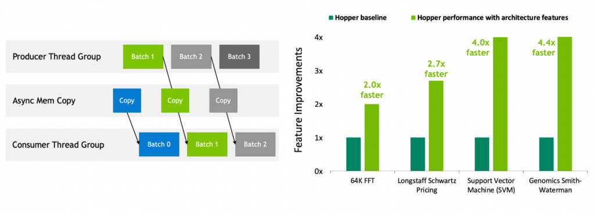

有关详细信息，请参阅 [NVIDIA H100 Tensor 核心架构概述](https://resources.nvidia.com/en-us-tensor-core)和 [NVIDIA Hopper 架构深入](https://developer.nvidia.com/blog/nvidia-hopper-architecture-in-depth/)。

## NVLink-C2C：用于超级芯片的高带宽、芯片到芯片互连
NVIDIA Grace Hopper 通过 NVIDIA NVLink-C2C 将 NVIDIA Grace CPU 和 NVIDIA Hopper GPU 融合到一个超级芯片中，NVIDIA NVLink-C2C 是一种 900 GB/s 的芯片到芯片一致性互连，可以使用统一的编程模型对 Grace Hopper 超级芯片进行编程。

NVLink Chip-2-Chip (C2C) 互连在 Grace CPU 和 Hopper GPU 之间提供高带宽直接连接，以创建 Grace Hopper Superchip，该超级芯片专为 AI 和 HPC 应用程序的嵌入式加速而设计。

凭借 900 GB/s 的双向带宽，NVLink-C2C 以更低的延迟提供 x16 PCIe Gen 链路带宽的 7 倍。 NVLink-C2C 每传输一位仅使用 1.3 皮焦耳，比 PCIe Gen 5 的能效高出 5 倍以上。

此外，NVLink-C2C 是一种一致的内存互连，具有对系统范围原子操作的本机硬件支持。这提高了内存访问非本地内存的性能，例如 CPU 和 GPU 线程访问驻留在其他设备中的内存。硬件一致性还提高了同步原语的性能，减少了 GPU 或 CPU 相互等待的时间并提高了总体系统利用率。

最后，硬件一致性还简化了使用流行编程语言和框架的异构计算应用程序的开发。有关详细信息，请参阅 NVIDIA Grace Hopper 编程模型部分。

## NVLink 交换系统
NVIDIA NVLink 交换系统结合了第四代 NVIDIA NVLink 技术和全新的第三代 NVIDIA NVSwitch。 NVSwitch 的单级最多可连接八个 Grace Hopper 超级芯片，胖树拓扑结构中的第二级可通过 NVLink 联网多达 256 个 Grace Hopper 超级芯片。 Grace Hopper Superchip 对以高达 900 GB/s 的速度交换数据。

凭借多达 256 个 Grace Hopper 超级芯片，该网络可提供高达 115.2 TB/s 的全对全带宽。 这是 NVIDIA InfiniBand NDR400 总带宽的 9 倍。

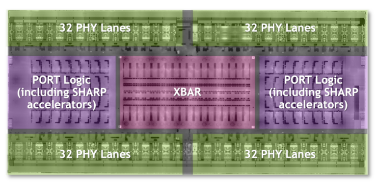

第四代 NVIDIA NVLink 技术使 GPU 线程能够使用正常的内存操作、原子操作和批量传输来寻址 NVLink 网络中所有超级芯片提供的高达 150 TB 的内存。 MPI、NCCL 或 NVSHMEM 等通信库在可用时透明地利用 NVLink 开关系统。

## 扩展 GPU 显存
NVIDIA Grace Hopper Superchip 旨在加速具有超大内存占用空间的应用程序，其容量大于单个超级芯片的 HBM3 和 LPDDR5X 内存容量。有关详细信息，请参阅 NVIDIA Grace Hopper 加速应用程序部分。

高带宽 NVLink-C2C 上的扩展 GPU 内存 (EGM) 功能使 GPU 能够高效地访问所有系统内存。 EGM 在多节点 NVSwitch 连接系统中提供高达 150 TB 的系统内存。使用 EGM，可以分配物理内存以供多节点系统中的任何 GPU 线程访问。所有 GPU 都可以以 GPU-GPU NVLink 或 NVLink-C2C 的最低速度访问 EGM。

Grace Hopper Superchip 配置中的内存访问通过本地高带宽 NVLink-C2C 以 900 GB/s 的速度进行。远程内存访问是通过 GPU NVLink 执行的，并且根据正在访问的内存，还可以使用 NVLink-C2C（下图所示）。借助 EGM，GPU 线程现在可以以 450 GB/s 的速度访问 NVSwitch 结构上的所有可用内存资源，包括 LPDDR5X 和 HBM3。

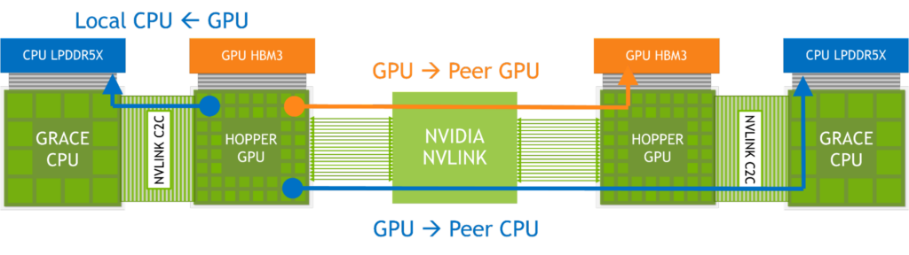

## NVIDIA HGX Grace Hopper
NVIDIA HGX Grace Hopper 每个节点都有一个 Grace Hopper 超级芯片，与 BlueField-3 NIC 或 OEM 定义的 I/O 以及可选的 NVLink 开关系统配对。 它可以风冷或液冷，TDP 高达 1,000W。

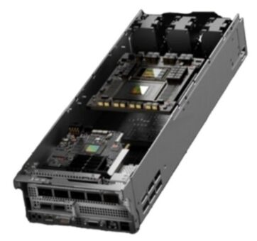

## 带 InfiniBand 的 NVIDIA HGX Grace Hopper
NVIDIA HGX Grace Hopper with Infiniband非常适合扩展传统机器学习 (ML) 和 HPC 工作负载，这些工作负载不会受到 InfiniBand 网络通信开销的瓶颈，InfiniBand 是可用的最快互连之一。

每个节点包含一个 Grace Hopper Superchip 和一个或多个 PCIe 设备，例如 NVMe 固态驱动器和 BlueField-3 DPU、NVIDIA ConnectX-7 NIC 或 OEM 定义的 I/O。 NDR400 InfiniBand NIC 具有 16 个 PCIe Gen 5 通道，可在超级芯片上提供高达 100 GB/s 的总带宽。 结合 NVIDIA BlueField-3 DPU，该平台易于管理和部署，并使用传统的 HPC 和 AI 集群网络架构。

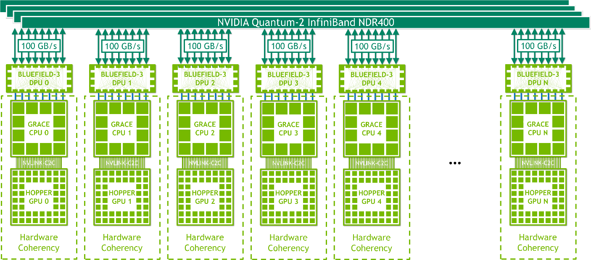

## 带有 NVLink 开关的 NVIDIA HGX Grace Hopper
NVIDIA HGX Grace Hopper with NVLink Switch 是强大的可扩展巨型机器学习和 HPC 工作负载的理想选择。 它使 NVLink 连接域中的所有 GPU 线程能够在 256-GPU NVLink 连接系统中以每个超级芯片高达 900 GB/s 的总带宽寻址高达 150 TB 的内存。 一个简单的编程模型使用指针加载、存储和原子操作。 其 450 GB/s 的全归约带宽和高达 115.2 TB/s 的对分带宽使该平台成为大规模扩展全球最大、最具挑战性的 AI 训练和 HPC 工作负载的理想选择。

NVLink 连接的域与 NVIDIA InfiniBand 网络联网，例如，NVIDIA ConnectX-7 NIC 或 NVIDIA BlueField-3 数据处理单元 (DPU) 与 NVIDIA Quantum 2 NDR 交换机或 OEM 定义的 I/O 解决方案配对。

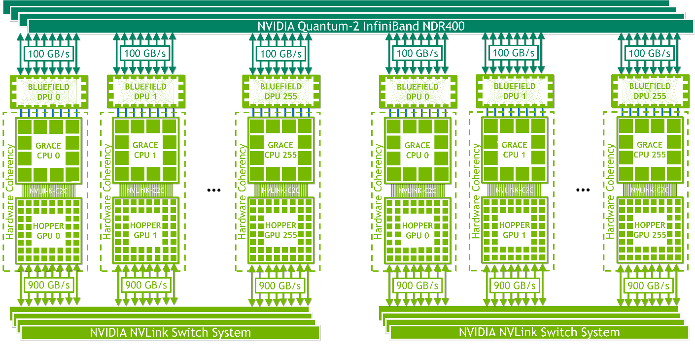

