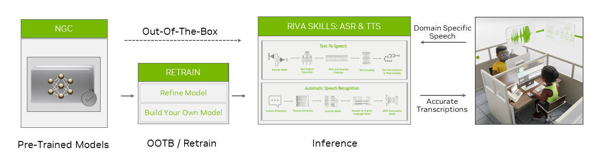
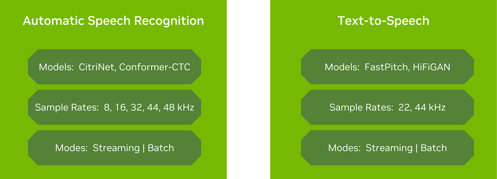
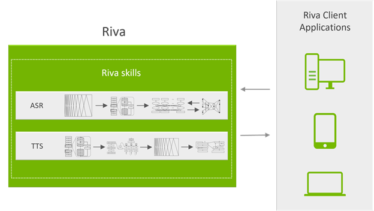
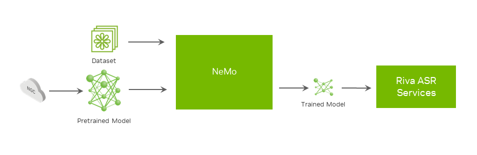
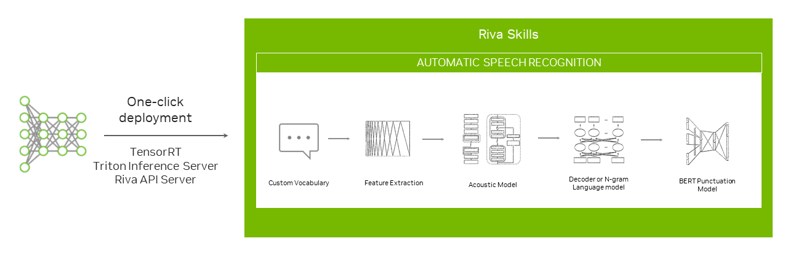

# NVIDIA Riva 简介：用于开发语音 AI 应用程序的 GPU 加速 SDK


[语音 AI](https://developer.nvidia.com/blog/an-easy-introduction-to-speech-ai/) 用于多种应用，包括联络中心的座席助理以增强人类座席的能力、智能虚拟助理 (IVA) 的语音界面以及视频会议中的实时字幕。 为了支持这些功能，[语音 AI 技术包括自动语音识别 (ASR) 和文本转语音 (TTS)](https://developer.nvidia.com/blog/a-guide-to-understanding-essential-speech-ai-terms/#:~:text=How%20are%20speech%20AI%20systems%20related%20to%20AI%2C%20ML%2C%20and%20DL%3F)。 ASR 管道获取原始音频并将其转换为文本，而 TTS 管道获取文本并将其转换为音频。

开发和运行实时语音 AI 服务既复杂又困难。 构建语音 AI 应用程序需要数十万小时的音频数据、用于根据您的特定用例构建和自定义模型的工具，以及可扩展的部署支持。

它还意味着实时运行，低延迟远低于 300 毫秒，以便与用户自然交互。 [NVIDIA Riva](https://www.nvidia.com/en-us/ai-data-science/products/riva/) 简化了开发语音 AI 服务的端到端流程，并为类人交互提供实时性能。

## NVIDIA Riva SDK
[NVIDIA Riva](https://www.nvidia.com/en-us/ai-data-science/products/riva/#:~:text=What%20is%20NVIDIA%20Riva%3F) 是一个 GPU 加速的 SDK，用于构建和部署完全可定制的实时语音 AI 应用程序，这些应用程序可以实时准确地交付。 这些应用程序可以部署在本地、云端、嵌入式和边缘。 NVIDIA Riva 旨在帮助您轻松快速地访问语音 AI 功能。 只需几条命令，即可通过API操作访问高性能服务并试用demo。



NVIDIA Riva SDK 包括可在自定义数据集上微调的[预训练语音 AI 模型](https://ngc.nvidia.com/catalog/models?orderBy=scoreDESC&pageNumber=0&query=riva&quickFilter=&filters=)，以及用于自动语音识别和语音合成的优化端到端技能。

使用 Riva，您可以根据您的数据完全自定义最先进的模型，以更深入地了解它们的特定上下文。 优化推理以提供实时运行的服务（少于 150 毫秒）。

任务特定的 AI 服务和 gRPC 端点提供开箱即用的高性能 ASR 和 TTS。 这些 AI 服务经过数千小时的公共和内部数据集训练，以达到高精度。 您可以开始使用预训练模型或使用您自己的数据集对其进行微调，以进一步提高模型性能。

Riva 使用[ NVIDIA Triton Inference Server ](https://docs.nvidia.com/deeplearning/triton-inference-server/user-guide/docs/)服务于多个模型，以实现高效稳健的资源分配，并在高吞吐量、低延迟和高精度方面实现高性能。


## NVIDIA Riva功能概述
Riva 为实时转录和智能虚拟助手等用例提供高度优化的自动语音识别和语音合成服务。 自动语音识别技能支持英语、西班牙语、普通话、印地语、韩语、葡萄牙语、法语、德语和俄语。

它在各种真实世界的特定领域数据集上进行训练和评估。 凭借电信、播客和医疗保健词汇，它提供了世界一流的生产准确性。 要了解更多信息，请参阅[探索自动语音识别技术的独特应用](https://developer.nvidia.com/blog/exploring-unique-applications-of-automatic-speech-recognition-technology/)。

Riva 文本转语音或语音合成技能可生成类人语音。 与 NVIDIA V100 GPU 上的 Tacotron 2 和 WaveGlow 模型相比，它使用非自回归模型在 NVIDIA A100 GPU 上提供 12 倍的性能提升。 此外，借助 TTS，您只需 30 分钟的语音数据，即可为每个品牌和虚拟助手创建自然的自定义语音。



为了充分利用 GPU 的计算能力，Riva skills 使用 NVIDIA Triton 推理服务器来为神经网络和集成管道提供服务，以便与 NVIDIA TensorRT 一起高效运行。

Riva 服务通过隐藏所有复杂性的 gRPC 端点访问的 API 操作公开。 下图显示了系统的服务器端。 gRPC API 操作由在 Docker 容器中运行的 API 服务器公开。 他们负责处理所有语音传入和传出数据。



API 服务器向 NVIDIA Triton 发送推理请求并接收结果。

NVIDIA Triton 是后端服务器，可同时处理多个 GPU 上的多个推理请求，用于许多神经网络或集成管道。

将延迟保持在给定阈值以下对于语音 AI 应用程序至关重要。 这种延迟要求转化为推理请求一到达就执行。 要充分利用 GPU 来提高性能，您应该通过延迟推理执行来增加批处理大小，直到收到更多请求，从而形成更大的批处理。

NVIDIA Triton 还负责在一个请求和另一个请求之间切换网络上下文。

Riva 可以通过从 [NGC](https://ngc.nvidia.com/catalog/resources/nvidia:riva:riva_quickstart) 下载适当模型和容器的简单脚本直接安装在裸机上，也可以通过提供的 [Helm 图表](https://ngc.nvidia.com/catalog/helm-charts/nvidia:riva:riva-api)部署在 Kubernetes 上。


## 查询 NVIDIA Riva 服务
下面快速浏览一下如何与 Riva 互动。 通过简单的 Python API 操作，Python 接口使客户端更容易与 Riva 服务器通信。 例如，以下是如何通过四个步骤创建对现有 TTS Riva 服务的请求。

首先，导入 Riva API 和其他有用的或需要的库：

```python
import numpy as np
import IPython.display as ipd
import riva.client
```
接下来，创建到 Riva 端点的 gRPC 通道：

```python
auth = riva.client.Auth(uri='localhost:50051')
riva_tts = riva.client.SpeechSynthesisService(auth)
```

然后，配置 TTS API 参数：

```python
sample_rate_hz = 44100
req = { 
        "language_code"  : "en-US",
        "encoding"       : riva.client.AudioEncoding.LINEAR_PCM,
        "sample_rate_hz" : sample_rate_hz,
        "voice_name"     : "English-US.Female-1"
}
```
最后，创建一个 TTS 请求：
```python
req["text"] = "Is it recognize speech or wreck a nice beach?"
resp = riva_tts.synthesize(**req)
audio_samples = np.frombuffer(resp.audio, dtype=np.int16)
ipd.Audio(audio_samples, rate=sample_rate_hz)
```

## 使用您自己的数据自定义模型
虽然 Riva 的默认模型功能强大，但工程师在开发语音 AI 应用程序时可能需要对其进行自定义。 自定义 ASR 管道组件可以进一步优化音频数据转录的特定上下文包括：

* 与最初训练模型时使用的口音、方言甚至语言不同
* 特定领域的词汇，例如学术、科学或商业术语
* 偏好和/或取消偏好某些词，例如，解释一组同音词中的一个词在当前上下文中更有意义
* 嘈杂的环境

您可能还希望自定义 TTS 模型，以便合成语音采用特定的音调或口音，或者可能模仿自己的声音。

借助 [NVIDIA NeMo](https://developer.nvidia.com/nvidia-nemo)，您可以在特定领域或应用程序的数据集上微调 ASR、TTS 和 NLP 模型，甚至可以从头开始训练模型。



更详细地探索这样一种自定义，以进一步提高 ASR 转录文本的易读性和准确性，您可以将自定义标点符号和大写模型添加到生成没有这些功能的文本的 ASR 系统。

从预训练的 BERT 模型开始，第一步是准备数据集。 对于训练数据集中的每个单词，目标是预测以下内容：

* 应该跟在单词后面的标点符号
* 单词是否要大写

数据集准备就绪后，下一步是通过运行先前提供的脚本进行训练。 训练完成并达到所需的最终精度后，使用包含的脚本为 NVIDIA Triton 创建模型存储库。

[NVIDIA Riva Speech Skills](https://docs.nvidia.com/deeplearning/riva/user-guide/docs/index.html) 文档包含 [ASR 自定义最佳实践](https://docs.nvidia.com/deeplearning/riva/user-guide/docs/index.html)以及有关如何训练或微调其他模型的更多详细信息。 这篇文章仅展示了使用 NVIDIA NeMo 的众多定制可能性中的一种。

## 在 NVIDIA Riva 中部署模型
Riva 专为大规模语音 AI 而设计。 为了帮助您可靠地跨不同服务器有效地服务模型，NVIDIA 提供了使用 Helm 图表的按钮式模型部署。



Helm 图配置可从 [NGC 目录](https://ngc.nvidia.com/catalog/helm-charts/nvidia:riva:riva-api)中获得，可以针对自定义用例进行修改。 您可以更改与要部署的模型、存储它们的位置以及如何公开服务相关的设置。

## 总结
NVIDIA Riva 可作为一组容器和预训练模型从 NVIDIA NGC 免费提供给 NVIDIA 开发人员计划的成员。 使用这些资源，您可以开发具有实时转录、虚拟助手或自定义语音合成的应用程序。

您还可以通过 [NVIDIA AI Enterprise Support](https://www.nvidia.com/en-us/data-center/products/ai-enterprise-suite/support/) 获得对 Riva 大规模部署的支持。 您可以在 [NVIDIA LaunchPad](https://www.nvidia.com/en-us/launchpad/ai/riva/) 上免费试用 NVIDIA Riva，或访问 [ASR](https://resources.nvidia.com/en-us-riva-asr-briefcase) 和 [TTS](https://resources.nvidia.com/en-us-riva-tts-briefcase) 教程。

如果您准备好部署 Riva 语音 AI 技能，请查看 Riva 入门指南，为任何应用程序提供交互式语音体验。


