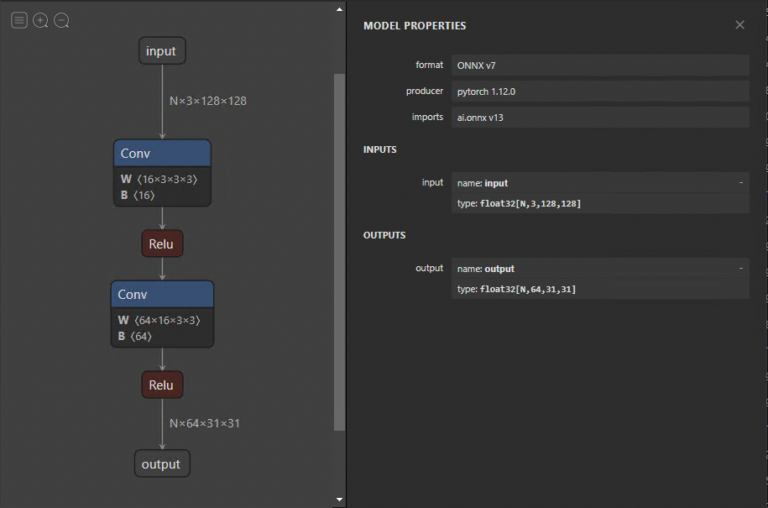
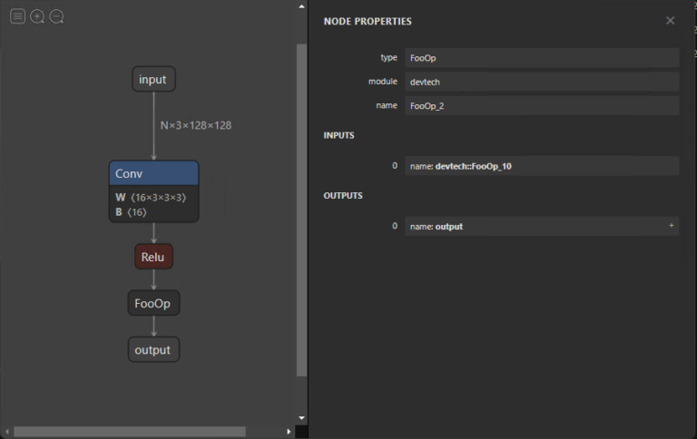
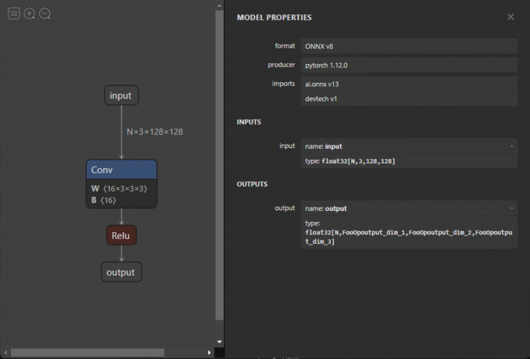

# 使用ONNX转换AI模型


## 与 ONNX 的互操作性
ONNX（Open Neural Network Exchange）是一种描述深度学习模型的开放标准，旨在促进框架兼容性。

考虑以下场景：您可以在 PyTorch 中训练神经网络，然后在将其部署到生产环境之前通过 TensorRT 优化编译器运行它。 这只是众多可互操作的深度学习工具组合中的一种，其中包括可视化、性能分析器和优化器。

研究人员和 DevOps 不再需要使用未针对建模和部署性能进行优化的单个工具链。

为此，ONNX 定义了一组标准的运算符以及基于 Protocol Buffers 序列化格式的标准文件格式。 该模型被描述为一个有向图，其边表示各种节点输入和输出之间的数据流，节点表示运算符及其参数。

## 导出模型
我为以下情况定义了一个由两个 Convolution-BatchNorm-ReLu 块组成的简单模型。
```python
import torch

class Model(torch.nn.Module):
    def __init__(self):
        super().__init__()

        self.model = torch.nn.Sequential(
            torch.nn.Conv2d(3, 16, 3, 2),
            torch.nn.BatchNorm2d(16),
            torch.nn.ReLU(),
            torch.nn.Conv2d(16, 64, 3, 2),
            torch.nn.BatchNorm2d(64),
            torch.nn.ReLU()
        )

    def forward(self, x):
        return self.model(x)

```
您可以使用 PyTorch 内置导出器通过创建模型实例并调用 torch.onnx.export 将此模型导出到 ONNX。 您还必须提供具有适当输入维度和数据类型的虚拟输入，以及给定输入和输出的符号名称。

在代码示例中，我定义了输入和输出的索引 0 是动态的，以便在运行时以不同的批量大小运行模型。

```python
import torch

model = Model().eval().to(device="cpu")
dummy_input = torch.rand((1, 3, 128, 128), device="cpu")

torch.onnx.export(
    model,
    dummy_input,
    "model.onnx",
    input_names=["input"],
    output_names=["output"],
    dynamic_axes={"input": {0: "N"}, "output": {0: "N"}},
    opset_version=13
)

```
在内部，PyTorch 调用 `torch.jit.trace`，它使用给定的参数执行模型，并将执行期间的所有操作记录为有向图。

跟踪展开循环和 if 语句，生成与跟踪运行相同的静态图。 没有捕获到数据相关的控制流。 这种导出类型适用于许多用例，但请记住这些限制。

如果需要动态行为，您可以使用脚本。 因此，模型必须先导出到 ScriptModule 对象，然后才能转换为 ONNX，如以下示例所示。

```python
import torch

model = Model().eval().to(device="cpu")
dummy_input = torch.rand((1, 3, 128, 128), device="cpu")
scripted_model = torch.jit.script(model)

torch.onnx.export(
    scripted_model,
    dummy_input,
    "model.onnx",
    input_names=["input"],
    output_names=["output"],
    dynamic_axes={"input": {0: "N"}, "output": {0: "N"}},
    opset_version=13
)

```

将模型转换为 ScriptModule 对象并不总是微不足道的，通常需要更改一些代码。 有关详细信息，请参阅[避免陷阱](https://pytorch.org/docs/stable/onnx.html#pitfalls)和 [TorchScript](https://pytorch.org/docs/stable/jit.html)。

因为前向调用中没有数据依赖性，所以您可以将模型转换为可编写脚本的模型，而无需对代码进行任何更多更改。

导出模型后，您可以使用 Netron 将其可视化。 默认视图提供模型图和属性面板。 如果您选择输入或输出，属性面板会显示一般信息，例如名称、OpSet 和维度。

同样，在图中选择一个节点会显示该节点的属性。 这是检查模型是否正确导出以及稍后调试和分析问题的绝佳方法。



## 自定义运算符
目前，ONNX 目前定义了大约 150 个操作。 它们的复杂性从算术加法到完整的长短期记忆 (LSTM) 实现不等。 尽管此列表随着每个新版本的增加而增加，但您可能会遇到不包括您的研究模型中的运算符的情况。

在这种情况下，您可以定义 torch.autograd.Function，它包括 forward 函数中的自定义功能和 symbolic 中的符号定义。 在这种情况下，前向函数通过返回其输入来实现无操作。

```python
class FooOp(torch.autograd.Function):
	@staticmethod
	def forward(ctx, input1: torch.Tensor) -> torch.Tensor:
		return input1
	
	@staticmethod
	def symbolic(g, input1):
		return g.op("devtech::FooOp", input1)

class FooModel(torch.nn.Module):
    def __init__(self):
        super().__init__()

        self.model = torch.nn.Sequential(
            torch.nn.Conv2d(3, 16, 3, 2),
            torch.nn.BatchNorm2d(16),
            torch.nn.ReLU()
        )

    def forward(self, x):
        x = self.model(x)
        return FooOp.apply(x)

model = FooModel().eval().to(device="cpu")
dummy_input = torch.rand((1, 3, 128, 128), device="cpu")

torch.onnx.export(
    model,
    dummy_input,
    "model_foo.onnx",
    input_names=["input"],
    output_names=["output"],
    dynamic_axes={"input": {0: "N"}, "output": {0: "N"}},
    opset_version=13,
)

```
此示例演示如何定义用于将模型导出到 ONNX 的符号节点。 尽管在 forward 函数中提供了符号节点的功能，但它必须被实现并提供给用于推断 ONNX 模型的运行时。 这是特定于执行提供者的，将在本文后面解决。




## 修改 ONNX 模型
您可能希望更改 ONNX 模型而不必再次导出它。 更改的范围可以从更改名称到消除整个节点。 直接修改模型很困难，因为所有信息都被编码为协议缓冲区。 幸运的是，您可以使用 [GraphSurgeon](https://github.com/NVIDIA/TensorRT/tree/main/tools/onnx-graphsurgeon) 简单地更改您的模型。

以下代码示例展示了如何从导出的模型中删除伪造的 FooOp 节点。 还有许多其他方法可以使用 GraphSurgeon 来修改和调试我无法在此处介绍的模型。 有关详细信息，请参阅 [GitHub 存储库](https://github.com/NVIDIA/TensorRT/tree/main/tools/onnx-graphsurgeon/examples)。

```python
import onnx_graphsurgeon as gs
import onnx

graph = gs.import_onnx(onnx.load("model_foo.onnx"))

fake_node = [node for node in graph.nodes if node.op == "FooOp"][0]

# Get the input node of the fake node
# For example, node.i() is equivalent to node.inputs[0].inputs[0]
inp_node = fake_node.i()

# Reconnect the input node to the output tensors of the fake node, so that the first identity
# node in the example graph now skips over the fake node.
inp_node.outputs = fake_node.outputs
fake_node.outputs.clear()

# Remove the fake node from the graph completely
graph.cleanup()
onnx.save(gs.export_onnx(graph), "removed.onnx")

```
要删除节点，您必须首先使用 GraphSurgeon API 加载模型。 接下来，遍历图形，查找要替换的节点并将其与 FooOp 节点类型匹配。 用它自己的输出替换它的输入节点的输出张量，然后移除它自己与其输出的连接，移除节点。




